## Sprawozdanie 2

### Część I

#### Wybór oprogramowania

Oprogramowaniem wykorzystanym podczas wykonywania instrukcji był projekt [pencilblue]('https://github.com/pencilblue/pencilblue'). Jest to oprogramowanie typu Content Management System oraz aplikacja do tworzenia blogów. Zbudowana jest na bazie `nodejs`. Projekt pasuje pod tematykę zajęć, ponieważ w prosty sposób można przeprowadzić build i testy przy użyciu `npm`.

> Wymaganiami wstępnymi aplikacji jest `nodejs` oraz `Mongodb`. Celem zajęć nie jest pełne uruchomienie aplikacji więc baza danych została pominięta podczas tworzenia obrazów. Oczywiście aplikację można uruchomić lecz pojawi się błąd połączenia z bazą danych. 

#### Budowanie obrazów

Pierwszym krokiem było uruchomienie kontenera bazowego, w którym pobrane zostanie repozytorium z kodem oraz ręcznie przeprowadzone zostaną fazy build oraz test.

Uruchomienie kontenera bazowego z `nodejs` w trybie interaktywnym o nazwie `step1`. 

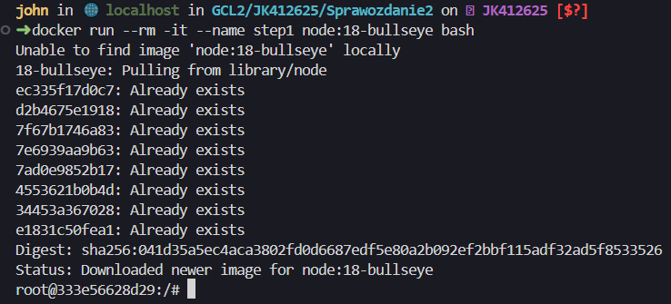

Następnie skolonowanie repozytorium do katalogu `/home` komendą

```bash
git clone https://github.com/pencilblue/pencilblue.git
```

Kolejnym krokiem jest zainstalowanie zależności poleceniem `npm i` (skrót od `npm install`).

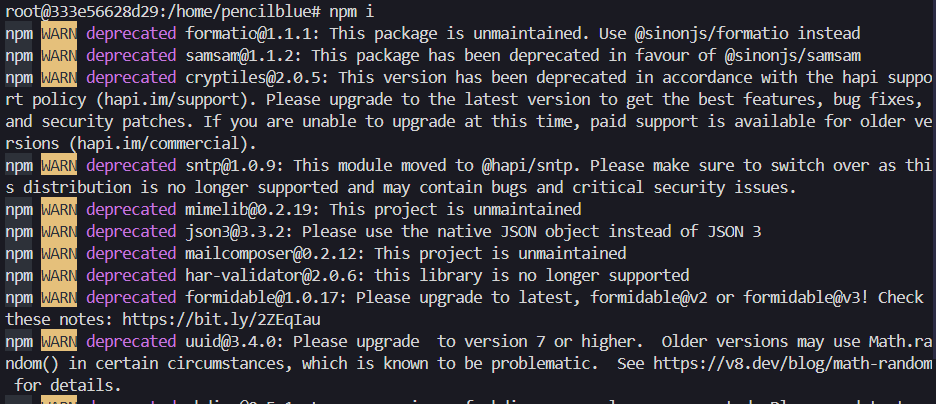

Po fazie budowy można przejść do uruchomienia testów. Testy uruchamia się poleceniem `npm test` w katalogu repozytorium (pencilblue). Polecenie to opiera się na definicjach w pliku konfiguracyjnym `package.json`. To tam znajdują się informacje o tym co zostanie uruchomione po wywołaniu `npm test`. 

Fragment pliku `package.json`

```json
 "scripts": {
    "start": "node pencilblue.js",
    "test": "istanbul cover ./node_modules/mocha/bin/_mocha -- -R spec --recursive"
  },
```
TODO: istanbul cover


Poniżej znajduje się podsumowanie pokrycia testów i ich wyniki.

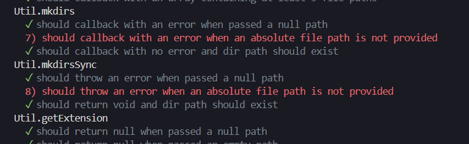

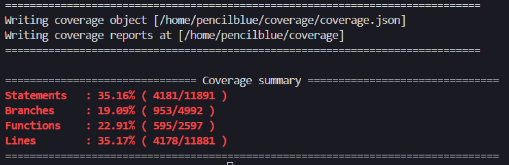

#### Przygotowanie plików Dockerfile

Aby za każdym razem nie powtarzać tych samych kroków ręcznie wykorzystujemy `Dockerfile`. Pierwszy obraz składa się z:
- wybrania obrazu bazowego (node:18-bullseye)
- aktualizacji pakietów
- sklonowania repozytorium
- uruchomienia instalacji zależności npm

```Dockerfile
FROM node:18-bullseye

RUN apt update && apt upgrade -y
WORKDIR /app
RUN git clone https://github.com/pencilblue/pencilblue.git
RUN cd pencilblue && npm install
```

w drugim `Dockerfile` naszym obrazem bazowym będzie wcześniej obraz stworzony w poprzednim kroku (otagowany nazwą stage1). Na końcu uruchamiamy tylko testy poleceniem `npm test`.

```Dockerfile
FROM stage1

WORKDIR /app/pencilblue

CMD ["npm", "test"]
```

Aby przetestować czy nasza koncepcja działa na początku musimy zbudować pierwszy obraz poniższym poleceniem. Po opcji `-t` podajemy nazwę naszego obrazu a po `-f` nazwę pliku Dockerfile. Ostatnia kropka oznacza kontekst, w którym docker szuka danego Dockerfile.
```bash
docker build -t stage1 -f file1.Dockerfile .
```

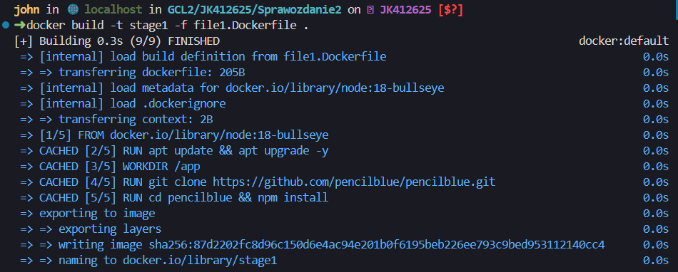

Następnie budujemy drugi obraz, który bazuje na poprzednim.
```bash
docker build -t stage2 -f file2.Dockerfile .
```

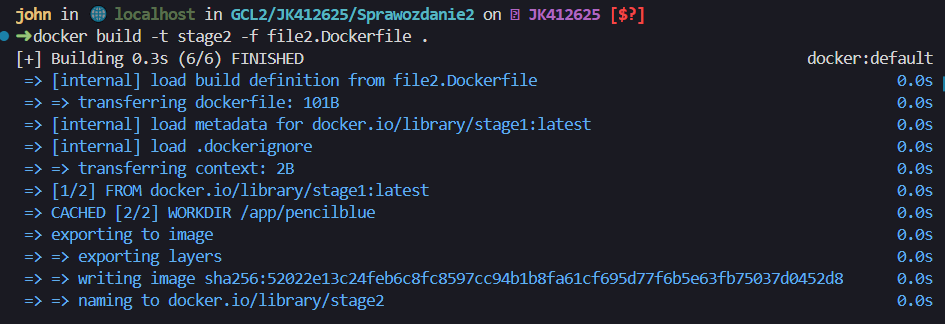

Kontener bazujący na drugim obrazie uruchamiamy poleceniem
```bash
docker run --rm -it stage2
```
Poniżej znajduje się wynik polecenia. Widzimy informację z pokryciem testów, które zwróciło narzędzie `istanbul`.

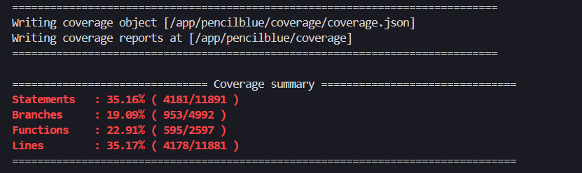

W celu upewnienia się, że na pewno zbudowały się zależności można wejść do kontenera poprzez uruchomienie go w trybie interaktywnym z poleceniem bash. Jak widać na poniższym zdjęciu, w katalogu repozytorium znajduje się katalog `node_modules` z zainstalowanymi artefaktami z pierwszego obrazu.

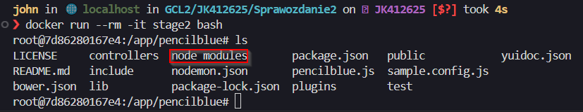

#### Multi-stage build z docker-compose

Docker umożliwia przeprowadzenie [\`multi-stage build\`](https://docs.docker.com/build/building/multi-stage/) wraz z narzędziem docker-compose. Automatyzuje to znacząco proces uruchamiania i budowania obrazów i kontenerów, które podzielone są na poszczególne kroki.

Należy przygotować jeden plik Dockerfile, w którym podzielimy cały proces budowania i testowania na dwa kroki.

Wielofazowy obraz tworzymy poprzez użycie dwóch lub więcej wyrażeń `FROM`. Każdemu krokowi można nadać nazwę poprzez zastosowanie `FROM <nazwa_obrazu/kroku> as <nazwa_kroku>`. W poniższym listingu na początku definiujemy fazę `build` naszej aplikacji. Wybieramy obraz bazowy i dodajemy tag do naszego kroku tak aby móc później skorzystać z tej warstwy. Następnie aktualizujemy pakiety, definiujemy katalog pracy (tam będą wykonywane kolejne warstwy) i klonujemy repozytorium. Ostatnim krokiem jest instalacja modułów npm, które potrzebne są do uruchomienia aplikacji.

W drugiej fazie definiujemy katalog pracy, tzn. wszystkie komendy po tym wyrażeniu będą wykonywane w katalogu `/app/pencilblue`. W ostatnim kroku uruchamiamy testy poleceniem `npm test`. Po wykonaniu testów kontener zakończy swoje działanie.


Plik Dockerfile
```Dockerfile
FROM node:18-bullseye as stage1

RUN apt update && apt upgrade -y
WORKDIR /app
RUN git clone https://github.com/pencilblue/pencilblue.git
RUN cd pencilblue && npm install

FROM stage1 as stage2

WORKDIR /app/pencilblue

CMD ["npm", "test"]
```

Narzędzie `docker-compose` pozwala na automatyzację budowania obrazów i uruchamiania aplikacji złożonej z kilku komponentów. W tym przypadku możemy wyróżnić dwa: fazę budowania i fazę testowania. Głównymi argumentami narzędzia `docker-compose` są:
- `up` - buduje i uruchamia kontenery, w tym potrzebne sieci (bridge)
- `build` - buduje obrazy wszystkich serwisów
- `stop` - zatrzymuje działanie kontenerów, nie usuwa ich
- `down` - zatrzymuje działanie kontenerów i usuwa je oraz powiązane z nimi sieci 


```yaml
version: '3.9'

services:
  stage1:
    build:
      context: .
      target: stage1
  stage2:
    build:
      context: .
      target: stage2
```

Pierwszym krokiem przed uruchomieniem kontenerów jest zbudowanie obrazów. `Docker-compose` umożliwia to poprzez argument `build`.

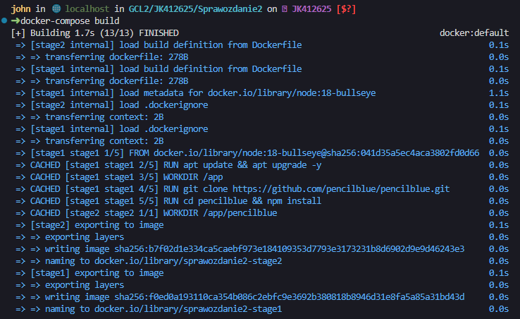

Początkowy wynik po uruchomieniu `docker-compose up`. Jeżeli nie sprecyzujemy inaczej to docker-compose podłącza się interaktywnie do wszystkich stworzonych kontenerów. Aby rozróżnić, z którego kontenera pochodzi wydruk w terminalu należy spojrzeć na lewą kolumnę. Nazwa `stage2-1` oznacza identyfikator kontenera. Nie jest on jednoznaczny z tym co znajdziemy w informacjach z `docker ps -a`.

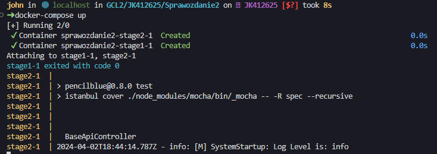

Poniżej znajduje się `Coverage summary` przeprowadzone przez kontener `stage2-1`.

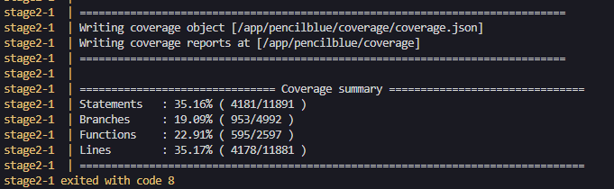

#### Końcowe rozważania

Powyższy program nadaje się do wdrożenia w kontenerach. Jest to aplikacja webowa, którą prościej jest zarządzać i wdrażać jeżeli skorzystamy z technologii konteneryzacji. Można jednoznacznie wydzielić fazę budowania, testowania i uruchamiania aplikacji. Wystarczy odpowiednio dopasować konfigurację tak aby aplikacja mogła się łączyć z dedykowaną bazą MongoDB. Dzięki wykorzystaniu dockera można również wprowadzić cały pipeline, który całkowicie automatyzowałby wdrażanie tej aplikacji.

<hr>

### Część II

#### Zachowywanie stanu

Pierwszym zadaniem było stworzenie dwóch woluminów in/out i podłączenie ich do kontenera bazowego dla aplikacji z pierwszej części. 

Aby sklonować na wolumin1 repozytorium z kodem skorzystam z tymczasowego kontenera. Repozytorium sklonowane zostanie na system bazowy (OpenSUSE). Następnie do kontenera tymczasowego podpięty zostanie katalog z repozytorium (typ podpięcia BIND). W kontenerze tymczasowym wykonana zostanie kopia repozytorium na wolumin1. Dzięki temu kontener z buildem będzie miał dostęp do kodu przez wolumin1. 

Stworzenie woluminów: wejściowego (wolumin1) i wyjściowego (wolumin2). Na końcu wypisano dostępne woluminy w systemie.

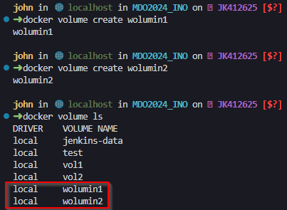

Uruchomienie kontenera głównego z początkowymi zależnościami (nodejs). Kontener uruchomiony został w trybie `detached` (-d). 

```bash
docker run --rm -it -d --name main_build --mount source=wolumin1,target=/wolumin1 --mount source=wolumin2,target=/wolumin2 node:18-bullseye
```

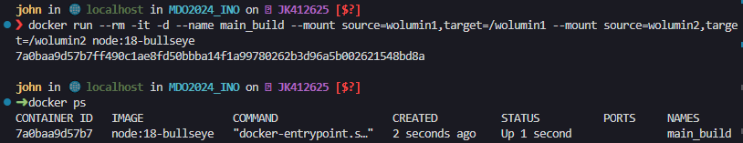

Sklonowanie tymczasowo repozytorium w głownym systemie.


Stworzenie tymczasowego kontenera z podpiętym repozytorium i woluminem wolumin1.

```bash
docker run -it --rm --mount type=bind,source=$(pwd)/pencilblue,target=/repo --mount source=wolumin1,target=/wolumin1 ubuntu
```
Wykorzystujemy opcję `--mount`, która pozwala nam na tworzenie woluminów. Należy sprecyzować źródło, które podpinamy (ścieżka katalogu z repozytorium) oraz cel (ścieżka katalogu w kontenerze gdzie podpięte będzie źródło). Dodatkową opcją jest typ woluminu. W tym przypadku wykorzystujemy możliwość podpięcia katalogu z systemu pod kontener czyli typ `BIND`.

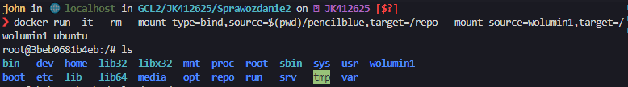

Skopiowanie plików repozytorium do wolumin1 za pomocą komendy `cp` z opcją `--recursive`. Jak widać pliki są widoczne w tym katalogu.

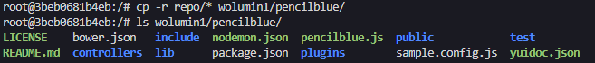

Połączenie się z kontenerem main_build za pomocą `docker exec` i basha oraz zapisanie zbudowanych plików na woluminie wyjściowym (wolumin2). Gdy wylistujemy zawartość podpiętego woluminu wolumin1 zobaczymy pliki aplikacji.

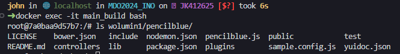

Kolejnym krokiem jest zbudowanie zależności w kontenerze `main_build`. Wykonamy to komendą `npm install`. W tym celu przechodzimy do katalogu z repozytorium w wolumin1 i uruchamiamy komendę.

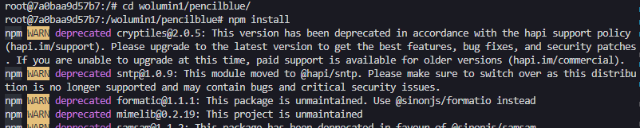

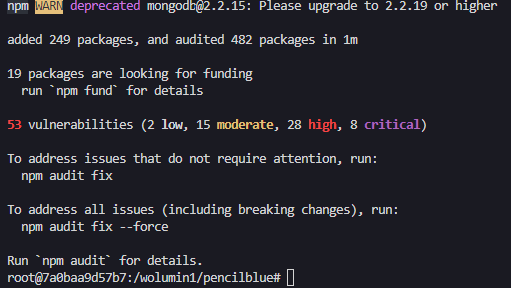

Zbudowane zależności w katalogu `node_modules`.

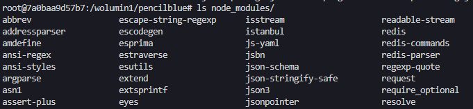

W woluminie wolumin2 zapisane zostaną zbudowane artefakty. W tym celu skorzystano z polecenia `cp`. Poleceniem `du -sh /wolumin2` sprawdzono wielkość katalogu `node_modules`.

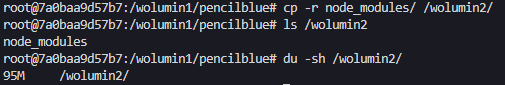

Powyższe kroki można zautomatyzować wykorzystująć Dockerfile. Na przykład możemy na początku stworzyć wewnątrz kontenera dwa katalogi np. wol_in, wol_out. Następnie wykorzystująć `RUN --mount` podpiąć woluminy pod te katalogi. Można później sklonować repozytorium do katalogu `/wol_in`, zbudować zależności i skopiować je do woluminu wyjściowego. Przykładowy Dockerfile wyglądałby w poniższy sposób.

```Dockerfile
FROM node:18-bullseye
RUN mkdir -p /wol_in /wol_out
RUN --mount=type=volume,source=wol_in,target=/wol_out
RUN --mount=type=volume,source=wol_in,target=/wol_out

RUN git clone https://github.com/pencilblue/pencilblue.git
RUN mv pencilblue /wol_in

WORKDIR /wol_in/pencilblue
RUN npm install
RUN cp -r node_modules/ /wol_out
```

#### Eksponowanie portu

W drugim zadaniu mieliśmy przeprowadzić badanie ruchu sieciowego używając narzędzia `iperf`. Narzędzie to posiada [dedykowany obraz dockerowy](https://hub.docker.com/r/networkstatic/iperf3/).

Na początku należy uruchomić serwer iperf3, który będzie nasłuchiwał na połączenia. W tym celu wykonujemy komendę `docker run` z odpowiednią komendą `iperf3 -s` gdzie `-s` oznacza tryb serwera. Przekierowywujemy również port z wnętrza kontenera (5201:5201) dodając opcję `-p`.

```bash
docker run -it --rm --name=iperf3-server -p 5201:5201 networkstatic/iperf3 -s
```

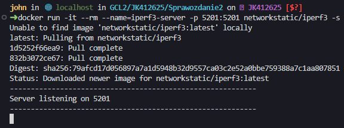

W celu zmierzenia przepustowości pomiędzy dwoma kontenerami uruchomimy kolejny, bazujący na tym samym obrazie. Jednakże musimy dowiedzieć się jaki adres IP posiada nasz serwer iperf3 w kontenerze. Z pomocą przychodzi `docker inspect`. Dzięki tej komendzie możemy dowiedzieć się więcej o działającym kontenerze. W tym przypadku interesuje nas tylko jego adres IP więcej możemy sformatować wynik używając opcji `--format`. Syntax opcji formatu wygląda podobnie jak w narzędziach typu [\`jq\`](https://jqlang.github.io/jq/) lub [\`yq\`](https://github.com/mikefarah/yq) parsujących jsona i yamla. Podajemy po kropkach kolejne atrybuty konfiguracji np. `.NetworkSettings.IPAddress` w klamrowych nawiasach.

```bash
docker inspect --format "{{ .NetworkSettings.IPAddress }}" <nazwa/id kontenera>
```

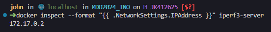

Po uzyskaniu adresu IP możemy połączyć się z serwerem iperf. Zgodnie z dokumentacją połączymy się w trybie klienckim `-c`. Dostajemy poniższy wynik.

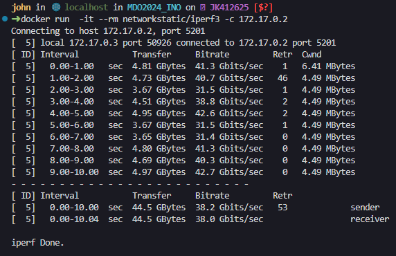

Jak widać połączenie jest całkiem szybkie.

Docker network pozwala na tworzenie, zarządzanie i usuwanie sieci, które mogą być wykorzystywane przez kontenery. Jest to przydatna opcja kiedy chcemy móc szczegółowo manipulować parametrami sieci w jakiej pracują kontenery. Można definiować własną adresację IP, tworzyć interfejsy sieciowe itp.

Jak wyżej wspomniano, kontenery można skomunikować ze sobą w jednej sieci. Aby stworzyć dedykowaną sieć mostkową należy wykonać komendę `docker network create`.

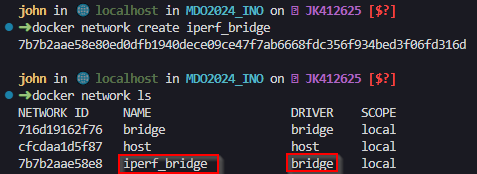

Poniżej stworzono kontener z serwerem iperf3 w dedykowanej sieci mostkowej. Podczas tworzenia komendą `docker run` wystarczy dodać opcję `--network <nazwa_sieci>`.

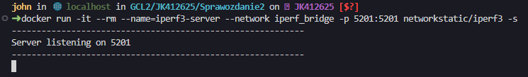

Przeprowadzony został test przepustowości z zewnątrz (z poziomu systemu operacyjnego) oraz z wewnątrz (z poziomu kontenera w tej samej sieci mostkowej). Na początku połączono się z zewnątrz, po uzyskaniu adresu ip kontenera komendą `docker inspect`. 

> Narzędzie `iperf3` zostało zainstalowane za pomocą instalatora zypper komendą `sudo zypper install iperf`

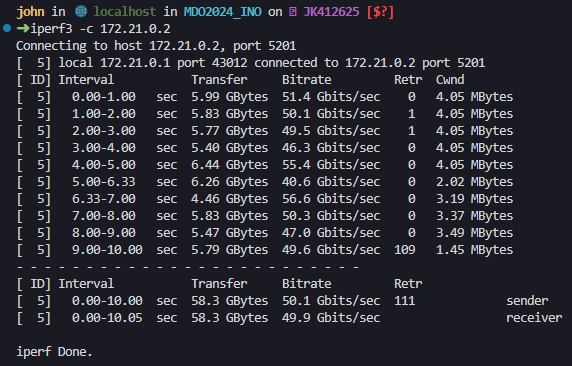

Z wewnątrz kontenera podpiętego pod tą samą sieć co serwer iperf wygląda to następująco. Wykorzystano nazwę kontenera zamiast adresów IP.

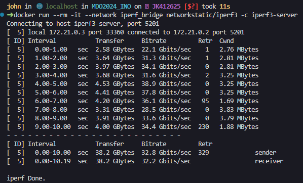

Przepustowość jest znacząco mniejsza niż gdy wykorzystujemy domyślną sieć mostkową dockera. Może być to spowodowane, że w przypadku komunikacji z kontenerami powstaje narzut na komunikację wewnątrz sieci. Pakiety muszą przechodzić przez warstwę sieciową i warstwę kontroli kontrolera zanim dotrą do dedykowanego hosta.

TODO: logi komunikacji?

#### Instalacja Jenkins

TODO: install jenkins

