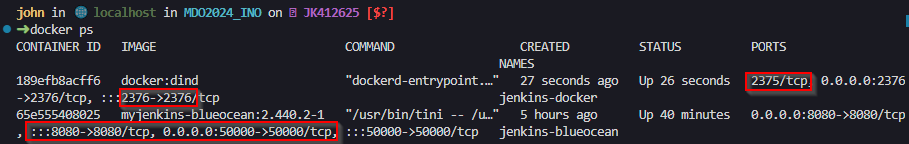
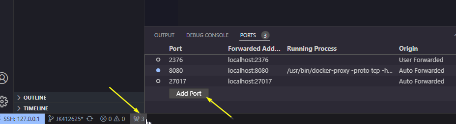
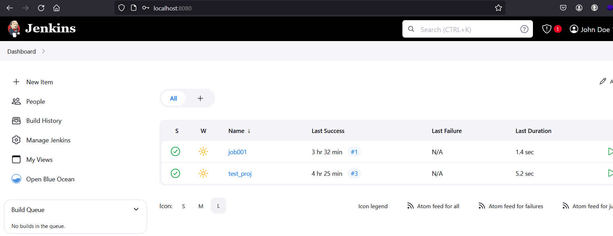

## Sprawozdanie 2

### Część I

Pierwszym krokiem, na którym opiera się cała reszta tworzenia pipeline'u, jest zainstalowanie Jenkinsa wraz z DIND (Docker in Docker). W poprzednim sprawozdaniu znajdują się komendy używane do uruchomienia dwóch kontenerów: jeden tworzący środowisko DIND a drugi z instancją Jenkinsa. Oba te kontenery są podłączone do jednej dockerowej sieci tak aby mogły się komunikować ze sobą.

TODO: wytłumaczenie - Przygotuj obraz blueocean na podstawie obrazu Jenkinsa (czym się różnią?)

Uruchomione kontenery, gdy używamy domyślnych ustawień, powinny eksponować poniższe porty.

Na ten moment interesujący jest dla nast port 8080, na którym działa interfejs webowy Jenkinsa. Przez to, że w maszynie wirtualnej nie ma środowiska graficznego należy dodać kolejną regułę do przekierowywania portów. Dodatek `open-ssh` w VSCode umożliwia w prosty sposób na przekierowywanie portów z lub do zdalnego hosta poprzez ssh. Wystarczy kliknąć ikonę anteny i dodać port, któóry chcemy przekierować ze zdalnej maszyny. 

Po przejściu instalacji Jenkinsa powinniśmy mieć dostęp do panelu administratora.

TODO: dodać instancje mongo-db do docker-compose zeby apka dzialala, zmienic wersje nodejs?
TODO: Konfiguracja jenkinsa
TODO: Zadbaj o archiwizację i zabezpieczenie logów

### Część II

Utwórz projekt, który zwraca błąd, gdy... godzina jest nieparzysta
Utwórz "prawdziwy" projekt, który:
    klonuje nasze repozytorium - git clone
    przechodzi na osobistą gałąź - git checkout JK412625
    buduje obrazy z dockerfiles i/lub komponuje via docker-compose - TODO: zmimenić def. composea'

### Część III

