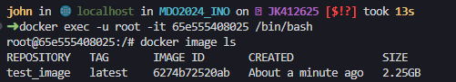

## Sprawozdanie 2

### Część I

Pierwszym krokiem, na którym opiera się cała reszta tworzenia pipeline'u, jest zainstalowanie Jenkinsa wraz z DIND (Docker in Docker). W poprzednim sprawozdaniu znajdują się komendy używane do uruchomienia dwóch kontenerów: jeden tworzący środowisko DIND a drugi z instancją Jenkinsa. Oba te kontenery są podłączone do jednej dockerowej sieci tak aby mogły się komunikować ze sobą.

Blueocean UI to nowocześniejszy interfejs użytkownika jenkinsa. Tryb widoku z klasycznego UI na BlueOcean można przełączyć korzystając z panelu znajdującego się po lewej stronie strony, poprzez kliknięcie `Open Blue Ocean` lub nawigując na stronę `http://jenkins-server-url/blue`. 


Uruchomione kontenery, gdy używamy domyślnych ustawień z dokumentacji Jenkinsa, powinny eksponować poniższe porty.


Na ten moment interesujący jest dla nast port 8080, na którym działa interfejs webowy Jenkinsa. Przez to, że w maszynie wirtualnej nie ma środowiska graficznego należy dodać kolejną regułę do przekierowywania portów. Dodatek `open-ssh` w VSCode umożliwia w prosty sposób na przekierowywanie portów z lub do zdalnego hosta poprzez ssh. Wystarczy kliknąć ikonę anteny i dodać port, któóry chcemy przekierować ze zdalnej maszyny. 


Po przejściu instalacji Jenkinsa powinniśmy mieć dostęp do panelu administratora.


Instancja Jenkinsa działa w kontenerze. W celu zabezpieczenia jej stanu, wykorzystywane są wolumeny. W wolumenie `jenkins-data` znajduje się katalog domowy Jenkinsa (wszystkie logi, joby i konfiguracja). Jeżeli coś by się stało z instancją Jenkinsa, można włączyć inny kontener i w ten sposób dostać się do wolumenu gdzie zapisany jest stan aplikacji. Można w ten sposób dostać się do logów systemowych itp.

### Część II

Po zainstalowaniu jenkinsa należało stworzyć projekt, który wyświetla polecenie `uname`.


W drugim testowym projekcie zwracany jest błąd gdy godzina jest nieparzysta. Przy tworzeniu projektu w sekcji `Kroki budowania` należy wkleić poniższy kod. Polecenie `date +"%H"` pobiera aktualną godzinę ustawioną w systemie. Jedynym wyzwalaczem jest wyzwalacz manualny.

```bash
#!/bin/bash

# Get the current hour
hour=$(date +"%H")

# Check if the hour is even
if (( hour % 2 == 0 )); then
    exit 0
else
    exit 1
fi
```

W trzecim testowym projekcie należało: sklonować repozytorium przedmiotu, przejść na osobistą gałąź (JK412625) oraz zbudować obrazy z Dockerfile.

Projekt został skonfigurowany w następujący sposób: manualny trigger, usuwanie workspace po zakończonym buildzie. Jedynym krokiem budowania jest wywołanie kilku komend z powłoki tak jak poniżej.


Po udanym buildzie, w głównym kontenerze gdzie działa Jenkins, powinien być widoczny obraz test_build.



### Część III - Pipeline

Oprogramowaniem, dla którego stworzony zostanie pipeline jest Ghidra. Ghidra to platforma do odwracania inżynieryjnego oprogramowania (SRE), która została opracowana przez Narodową Agencję Bezpieczeństwa (NSA) i udostępniona jako otwarte oprogramowanie. Zapewnia zestaw narzędzi do analizy skompilowanego kodu. Reverse engineering polega na badaniu binarnego kodu oprogramowania w celu zrozumienia jego funkcjonalności, struktury i zachowania, często w celu analizy podatności, analizy złośliwego oprogramowania lub modyfikacji oprogramowania.

W projekcie tym można rozróżnić każdą fazę pipeline'u: budowanie, testowanie, wdrażanie oraz publikowanie.

Projekt ten zawiera w sobie dużo różnych komponentów. Czas potrzebny na przeprowadzenie testów jednostkowych wynosi prawię godzinę. Dlatego zdecydowałem się aby uruchomić jedynie jeden zestaw testów (konkretnie ....) dla celów demonstracyjnych. W prawdziwym pipeline prawdopodobnie należało by uruchomić wszystkie testy jednostkowe oraz dodatkowo testy integracyjne załączone do repozytorium.