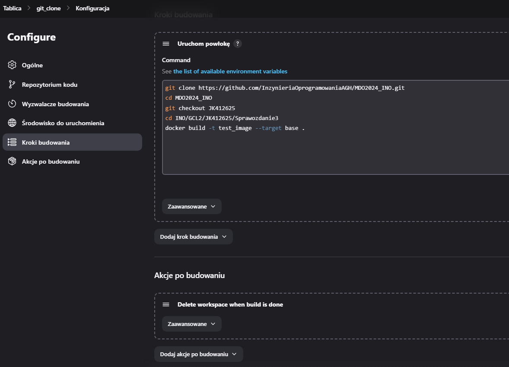
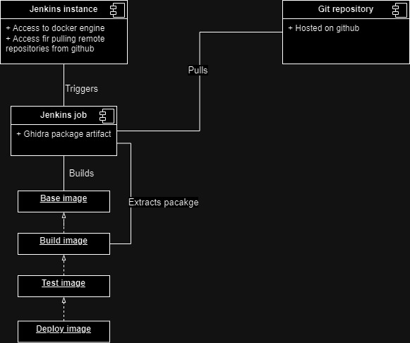

## Sprawozdanie 3

### Część I

Pierwszym krokiem, na którym opiera się cała reszta tworzenia pipeline'u, jest zainstalowanie Jenkinsa wraz z DIND (Docker in Docker). W poprzednim sprawozdaniu znajdują się komendy używane do uruchomienia dwóch kontenerów: jeden tworzący środowisko DIND a drugi z instancją Jenkinsa. Oba te kontenery są podłączone do jednej dockerowej sieci tak aby mogły się komunikować ze sobą. Kontener Jenkinsa komunikuje się z DIND'em po TLS co wiązało się z wygenerowaniem odpowiednich certyfikatów.

Blueocean UI to nowocześniejszy interfejs użytkownika jenkinsa. Tryb widoku z klasycznego UI na BlueOcean można przełączyć korzystając z panelu znajdującego się po lewej stronie strony, poprzez kliknięcie `Open Blue Ocean` lub nawigując na stronę `http://jenkins-server-url/blue`. 


Uruchomione kontenery, gdy używamy domyślnych ustawień z dokumentacji Jenkinsa, powinny eksponować poniższe porty.


Na ten moment interesujący jest dla nast port 8080, na którym działa interfejs webowy Jenkinsa. Przez to, że w maszynie wirtualnej nie ma środowiska graficznego należy dodać kolejną regułę do przekierowywania portów. Dodatek `open-ssh` w VSCode umożliwia w prosty sposób na przekierowywanie portów z lub do zdalnego hosta poprzez ssh. Wystarczy kliknąć ikonę anteny i dodać port, któóry chcemy przekierować ze zdalnej maszyny. 


Po przejściu instalacji Jenkinsa powinniśmy mieć dostęp do panelu administratora.


Instancja Jenkinsa działa w kontenerze. W celu zabezpieczenia jej stanu, wykorzystywane są wolumeny. W wolumenie `jenkins-data` znajduje się katalog domowy Jenkinsa (wszystkie logi, joby i konfiguracja). Jeżeli coś by się stało z instancją Jenkinsa, można włączyć inny kontener i w ten sposób dostać się do wolumenu gdzie zapisany jest stan aplikacji. Można w ten sposób dostać się do logów systemowych itp.

### Część II

Po zainstalowaniu jenkinsa należało stworzyć projekt, który wyświetla polecenie `uname`.


W drugim testowym projekcie zwracany jest błąd gdy godzina jest nieparzysta. Przy tworzeniu projektu w sekcji `Kroki budowania` należy wkleić poniższy kod. Polecenie `date +"%H"` pobiera aktualną godzinę ustawioną w systemie. Jedynym wyzwalaczem jest wyzwalacz manualny.

```bash
#!/bin/bash

# Get the current hour
hour=$(date +"%H")

# Check if the hour is even
if (( hour % 2 == 0 )); then
    exit 0
else
    exit 1
fi
```

W trzecim testowym projekcie należało: sklonować repozytorium przedmiotu, przejść na osobistą gałąź (JK412625) oraz zbudować obrazy z Dockerfile.

Projekt został skonfigurowany w następujący sposób: manualny trigger, usuwanie workspace po zakończonym buildzie. Jedynym krokiem budowania jest wywołanie kilku komend z powłoki tak jak poniżej.



Po udanym buildzie, w głównym kontenerze gdzie działa Jenkins, powinien być widoczny obraz test_build.


### Część III - Pipeline

#### Wstęp

Oprogramowaniem, dla którego stworzony zostanie pipeline jest [Ghidra](https://github.com/NationalSecurityAgency/ghidra). [Ghidra](https://github.com/NationalSecurityAgency/ghidra) to platforma do `reverse-engineer'ingu` oprogramowania (SRE), która została opracowana przez Narodową Agencję Bezpieczeństwa (NSA) i udostępniona jako otwarte oprogramowanie. Zapewnia zestaw narzędzi do analizy skompilowanego kodu. Reverse engineering polega na badaniu binarnego kodu oprogramowania w celu zrozumienia jego funkcjonalności, struktury i zachowania, często w celu analizy podatności, analizy złośliwego oprogramowania lub modyfikacji oprogramowania.

Program ten został udostępniony przez NSA na licencji GPL. Umożliwia nam to swobodne używanie oprogramowania oraz jego modyfikację. Do zrealizowania zajęć postanowiłem stworzyć fork'a repozytorium. W nim umieszczony został plik `Jenkinsfile` zawierający poszczególne fazy pipeline'u oraz plik `Dockerfile` służący do budowania aplikacji. Dzięki temu nie będzie potrzebnie klonowanie kilku repozytoriów. Jeżeli plik Dockerfile i pipeline zostałby umieszczony w repozytorium kierunkowym to trzeba byłoby sklonować aż dwa repozytoria (kierunkowe do pobrania pliku Dockerfile i Jenkins pipeline oraz repo z kodem Ghidry).

W projekcie tym można rozróżnić każdą fazę ogólnego pipeline'u: budowanie, testowanie, wdrażanie oraz publikowanie. Głównym narzędziem służącym do budowania i testowania tego projektu jest [gradle](https://gradle.org/).

#### Diagramy

Diagram aktywności ilustruje poszczególne etapy wykonywane przez Jenkinsa.


Diagram wdrożeniowy ilustruje relacje pomiędzy poszczególnymi składnikami pipeline'u.



#### Poszczególne etapy

Poniżej zostały omówione poszczególne etapy wraz z niezbędnymi zależnościami potrzebnymi do zbudowania aplikacji.

Projekt Ghidra jest w głównej mierze oparty o Javę. Aplikacja ta docelowo uruchamiana jest jako aplikacja GUI na systemie Linuksowym lub Windowsie. Na potrzeby zajęć przyjmujemy, że aplikacja będzie budowana na linuksie. Podstawowe zależności zostały wypisane poniżej.
- JDK 17 64-bit
- Gradle 7.3+
- Python3 (wersja od 3.7 do 3.12) z instalatorem pip
- make, gcc (wersja < 14.*) oraz g++

> \* Dla wersji 14 gcc, ghidra nie będzie się wstanie zbudować. W nowej wersji kompilatora zastąpiono niektóre warningi błędami co powoduje przerwanie build'a aplikacji. Konkretnie chodzi o `implicit declaration of function` co wcześniej zwracało tylko warning a w nowej wersji już error. Można przywrócić stare działanie poprzez użycie odpowiedniej flagi kompilatora. Odpowiedni dobór obrazu bazowego w Dockerfile ma również znaczenie. Dla obrazu `fedora:latest`, docker czasami zaciąga najnowszą wersję kompilatora. Należy pamiętać, że tag 'latest' nie oznacza, że na różnych systemach zbudujemy tą samą wersję obrazu bazowego gdy skorzystamy z tagu latest.

Deklaratywny pipeline dla ghidry ma następującą definicję.

```groovy
pipeline {
  agent any
  parameters {
    string(name: 'DOCKER_BUILD', defaultValue: 'ghidra-build')
    string(name: 'DOCKER_TEST', defaultValue: 'ghidra-test')
    string(name: 'DOCKER_BASE', defaultValue: 'ghidra-base')
    string(name: 'DOCKER_DEPLOY', defaultValue: 'ghidra-deploy')
  }
  stages {
    stage('Build') {
      agent any
      steps {
        sh "docker build -t ${params.DOCKER_BASE} --no-cache --target=base ."
        sh "docker build -t ${params.DOCKER_BUILD} --target=build ."
      }
    }
    stage('Test') {
      agent any
      steps {
        sh "docker build -t ${params.DOCKER_TEST} --target=test ."
      }
    }
    stage('Deploy') {
      agent any
      steps {
        sh "docker build -t ${params.DOCKER_DEPLOY} --target=deploy ."
      }
    }
    stage('Publish') {
      agent any
      steps {
        script {
          def containerId = sh(script: "docker run --rm -d ${params.DOCKER_BUILD} tail -f /dev/null", returnStdout: true).trim()
          sh "docker exec ${containerId} bash -c 'mv /ghidra/build/dist/ghidra_*.zip /ghidra.zip'"
          sh "docker cp ${containerId}:/ghidra.zip ."
          sh "docker stop ${containerId}"
          archiveArtifacts artifacts: 'ghidra.zip'
        }
      }
    }
  }
  post {
        always {
            deleteDir()
        }
        cleanup {
            script {
                sh "docker rmi -f ${params.DOCKER_BASE}"
                sh "docker rmi -f ${params.DOCKER_BUILD}"
                sh "docker rmi -f ${params.DOCKER_TEST}"
                sh "docker rmi -f ${params.DOCKER_DEPLOY}"
                sh "docker system prune -f"
            }
        }
    }
}
```

Obraz służący do zbudowania aplikacji jest wieloetapowy. Dla konkretnych faz wywołujemy odpowiedni target.

```Dockerfile
FROM fedora:39 as base

RUN dnf -y update && \
    dnf -y install java-17-openjdk-devel gcc g++ git zip wget python3 python3-pip glibc-devel

ARG GRADLE_VERSION=8.7
RUN wget https://services.gradle.org/distributions/gradle-${GRADLE_VERSION}-bin.zip   
RUN mkdir -p /opt/gradle
RUN unzip -d /opt/gradle gradle-${GRADLE_VERSION}-bin.zip
RUN rm gradle-${GRADLE_VERSION}-bin.zip
COPY . /ghidra
WORKDIR /ghidra
RUN /opt/gradle/gradle-${GRADLE_VERSION}/bin/gradle -I gradle/support/fetchDependencies.gradle init

FROM base as build
WORKDIR /ghidra
RUN /opt/gradle/gradle-${GRADLE_VERSION}/bin/gradle buildGhidra

FROM build as test

WORKDIR /ghidra
RUN Xvfb :99 -nolisten tcp &
RUN export DISPLAY=:99
RUN /opt/gradle/gradle-${GRADLE_VERSION}/bin/gradle unitTestReport

FROM build as deploy

WORKDIR /ghidra/build/dist
RUN unzip *.zip
RUN rm *.zip
RUN cd /ghidra/build/dist/ghidra_* && set -e; ./ghidraRun
```

##### Base i Build

W fazie base zaczynamy w obrazie Fedora. Należy zaktualizować pakiety oraz zainstalować brakujące zależności. Są to JDK, kompilatory, narzędzia służące do kompresji, Python, Gradle i inne (szczegółowa lista znajduje się w Dockerfile). Plik wykonywalny Gradle w wersji 8.7 jest pobierany z repozytorium gradle.org. Należy pamiętać, że plik Dockerfile znajduje się w   forku repozytorium Ghidry, dlatego nie musimy dodatkowo klonować repozytorium z kodem projektu.

Obraz build polega na obrazie base. W tej fazie uruchamiamy budowanie paczki poleceniem `gradle buildGhidra`. Po poprawnym zbudowaniu zostanie wygenerowany plik zip zawierający aplikację gotową do uruchomienia w środowisku gdzie zainstalowany jest JDK w wersji 17. Plik ten w nazwie jest odpowiednio wersjonowany po zbudowaniu.

##### Test

W tej fazie korzystamy z obrazu build i uruchamiamy wszystkie testy jednostkowe znajdujące się w projekcie. Jest to najbardziej czasochłonny etap, ponieważ Ghidra jest ogromnym projektem, posiadającym setki dziesiątki plików z kodem Javy i innych języków (np. dekompilatorów). Uruchamia się akcję `unitTestReport` poleceniem gradle.

##### Deploy

Faza deploy polega na rozpakowaniu zbudowanej paczki i próbie uruchomienia aplikacji. Jeżeli po uruchomieniu aplikacja nie zwróci żadnego błędu to obraz zbuduje się poprawnie. Postanowiłem nie uruchamiać tego kroku w kontenerze, ponieważ wieloetapowy build Dockera pozwala na czytelne rozdzielenie każdego z kroków bez konieczności korzystania z kontenerów.

##### Publish

Jeżeli wszystkie poprzednie fazy wykonały się poprawnie, można zarchiwizować artefakt stworzony podczas kroku build. Uruchamiany jest kontener obrazu build. Następnie kopiowana jest z niego zbudowana paczka do katalogu roboczego Jenkinsa. Jeżeli dodamy instrukcję `archiveArtifacts artifacts: 'ghidra.zip'` Jenkins przyłączy ten plik do danego job'a. Nie zostanie on usunięty podczas czyszczenia środowiska.

Po rozpakowaniu tego pliku, zobaczymy informację o wersji w nazwie katalogu. Numer wersji sprecyzowany jest w kodzie Ghidry (nie jest on ustawiany przeze mnie).

##### Post actions

Po wszystkich krokach czyszczony jest katalog roboczy, w którym np. sklonowane zostało repozytorium, poprzez zastosowanie instrukcji `deleteDir()`. Dodatkowo usuwane są wszystkie wcześniej zbudowane obrazy.

Należy w tym miejscu napomnąc, że w przypadku gdyby z naszej instancji Jenkinsa i pipeline'u korzystałoby więcej osób, ostatni krok prawdopodobnie usunie obrazy innych osób. Należałoby wprowadzić tagowanie obrazów np. poprzez dodanie do nazwy hasha commita. Ten string można wydobyć poleceniem `git rev-parse --short HEAD`.

#### Konfiguracja projektu w Jenkinsie

Typ projektu to pipeline. Dodatkowo wprowadzone opcje to:
- Porzucanie starych zadań. Z uwagi na małą ilość miejsca na maszynie wirtualnej, przetrzymywane są tylko 3 ostanie zadania.
- Parametry: użytkownik podczas uruchamiania może zmienić nazwy obrazów, tak aby nie kolidowały z nazwami innych użytkowników.
- Budowanie ze zdalnego repozytorium: plik Jenkinsfile pobierany jest ze zdalnego repozytorium. Jenkins musi na początku je sklonować.

#### Przykładowe manualne wywołanie

Aby uruchomić zadanie należy przejść do projektu i kliknąć przycisk `Uruchom z parametrami`. Jeżeli domyślne wartości nas zadowalają można zatwierdzić zadanie. Podczas trwania zadania można na bieżąco patrzeć w logi i widzieć jakie polecenia są aktualnie uruchomione. Na głównej stronie projektu (http://jenkins:8080/job/<nazwa-projektu>) widać `stage view`, które ilustruje na bieżąco na jakim etapie znajduje się zadanie wraz z jego czasem trwania. Po zakończeniu się zadania powinniśmy widzieć zielony kolor. Nad `stage view` widać ostatnio wygenerowany artefakt.


W widoku zadania możemy zobaczyć dla jakiego stanu repozytorium został uruchomiony build.


Dla bardziej wymagających użytkowników można skorzystać z `Blue Ocean`. Dzięki temu możemy przejść do każdej uruchomionej komendy w pipeline'ie oraz jej wyniku w interaktywny sposób.


W zakładce `Artifacts` widoczne są artefakty zarchiwizowane przez Jenkinsa. Projekt skonfigurowany jest tak, że archiwizuje dwa pliki: logi pipeline oraz zbudowana paczka Ghidry.


#### Podsumowanie

Proces jest skuteczny, ponieważ po przejściu wszystkich etapów 'rurociągu' dostajemy archiwum zip z kodem Ghidry. W teorii Ghidra może być uruchomiona w Dockerze ale wymagało by to od użytkownika zainstalowania oprogramowania umożliwającego zdalne połączenie się z graficznymi interfejsami użytkownika (np. po protokole RDP lub przez X11 forwarding). 

Dołączony do jenkinsowego przejścia artefakt wymaga zainstalowania na systemie docelowym JDK w odpowiendniej wersji. Jak wcześniej wspomniano, uruchomienie Ghidry w kontenerze jest jak najbardziej możliwe, ale wiązałoby się to z większym wysiłkiem ze strony użytkownika, ponieważ należałoby zainstalować dodatkowe oprogramowanie (oprócz JDK).

Diagram ilustrujący wdrożenie nie odzwierciedla wszystkich relacji występujących w środowisku gdzie budowana jest aplikacja, np. nie sprecyzowano na jakim systemie uruchomiony jest instancja jenkinsa oraz w jaki sposób ma dostęp do dockera.
