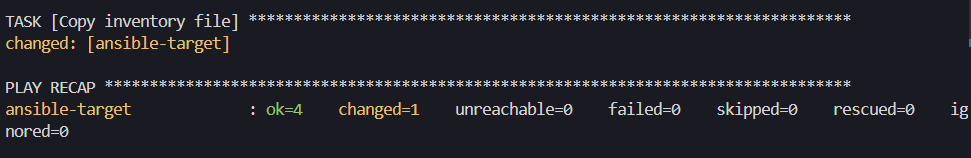
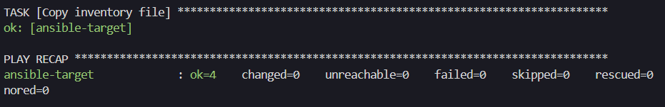

## Sprawozdanie 4

### Automatyzacja i zdalne wykonywanie poleceń za pomocą Ansible

Ansible to potężne narzędzie do automatyzacji, które umożliwia zarządzanie konfiguracją i wdrażanie aplikacji na wielu serwerach jednocześnie. Jest to popularne rozwiązanie wśród administratorów systemów i inżynierów DevOps ze względu na swoją prostotę użycia i skalowalność. Dzięki modelowi działania opartemu na infrastrukturze kodu oraz wykorzystaniu języka YAML do definiowania zadań, Ansible pozwala na szybkie i skuteczne zarządzanie infrastrukturą IT.

#### Konfiguracja dodatkowej maszyny

Jako system maszyny ansible-target, na której wykonywane będą polecenia zlecone przez ansible, wybrany został openSUSE Tumbleweed w wersji minimalistycznej bez środowiska graficznego.

Na tym systemie należało uruchomić usługę sshd oraz upewnić się, że znajduje się tam narzędzie tar.  


Kolejnym krokiem było zainstalowanie [oprogramowania Ansible](https://docs.ansible.com/) w systemie bazowym.

```
sudo zypper install ansible
```

Ostatnim elementem ułatwiającym komunikację ansible z nowo stworzoną maszyną była wymiana kluczy ssh. W tym celu przekonfigurowano ustawienia siecowe maszyny docelowej poprzez dodanie nowego adaptera siecowego w trybie `bridged` tak aby posiadał on swój własny adres IP. Dzięki temu będzie można również ustawić literową nazwę hosta przez co nie będziemy musieli podawać adresu IP podczas łączenia się z maszyną. 
- Aby wymienić klucze można użyć polecenia: `ssh-copy-id username@hostname`
- Aby dodać regułę imitującą DNS należy zedytować plik /etc/hosts i dodać w nim nową linijkę: `192.168.0.168 ansible-target` (gdzie podany adres IP to adres maszyny docelowej)

Weryfikacja, że z maszyną `ansible-target` da się połączyć bez używania hasła


#### Inwentaryzacja

Łatwiej jest zapamiętać nazwy komputerów nie stosując adresów IP lub innych oznaczeń liczbowych. W tym celu na obu maszynach zmieniono nazwy hostów poleceniem `hostnamectl`.

Na głównej maszynie
```bash
sudo hostnamectl set-hostname ansible-main
```

Na maszynie target1 i target2
```bash
sudo hostnamectl set-hostname ansible-target-<1 lub 2>
```

Dodatkowo zedytowano (jak wcześniej wspomniano) plik `/etc/hosts` na głownej maszynie.


Plik inwentaryzacji jest swojego rodzaju plikiem konfiguracyjnym zawierającym informacje o hostach, w których wykonywane będą określone polecenia. Dzięki niemu, ansible może zarządzać dużą liczbą hostów za pomocą pojedynczej komendy. Ma on rozszerzenie `ini`. Pliki w tym formacie są używane do przechowywania ustawień czy kluczy w hierarchicznej strukturze sekcji i parametrów. 

Należało umieścić w nim dwie sekcje:
- Orchestrators: zawiera ona nazwę maszyny, z której wykonywane są polecenia przy pomocy ansible
- Endpoints: nazwy docelowych maszyn, w których wykonujemy jakieś operacje

```ini
[Endpoints]
ansible-target-1
ansible-target-2

[Orchestrators]
localhost
```

Aby zweryfikować poprawność przygotowanego pliku, należało wysłać żądanie `ping` do wszystkich maszyn z sekcji `Endpoints`.


Maszyny 'odbijają piłeczkę' i zwracają `pong`. Dodatkowo widać, że ansible połączył się po protokole ssh i sprawdził, że na systemach dostępny jest Python w wersji 3.11.

#### Zdalne wywoływanie procedur

Ansible oferuje bardzo potężne narzędzie zwane playbookami. Dzięki nim możemy zdefiniować jakie operacje mają być wykonane na docelowych maszynach. Playbooki mogą być używane np. do zapisania konfiguracji swojego systemu. W razie potrzeby migracji na nową maszynę wystarczyło by uruchomić playbook z zapisaną konfiguracją systemu co uczyniło by proces zmiany maszyny o wiele prostszym.

Ważne jest to aby w playbookach jak najwięcej korzystać z dostępnych pluginów a nie wykonywać komendy ręcznie. Umożliwi to nam odizolowanie się od problemów związanych z wykonywaniem komend na różnych systemach czy w różnych środowskach. Zadaniem programisty jest sprecyzowanie jaki ma być końcowy stan wykonanych operacji przez ansible, a nie zastanawianie się jaką komendę uruchomić w zależności od systemu hosta.

Za pomocą playbooka mieliśmy wykonać szereg operacji:
- wysłać żądanie ping do wszystkich maszyn
- skopiować plik inwentaryzacji na maszyny Endpoints
- zaktualizować pakiety w systemie
- zrestartować usługi sshd i rngd

Definicja playbooka

```yaml
- name: Inwentaryzacja
  hosts: Endpoints
  tasks:
   - name: Ping my hosts
     ansible.builtin.ping:
   - name: Print message
     ansible.builtin.debug:
      msg: Hello world
   - name: Copy inventory file
     copy:
       src: ./inventory.ini
       dest: /home/ansible/
   - name: Update packages
     become: true
     become_method: sudo
     zypper:
      name: "*"
      state: latest
   - name: Restart sshd and rndg
     become: yes
     ansible.builtin.systemd_service:
       name: "{{ item }}"
       state: restarted
     loop:
       - sshd
       - rngd
```

Playbooka uruchamiamy poniższym poleceniem. Gdy operacje w playbooku wymagają uprawnień roota, musimy dodać flagę `--ask-become-pass` i po uruchomieniu podać hasło użytkownika z uprawnieniami roota. Gdy na docelowych maszynach nazwa użytkownika jest inna niż ta na bazowym systemie należy dodać flagę `-u` i podać nazwę użytkownika.

```bash
ansible-playbook ./playbook1.yaml -i inventory.ini -u ansible --ask-become-pass
```

Pierwsze uruchomienie


Drugie uruchomienie


Jak widać za drugim razem przy kopiowaniu plików dostajemy status OK oznaczający, że ansible zastało stan, który odpowiada temu co sprecyzowaliśmy w playbooku. Można zauważyć, że podczas restartowania usługi [`rngd`](https://manpages.opensuse.org/Tumbleweed/rng-tools/rngd.8.en.html) otrzymujemy błąd. Z tego co wynika z dokumentacji systemu openSUSE, rngd to narzędzie, które nie jest włączone jako usługa, którą można zrestartować, dlatego otrzymujemy błąd. Usługa sshd, za każdym razem się restartuje i zwraca status changed co jest przewidywanym wynikiem.

Za zadanie mieliśmy również przeprowadzić operacje względem maszyn z wyłączonym serwerem ssh. Gdy wyłączymy serwer ssh ansible nie będzie mogło połączyć się z docelową maszyną a tym samym wykonać operacji, które sprecyzowaliśmy w playbooku.


#### Zarządzanie kontenerem


### Pliki odpowiedzi dla wdrożeń nienadzorowanych

Pierwszym etapem laboratorium było wygenerowanie pliku odpowiedzi. Aby to zrobić, należało utworzyć nową maszynę wirtualną, wspierającą kickstart, na przykład Fedorę. Po przejściu przez proces instalacji i zainstalowaniu systemu, konieczne było skopiowanie pliku znajdującego się pod ścieżką /root/anaconda-ks.cfg do systemu bazowego.

Plik ten będzie później używany do automatycznej instalacji systemu. Jest to pójście o krok dalej jeżeli chodzi o automatyzację bla bla bla.


Wykonanie playbooka po raz pierwszy



Wynik po uruchomieniu drugi raz tego samego polecenia i playbooka

