## Sprawozdanie 4

### Automatyzacja i zdalne wykonywanie poleceń za pomocą Ansible

Ansible to potężne narzędzie do automatyzacji, które umożliwia zarządzanie konfiguracją i wdrażanie aplikacji na wielu serwerach jednocześnie. Jest to popularne rozwiązanie wśród administratorów systemów i inżynierów DevOps ze względu na swoją prostotę użycia i skalowalność. Dzięki modelowi działania opartemu na infrastrukturze kodu oraz wykorzystaniu języka YAML do definiowania zadań, Ansible pozwala na szybkie i skuteczne zarządzanie infrastrukturą IT.

#### Konfiguracja dodatkowej maszyny

Jako system maszyny ansible-target, na której wykonywane będą polecenia zlecone przez ansible, wybrany został openSUSE Tumbleweed w wersji minimalistycznej bez środowiska graficznego.

Na tym systemie należało uruchomić usługę sshd oraz upewnić się, że znajduje się tam narzędzie tar.  

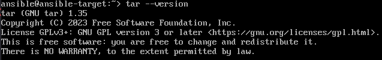

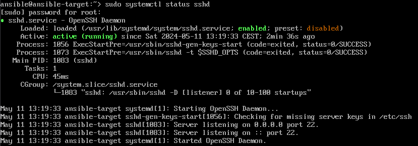

Kolejnym krokiem było zainstalowanie [oprogramowania Ansible](https://docs.ansible.com/) w systemie bazowym.

```
sudo zypper install ansible
```

Ostatnim elementem ułatwiającym komunikację ansible z nowo stworzoną maszyną była wymiana kluczy ssh. W tym celu przekonfigurowano ustawienia siecowe maszyny docelowej poprzez dodanie nowego adaptera siecowego w trybie `bridged` tak aby posiadał on swój własny adres IP. Dzięki temu będzie można również ustawić literową nazwę hosta przez co nie będziemy musieli podawać adresu IP podczas łączenia się z maszyną. 
- Aby wymienić klucze można użyć polecenia: `ssh-copy-id username@hostname`
- Aby dodać regułę imitującą DNS należy zedytować plik /etc/hosts i dodać w nim nową linijkę: `192.168.0.168 ansible-target` (gdzie podany adres IP to adres maszyny docelowej)

Weryfikacja, że z maszyną `ansible-target` da się połączyć bez używania hasła

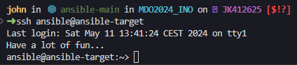

#### Inwentaryzacja

Łatwiej jest zapamiętać nazwy komputerów nie stosując adresów IP lub innych oznaczeń liczbowych. W tym celu na obu maszynach zmieniono nazwy hostów poleceniem `hostnamectl`.

Na głównej maszynie
```bash
sudo hostnamectl set-hostname ansible-main
```

Na maszynie target1 i target2
```bash
sudo hostnamectl set-hostname ansible-target-<1 lub 2>
```

Dodatkowo zedytowano (jak wcześniej wspomniano) plik `/etc/hosts` na głownej maszynie.

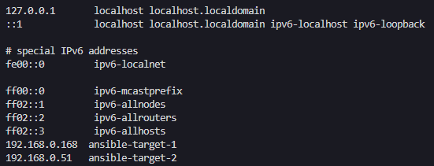

Plik inwentaryzacji jest swojego rodzaju plikiem konfiguracyjnym zawierającym informacje o hostach, w których wykonywane będą określone polecenia. Dzięki niemu, ansible może zarządzać dużą liczbą hostów za pomocą pojedynczej komendy. Ma on rozszerzenie `ini`. Pliki w tym formacie są używane do przechowywania ustawień czy kluczy w hierarchicznej strukturze sekcji i parametrów. 

Należało umieścić w nim dwie sekcje:
- Orchestrators: zawiera ona nazwę maszyny, z której wykonywane są polecenia przy pomocy ansible
- Endpoints: nazwy docelowych maszyn, w których wykonujemy jakieś operacje

```ini
[Endpoints]
ansible-target-1
ansible-target-2

[Orchestrators]
localhost
```

Aby zweryfikować poprawność przygotowanego pliku, należało wysłać żądanie `ping` do wszystkich maszyn z sekcji `Endpoints`.

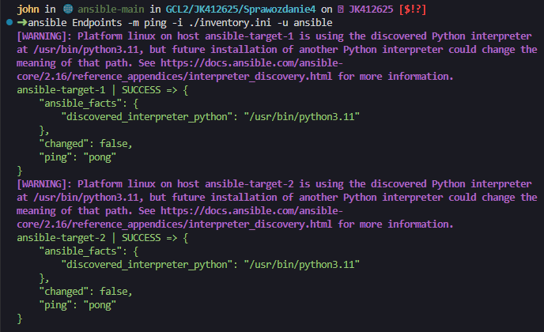

Maszyny 'odbijają piłeczkę' i zwracają `pong`. Dodatkowo widać, że ansible połączył się po protokole ssh i sprawdził, że na systemach dostępny jest Python w wersji 3.11.

#### Zdalne wywoływanie procedur

Ansible oferuje bardzo potężne narzędzie zwane playbookami. Dzięki nim możemy zdefiniować jakie operacje mają być wykonane na docelowych maszynach. Playbooki mogą być używane np. do zapisania konfiguracji swojego systemu. W razie potrzeby migracji na nową maszynę wystarczyło by uruchomić playbook z zapisaną konfiguracją systemu co uczyniło by proces zmiany maszyny o wiele prostszym.

Ważne jest to aby w playbookach jak najwięcej korzystać z dostępnych pluginów a nie wykonywać komendy ręcznie. Umożliwi to nam odizolowanie się od problemów związanych z wykonywaniem komend na różnych systemach czy w różnych środowskach. Zadaniem programisty jest sprecyzowanie jaki ma być końcowy stan wykonanych operacji przez ansible, a nie zastanawianie się jaką komendę uruchomić w zależności od systemu hosta.

Za pomocą playbooka mieliśmy wykonać szereg operacji:
- wysłać żądanie ping do wszystkich maszyn
- skopiować plik inwentaryzacji na maszyny Endpoints
- zaktualizować pakiety w systemie
- zrestartować usługi sshd i rngd

Definicja playbooka

```yaml
- name: Inwentaryzacja
  hosts: Endpoints
  tasks:
   - name: Ping my hosts
     ansible.builtin.ping:
   - name: Print message
     ansible.builtin.debug:
      msg: Hello world
   - name: Copy inventory file
     copy:
       src: ./inventory.ini
       dest: /home/ansible/
   - name: Update packages
     become: true
     become_method: sudo
     zypper:
      name: "*"
      state: latest
   - name: Restart sshd and rndg
     become: yes
     ansible.builtin.systemd_service:
       name: "{{ item }}"
       state: restarted
     loop:
       - sshd
       - rngd
```

Playbooka uruchamiamy poniższym poleceniem. Gdy operacje w playbooku wymagają uprawnień roota, musimy dodać flagę `--ask-become-pass` i po uruchomieniu podać hasło użytkownika z uprawnieniami roota. Gdy na docelowych maszynach nazwa użytkownika jest inna niż ta na bazowym systemie należy dodać flagę `-u` i podać nazwę użytkownika.

```bash
ansible-playbook ./playbook1.yaml -i inventory.ini -u ansible --ask-become-pass
```

Pierwsze uruchomienie

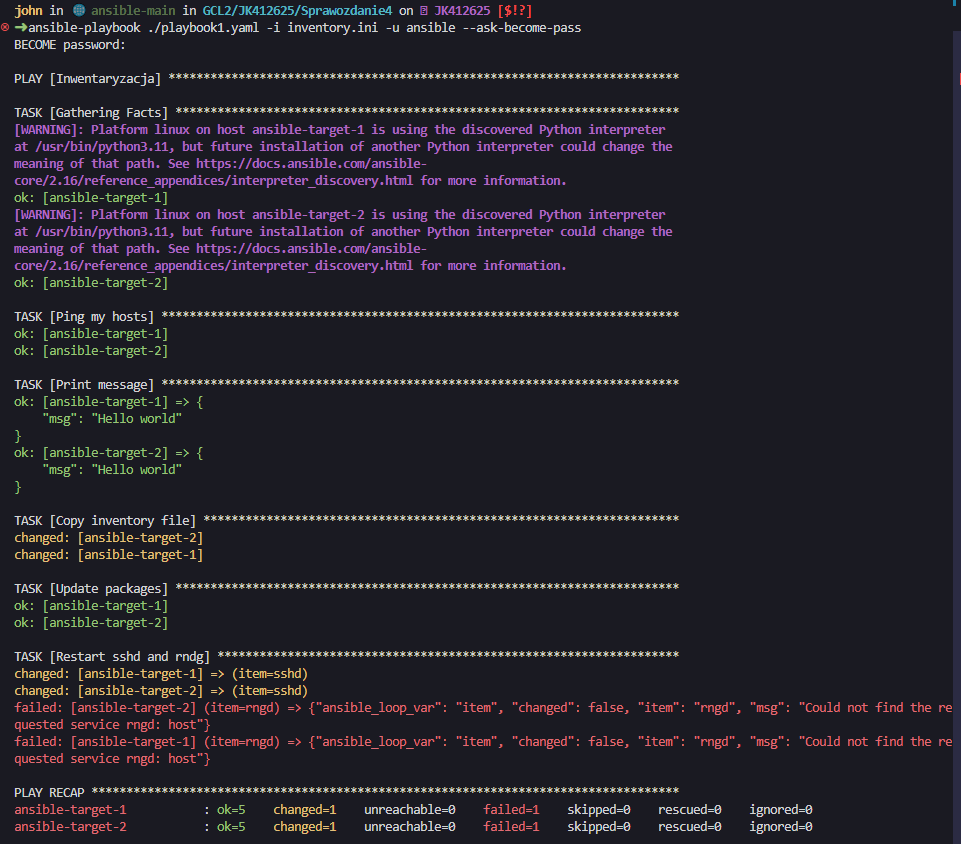

Drugie uruchomienie

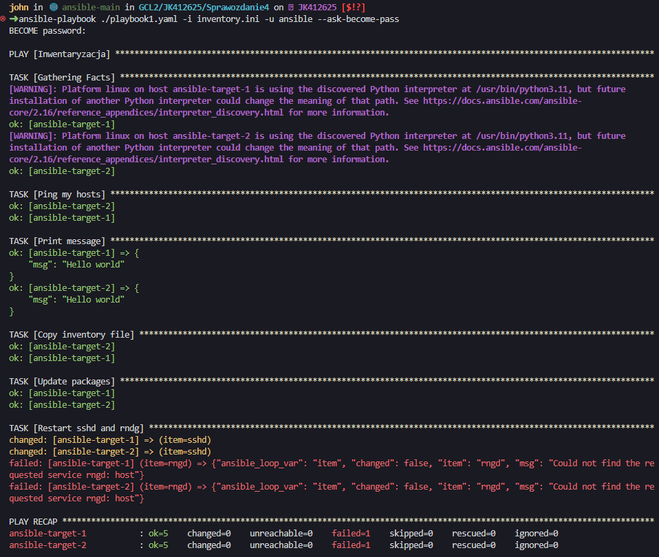

Jak widać za drugim razem przy kopiowaniu plików dostajemy status OK oznaczający, że ansible zastało stan, który odpowiada temu co sprecyzowaliśmy w playbooku. Można zauważyć, że podczas restartowania usługi [`rngd`](https://manpages.opensuse.org/Tumbleweed/rng-tools/rngd.8.en.html) otrzymujemy błąd. Z tego co wynika z dokumentacji systemu openSUSE, rngd to narzędzie, które nie jest włączone jako usługa, którą można zrestartować, dlatego otrzymujemy błąd. Usługa sshd, za każdym razem się restartuje i zwraca status changed co jest przewidywanym wynikiem.

Za zadanie mieliśmy również przeprowadzić operacje względem maszyn z wyłączonym serwerem ssh. Gdy wyłączymy serwer ssh ansible nie będzie mogło połączyć się z docelową maszyną a tym samym wykonać operacji, które sprecyzowaliśmy w playbooku.

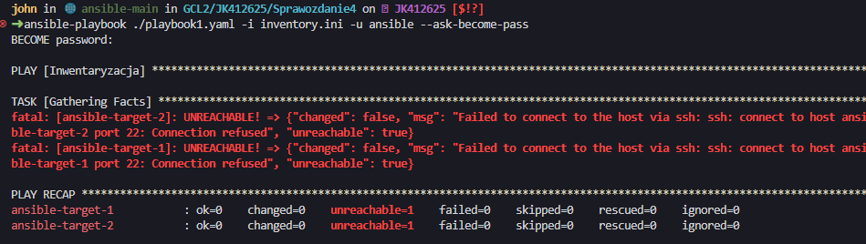

#### Zarządzanie kontenerem

Sekcja Deploy z poprzednich zajęć uruchamiała budowanie obrazu deploy służącego do rozpakowania zbudowanej aplikacji a następnie uruchomienia jest w celu sprawdzenia czy oprogramowanie jest gotowe do działania.

Elementy nowego playbooka:
- Pierwszym wymaganym krokiem w tej sekcji sprawozdania było uruchomienie kontenera z obrazem Deploy.
- Zamiast pobierać obraz z DockerHub pobrany zostanie artefakt z Jenkinsa ze zbudowaną aplikacją. Następnie zostanie on przekopiowany do docelowych maszyn.
- Doinstalowane zostaną potrzebne zależności aby uruchomić Ghidrę (OpenJDK w wersji przynajmniej 17).
- Na docelowych maszynach uruchomiony zostanie kontener jedynie z OpenJDK i zbudowanym kodem Ghidry.
- Na końcu usunie się uruchomiony wcześniej kontener.

Powyższe elementy można podzielić na dwie fazy: przygotowanie środowiska (zainstalowanie dockera, pobranie repozytorium z kodem itp.) a następnie uruchomienia aplikacji.

W celu pobrania artefaktu z jenkinsa został stworzony playbook ansible, wykorzystujący Jenkinsowe API. Potrzebne jest hasło oraz login aby móc pobrać artefakt.

Playbook kopiujący artefakt z Jenkinsa:

```yaml
- name: Copy file from jenkins
  hosts: localhost
  connection: local
  tasks:
    - name: Retrieve latest build from jenkins
      command: wget -r -np -l 1 -A zip --auth-no-challenge --http-user=<redacted> --http-password=<redacted>  http://127.0.0.1:8080/job/ghidra-main-pip/lastSuccessfulBuild/artifact/*zip*/ghidra.zip -O ghidra.zip
```

Ansible musi wykonać tą operację lokalnie ponieważ nie może zalogować się do maszyny po ssh. W tym celu przy hostach należy podać adres `localhost` oraz ustawić połączenie na `local`.

Poniżej znajduje się wynik polecenia `ansible-playbook ./ghidra-package.yaml`.

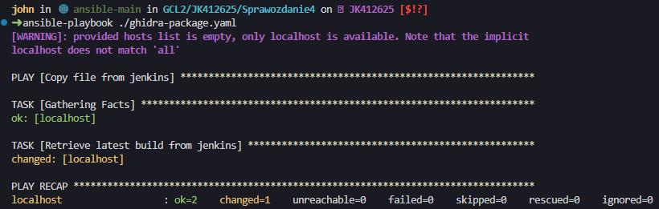

Gdy wylistujemy pliki w obecnym katalogu powinniśmy zobaczyć plik ghidra.zip.

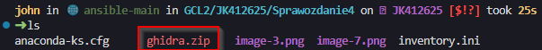

Poniżej znajduje się listing playbooka instalującego dockera i uruchamiający nowy obraz w kontenerze. Aby ansible poprawnie skopiowało plik z ghidrą należy go umieścić w ~/. Po kolei:
- odświeżenie repozytoriów
- instalacja dockera
- uruchomienie usługi dockera
- skopiowanie plików do docelowych maszyn
- zbudowanie obrazu dla ghidry
- uruchomienie kontenera z nowo stworzonym obrazem zawierającym skopiowany artefakt

```yaml
- name: Install and start docker
  hosts: Endpoints
  become: yes
  tasks:
    - name: Refresh all repositories
      command: zypper refresh
    - name: Install Docker
      zypper:
        name: docker
        state: present
    - name: Start and enable Docker service
      systemd:
        name: docker
        state: started
        enabled: yes

- name: Copy files
  hosts: Endpoints
  tasks:
    - name: Copy files 2
      copy:
        src: "~/{{ item }}"
        dest: ~/
      with_items:
        - ghidra.zip
        - devops/MDO2024_INO/INO/GCL2/JK412625/Sprawozdanie4/Dockerfile

- name: Create image with JDK and copied artifact
  hosts: Endpoints
  become: true
  tasks:
    - name: Build Docker image
      docker_image:
        name: deploy
        build:
          path: /home/ansible
        source: build

- name: Run ghidra
  hosts: Endpoints
  become: true
  tasks:
    - name: Run Docker container
      docker_container:
        name: ghidra_run
        image: deploy
```

Wyniki po uruchomieniu playbooka.

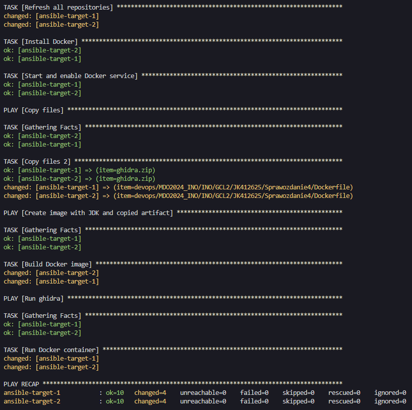

Ostatnim wymaganym elementem było wyczyszczenie zbudowanych obrazów i uruchomionych kontenerów. W tym celu również użyjemy dockerowego pluginu w ansible. Jako target ustawiamy maszyny podane w sekcji Endpoints.

```yaml
- name: Remove docker images and container
  hosts: Endpoints
  become: true
  tasks:
    - name: Run Docker container
      docker_container:
        name: ghidra_run
        state: absent
    - name: Run Docker container
      docker_image:
        name: deploy
        state: absent
```

Playbook uruchamiamy poleceniem: `ansible-playbook ./clean-docker.yaml -i ./inventory.ini -u ansible --ask-become-pass`.

##### Ansible galaxy

Powyższe playbooki można ubrać w role używając ansible galaxy.


### Pliki odpowiedzi dla wdrożeń nienadzorowanych

Pierwszym etapem laboratorium było wygenerowanie pliku odpowiedzi. Aby to zrobić, należało utworzyć nową maszynę wirtualną, wspierającą kickstart, na przykład Fedorę. Po przejściu przez proces instalacji i zainstalowaniu systemu, konieczne było skopiowanie pliku znajdującego się pod ścieżką /root/anaconda-ks.cfg do systemu bazowego.

Plik ten będzie później używany do automatycznej instalacji systemu. Zawiera on szereg instrukcji opisujących kolejne kroki instalowania nowego systemu. Jest to np. wybór języka, stworzenie nowego użytkownika czy zainstalowanie sprecyzowanych pakietów.

Po stworzeniu i uruchomieniu maszyny z docelowym instalatorem iso w GRUB'ie należy wejść w tryb edycji komend, które zostaną uruchomione przez GRUB. Należy wcisnąć `e`. Żeby wykorzystać nasz plik uruchamiający należy dodać zmienną `inst.ks=<ścieżka do pliku anaconda-ks.cfg>`. Można podać ścieżkę sieciową (np. adres webservera, który hostuje nasz plik). W tym celu wykorzystane zostały Github Gist, które pozwalają na dodawanie snippetów kodu tak samo jak pastebin. Po edycji komendy powinny wyglądać tak jak poniżej. Nową instrukcję dodajemy przed `initrdefi`, które rozpoczyna instalację.

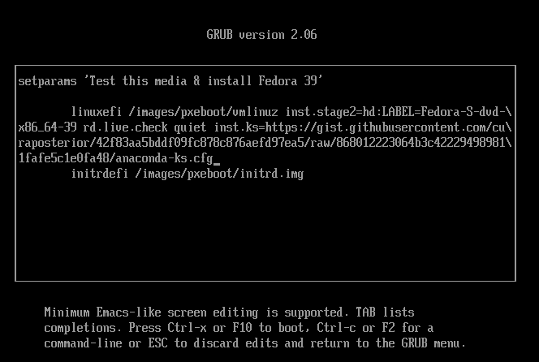

Tryb instalacji został ustawiony na tekstowy poprzez polecenie text, co oznacza, że instalacja będzie przeprowadzona bez użycia interfejsu graficznego. Układ klawiatury skonfigurowano na polski (keyboard --vckeymap=pl --xlayouts='pl'), a język systemu na polski z kodowaniem UTF-8 (lang pl_PL.UTF-8).

Źródła instalacji zostały określone poprzez użycie list: główna lista dla Fedora 39 (url --mirrorlist="http://mirrors.fedoraproject.org/mirrorlist?repo=fedora-39&arch=x86_64") oraz lista dla aktualizacji (repo --name=update --mirrorlist=http://mirrors.fedoraproject.org/mirrorlist?repo=updates-released-f39&arch=x86_64).

Konfiguracja dysku zakłada ignorowanie wszystkich dysków poza sda (ignoredisk --only-use=sda), automatyczne partycjonowanie (autopart) oraz usunięcie wszystkich istniejących partycji i utworzenie nowej etykiety dysku (clearpart --all --initlabel). Strefa czasowa została ustawiona na Europe/Warsaw z użyciem czasu UTC (timezone Europe/Warsaw --utc).

Konto administratora (root) zostało zablokowane (rootpw --lock), co oznacza, że nie będzie można się na nie bezpośrednio zalogować. Zostało utworzone konto użytkownika john, który należy do grupy wheel (grupa administracyjna), z zaszyfrowanym hasłem (user --groups=wheel --name=john --password=$y$j9T$y0nYbyK8bG4D7d36UMN9pa6G$0uQDFS8/6NgXTErzM1Rqc57QVfKsnpjhfH7zLcl9k22 --iscrypted --gecos="john doe").

Lista pakietów do instalacji obejmuje:

```
@^server-product-environment
java-17-openjdk
java-17-openjdk-devel
python3
python3-pip
unzip
wget
```

Po instalacji wykonywane są dodatkowe działania:

```
wget http://172.31.100.202:8000/ghidra.zip -P /tmp
unzip /tmp/ghidra.zip -d /usr/bin/local/
mv /usr/bin/local/ghidra_* /usr/bin/local/ghidra_exec/
rm -rf /usr/bin/local/ghidra
echo "export PATH=$PATH:/usr/bin/local/ghidra_exec" >> /etc/profile
echo "/usr/local/bin/ghidra_exec/ghidraRun" >> /home/john/.bashrc
```

Polecenia te pobierają plik ghidra.zip z określonego adresu URL, rozpakowują go do katalogu /usr/bin/local/, przenoszą zawartość do katalogu /usr/bin/local/ghidra_exec/, usuwają pierwotny katalog ghidra oraz dodają ścieżkę do zmiennej środowiskowej PATH w pliku /etc/profile. Na końcu za każdym razem gdy użytkownik zaloguje się do systemu i uruchomi basha to Ghidra uruchomi się w tle.

Po zakończeniu instalacji system zostaje automatycznie uruchomiony ponownie (reboot).

Plik z pełną konfiguracją znajduje się poniżej. 

```cfg
text

keyboard --vckeymap=pl --xlayouts='pl'
lang pl_PL.UTF-8

url --mirrorlist="http://mirrors.fedoraproject.org/mirrorlist?repo=fedora-39&arch=x86_64"
repo --name=update --mirrorlist=http://mirrors.fedoraproject.org/mirrorlist?repo=updates-released-f39&arch=x86_64

firstboot --enable

ignoredisk --only-use=sda
autopart
# Partition clearing information
clearpart --all --initlabel

timezone Europe/Warsaw --utc

rootpw --lock
user --groups=wheel --name=john --password=$y$j9T$y0nYbyK8bG4D7d36UMN9pa6G$0uQDFS8/6NgXTErzM1Rqc57QVfKsnpjhfH7zLcl9k22 --iscrypted --gecos="john doe"

%packages
@^server-product-environment
java-17-openjdk
java-17-openjdk-devel
python3
python3-pip
unzip
wget
%end

%post
wget http://172.31.100.202:8000/ghidra.zip -P /tmp
unzip /tmp/ghidra.zip -d /usr/bin/local/
mv /usr/bin/local/ghidra_* /usr/bin/local/ghidra_exec/
rm -rf /usr/bin/local/ghidra
echo "export PATH=$PATH:/usr/bin/local/ghidra_exec" >> /etc/profile
echo "/usr/local/bin/ghidra_exec/ghidraRun" >> /home/john/.bashrc
%end

reboot
```

Poniżej widać załadowanie wstępnych ustawień (język, czas itp.) podczas instalacji

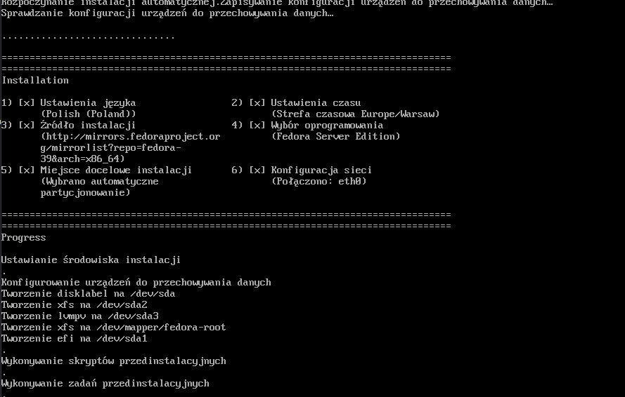

Po zainstalowaniu systemu i automatycznym jego zrestartowaniu można się zalogować na stworzone wcześniej konto. Gdy wylistujemy procesy zobaczymy tam uruchomiony proces Ghidry. Docelowo tą aplikację powinno się uruchamiać w środowisku graficznym. 

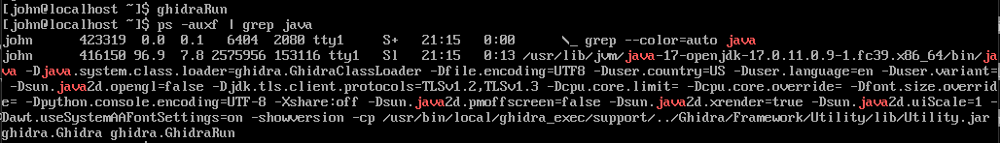
