## Sprawozdanie 5


### Wdrażanie na zarządzalne kontenery (K8s cz. 1)

> Informacja: W niektórych miejscach zamiast komendy kubectl może pojawić się samo k. W pliku ~/.bashrc został ustawiony alias na komendę kubectl (alias k='kubectl').


#### Minikube i inne narzędzia

Na zajęciach wykorzystaliśmy kilka narzędzi, które pozwalają na pracę w środowisku Kubernetes. [Kubernetes](https://kubernetes.io/docs/tutorials/kubernetes-basics/) to technologia pozwalająca zautomatyzować wdrażanie, skalowanie i zarządzanie aplikacjami. [Kluczowe elementy](https://kubernetes.io/docs/concepts/architecture/) Kubernetesa to:
- Pod -> najmniejsza zarządzalna jednostka w k8s
- Node -> węzęł to najczęsciej fizyczna lub wirtualna maszyna
- Master Node (Control Plane) -> główny element klastra, składa się z kilku kluczowych komponentów służących do zarządzania resztą węzłów: kube-apiserver, etcd (baza danych) czy kube-contoller-manager itd. 

> Więcej informacji znajduje się na stronie z dokumentacją: https://kubernetes.io/docs/home/.

Na zajęciach wykorzystaliśmy narzędzie, które w prosty sposób pozwala uruchomić k8s lokalnie.

Minikube to narzędzie open-source, które umożliwia uruchomienie lokalnego klastra Kubernetes na jednym komputerze. Jest często stosowane zamiast pełnego klastra Kubernetes ze względu na swoją prostotę i niskie wymagania systemowe. Minikube obsługuje różne platformy wirtualizacji, takie jak VirtualBox, Docker, oraz VMware, co pozwala na łatwe dostosowanie do różnych środowisk deweloperskich. Oferuje wsparcie dla większości funkcji k8s. Minikube jest idealne do testowania i rozwoju aplikacji kontenerowych, umożliwiając deweloperom szybkie tworzenie, uruchamianie i debugowanie aplikacji bez konieczności konfigurowania i zarządzania złożonym klastrem produkcyjnym.


##### Instalacja Minikube

W celu instalacji minikube należy wykonać kroki z instrukcji: https://minikube.sigs.k8s.io/docs/start/. Po pobraniu i zainstalowaniu klastra należy go uruchomić komendą `minikube start`.

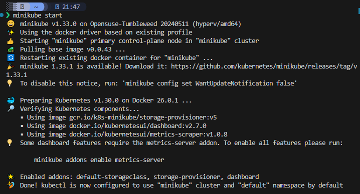

Minikube uruchamia kontroler w kontenerze. Gdy wypiszemy działające kontenery będzie można zauważyć forwarding charakterystycznych portów, które przekierowywuje minikube, np. 2376 (docker daemon).

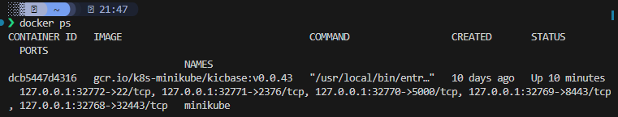

Kolejnym krokiem jest instalacja kubectl'a.


##### Instalacja kubectl

Aby móc zarządzać klastrem z poziomu terminala potrzebne jest narzędzie `kubectl`. Pozwoli nam ono wykonywać komendy na węźle (np. uruchamiać wdrożenia, sprawdzać stan podów itp.). Aby zainstalować `kubectl` ze źródła należy wykonać [instrukcję](https://kubernetes.io/docs/tasks/tools/install-kubectl-linux/). Po poprawnej instalacji powinniśmy móc sprawdzić np. wersję kubectl'a lub wylistować pody. Należy zaznaczyć, że przy uruchamianiu minikube'a komendą `start`, modyfikuje on konfigurację kubectl tak aby można było wykonywać operacje w 'miniklastrze' (konfiguracja znajduje się w katalogu `~/.kube`).

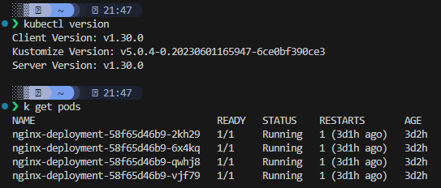

Powyżej widać przykładowe pody z nginx'em (serwerem webowym).


#### Analiza wybranego oprogramowania

Kontener z sekcji `Deploy` z zajęć z Jenkinsowym Pipeline'em nie nadaje się do ciągłego wdrożenia. Ghidra to aplikacja GUI, która jedynie mogła by być dystrybuowana w środowisku kubernetes.

Zaistniała konieczność zmiany oprogramowania na aplikację, która może działać w trybie ciągłym i da się łatwo zweryfikować czy poprawnie działa. Najprostszym tego przykładem jest serwer webowy [Nginx](https://nginx.org/en/). Pozwala on na m.in. hostowanie statycznych treści, uruchomienie go w trybie [reverse-proxy](https://docs.nginx.com/nginx/admin-guide/web-server/reverse-proxy/), na cache'owanie treści czy np. może pomagać regulować ruch sieciowy.

Domyślny kontener z nginx'em został lekko zmodyfikowany. Po pierwsze zmieniona została domyślna konfiguracja znajdująca się w pliku `nginx.conf` ([więcej o konfiguracji nginx'a](https://nginx.org/en/docs/beginners_guide.html#conf_structure)). Dodany został nowy nagłówek serwera oraz zmodyfikowana została strona powitalna, która wyświetla się gdy poprawnie skonfigurujemy nginx'a. Dodatkowo włączony został SSL z [certyfikatami `self-signed`](https://www.sectigo.com/resource-library/what-is-a-self-signed-certificate). Pozwala to na połączenie się z webserwerem po `HTTPS`, jednakże gdy połączymy się z serwerem otrzymamy informację, że połączenie nie jest bezpieczne. Jest to spowodowane, że certyfikaty zostały wygenerowane własnoręcznie i nie są respektowane przez np. przeglądarkę.

Przykładowy html witający użytkownika.

```html
<!DOCTYPE html>
<html lang="en">
<head>
    <meta charset="UTF-8">
    <meta name="viewport" content="width=device-width, initial-scale=1.0">
    <title>Landing page</title>
</head>
<body>
    <h1>VERSION 1</h1>
    <h2>Nginx seems to be working properly :)</h2>
    <p>Welcome to our website!</p>
    <div class="welcome-section">
        <h3>Welcome to our Website!</h3>
        <p>Thank you for visiting our website. We are excited to have you here!</p>
        <p>Feel free to explore and discover all the amazing features and content we have to offer.</p>
    </div>
</body>
</html>
```

> Powyższy template może nieco różnić się od wersji wdrażanych w deploymentach poniżej

Poniżej znajduje się zmodyfikowana koniguracja nginx'a. Większość atrybutów w tej konfiguracji została skopiowana z domyślnej konfiguracji. Jak wyżej wspomniano dodano możliwość komunikacji po HTTPS (server {listen 443}), dodano nagłówek z numerem studenta (add_header) i dodano hostowanie statycznego pliku o nazwie `index.html`.

```conf
user  nginx;
worker_processes  auto;
error_log  /var/log/nginx/error.log notice;
pid        /var/run/nginx.pid;
events {
    worker_connections  1024;
}
http {
    include       /etc/nginx/mime.types;
    default_type  application/octet-stream;
    add_header X-server-header "My personal header JK412625!";
    log_format  main  '$remote_addr - $remote_user [$time_local] "$request" '
                      '$status $body_bytes_sent "$http_referer" '
                      '"$http_user_agent" "$http_x_forwarded_for"';
    access_log  /var/log/nginx/access.log  main;

    sendfile        on;
    keepalive_timeout  65;

    server {
        listen 80;
        listen [::]:80;
        server_name localhost;
        return 301 https://$host$request_uri;
    }
    server {
        listen 443 ssl http2;
        listen [::]:443 ssl http2;
        server_name localhost;

        ssl_certificate /etc/nginx/ssl/nginx.crt;
        ssl_certificate_key /etc/nginx/ssl/nginx.key;

        location / {
            root /var/www/html;
            index index.html;
        }
    }
    include /etc/nginx/conf.d/*.conf;
}
```

Zmodyfikowany obraz docker

```Dockerfile
FROM nginx

RUN mkdir -p /var/www/html/
COPY index.html /var/www/html/index.html

RUN mkdir -p /etc/nginx/ssl/ && \
    openssl req -x509 -nodes -days 365 -newkey rsa:2048 -keyout /etc/nginx/ssl/nginx.key -out /etc/nginx/ssl/nginx.crt -subj "/C=US/ST=Denial/L=Springfield/O=Dis/CN=www.example.com"

COPY nginx.conf /etc/nginx/nginx.conf

EXPOSE 80 443
```

Eksponujemy dwa porty: 80 (http) i 443 (https) w kontenerze.


#### Wdrożenie na k8s

Przed uruchomieniem kontenera na stosie k8s trzeba zbudować obraz ze zmodyfikowanym nginx'em. Są dwie opcje, z których można skorzystać:
- zbudować obraz i 'wypchnąć' go do docker huba. Jeżeli minikube nie znajdzie obrazu lokalnie będzie próbował zaciągnąć go z docker-huba.
- zbudować obraz wewnątrz środowiska docker'owego minikube'a. Aby to zrobić należy w terminalu uruchomić polecenie `eval $(minikube -p minikube docker-env)`, które na czas trwania sesji w terminalu podmieni środowisko docker'owe na to w klastrze minikube. Dzięki temu nie będzie konieczności zaciągania obrazów z zewnętrznych źródeł.

W moim przypadku wybrana została opcja numer dwa. Gdy wypiszemy listę zbudowanych obrazów znajdujących się w środowisku minikube'a zobaczymy, że różni się ona od tego co jest dostępne w głównym systemie.

Wewnątrz minikube'a

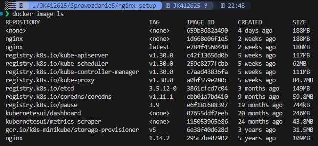

W głównym systemie

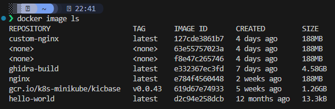

Dla celów zajęć zbudujemy dwa obrazy różniące się wiadomością w powitalnym html'u. Każdy z obrazów będzie otagowany inną wersją.

Budowa zmodyfikowanego nginx'a w katalogu z Dockerfile'em

```bash
docker build -t custom-nginx:1.0.0 .
docker build -t custom-nginx:2.0.0 .
```

Przykładowy wynik dla drugiej komendy (wersja 2.0.0).

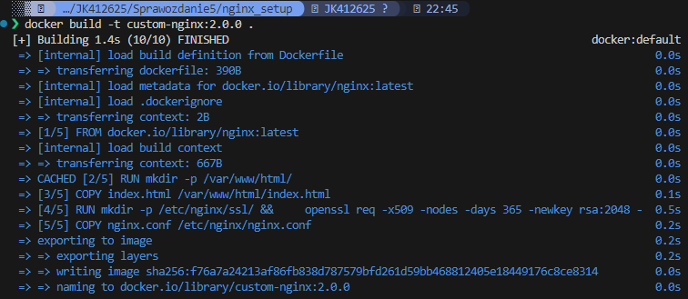

Obraz można również dodać do głównego rejestru dockera (DockerHub) wykonująć poniższe komendy:

```bash
docker login
docker tag custom-nginx:1.0.0 <username>/custom-nginx:1.0.0
docker push <username>/custom-nginx:1.0.0
```

Kolejnym krokiem jest uruchomienie poda. Aby to zrobić można skorzystać z polecenia `kubectl run`. Należy podać nazwę obrazu docker, który ma zostać uruchomiony, wyprowadzone porty (przez, które połączymy się z nginx'em) oraz label, dzięki któremu w prosty sposób będzie można sterować podem. Korzystając z `kubectl get pods` można wypisać działające pody.

```bash
minikube kubectl run -- nginx-deployment --image=nginx:latest --port=443 --labels app=nginx-deployment
```

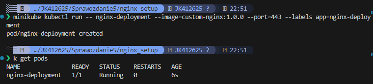

Widać pojedynczy kontener z działającym nginx'em. Nie jesteśmy jeszcze w stanie połączyć się z kontenerem ponieważ znajdujemy się w innej sieci. W tym celu należy przekierować porty. Kubectl umożliwia na przekierowanie portów z wewnątrz klastra do naszej lokalnej sieci. W tym celu należy wykonać polecenie `kubectl port-forward pod/nginx-deployment 8000:443`. Port `443` kontenera będzie dostępny pod portem `8000` w naszej lokalnej sieci.

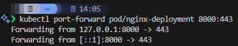

Można wykonać połączenie do webowego serwera, który wita nas zmodyfikowaną wcześniej stroną powitalną.

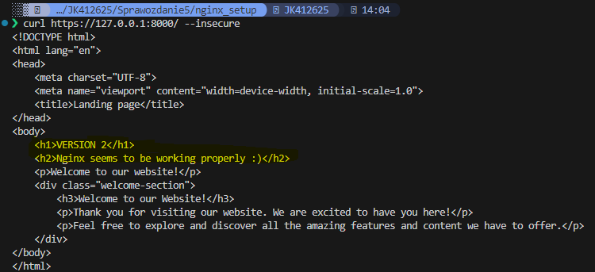


#### Dashboard k8s

Kubernetes udostępnia graficzny interfejs w formie aplikacji webowej, dzięki której można zarządzać klastrem. Aby go uruchomić w minikube należy wykonać komendę `minikube dashboard`. Wygląda on jak poniżej. 

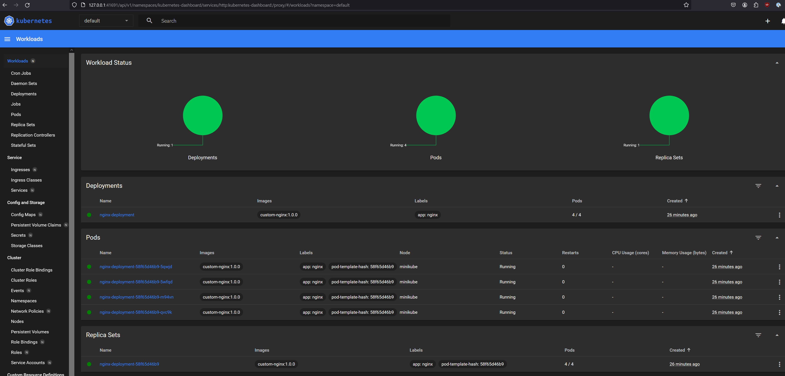

Umożliwia on wykonywanie tych samych operacji, które można przeprowadzić za pomocą narzędzia wiersza poleceń kubectl, ale w bardziej interaktywny i dostępny sposób. Dzięki Dashboardowi użytkownicy mogą np. tworzyć i edytować zasoby lub monitorować stan klastra (jest to wygodniejsze niż uruchamianie kolejnych komend w terminalu).

### Wdrażanie na zarządzalne kontenery (K8s cz. 1)


#### Manifest

Kroki z poprzedniej części (uruchamianie poda, przekierowywanie portów itp.) można ubrać w tzw. wdrożenia (deployment'y) zapisane w formacie yaml. Zawierają one finalny stan aplikacji jaki chcemy otrzymać w klastrze k8s. Można sprecyzować wszystkie parametry związane z wdrożeniem danej aplikacji (przekierowanie portów, ilość podów jakie mają zostać uruchomione, ograniczenia zasobów dla podów takie jak procesor, pamięć itp.).

Plik wdrożenia dla zmodyfikowanego nginx'a

```yaml
apiVersion: apps/v1
kind: Deployment
metadata:
  name: nginx-deployment
  labels:
    app: nginx
spec:
  replicas: 4
  selector:
    matchLabels:
      app: nginx
  template:
    metadata:
      labels:
        app: nginx
    spec:
      containers:
      - name: nginx
        image: custom-nginx:1.0.0
        imagePullPolicy: IfNotPresent
        ports:
        - containerPort: 80
        - containerPort: 443
        resources:
          limits:
            memory: "512Mi"
```

Głównymi parametrami pliku wdrożenia są:
- `.kind` -> rodzaj wdrożenia np. Deployment/StatefulSet/CronJob/ReplicaSet
- `.spec.replicas` -> ilość replik danego poda
- `.spec.template.spec.containers` -> sprecyzowanie kontenerów znajdujących się w danym podzie (pod może mieć uruchomione wiele kontenerów)
    - `.spec.template.spec.containers.image` -> nazwa obrazu, który zostanie uruchomiony
    - `.spec.template.spec.containers.imagePullPolicy` -> precyzuje w jakich warunkach k8s ma zaciągać obraz z zewnętrznego źródła


#### Zmiany w deploymencie

Wdrażanie deploymentu zapisanego w formie yaml jest bardzo proste. Wystarczy wykonać komendę `kubectl apply -f <nazwa-pliku-wdrożenia>`.

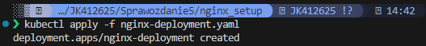

Wdrożenie zostało uruchomione. Można teraz sprawdzić czy k8s stworzył docelową ilość zreplikowanych podów.

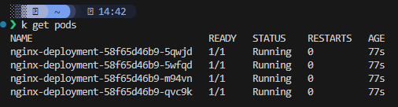

Zamast sprawdzać czy pody zostały uruchomione można sprawdzić stan `rollout'u` czyli tzw. procesu wdrożenia nowej wersji aplikacji ze zdefiniowaną ilością podów. Należy wykonać komendę `kubectl rollout status <resource-type>/<name-of-the-resource>`.

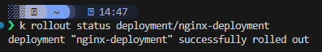

Komenda `kubectl rollout <opcja>` posiada inne ciekawe opcje:
- history -> można sprawdzić historę wdrożeń
- status -> status wdrożenia, pokazuje dynamicznie status jeżeli wdrożenie nie jest jeszcze gotowe
- undo -> przywrócenie poprzedniej wersji deploymentu
- pause/resume -> wstrzymanie/wznowienie deploymentu
 
Aktualne wdrożenie można modyfikować np. można zmienić liczbę replik na 8 w wyżej wspomnianym pliku yaml. Zmainy są aplikowane gdy ponownie uruchomi się polecenie `kubectl apply -f <nazwa-pliku-manifest>`.

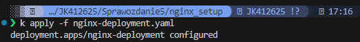

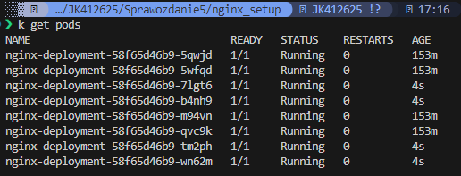

Jak widać liczba podów zwiększyła się do 8. Można również redukować liczbę podów np. do 1 lub 0. Zmniejszenie liczby podów do 0 pozwala na zachowanie konfiguracji deploymentu. Jeżeli pojawi sie potrzeba ponownego uruchomienia podów, wystarczy wykonać jedną komendę kubectl (np. `kubectl scale deployment <nazwa-deploymentu> --replicas=<liczba-replik>`).

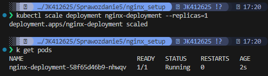

'Wyzerowanie' deploymentu. Widać, że deployment dalej istnieje w klastrze.

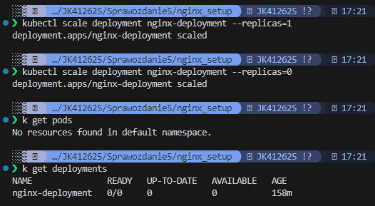

K8s pozwala w prosty sposób podmieniać wersje danej aplikacji. Przykładem może być zmiana wcześniej zmodyfikowanego obrazu nginx'a. Mamy dwie wersje, które różnią się tagiem oraz posiadają inne strony powitalne. Wersja 1.0.0 była wdrażana w poprzednich przykładach. Aby wdrożyć wersję 2.0.0 należy zmodyfikować tag obrazu custom-nginx w pliku yaml (z wdrożeniem).

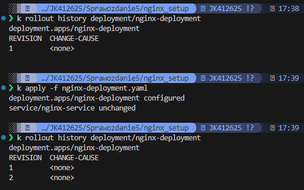

Jak widać powyżej po wdrożeni nowej wersji obrazu otrzymujemy nową rewizję historii. Gdy sprawdzimy wersję obrazów np. używając dashboarda k8s zobaczymy wersję 2.0.0.

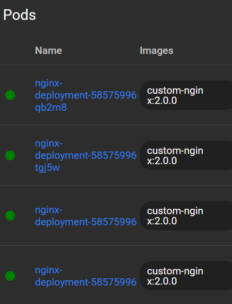

Gdyby nowo wprowadzona wersja np. nie działała lub miała jakieś luki bezpieczeństwa, w prosty sposób można cofnąć się do poprzedniej wersji deploymentu uruchamiając komendę `kubectl rollout undo`. Można sprecyzować którą wersję deploymentu chcemy przywrócić podając flagę `--to-revision=<numer-rewizji>` (domyślnie jest to wersja działająca przed akutalną).

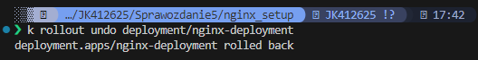

Po przywróceniu poprzedniej wersji pody korzystają z obrazów z wersją 1.0.0

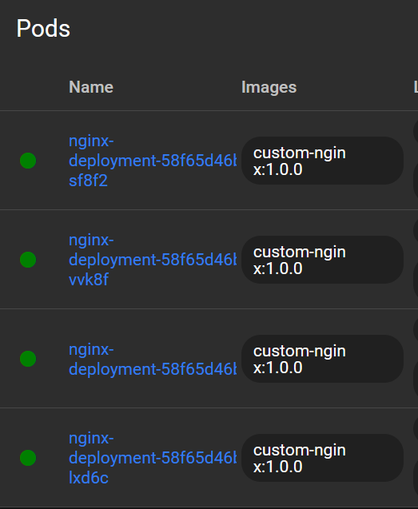


#### Kontrola wdrożenia

Poniżej znajduje się prosty skrypt napisany w języku bash, weryfikujący czy wdrożenie zdążyło się uruchomić (maksymalny czas oczekiwania to 60 sekund). Co jedną sekundę sprawdzany jest stan deploymentu za pomocą komendy `kubectl get deployment`, z której można odczytać stan wdrożenia. Kubectl pozwala na wyciąganie pełnych informacji o danym zasobie, korzystając z kube-apiserver. Można wydobywać pojednycze parametry odnosząc się do nich w odpowiedniej hierarchii. Interesuje nas stan `Available=True`, który oznacza, że deployment poprawnie się wdrożył.

```bash
#!/bin/bash

DEPLOYMENT_NAME="nginx-deployment"
TIMEOUT=60
INTERVAL=1

check_deployment() {
    kubectl get deployment "$DEPLOYMENT_NAME" -o jsonpath='{.status.conditions[?(@.type=="Available")].status}'
}

echo "Sprawdzanie statusu deploymentu '$DEPLOYMENT_NAME'..."

START_TIME=$(date +%s)
while true; do
    STATUS=$(check_deployment)
    CURRENT_TIME=$(date +%s)
    ELAPSED_TIME=$((CURRENT_TIME - START_TIME))
    if [ "$STATUS" == "True" ]; then
        echo "Wdrożenie '$DEPLOYMENT_NAME' zostało pomyślnie zakończone."
        exit 0
    fi
    if [ "$ELAPSED_TIME" -ge "$TIMEOUT" ]; then
        echo "Wdrożenie '$DEPLOYMENT_NAME' nie zakończyło się w ciągu $TIMEOUT sekund."
        exit 1
    fi
    echo "Wdrożenie w toku... (upłynęło '$ELAPSED_TIME' sekund)"
    sleep "$INTERVAL"
done
```

Przykładowe użycie skryptu dla deploymentu `nginx-deployment` dla 6 replik nginx'a.

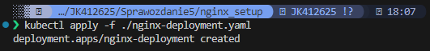

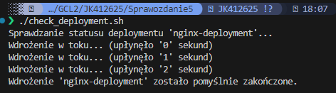


#### Serwisy

Tworząc zasób w klastrze k8s nie jest on domyślnie eksponowany z zewnątrz klastra. To znaczy, że jeżeli chcemy się połączyć z naszym zmodyfikowanym nginx'em to albo musimy ręcznie przekierować porty lub wykorzystać do tego kolejny zasób k8s czyli `Service`. Serwisy definiują politykę dostępu dla zestawu podów/aplikacji. Wyróżniamy kilka rodzajów serwisów:
- ClusterIP -> pody są dostępne tylko z wewnątrz klastra
- NodePort -> udostępnia aplikację na określonym porcie.
- Loadbalancer -> tworzy load balancer, który rozdziela ruch do podów (domyślnie k8s nie ma zaimplementowanej tej funkcjnonalności, potrzebne są zewnętrzne aplikacje / pluginy pozwalające na uruchomienie takiej usługi. Dostawcy chmurowi zwykle zapewniają tą usługę `out-of-the-box`. Popularnymi opcjami o otwartym kodzie źródłowym są [MetaLB](https://metallb.io/) czy [PureLB](https://purelb.gitlab.io/docs/)).
- ExternalName -> mapuje serwis na zewnętrzną nazwę DNS.

Przykładowy serwis dla deployment'u nginx'a eksponujący dwa porty TCP: 80 i 443 (domyślnie będzie to ClusterIP).

```yaml
apiVersion: v1
kind: Service
metadata:
  name: nginx-service
spec:
  selector:
    app: nginx
  ports:
    - name: http-port
      protocol: TCP
      port: 80
      targetPort: 80
    - name: https-port
      protocol: TCP
      port: 443
      targetPort: 443
```

Aby wyeksponować serwis po za klaster można użyć minikube'a. Należy zaznaczyć, że zasoby posiadające typ ClusterIP nie powinny być eksponowane, jednak minikube pozwala to zrobić w celach edukacyjnych.

Komenda eksponująca dany serwis
```bash
minikube service nginx-service
```

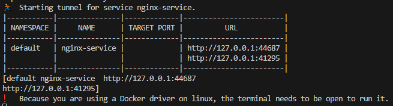

Dzięki temu można teraz dostać się do strony powitalnej nginx'a.

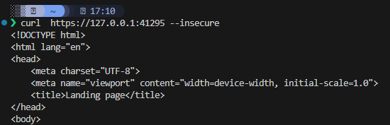


#### Strategie wdrożenia

Oto główne strategie wdrożeń w Kubernetes:
- RollingUpdate -> w strategii RollingUpdate, pody są aktualizowane stopniowo, co oznacza, że część starych podów jest sukcesywnie zastępowana nowszymi wersjami. W trakcie aktualizacji zawsze pewna liczba podów pozostaje dostępna, co zapewnia ciągłość działania aplikacji. Można precyzyjnie określić, ile podów ma być jednocześnie niedostępnych i ile nowych podów ma być tworzonych podczas wdrażania aktualizacji.
  - Parametr MaxSurge -> precyzuje ile nowych podów może zostać stworzonych na raz
  - Parametr MaxUnAvailable -> precyzuje maksymalną ilość niedostępnych podów.
- Recreate -> w strategii Recreate wszystkie pody są usuwane przed stworzeniem nowych podów z nowszą wersją.
- CanaryDeployment -> polega na stworzeniu deploymentu z nową wersją oprogramowania równolegle do deploymentu działającego ze starą wersją. Dzięki temu nową wersję można jeszcze przetestować przed udostępnieniem jej użytkownikom. Aby udostępnić nową wersję użytkownikom wystarczy podmienić selektor aplikacji w serwisie rutującym użytkowników do aplikacji. Takie rozwiązanie wymaga zużycia większej liczby zasobów.

**Wdrożenie *RollingUpdate***

Strategie dla deploymentu definiuje się pod parametrem `.spec.strategy` w pliku yaml. Poniżej ustawiono również wyżej wspomniane parametry sterujące sposobem wdrożenia nowych podów i zmieniono liczbę replik na 6.

```yaml
spec:
  (...)
  strategy:
    type: RollingUpdate
    rollingUpdate:
      maxUnavailable: 1
```

Gdy zmienimy wersję oprogramowania `rollout` powinien zachować się w poniższy sposób.

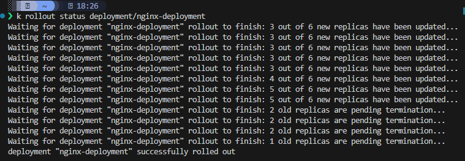

**Wdrożenie *Recreate***

```yaml
spec:
  (...)
  strategy:
    type: Recreate
```

Po uruchomieniu nowego deploymentu za pomocą komendy `kubectl apply`, otrzymujemy poniższy wynik. Jak widać na końcu, nie ma widocznej operacji usuwania starych podów. Na początku wszystkie stare pod'y są usuwane, a następnie wdrażane są nowe.

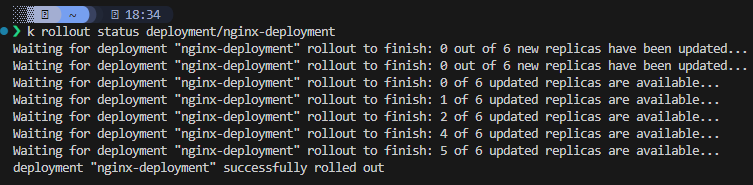

**Wdrożenie *Canary Deployment***

We wdrożeniu `Canary Deployment` wykorzystany zostanie mechanizm etykietowania. Przyjmijmy hipotetyczną sytuację: chcemy zaktualizować wersję aplikacji z 1.0.0 do 2.0.0 za pomocą `Canary Deployment`. W tym celu należy przygotować nowy manifest opisujący nową wersję oprogramowania. Będzie się on różnił tylko labelem, który zostanie później wykorzystany w serwisach oraz wersją obrazu `custom-nginx`.

```yaml
apiVersion: apps/v1
kind: Deployment
metadata:
  name: nginx-canary
  labels:
    app: canary
spec:
  replicas: 4
  selector:
    matchLabels:
      app: canary
  template:
    metadata:
      labels: 
        app: canary
    spec:
      containers:
      - name: nginx
        image: custom-nginx:2.0.0
        imagePullPolicy: IfNotPresent
        ports:
        - containerPort: 80
        - containerPort: 443
        resources:
          limits:
            memory: "512Mi"
  strategy:
    type: RollingUpdate
    rollingUpdate:
      maxUnavailable: 1
```

Na początku należy upewnić się, że stara wersja nginx'a jest wdrożona jako Deployment. W tym celu można przejść do zakładki `Deployments` w `k8s dashboard`.

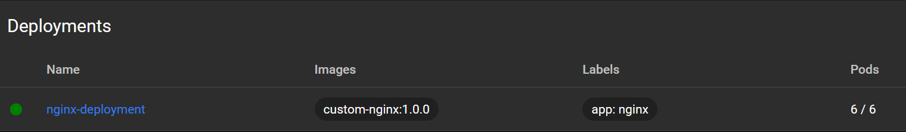

Należy upewnić się również, że serwis `nginx-service` działa i jest przypisany do aplikacji nginx a nie canary. Wystarczy przejść do zakładki `Service > Services > nginx-service` i zobaczyć parametry znajdujące się pod `Resource Information`.

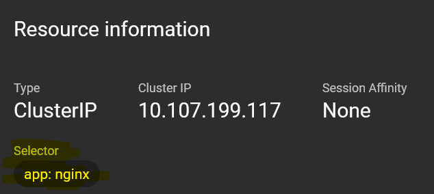

Kolejnym krokiem jest wdrożenie nowej aplikacji z labelem `canary`. Jest to nowa wersja aplikacji custom-nginx, którą chcemy wdrożyć zamiast obecnej.

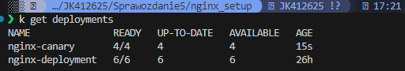

W klastrze działają teraz dwa deploymenty, jeden z wersją aplikacji 1.0.0 a drugi 2.0.0. Serwis `przekierowywuje` użytkowników do wersji 1.0.0. Aby to zmienić należy zaktualizować wartość parametru `.spec.selector.app` na `canary` w manifeście serwisu.

```yaml
apiVersion: v1
kind: Service
metadata:
  name: nginx-service
spec:
  selector:
    app: canary
  ports:
    - name: http-port
      protocol: TCP
      port: 80
      targetPort: 80
    - name: https-port
      protocol: TCP
      port: 443
      targetPort: 443
```

Po zaktualizowaniu manifestu serwisu, wdrożeniu go i zrestartowaniu komendy `minikube service`, jesteśmy w stanie dostać się do nowej wersji aplikacji.

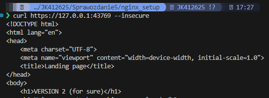

Poniżej widoczny jest zrzut ekranu ilustrujący wprowadzone zmiany. Selektor zmienił się na `canary`, zredukowała się liczba eksponowanych podów oraz zmieniła się wersja podów, które obsługuje serwis.

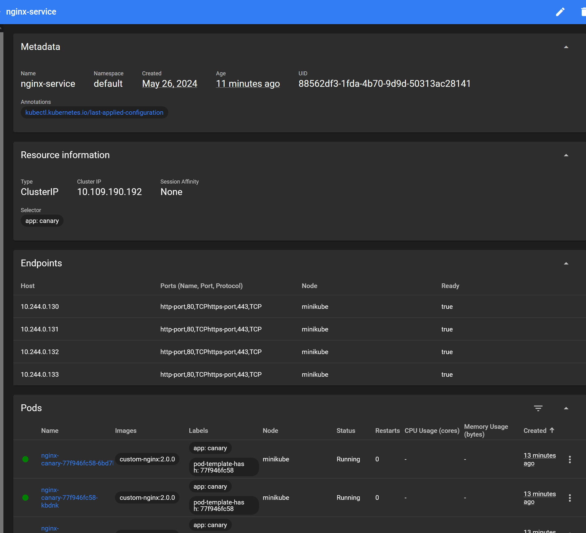

Na końcu można usunąć deployment ze starą wersją lub np. zredukować jego liczbę replik do zera, jeżeli pojawiłaby się konieczność migracji do starszej wersji.

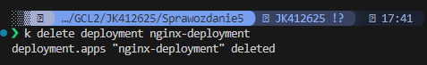

> Każde z powyższych rozwiązań ma swoje wady i zalety. Po przeanalizowaniu tych trzech opcji, dla aplikacji custom-nginx najlepiej zastosować typ wdrożenia RollingUpdate. Zapewnia on ciągłość działania. Wadą jest to, że użytkownik może połączyć się ze starszą wersją custom-nginx. W tym przypadku nie powoduje to problemów.