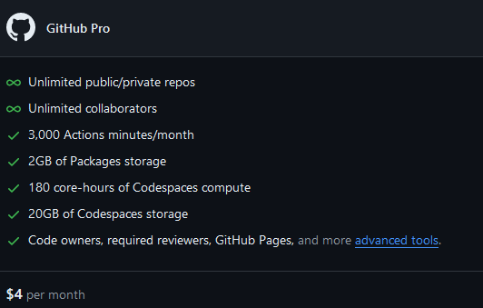

# Sprawozdanie 6

## Shift-left: GitHub Actions

### Wybór projektu

Repozytorium na którym przetestowane zostaną github actions jest doom-ascii. Jest to projekt, który odtwarza klasyczną grę Doom w formie Ascii czyli za pomocą tekstowych znaków (wraz z kolorowaniem). Zamiast tradycyjnej grafiki gra jest renderowana w terminalu. Oprogramowanie jest udostępnione na licencji `GNU GPL`.

Dla celów zajęć stworzono forka repozytorium. Umożliwa to pełną kontrolę nad code-base'em dzięki czemu można stworzyć workflow actions.

### Actions

Plan `Github Pro`, który można odebrać za darmo jeżeli posiada się status studenta, pozwala na 3000 minut działania `Actions` na miesiąc. Inne usługi wchodzące w skład planu `Pro` znajdują się poniżej. Warto również spojrzeć na dokładną [rozpiskę płatności](https://docs.github.com/en/billing/managing-billing-for-github-actions/about-billing-for-github-actions) za Github Actions.



Aby zarządzać akcjami należy przejść do karty `Actions`.


Pierwszym krokiem stworzenie jest nowego `Workflow`, które będzie definiować daną akcję.


Do wyboru jest wiele predefiniowanych szablonów. Zawierają one najpopularniejsze zastosowania `Actions` np. deployment w chmurze, budowa projektu itp. Na bazie repozytorium github podpowiada jakie workflow powinniśmy wybrać. Dla projektu `doom-ascii` celem `Actions` będzie budowa projektu. W tym celu należy wybrać `C/C++ with make`. 


> Oczywiście nie trzeba korzystać z szablonów. Można definiować własne workflow poprzez zamieszczenie pliku yaml z odpowiednią konfiguracją w katalogu `.github` w głównym katalogu repozytorium. Github automatycznie zindeksuje ten plik i pozwoli na wykorzystanie go w głównym menu `Actions`.

Plik `workflow` powinien zawierać poniższe parametry:
1. Zdefiniowanie kiedy dana akcja ma się wykonać np. gdy ktoś wypchnie zmiany do gałęzi `main` czy `release`.
    ```yaml
    on:
    push:
        branches:
        - main
        - release/*
    ```

2. Zdefiniowanie `job'a`, który definiuje daną akcję (co, gdzie i jak wykonuje dana akcja).
    - przypisanie [`runner'a`](https://docs.github.com/en/actions/using-github-hosted-runners/about-github-hosted-runners/about-github-hosted-runners) (systemu hosta, w którym wykonuje się dana akcja, można myśleć o tym jak o kontenerze, dla którego precyzujemy bazowy obraz).
    ```yaml
    runs-on: ubuntu-latest
    ```
    - definicja kroków akcji (parametr `uses` pozwala na wykorzystanie workflow innych użytkowników, podobnie jak z obrazami dockera, gdzie można zaciągać obrazy z dockerhub'a)
    ```yaml
    steps:
        - uses: actions/checkout@v4
        - name: configure
          run: ./configure
    ```

Dla wybranego projektu gry w terminalu jedynym potrzebnym składnikiem będzie make oraz runner, który jest pochodną systemu Linux lub Windows (doom-ascii można zbudować na Windowsie). Poniżej znajduje się definicja pliku yaml github actions pozwalającego na zbudowanie projektu `doom-ascii`.

```yaml
name: Budowa

on:
  push:
    branches: [ "master" ]
  pull_request:
    branches: [ "master" ]

jobs:
  build:

    runs-on: ubuntu-latest

    steps:
    - uses: actions/checkout@v4
    - name: make
      run: |
        cd ./src
        make
```

Akcja będzie się uruchamiać podczas wypychania zmian do gałęzi `master`. Jako runner wybrano `ubuntu-latest`. Kolejnymi krokami akcji są:
- checkout repozytorium - używana jest predefiniowana akcja w wersji 4, która klonuje repozytorium i pobiera domyślnie tylko najnowszy commit. Dzięki temu można przeprowadzić dalsze kroki, posiadając kod źródłowy aplikacji na runnerze (więcej scenariuszy użycia można znaleźć pod [linkiem](https://github.com/actions/checkout)).
- przejście do katalogu `src` i zbudowanie aplikacji make`em.

Aby przetestować działanie akcji należy wypchnąć commit do gałęzi `master`. Po wypchnięciu, w karcie `Actions` powinna się pojawić nowa akcja.


Build wykonuje się dosyć szybko. Podczas i po skończonej akcji można zobaczyć logi danej akcji. Można również skorzystać z wyszukiwarki logów.


Github actions pozwala zachować działający stan aplikacji w repozytorium. Jeżeli wprowadzimy zmiany, które powodują błędy podczas budowania aplikacji od razu się o tym dowiemy. `Actions` pozwala na integrację pipeline'u CI/CD bez potrzeby korzystania z zewnętrznych narzędzi, takich jak Jenkins. Z drugiej strony powoduje to przywiązanie się do platformy, z której ciężko przenieść rozwiązania CI&CD na swój własny hosting. Z jednej strony nie musimy martwić się zasobami sprzętowymi potrzebnymi do budowania/testowania kodu z drugiej strony możemy płacić duże pieniądze jeżeli akcje trwają długo i generują duże ilości danych. Należy dokładnie oszacować koszty przed przenoszeniem się na `Actions`.

### Dokumentacja Github Actions

Przydatne linki:
- [event triggers](https://docs.github.com/en/actions/using-workflows/events-that-trigger-workflows)
- [ręczne uruchamianie actions](https://docs.github.com/en/actions/using-workflows/manually-running-a-workflow)
- [wirtualne środowiska actions](https://docs.github.com/en/actions/using-github-hosted-runners/about-github-hosted-runners/about-github-hosted-runners)
- [syntax github actions](https://docs.github.com/en/actions/using-workflows/workflow-syntax-for-github-actions#jobsjob_idstepsuses)
- [warunkowe uruchamianie github actions](https://docs.github.com/en/actions/learn-github-actions/contexts)


## Azure
