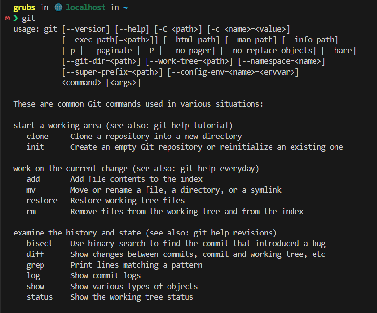
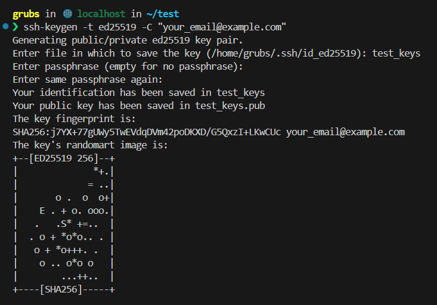
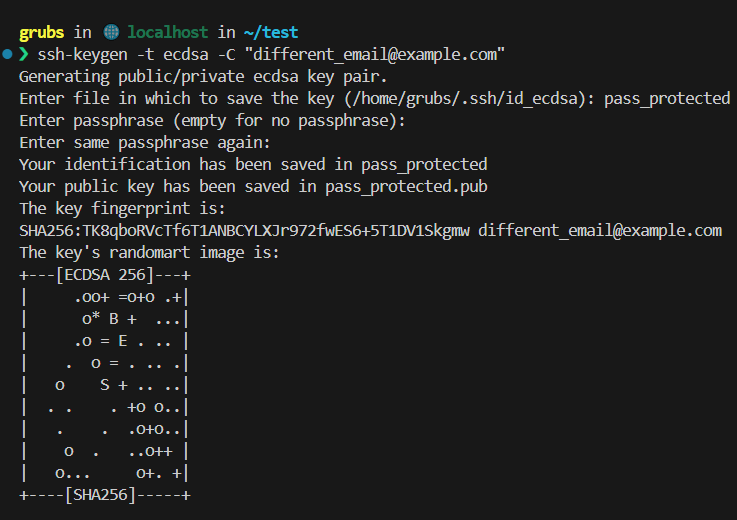
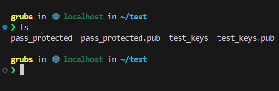
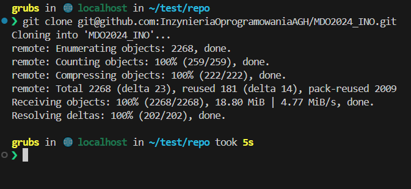
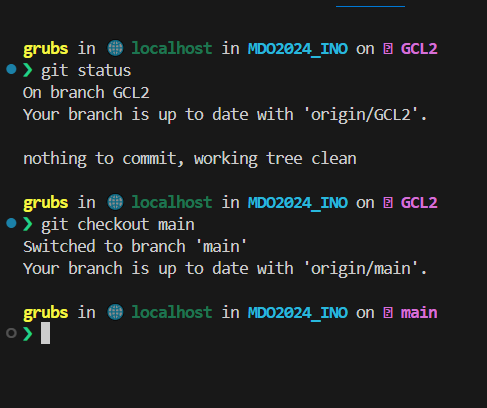
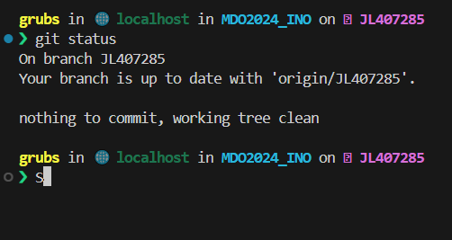
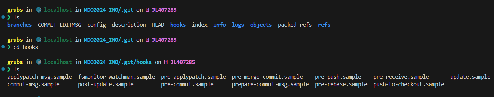
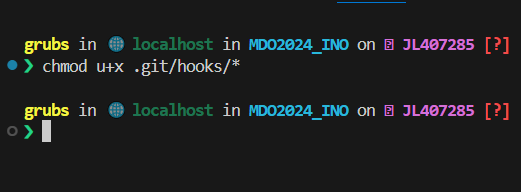
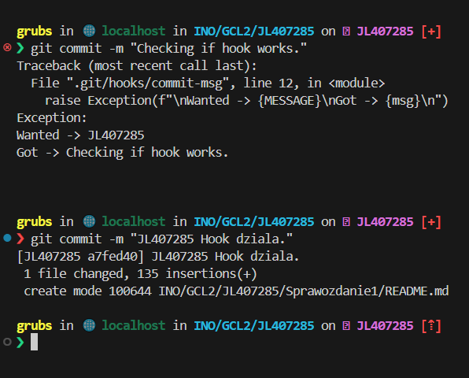

# Sprawozdanie 1

## Konfiguracja systemu

Wykorzystany został system operacyjny Linux, dystrybucja OpenSuse Leap. Do utworzenia maszyny wirtualnej wykorzystany został VirtualBox.

## Instalacja Git

W celu rozpoczęcia pracy nad projektem wymagany program kontrol wersji Git.
Aby zainstalować Gita należy posłużyć się komendą:

```console
foo@bar:~ sudo zypper install git
```

Aby zainstalować nowe oprogramowanie na serwerze wymagane są uprawnienia administratora (root'a). Musimy więc wykorzystać polecenie sudo (superuser do) aby je otrzymać.

Do instalacji wykorzystujemy menedżer pakietów **zypper**. Zypper umożliwia instalowanie, usuwanie oraz zarządzanie pakietami oprogramowania w systemach opartych na RPM(Red Hat Package Manager).

Jeżeli instalacja git przebiegła pomyślnie przy wpisaniu komendy
```console
foo@bar:~ git
```

Powinna pokazać się następująca wiadomość



## Utworzenie kluczy SSH
Aby móc sklonować repozytorium przedmiotowe oraz rozpocząc na nim pracę wymagane jest utworzenie pary kluczy SSH, które wykorzystywane są przez Git do bezpiecznej komunikacji z serwerem. Aby wygenerować klucze SSH wykorzystamy pakiet OpenSSH. OpenSSH składa się z klienta SSH, który umożliwia zdalne logowanie jak i serwer ssh nasłuchujący na porcie 22 oraz inne narzędzia.

Utworzymy dwie pary kluczy, jedną zabezpieczoną hasłem oraz drugą bez tego zabezpieczenia. Zamiast RSA wykorzystany zostanie algorytm szyfrowania ED25519, ponieważ utworzone za pomocą niego klucze charakteryzują się lepszymi zabezpieczeniami oraz wydajnością.

### Para kluczy bez hasła

Polecenie
```console
ssh-keygen -t ed25519 -C "your_email@example.com"
```

Utworzy parę kluczy wykorzystując podany adres email jako etykietę.



Po wpisaniu powyższej komendy podmieniając etykietę na nasz email powinny zostać utworzone dwa nowe pliki w podanym przez nas folderze. Komendą **ls** wylistujmy pliki w aktualnym folderze, aby zweryfikować że klucze zostały utworzone.


Utworzone zostały dwa klucze prywatny oraz publiczny. Nazwa klucza publicznego zakończona jest wyrazem **.pub**. Utworzony klucz publiczny należy skopiować oraz dodać do listy naszych kluczy na Github. Klucz prywatny należy dodać do agenta ssh poleceniem

```console
ssh-add ~/.ssh/id_ed25519
```

Nazwę id_ed25519 należy podmienić na odpowiednią nazwę utworzonego wcześniej klucza prywatnego.

### Para kluczy zabezpieczona hasłem

Utworzymy parę kluczy wykorzystując inny algorytm oraz dodatkowo zabezpieczymy je hasłem.

Ponownie wykorzystujemy polecenie ssh-keygen
```console
ssh-keygen -t ecdsa -C "another_email@example.com"
```

Tym razem przy pytaniu o hasło (secure phrase) należy wpisać hasło którym chcemy dodatkowo zabezpieczyć utworzone klucze.

Po wygenerowaniu klucz nasz folder z kluczami powinien wyglądać następująco





## Klonowanie repozytorium

Mając do dyspozycji utworzone wczesniej klucze SSH możemy sklonować repozytorium Github. Repozytorium możemy sklonować poprzez HTTPS oraz SSH. Zaletą HTTPS jest fakt, że nie trzeba tworzyć kluczy kryptograficznych, jednak przy każdej komunikacji z repozytorium będziemy poproszeni o logowanie. Dodatkowo klucze SSH charakteryzują się lepszym bezpieczeństwem między innymi poprzez autentykację dwuskładnikową.

Aby sklonować repozytorium należy wejść na strone repozytorium, następnie nacisnąć przycisk **Code** oraz wybrać opcję SSH.


Komenda **git clone** umożliwi nam sklonowanie repozytorium. Przed sklonowaniem warto upewnić się, że znajdujemy się w odpowiednim folderze, ponieważ git umieści repozytorium w aktualnym folderze w którym się znajdujemy.

```console
git clone git@github.com:InzynieriaOprogramowaniaAGH/MDO2024_INO.git
```

Po wpisaniu komendy powinniśmy zobaczyć



Oznacza to, że repozytorium zostało prawidłowo sklonowane.
### Utworzenie nowej gałęzi


Git umożliwia tworzenie gałęzi (branchy) czyli oddzielonych od siebie serii commitów (w zasadzie mają one wspólnego przodka). Gałęzie pozwalają na kolaborację, równoległy rozwój oprogramowania oraz wersjonowanie. Git umożliwia przełączanie się pomiędzy gałęziami, tworzenie nowych gałęzi, scalanie oraz łączenie historii gałęzi (rebase).

Aby utworzyć nową gałąź musimy posłużyć się poleceniem

```console
git branch <branch_name>
```
Aby przełączyć się na inną gałąź wykorzystamy polecenie

```console
git checkout <branch_name>
```
Polecenie git status wyświetli nam informację o aktualnej gałęzi

```console
git status
```
Przeniesiemy się na odpowiednią gałąź oraz utworzymy nową gałąź o nazwie inicjały + nr indeksu

Wypisanie aktualnej gałęzi oraz jej zmiana



Następnie poleceniami
```console
git branch JL407285
git checkout JL407285
```

Tworzymy nową gałąź oraz na nią przechodzimy. Tworzenie gałęzi nie zawiera zdjęcia z uwagi na to, że gałąź o tej nazwie już istnieje.

Na koniec poleceniem git status zweryfikujmy, że znajdujemy się na dobrej gałęzi



### Utworzenie Git Hooka
Pracę na nowej gałęzi rozpoczniemy od stworzenia git hooka

Git hooks to skrypty wykonywane automatycznie w odpowiedzi na określone wydarzenia w operacjach gitowych, takich jak commit, push, merge. Działają one lokalnie na komputerze użytkownika, na którym znajduje się repozytorium gitowe. 

Utworzymy nowego git hook'a, którego zadaniem będzie weryfikacja, że commit mesage rozpoczyna się od inicjałów + nr indexu (w moim przypadku JL407285).

Warto zaznaczyć, że utworzone przez nas hooki działać będą jedynie na lokalnym repozytorium.
Aby utworzyć nowego hooka przenieśmy się do folderu **.git/hooks/**.

W folderze **MDO2024_INO** wywołamy polecenie
```console
cd .git/hooks/
```



Utwórzmy nowy hook, który będzie sprawdzał wiadomość commit'a
```console
touch commit-msg
```
Musimy nadać prawa wykonywawcze nowemu hook'owi w przeciwnym wypadku nie zadziała.
```console
chmod u+x .git/hooks/*
```


Powyższą komendę wywołujemy w folderze **MDO2024_INO**.

Hooki możemy pisać w wielu językach programowania. Ten hook napiszemy w Pythonie 3. Początek kodu musi zawierać **shebang**, aby komputer wiedział jak zinterpretować kod.

Kod źródłowy hooka poniżej

```code
#!/usr/bin/env python3
import sys
MESSAGE = "JL407285"

def get_message(name):
    with open(name, 'r') as f:
        msg = f.read()
    return msg

msg = get_message(sys.argv[1])
if not msg.startswith(MESSAGE):
    raise Exception(f"\nWanted -> {MESSAGE}\nGot -> {msg}\n")
```

W skrócie przechwycamy wiadomość z którą ma iść commit oraz weryfikujemy, że zaczyna się od naszych inicjałów. Prawidłowo stworzony hook powinien działać jak poniżej.



### Wciąganie gałęzi

Komendą git merge chcielibyśmy, aby zmiany w naszej gałęzi zostały wchłonięte przez gałąź główną. W tym celu musimy przenieść się na gałąź grupową.

```console
git checkout GCL2
```

A następnie poleceniem
```console
git merge JL407285
```

Łączymy gałęzie.

--zdjecie--

## Docker
Docker to platforma do konteneryzacji aplikacji, która umożliwia pakowanie, dostarczanie i uruchamianie aplikacji w lekkich, przenośnych kontenerach. Kontenery Docker są izolowanymi środowiskami, które zawierają aplikacje wraz z wszystkimi jej zależnościami, co pozwala na spójne działanie aplikacji na różnych środowiskach, niezależnie od konfiguracji systemu.

### Instalacja
Dockera możemy zainstalować korzystając z wspomnianego powyżej menedżera paczek Zypper.
```console
sudo zypper install docker
```
Następnie musimy umozliwić działanie daemona dockera
```console
systemctl enable docker
```
Oraz go uruchomić
```console
systemctl start docker
```
Aby zweryfikować, że docker został zainstalowany poprawnie oraz działa wywołajmy polecenie
```console
sudo systemctl docker status
```
Powinniśmy zobaczyć
-- zdjecie --
### DockerHub
DockerHub to platforma internetowa, która służy jako centralne repozytorium dla obrazów Dockerowych. Oferuje szereg funkcji i usług związanych z konteneryzacją aplikacji przy użyciu Dockera.

DockerHub pozwala umieszczać swoje własne obrazy jak i pobierać obrazy od oficjalnych twórców oprogramowania.
### Pobranie obrazów
Celem weryfikacji działania dockera oraz kolejnych zadań pobierzemy kilka gotowych obrazów.

Poleceniem
```console
docker pull <nazwa_kontenera>
```
Możemy pobrać kontener z DockerHuba. Pobrane zostały kontenery **hello-world** **busybox** **ubuntu**. Kontenery hello-world oraz busybox znajdowały się już na systemie stąd Docker sprawdził jedynie ich wersję, kontener ubuntu był nowy stąd został pobrany z huba.
--zdjecie--
Po pobraniu kontenerów warto zweryfikować, że znajdują się w systemie. Poleceniem docker images możemy wypisać pobrane obrazy.
```console
docker images
```
--zdjecie--
### Uruchomienie obrazu
Uruchomimy pobrany wcześniej obraz **busybox** i spróbujemy podłączyć się do niego.
Kontener możemy uruchomić poleceniem
```console
docker run busybox
```
-- zdjecie --
Jednak wywołanie tego polecenia nie daje nam żadnej informacji zwrotnej. Kontener uruchomił się i natychmiast wyłączył, ponieważ nie miał zadeklarowanego zadania. Wypiszmy więc  kontenery znajdujące się na maszynie poleceniem
```console
docker ps -a
```
Rozpocznijmy interaktywną sesję i podłączmy się do kontenera. Polecenie
```console
docker run -it <nazwa_kontenera>
```
Uruchomi kontener w trybie -interactive oraz -tty. W ten sposób dostaniemy dostęp do terminala i bedziemy mogli przemieszczać się po kontenerze.
--zdjecie--
Jak widać zostaliśmy podłączeni do kontenera jako root. Na drugim terminalu sprawdźmy listę działających kontenerów.
--zdjecie--
Sprawdźmy numer wersji busybox'a.
--zdjecie--
### Obrazy systemowe
Docker udostępnia nam obrazy bazowe na podstawie których możemy tworzyć nasze własne, nowe obrazy. Podłączmy się do kontenera **ubuntu** w trybie interaktywnym i sprawdźmy **PID1** oraz zaktualizujmy pakiety.
Polecenie
```console
docker run -it ubuntu
```
Pozwoli nam uruchomić kontener w trybie interaktywnym. Następnie poleceniem
```console
ps -auxf
```
Wypiszemy wszystkie działające procesy, we wszystkich sesjach, ze szczegółowymi informacjami o właścicielu procesu, włącznie z procesami niezwiązanymi z terminalem w formie drzewa opisującym relacje między procesami.
--zdjecie--
Po wejściu do kontenera poleceniami
```console
apt update
exit
```
Aktualizujemy pakiety oraz wychodzimy z kontenera.
### Dockerfile
Dockerfile to plik tekstowy zawierający instrukcje potrzebne do zbudowania obrazu Dockerowego. Zawiera on zestaw poleceń, które definiują, jak wyglądać będzie środowisko uruchomieniowe aplikacji wewnątrz kontenera Dockerowego.

Poleceniem **touch** utworzymy plik Dockerfile. Następnie w Dockerfile dyrektywą **FROM** musimy określić obraz bazowy (w naszym przypadku ubuntu). Dyrektywą **RUN** wywołamy komendy instalujące git'a (uwaga opcja -y oznacza, że przy pytaniu o instalację pakietów odpowiedź będzie automatycznie **yes**) oraz klonujące repo. Na koniec dyrektywą **ENTRYPOINT** określamy co ma zadziać się na początku działania kontenera. Chcemy aby kontener działał dopóki ręcznie go nie wyłączymy stąd możemy wykorzystać komendę **cat**, która będzie czytać w pętli z stdin.
```code
FROM ubuntu:latest

RUN apt-get update
RUN apt-get install -y git
RUN git clone https://github.com/InzynieriaOprogramowaniaAGH/MDO2024_INO.git


ENTRYPOINT ["cat"]
```
Poleceniem
```console
docker build . -t "sprawozdanie1"
```
Rozpoczynamy budowę kontenera. W poleceniu możemy podać ścieżkę do Dockerfila, jednak nasz znajduje się w tym samym folderze więc wpisujemy ".", -t tworzy tag do kontenera nadając mu sensowniejsze imie.
--zdjecie--


Po zbudowaniu kontenera uruchomimy go w trybie **detached** oraz z uruchomionym terminalem (jest to wymagane, aby **cat** działał w nieskończoność).
```console
docker run -dt sprawozdanie1
```
Po uruchomieniu zweryfikujmy, że kontener działa.
--zdjecie--

Skoro kontener działa podłączmy się do niego poleceniem
```console
docker exec -it <hash> /bin/bash
```
Docker exec pozwala nam wykonać polecenie wewnątrz kontenera. Wraz ze znaną nam wcześniej opcją -it możemy połączyć się interaktywnie do kontera o hashu "hash" i wywołać powłokę. Bedąc wewnątrz kontenera sprawdźmy czy repo zostało pobrane i git działa.

--zdjecie--
### Czyszczenie
Sprawdźmy działające kontenery, a następnie usuńmy je, poniewaz nie są nam już potrzebne.
```console
docker ps -a
docker rm <nazwa>
```
Docker rm usuwa kontener kierując się tagiem lub hashem.
--zdjecie--
Możemy też posłużyć się poleceniem **docker container prune**, aby usunąć wszystkie kontenery, które zakończyły swoją pracę. Podobnie możemy usunąć obrazy poleceniem **docker image prune**. Warto zaznaczyć, że nie zostaną usunięte obrazy na których bazują działające kontenery.