# Sprawozdanie 2
### Jakub Łach, Inżynieria Obliczeniowa

## Cel laboratorium
Celem laboratoriów było poszerzenie wiedzy o kontenerach oraz wykorzystanie ich do automatycznej budowy oraz testowania przykładowej aplikacji.

## Wybór oprogramowania
Zdecydowałem się na aplikację nodejs **node-js-dummy-test** z uwagi na jej prostotę oraz wygode przeprowadzenia buildu oraz wywołanie testów wykorzystując npm.

### Budowanie projektu
Zbudujmy najpierw aplikację wewnątrz maszyny wirtualnej, aby zweryfikować jej działanie.

```console
git clone git@github.com:devenes/node-js-dummy-test.git
```
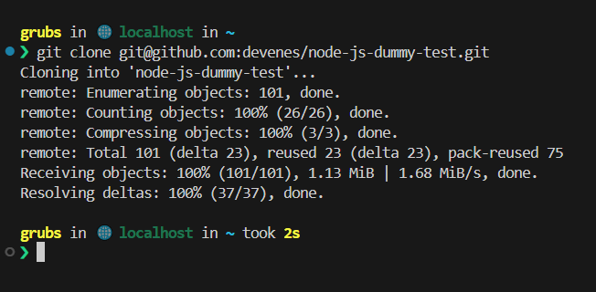

W moim przypadku wymaganie było również zainstalowanie **npm**.

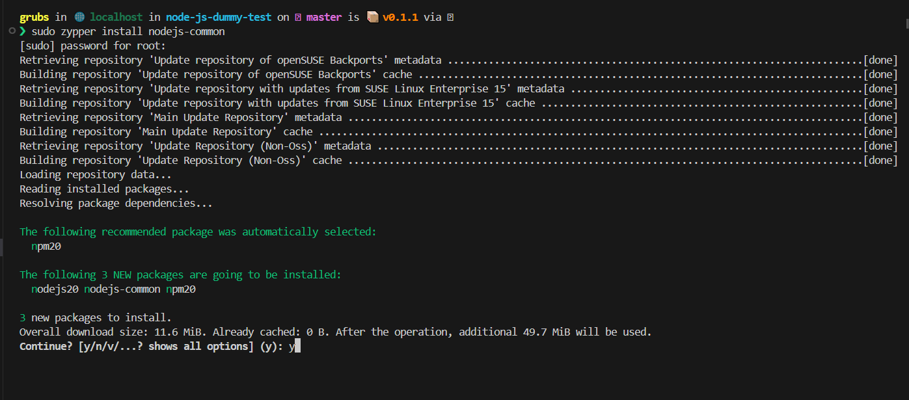

Weryfikacja że npm zostało poprawnie zainstalowane

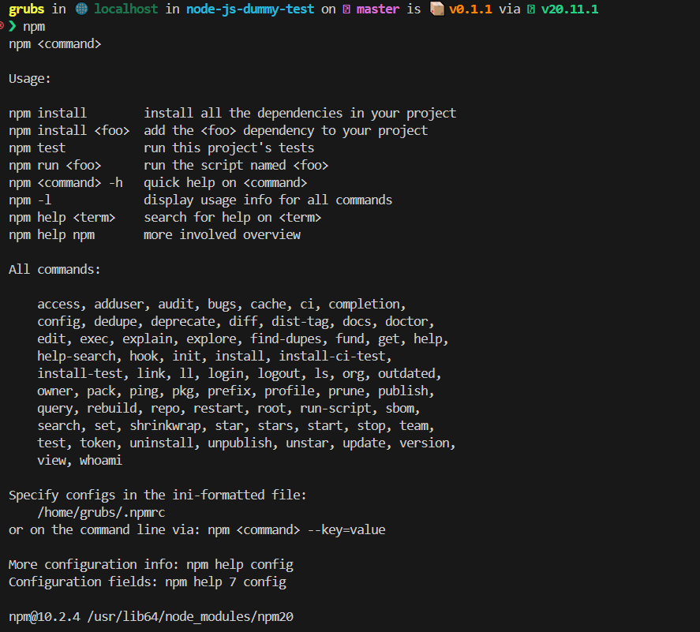

Po instalacji **npm** oraz weryfikacji że działa poprawnie możemy przejść do instalacji wymaganych zależności. Wykorzystamy komendę **npm install**.

```console
npm install
```

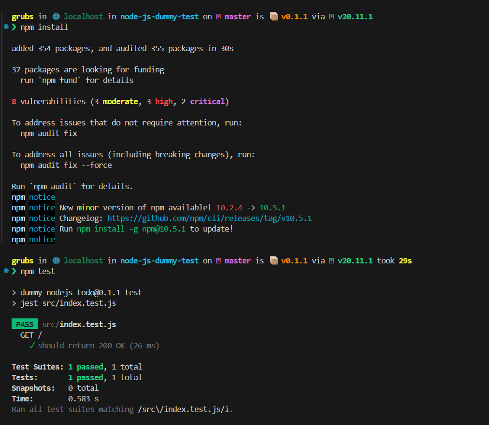

Testy przeprowadzimy komendą **npm test**. Jak widać na powyższym zrzucie ekranu zależności zostały zainstalowane oraz testy wykonały się poprawnie.

## Budowa w kontenerze

Chcielibyśmy przeprowadzić build aplikacji w kontenerze z uwagi na zalety z tego płynące jak wyizolowanie środowiska wykonawczego, reprodukowalność procesu budowy, integracja z narzędziami CI/CD oraz inne.

### Build wewnątrz kontenera bazowego

Na początku wybierzemy podstawowy kontener bazowy, który będzie wystarczający do zbudowania aplikacji oraz przeprowadzenia testów. W naszym przypadku kontener z obrazem **node** .

Stworzymy więc kontener o nazwie **nodeapp** oraz podłączymy się do niego interaktywnie i w środku sklonujemy repozytorium oraz przeprowadzimy build.

```console
sudo docker run --rm -it --name nodeapp node bash
```

Tworzymy w ten sposób tymczasowy kontener, który zostanie zabity po wyjściu z niego.

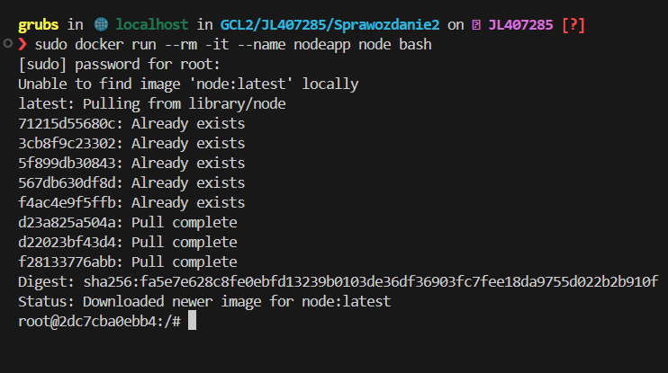

Jesteśmy w środku kontenera, w takim wypadku posłużmy się ponownie komendą **git clone** aby sklonować repozytorium oraz zbudujmy aplikację.

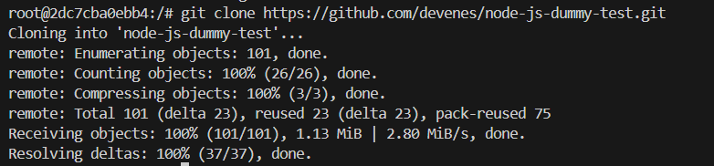

Następnie jak wcześniej wykorzystajmy **npm** do zainstalowania zależności oraz przetestowania aplikacji.

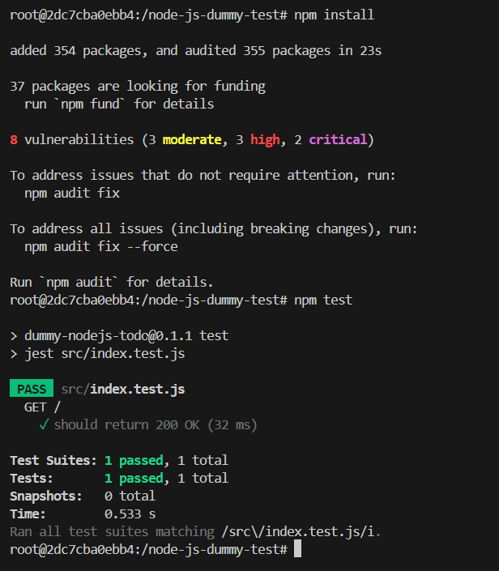

### Automatyzacja procesu

Powyższy proces możemy łatwo zautomatyzować tworząc dwa pliki Dockerfile: **builder** oraz **tester**. Stworzmy dwa pliki z uwagi na to, że proces budowania aplikacji wcale nie musi być ściśle powiązany z jej testowaniem. Separacja obowiązków pozwala na przykładowo testowanie wielu wersji aplikacji.

Plik **easy-bldr** utworzy nam obraz kontenera gotowy do zbudowania powyższej aplikacji. **Easy-tstr** wykorzysta obraz buildera w celu przeprowadzenia testów.

Plik builder
```code
FROM node:latest
RUN git clone https://github.com/devenes/node-js-dummy-test
WORKDIR /node-js-dummy-test
RUN npm install
```

Krok po kroku: wybieramy obraz bazowy node, klonujemy repozytorium (przez HTTPS !), ustawiamy bieżący katalog roboczy (wymagane w node od wersji 15), instalujemy zależności.

Mając już gotowy obraz możemy go zbudować komendą:

```console
sudo docker build -t builder -f easy-bldr.Dockerfile .
```

Opcja -t stworzy nam tag do zbudowanego obrazu, opcja -f określa plik w którym znajduje się przepis na zbudowanie, kropka na końcu sygnalizuje, aby pliku szukać w aktualnym katalogu.

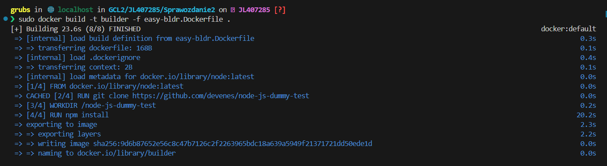

Mamy zbudowany obraz buildera, wykorzystajmy go teraz do zbudowania testera.

Dockerfile tester

```code
FROM builder
WORKDIR /node-js-dummy-test
RUN npm test
```

Krok po kroku: bazujemy na obrazie buildera, ustawiamy odpowiedni katalog roboczy i wywołujemy w nim testy.

Zbudujmy go podobnie jak builder.

```console
sudo docker build -t tester -f easy-tstr.Dockerfile .
```


Pytanie jest więc czy testy się wykonywały i przeszły poprawnie ?

Wykorzystaliśmy komendę **RUN**, która zwróci nam błąd jeżeli wywoływana przez nią komenda (**npm test**) zwróci kod inny od 0. Jeżeli się tak stanie **docker build** tez zwróci błąd. Możemy więc założyć, że testy się wywołały i przeszły poprawnie.

Możemy to zweryfikować budując obraz ponownie tym razem komendą:

```console
docker build -f easy-tstr.dockerfile -t tester --progress=plain --no-cache .
```

W ten sposób zostanie wyświetlona nam znacznie większa ilość informacji w trakcie budowania.

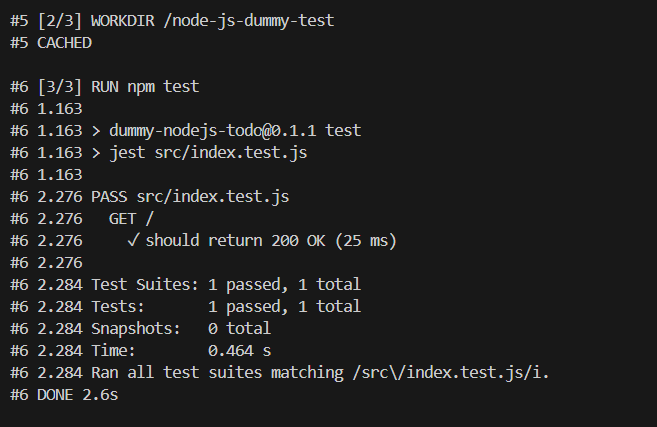

Możemy dodatkowo zajrzeć do kontenera i sprawdzić czy wymagane zależności zostały poprawnie zainstalowane.

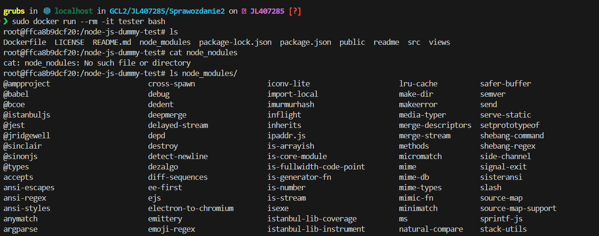

Jak widać oba procesy przebiegły poprawnie. Warto dodać, że w kontenerze po zbudowaniu nie wykonywane są żadne operacje, stąd zakończy on swoje działanie od razu. Instrukcja **RUN** służy nam do wykonywania poleceń w trakcie budowania obrazu, zaś **CMD** do wywołania polecenia po uruchomieniu kontenera. Stąd testy wywołaliśmy w trakcie budowy, nie są one przeprowadzane przy uruchomieniu i kontener natychmiastowo kończy swoją pracę.


## Woluminy oraz zapamiętywanie stanu

Jeżeli chcemy przechować dane poza kontenerem musimy posłużyć się woluminami. Mogą one przydać się nam w przypadku kiedy chcielibyśmy zachować dane po zatrzymaniu pracy kontenera albo jego usunięciu lub gdy chcielibyśmy aby kilka kontenerów współdzieliło jakieś dane. Ogólnie najważniejszą cechą woluminów jest to, że uniezależniają nasze dane od kontenera, kontener może zostać uszkodzony/usunięty, a dane w woluminach nie zostaną skorumpowane.

### Tworzenie woluminów oraz podpięcie pod kontener

Utwórzmy najpierw dwa woluminy wejściowy i wyjściowy.
Woluminy tworzymy komendą
```console
docker volume create nazwa_woluminu
```

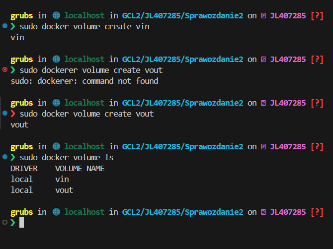

Aby podłączyć do kontenera wolumin wykorzystamy flagę **mount**. Określamy dalej **source** czyli nazwę woluminu i **target** czyli lokalizację w plikach w środku kontenera.

Uruchomimy kontener podpinajac woluminy i sprawdzimy czy rzeczwiście znajdują się one w środku.

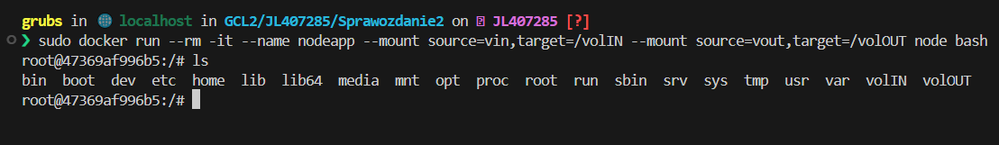

Jak widzimy utworzone zostały foldery **volIN** oraz **volOUT**.

Woluminy zostały utworzone. Chcemy teraz na wolumin wejściowy umieścić repozytorium aplikacji. Wykorzystamy do tego kontener tymczasowy. Kontener tymczasowy będzie posiadał git'a i podepniemy do niego wolumin wejściowy. Następnie przejdziemy do odpowiedniego katalogu (volIN) oraz tam sklonujemy repo.

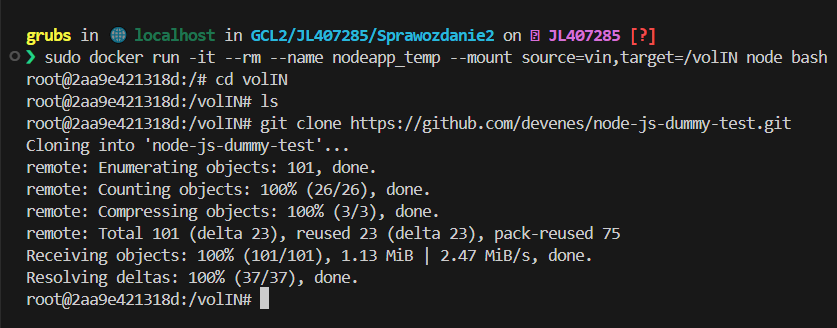


Powracamy do oryginalnego kontenera i sprawdzimy czy rzeczywiście znajduje się sklonowane repo w odpowiednim folderze.

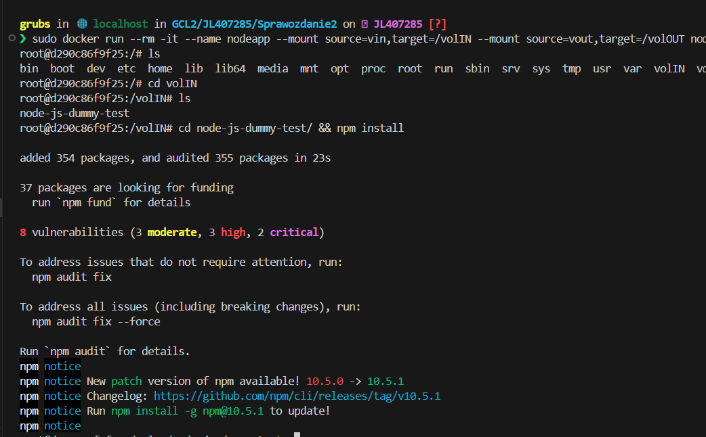

Repozytorium znajdowało się tam gdzie przewidywaliśmy więc zainstalowaliśmy wymagane zależności.


Na wolumin wyjściowy skopiujemy teraz zbudowane pliki aplikacji komendą
```console
cp -r node_modules/ ../../volOUT/
```


Flaga -r oznacza, że rekursywnie kopiujemy wszystkie podkatalogi.
Po skopiowaniu odpowiednich katalogów pliki będą dostępne po wyjściu z kontenera.

### Klonowanie wewnątrz kontenera

Możemy również sklonować repozytorium na wolumin wejściowy robiąc to wewnątrz kontenera za pomocą git'a.

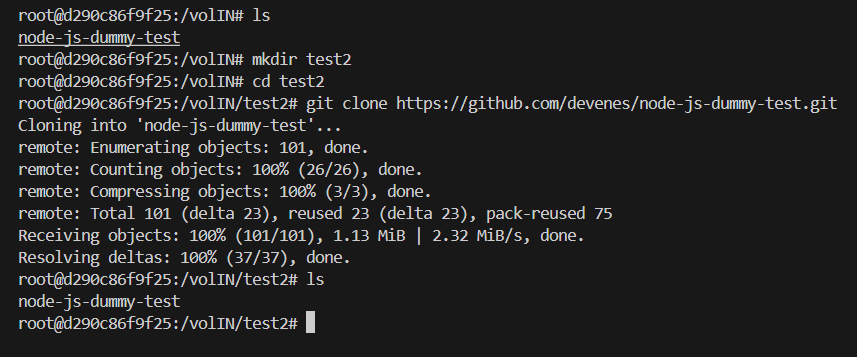

### Możliwości ewentualnej automatyzacji

Powyższe kroki również mogą zostać zautomatyzowane. Na początku wewnątrz kontenera stworzymy dwa katalogi odpowiadające woluminowi wejściowemu i wyjściowemu. Używając **RUN --mount** podłączamy woluminy pod katalogi. Później klonujemy repozytorium, budujemy aplikację oraz kopiujemy artefakty na wolumin wyjściowy.

Taki Dockerfile mógłbym wyglądać następująco.

```code
FROM node:latest

RUN mkdir volIN
RUN mkdir volOUT
RUN --mount=type=volume,source=vin,target=/volIN
RUN --mount=type=volume,source=vout,target=/volOUT
WORKDIR /volIN
RUN git clone https://github.com/devenes/node-js-dummy-test.git

WORKDIR /volIN/node-js-dummy-test

RUN npm install
RUN cp -r node_modules ../../volOUT/node_modules
```

## Eksponowanie portu

Przeprowadzimy teraz test ruchu sieciowego korzystając z narzędzia **iperf-3**. Narzędzie to posiada oryginalny obraz kontenera, który wykorzystamy do naszych testów.

### Uruchomienie serwera

Uruchomimy kontener z obrazem **iperf**, aby nasłuchiwał na porcie 5201 (flaga -p). Flaga -s sygnalizuje, że będzie to serwer.

```console
sudo docker --rm -it --name=iperf3-server -p 5201:5201 networkstatic/iperf3 -s
```

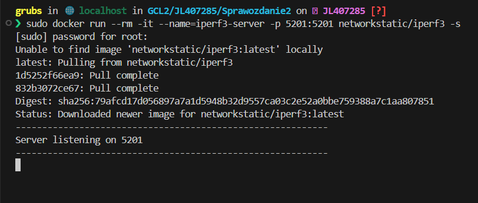

Serwer działa w kontenerze i nasłuchuje na określonym przez nas porcie. Spróbujemy więc podłączyć się do niego i przeprowadzić testy.

### Uruchomienie klienta w kontenerze

Stworzymy nowy kontener tym razem z flagą -c, który będzie klientem i połaczy się z serwerem. Zanim jednak do tego przejdziemy musimy poznać adres IP posiada nasz serwer. Wykorzystamy do tego **docker inspect**. Komenda ta wypisuje wiele zaawansowanych informacji na temat konteneru. Pozwala ona również flagą --format określić jaka informacja nas interesuje.

```console
docker inspect --format "{{ .NetworkSettings.IPAddress }}" nazwa_kontenera
```

Po odnalezieniu adresu IP naszego serwera podłączymy się do niego z klienta.

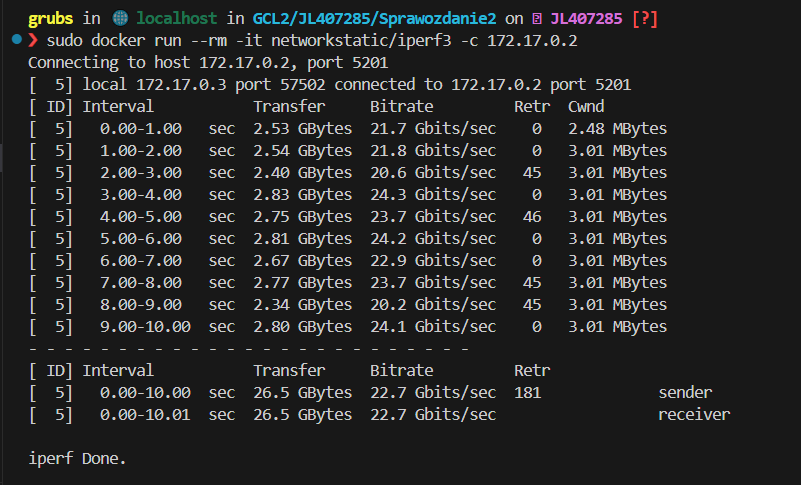

Połączenie jest zadowalające i zarówno klient jak i serwer działają poprawnie.

## Sieć mostkowa

Docker pozwala nam tworzyć i zarządzać sieciami przeznaczonymi dla kontenerów. Wykorzystamy nową sięć za pomocą której kontenery będą komunikować się między sobą.

Aby utworzyć właśną sięć posłużymy się komendą:
```console
docker network create nazwa_sieci
```

Utwórzmy więc sieć mostkową:

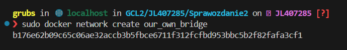

Wypiszmy wszystkie istniejące sieci

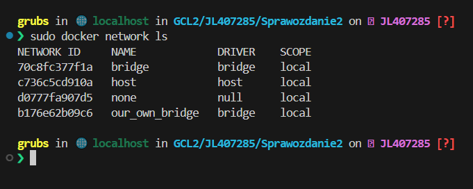

Stworzymy teraz kontener, który będzie operował w wyżej utworzonej sieci.

```console
sudo docker run --rm -it --name=iperf3-server --network our_own_bridge -p 5201:5201 networkstatic/iperf3 -s 
```

Standardowa komenda używana przez nas wcześniej, nowa jest jedynie flaga --network która wskazuje w której sieci ma operować kontener.


### Połączenie z hosta i spoza hosta

Przeprowadzimy teraz dodatkowe testy. Jeden będzie z poziomu systemu operacyjnego, drugi z poziomu kontenera operującego w tej samej sieci.

Instalujemy iperf'a oraz przeprowadzamy test.
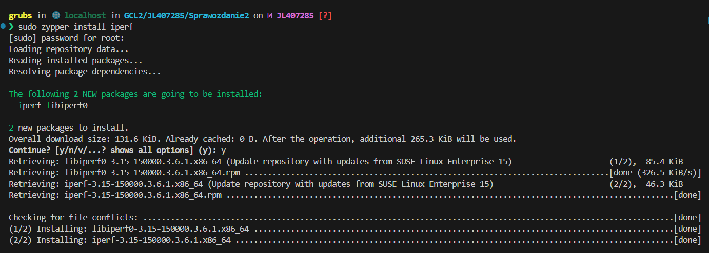

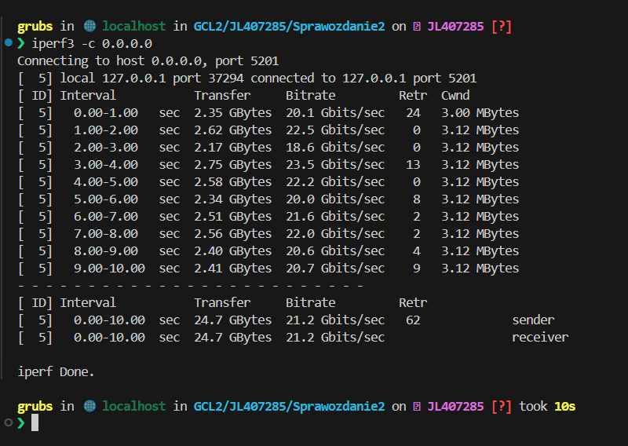

Widok serwera

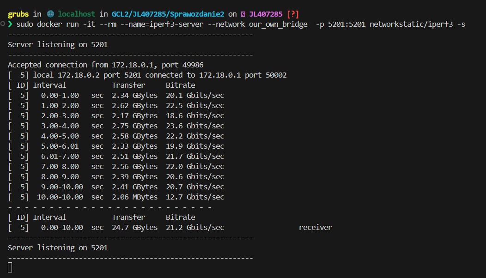


Na koniec spróbujmy połączyć się do kontenera spoza hosta tj. z systemu na którym działa maszyna wirtualna. W przypadku korzystania z VirtualBox musimy utworzyć regułę przekierowywania portów. Musimy również zainstalować iperf3 na naszym systemie.


Po utworzeniu odpowiedniej reguły możemy uruchomić program iperf-3 w terminalu na systemi Windows (w moim przypadku) i podłączyć się do serwera działającego w kontenerze.

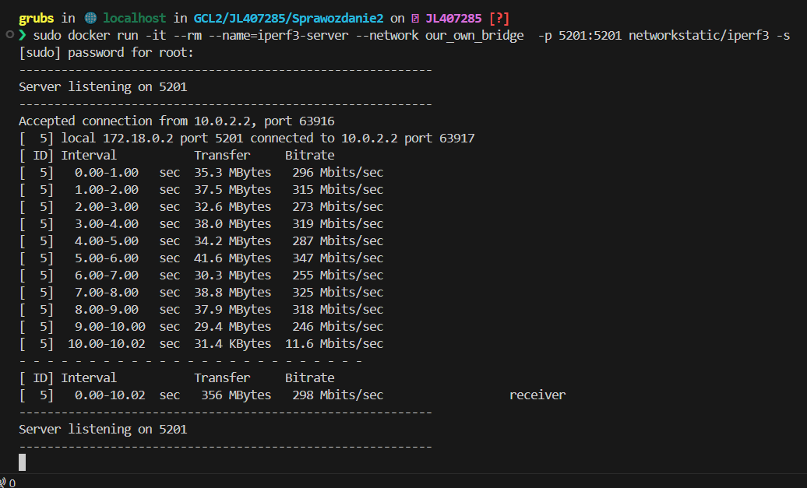


Widok z Windows

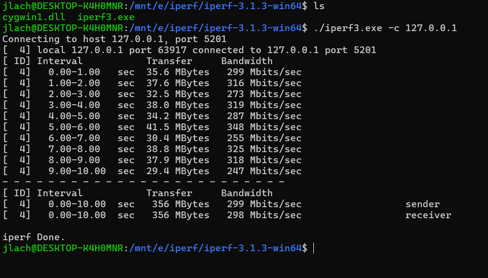


Jak widać osiągneliśmy dużo gorszy wynik przepustowości. Prawdopodobnie wynika to z wirtualizacji - dwa kontenery client i server działają na jednym systemie operacyjnym, dodatkowo wirtualizacji sieci również powoduje dodatkowy narzut, szczególnie przy przekierowywaniu portów.