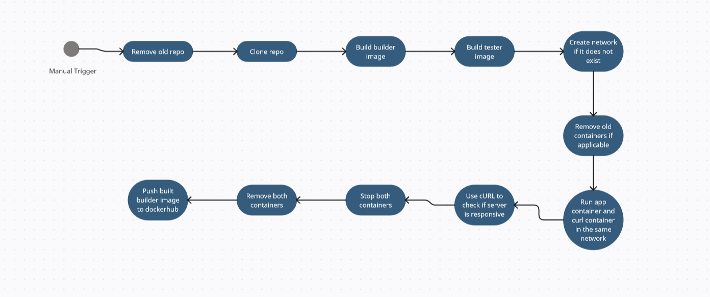

# Sprawozdanie 3
## Jakub Łach INO GCL2
## Pipeline, Jenkins, izolacja etapów

Celem ćwiczeń było wykorzystanie Dockera oraz Jenkinsa w celu automatyzacji procesu budowania oraz utworzenie fundamentów pod proces CI/CD. Głównym zadaniem było utworzenie pipeline czyli zdefiniowanego zestawu kroków, która wykonywane w określonej kolejności automatyzają proces budowania, testowania oraz wdrażania oprogramowania. Pipeline definiujemy zazwyczaj jako skrypt w specjalnym języku Jenkinsa. Pipeline w Jenkinsie może być używany do reprezentowania procesu CI/CD (Continuous Integration/Continuous Delivery) lub CI/CD/CD (Continuous Integration/Continuous Delivery/Continuous Deployment) i może zawierać różne etapy, takie jak pobieranie kodu źródłowego, budowanie aplikacji, testowanie, wdrażanie do różnych środowisk (np. testowego, stagingowego, produkcyjnego) oraz raportowanie wyników.


### Proste projekty w Jenkins
W ramach przećwiczenia pracy z Jenkinsem wykonano dwa proste projekty: jeden wyświetlający uname oraz drugi zwracający błąd gdy godzina jest nieparzysta.

Aby wyświetlić uname utworzymy nowy projekt na stronie Jenkins. W konfiguracji musimy odszukać **kroki budowania**. Klikamy dodaj krok budowania oraz wybieramy uruchom powłokę. W polu wpisujemy komendę **uname -a**, która wypisuje interesujące informacje o jądrze systemu oraz inne informacje systemowe. Flaga -a informuje, że chcemy wszystkie informacje.


Po wpisaniu klikamy zapisz oraz uruchamiamy projekt. Po prawidłowym wykonaniu wybieramy opcję **pokaż logi konsoli**.


Jak widać udało nam się wykorzystać Jenkinsa do wypisania informacji o systemie.


Jako kolejny projekt utworzymy skrypt zwracający błąd w momencie gdy godzina jest nieparzysta. Postępujemy jak poprzednio jedynie tym razem w pole komendy wpiszemy następujący skrypt.

```cmd
#!/bin/bash
current_hour=$(date +%H)

if [ $((current_hour % 2)) -eq 1 ]; then
    echo "Error: Current hour is odd"
    exit 1
else
    echo "Current hour is even"
fi
```

Uruchamiamy nasz projekt i sprawdzamy logi konsoli.


W momencie wywołania godzina była parzysta (02:14) więc skrypt działa prawidłowo.


Utwórzmy troszkę bardziej skomplikowany projekt, który sklonuje nasze repozytorium, przejdzie na odpowiednią gałąź oraz zbuduje obrazy z Dockerfile.

Będziemy postępować podobnie jak poprzednio jedynie tym razem wykorzystamy zakładkę **repozytorium kodu**. Wybierzemy opcję Git oraz podamy odpowiedni url oraz kredki. Dodatkowo możemy wybrać od razu branch'a na którym chcielibyśmy się znaleźć.


W polu budowania dodamy prosty skrypt który przejdzie do odpowiedniego katalogu w sklonowany repo oraz zbuduje nasz **builder** image.


Uruchamiamy nasz projekt i sprawdzamy logi konsoli.


Jak widzimy udało nam się zbudować odpowiedni obraz.


## Prawdziwy pipeline

Głównym projektem jaki należało wykonać było utworzenie pipeline, który klonuje repozytorium, buduje obraz builder, przeprowadza testy, deploy'uje aplikację oraz publikuje artefakty/obraz do rejestru. Utworzone zostały diagramy UML w celu klaryfikacji przebiegu procesu. Na koniec zweryfikujemy czy pokrywają się one z rzeczywistym końcowym pipeline.

### Wybór aplikacji

Wybrałem aplikację node-js-dummy-test, która jest prostą aplikacją napisaną w node.js oraz express.js. Zdecydowałem się na nią z uwagi na jej prostotę, ponieważ w ten sposób możliwe jest skupienie się na fundamentalnych aspektach budowania pipeline. Dodatkowo aplikacja posiada odpowiednią licencję oraz można w łatwy sposób sprawdzić jej działanie za pomocą cURL (co wykorzystamy w pipeline w kroku "Verify").

Link do aplikacji : https://github.com/devenes/node-js-dummy-test

Aplikacja posiada licencję Apache 2.0 co pozwala na możliwość swobodnego obrotu kodem na potrzeby zadania.

Uznałem, że nie ma potrzeby forkowania repozytorium, ponieważ nasze potrzeby tego nie wymagają. Forkowanie byłoby uzasadnione w przypadku oparcia się na konkretnej wersji aplikacji do dalszej pracy lub wymaganiach związanych z bezpieczeństwem.

### Diagramy UML
Wymagania środowiskowe to Node.js oraz Git.

Utworzone zostały 2 diagramy UML: czynności oraz wdrożenia.

Diagram czynności pozwala nam zwizualizować proces oraz przepływ informacji jak i pokazuje logiczną strukturę i sekwencję działań. Diagram wdrożenia pozwala zrozumienie infrastruktury oraz rozplanowanie wdrożenia.




Nasz pipeline może budować się na dedykowanym DIND (Docker-in-Docker) lub bezpośrednio na kontenerze CI.

W przypadku DIND Docker działa wewnątrz kontenera CI. Wtedy wewnątrz kontenera dochodzi do budowy oraz testowania. Zaletą takiego podejścia jest izolacja środowiska, prostota symulowania środowiska produkcyjnego i testowanie aplikacji w warunkach zbliżonych do tych w jakich będzie uruchamiana. Minusem jest złożoność konfiguracji oraz problemy z bezpieczeństwem z uwagi na wymagany dostęp do zasobów systemowych. Wydajność również może spaść z uwagi na kolejną warstwę wirtualizacji.


W przypadku budowy wewnątrz CI budowanie i testowanie odbywa się bezpośrednio w kontenerze CI. Zaletą tego rozwiązania jest prostota konfiguracji oraz lepsza wydajność. Za minus możemy uznać mniejszą izolację środowiska z uwagi na fakt, że procesy budowania mogą działać na poziomie systemu operacyjnego hosta.

Zdecydowałem się na budowę na dedykowany DIND.

### Utworzenie pipeline

Utworzony pipeline składa się z 6 etapów (Deploy i Verify możemy uznać za jeden, ale rozdzieliłem je dla czytelności). Pierwszym etapem jest 'Prepare', w którym usuwany jest katalog ze starą wersją repozytorium oraz klonowane jest ono ponownie. W kroku 'Build' budowany jest obraz **builder**. W kroku 'Test' budowany jest obraz **tester**. W kroku 'Deploy' tworzymy nową sieć dla kontenerów curl i app. Curl container zawiera program cURL, który użyję w celu sprawdzenia czy aplikacja działa. Aby oba kontenery mogły ze sobą rozmawiać tworzę im sieć na samym początku. Kontener app bazuje na **builder**, jedynie przy uruchomieniu wywoływane jest **npm start**, aby uruchomić aplikację. W kroku 'Verify' wykonuję komendę cURL do kontenera app na port 3000 oraz sprawdzam otrzymany response code. Za pierwszym razem pisania skryptu sprawdzałem czy otrzymany kod jest równy 200 (HTTP okej), jednak potem zdałem sobie sprawę, że to komenda dockera zwraca wartość, stąd jeżeli zwrócone jest 0 uznajemy to za sukces (w logach konsoli i tak wyświetla się kod HTTP z cURL). Ostatnim krokiem jest 'Publish', w którym usuwamy kontenery app i cURL oraz wysyłamy obraz **builder** do rejestru.


Zdecydowałem się nie tworzyć nowego kontenera do deployment'u z uwagi na to, że **builder** i tak jest dość minimalny więc jedyną różnicą w Dockerfile byłoby wywołanie **CMD npm start**.


Pełen kod pipeline

```cmd
pipeline {
    agent any
    
    stages {
        stage('Prepare'){
            steps {
                sh "rm -rf MDO2024_INO/"
                sh 'git clone -b JL407285 https://github.com/InzynieriaOprogramowaniaAGH/MDO2024_INO'
            }
        }
        stage('Build') {
            steps {
                echo 'Building ...'
                dir('MDO2024_INO/INO/GCL2/JL407285/Sprawozdanie2') {
                    // Budujemy obraz z opcją --no-cache
                    script {
                    docker.build('builder', '-f easy-bldr.Dockerfile --no-cache .')
                    }
                }
            }
        }

        stage('Test') {
            steps {
                echo 'Running Tests...'
                dir('MDO2024_INO/INO/GCL2/JL407285/Sprawozdanie2') {
                    script {
                        docker.build('tester', '-f easy-tstr.Dockerfile .')
                    }
                }
            }
        }
        
       stage('Deploy') {
            steps {
                echo 'Deploying...'
                script {
                    // Sprawdzamy, czy sieć już istnieje
                    def networkExists = sh(script: 'docker network ls --filter name=mynetwork -q', returnStdout: true).trim()
                    
                    // Tworzymy sieć tylko wtedy, gdy nie istnieje
                    if (!networkExists) {
                        sh 'docker network create mynetwork'
                    }
                    
                    sh 'docker network ls'
                    sh 'docker network inspect mynetwork'
                    
                    // Usuwamy kontener o tej samej nazwie, jeśli istnieje
                    sh 'docker rm -f app_container || true'
                    sh 'docker rm -f curl_container || true'
                   
                    // Uruchamiamy kontener z aplikacją Node.js w sieci
                    sh 'docker run -d --name app_container --network mynetwork builder npm start'                    
                    // Uruchamiamy kontener z curl w tej samej sieci
                    sh 'docker run --name curl_container -d --network mynetwork curlimages/curl sleep infinity'
                    
                    
                }
            }
        }

        
        stage('Verify') {
            steps {
                echo 'Verifying application...'
                script {
                    // Testujemy dostępność aplikacji za pomocą curl
                    def responseCode = sh(script: "docker exec curl_container curl -s -o /dev/null -w '%{http_code}' http://app_container:3000", returnStatus: true)
                    // Sprawdzamy odpowiedź
                    if (responseCode == 0) {
                        echo "Aplikacja została poprawnie uruchomiona i jest dostępna."
                    } else {
                        error "Wystąpił problem podczas uruchamiania aplikacji. Status odpowiedzi HTTP: ${responseCode}"
                    }
                }
            }
        }


        stage('Publish') {
            steps {
                echo 'Publishing image to DockerHub'
                sh 'docker stop app_container || true'
                sh 'docker rm app_container || true'
                
                sh 'docker stop curl_container || true'
                sh 'docker rm curl_container || true'
                
                withCredentials([string(credentialsId: 'docker-hub-access-token', variable: 'DOCKER_HUB_ACCESS_TOKEN')]) {
                // Log in to Docker Hub using the access token
                sh "docker login -u grubcio0 -p ${DOCKER_HUB_ACCESS_TOKEN}"
                }
                
                sh 'docker tag builder grubcio0/pipeline-repo:builder'
                sh 'docker push grubcio0/pipeline-repo:builder'

            }
        }
    }
}
```


Przykładowe wywołanie 


Wartość zwracana przez cURL


### Sposoby wdrażania

Wdrażania aplikacji może przebiegać na wiele sposobów. Można przykładowo stworzyć plik JAR lub Tar lub Zip i w ten sposób rozpowszechniać aplikację. Jest to odpowiednie podejście dla monolitycznych aplikacji, ale wymaga ręcznego zarządzania wersjami i zależnościami. Alternatywnym sposobem jest umieszczenie obrazu Docker w rejestrze. Zaletą tego rozwiązania jest elastyczność tego podejścia z uwagi na zależności które zawarte są w obrazie oraz spójność i powtarzalność wdrożeń.

Za jeszcze inny sposób można uznać umieszczenie aplikacji jako pakiet. W przypadku aplikacji Node.js na przykład, "package" może być paczką npm, którą można opublikować w repozytorium npm i zainstalować na serwerze, aby uruchomić aplikację.

W przypadku umieszczenia obrazu w rejestrze warto rozważyć ewentualne posprzątanie kontenera z artefaktów budowania oraz innych komponentów.


Za usprawnienie utworzonego pipeline warto byłoby rozważyć wersjonowanie aplikacji.


## Lista kontrolna

☑ Commit

☑ clone

☑ build

☑ test

☑ deploy

☑ publish


## Pełna lista kontrolna

☑ Aplikacja została wybrana

☑ Licencja potwierdza możliwość swobodnego obrotu kodem na potrzeby zadania

☑ Wybrany program buduje się

☑ Przechodzą dołączone do niego testy

☑ Zdecydowano, czy jest potrzebny fork własnej kopii repozytorium

☑ Stworzono diagram UML zawierający planowany pomysł na proces CI/CD

☑ Wybrano kontener bazowy lub stworzono odpowiedni kontener wstepny (runtime dependencies)

☑ Build został wykonany wewnątrz kontenera

☑ Testy zostały wykonane wewnątrz kontenera

☑ Kontener testowy jest oparty o kontener build

☒ Logi z procesu są odkładane jako numerowany artefakt

☑ Zdefiniowano kontener 'deploy' służący zbudowanej aplikacji do 
pracy

☑ Uzasadniono czy kontener buildowy nadaje się do tej roli/opisano proces stworzenia nowego

☒ Wersjonowany kontener 'deploy' ze zbudowaną aplikacją jest wdrażany na instancję Dockera (brakuje wersjonowania)

☑ Następuje weryfikacja, że aplikacja pracuje poprawnie (smoke test)

☑ Zdefiniowano, jaki element ma być publikowany jako artefakt

☑ Uzasadniono wybór: kontener z programem, plik binarny, flatpak, archiwum tar.gz, pakiet RPM/DEB

☒ Opisano proces wersjonowania artefaktu (można użyć semantic versioning)

☑ Dostępność artefaktu: publikacja do Rejestru online, artefakt załączony jako rezultat builda w Jenkinsie

☑ Przedstawiono sposób na zidentyfikowanie pochodzenia artefaktu

☑ Pliki Dockerfile i Jenkinsfile dostępne w sprawozdaniu w 
kopiowalnej postaci oraz obok sprawozdania, jako osobne pliki

☑ Zweryfikowano potencjalną rozbieżność między zaplanowanym UML a otrzymanym efektem

☑ Sprawozdanie pozwala zidentyfikować cel podjętych kroków

☑ Forma sprawozdania umożliwia wykonanie opisanych kroków w jednoznaczny sposób


## Definition of Done

**Czy opublikowany obraz może być pobrany z Rejestru i uruchomiony w Dockerze bez modyfikacji (acz potencjalnie z szeregiem wymaganych parametrów, jak obraz DIND)?**

Opublikowany obraz może być pobrany oraz uruchomiony bez problemu. Przeprowadziłem test, na komputerze z systemem Windows oraz zainstalowanym Dockerem pobrałem obraz oraz go uruchomiłem.


Jedyne wymaganie to wywołanie komendy **npm start** przy uruchamianiu kontenera.

## Zgodność z diagramami

Utworzone diagramy były dość ogólne, nie zostały przedstawione na nich wszystkie komponenty jak przykładowo serwer z którego klonujemy repozytorium. Jednak w ogólnym znaczeniu diagramy pokrywają się z tym co zachodzi w trakcie naszego pipeline.
