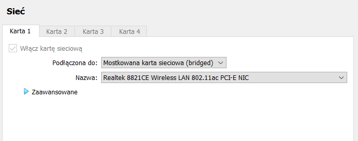
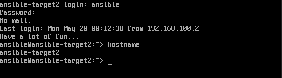
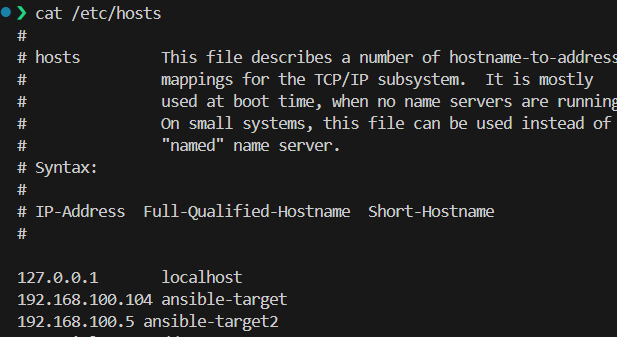
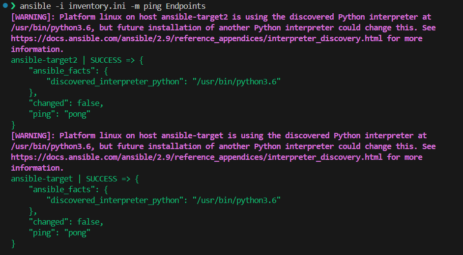
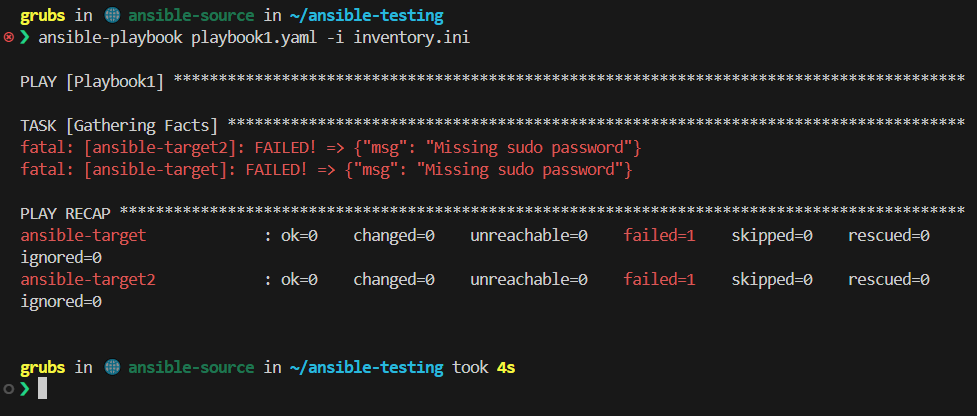
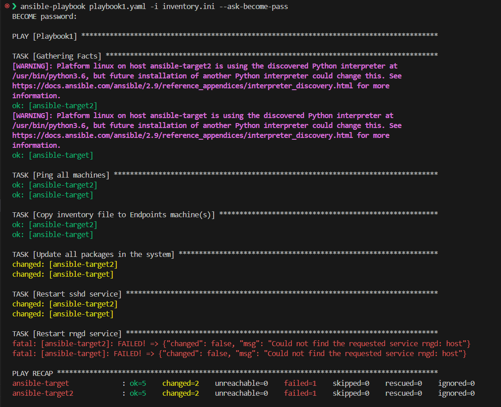
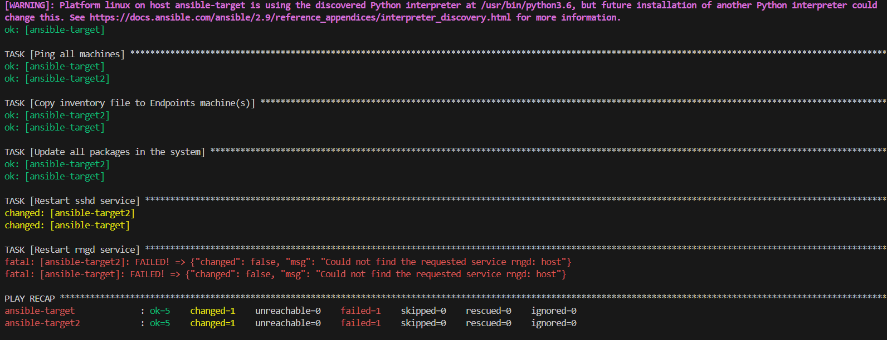
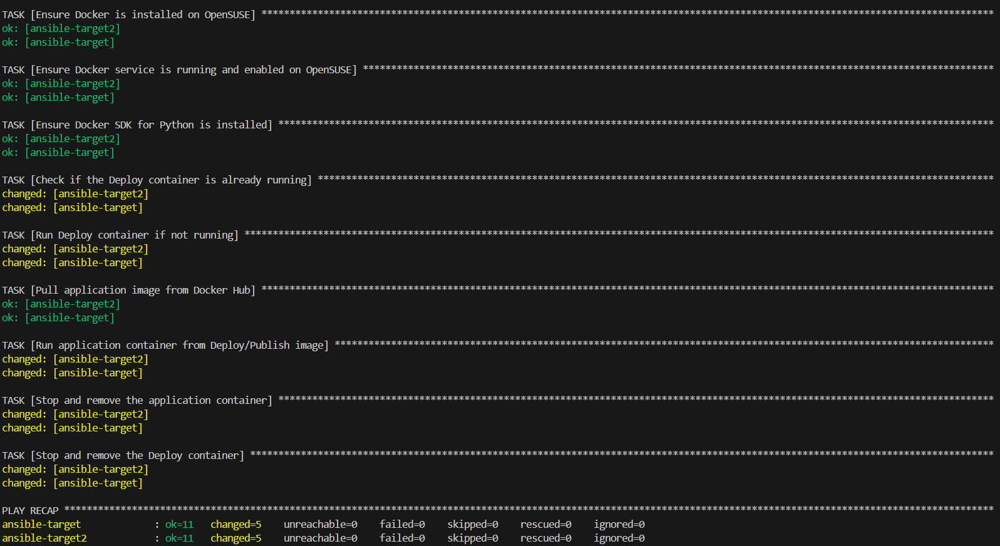
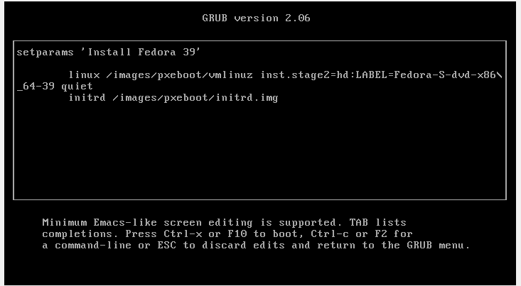
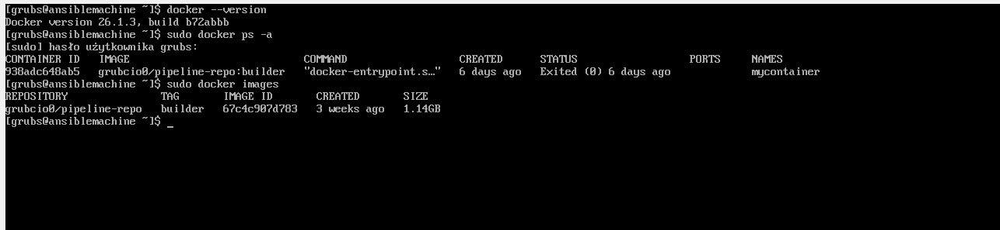

# Sprawozdanie 4

## Jakub Łach INO/GCL2

## Ansible

Ansible to narzędzie służące do automatyzacji wdrażania, konfiguracji i zarządzania. Znane ze swojej prostoty i używania języka deklaratywnego YAML do opisywania zadań automatyzacyjnych w plikach zwanych playbookami. Ansible wykorzystuje SSH do komunikacji do upraszcza zarządzanie.

### Praca z Ansible

Aby zacząć korzystać z Ansible należało utworzyć nową maszynę wirtualną z takim samym systemem jak maszyna główna. Po utworzeniu nowej maszyny (nazywanej od teraz ansible-target lub target) należało upewnić się, że zainstalowane są narzędzia *tar* oraz *sshd*. 

Zarówno dla maszyny głównej na której zainstalowane zostanie Ansible oraz dla target'ów w ustawieniach maszyny wirtualnej należało zmienić typ sieci na bridged, aby każda z maszyny posiadała własny adres IP.



Po wprowadzeniu wymaganych zmian poleceniem

```console
sudo zypper install ansible
```

Instalujemy Ansible na maszynie głównej. Przy instalacji systemu utworzono na target'ach użytkownika **ansible** oraz nadano poleceniem

```console
sudo hostnamectl set-hostname nowy-hostname

```
hostname ansible-target.



Aby wymienić klucze ssh można było użyć polecenia 

```console
ssh-copy-id remote_user@remote_host
```

Aby mieć pewność, że klucze zostały przeniesione warto spróbować zalogować się na maszynę typu target korzystając z ssh.

## Inwentaryzacja

Po wykonaniu podstawowych przygotowań należało przeprowadzić inwentaryzację. Ustawiono przewidywalne nazwy host'ów korzystając z *hostnamectl* (jak powyżej).
Kolejnym krokiem była modyfikacja pliku **/etc/hosts**, tak aby używać nazw hostów zamiast adresów IP.



Weryfikację łączności można było przeprowadzić za pomocą zalogowanie się na maszynę wirtualną korzystając z ssh.

Kolejnym krokiem było stworzenie pliku inwentaryzacji, który będzie wstępnym krokiem do pracy z Ansible.


Podstawowy plik inwentaryzacji może wyglądać następująco

```code
[Orchestrators]
ansible-source

[Endpoints]
ansible-target
ansible-target2
```

Jak widać definiujemy w nim dwa typy maszyn zarządzające (Orchestrators) oraz przyjmujące polecenia (Endpoints). Posługujemy się nazwami zamiast adresami IP, ponieważ zmodyfikowaliśmy plik **/etc/hosts**.


Aby przetestować nasz plik inwentaryzacji możemy go wykorzystać do wysłania polecenia ping do wszystkich Endpointów.



Polecenie 

```console
ansible -i inventory.ini -m ping Endpoints
```

Zleci Ansible wywołanie komendy ping do wszystkich maszyn typu Endpoints bazując na pliku inventory.ini
Moduł **ping** jest wbudowany w Ansible i służy do sprawdzania łączności i konfiguracji. Przez to, że wymienione zostały klucze SSH maszyna wykonująca polecenie **ping** nie zostanie poproszona o wprowadzenia hasła. Jeżeli chcemy wprowadzić wymóg wprowadzenia hasła możemy użyć opcji *--ask-pass*.

## Zdalne wywoływanie procedur oraz playbooki Ansible

Ansible Playbook to plik tekstowy napisany w formacie YAML, który definiuje zestaw instrukcji do automatyzacji zadań na zdalnych maszynach. Playbooki są używane do opisania sekwencji operacji, które Ansible ma wykonać, takich jak instalacja oprogramowania, konfigurowanie usług, wdrażanie aplikacji, zarządzanie konfiguracją i wiele innych.

Utworzymy dwa playbooki: jeden wyśle żądanie ping do wszystkich maszyn, skopiuje plik inwentaryzacji oraz zaktualizuje pakiety w systemie i zrestartuje usługi sshd i rngd.

**Playbook 1**

```code
- name: Playbook1
  hosts: Endpoints
  become: yes
  tasks:

    - name: Ping all machines
      ping:

    - name: Copy inventory file to Endpoints machine(s)
      copy:
        src: ./inventory.ini
        dest: /home/ansible
      

    - name: Update all packages in the system
      package:
        name: "*"
        state: latest

    - name: Restart sshd service
      service:
        name: sshd
        state: restarted

    - name: Restart rngd service
      service:
        name: rngd
        state: restarted
```

Playbook Ansible składa się z zadań - **tasks**. W playbooku definiujemy grupę hostów, na których mają zostać wykonane zadania oraz listę tych zadań. Jak się przekonamy istnieje wiele więcej zmiennych wbudowanych w playbooki pozwalajac na łatwe sprecyzowanie nawet dość skomplikowanych operacji.

Przykładowo w powyższym playbooku dla operacji **copy** możemy sprecyzować jako zmienne źródło oraz destynacje kopiowania. Tak samo w innych zadaniach **package**, **service**. 


Wykonamy playbook poleceniem
```console
ansible-playbook playbook1.yaml -i inventory.ini
```





Pojawił się błąd, ponieważ aby zrestartować usługi lub zaktualizować pakiety potrzebujemy dodatkowych uprawnień.

Dodajmy opcję --ask-become-pass. Opcja ta nadaje nam wyższy uprawnienia.



Jak widzimy doszło do przeniesienia plików inwentaryzacji oraz nie udało nam się zrestartować usługi **rngd**, usługa ta nie powinna być ręcznie restartowana stąd otrzymaliśmy błąd.

Przy drugim uruchomieniu widzimy zmianę w sekcji z kopiowaniem plików inwentaryzacji.




Pliku znajdują się już na targetach więc Ansible nie zmieniło stanu maszyn w żaden sposób oraz zwróciło OK.


Utworzymy teraz drugi Playbook, którego zadaniem będzie uruchomienie konteneru **Deploy** z poprzednich zajęć, pobranie aplikacji z DockerHub oraz jej podłączenie i wyprowadzenie portu. Następnie wykorzystamy **role** do podziału zadań z playbooka na mniejsze części.

**Playbook 2**

```code
- name: Ansible Playbook for Docker operations
  hosts: Endpoints
  become: yes
  tasks:

    - name: Ensure Python pip is installed on OpenSUSE
      zypper:
        name: python3-pip
        state: present
      when: ansible_facts['os_family'] == 'Suse'

    - name: Ensure Docker is installed on OpenSUSE
      zypper:
        name: docker
        state: present
      when: ansible_facts['os_family'] == 'Suse'

    - name: Ensure Docker service is running and enabled on OpenSUSE
      service:
        name: docker
        state: started
        enabled: yes
      when: ansible_facts['os_family'] == 'Suse'

    - name: Ensure Docker SDK for Python is installed
      pip:
        name: docker
        state: present
      when: ansible_facts['os_family'] == 'Suse'

    - name: Check if the Deploy container is already running
      command: docker ps --filter 'name=deploy_container' --format '{{"{{.Names}}"}}'
      register: deploy_container_running
      ignore_errors: yes

    - name: Run Deploy container if not running
      docker_container:
        name: deploy_container
        image: grubcio0/pipeline-repo:builder
        state: started
        ports:
          - "8080:80"
      when: deploy_container_running.stdout_lines is defined and deploy_container_running.stdout_lines == []

    - name: Pull application image from Docker Hub
      docker_image:
        name: grubcio0/pipeline-repo:builder
        source: pull

    - name: Run application container from Deploy/Publish image
      docker_container:
        name: app_container
        image: grubcio0/pipeline-repo:builder
        state: started
        ports:
          - "8080:80"
        
    - name: Stop and remove the application container
      docker_container:
        name: app_container
        state: absent

    - name: Stop and remove the Deploy container
      docker_container:
        name: deploy_container
        state: absent

```

Z nowych zmiennych jakie pojawiły się względem poprzedniego playbooka widzimy *docker_container* pozwalający na manipulowanie stanem kontenerów, sprecyzowaniem obrazu, portów. Możemy również zauważyć *docker_image* odnoszące się do obrazu, *command* precyzujące polecenie do wykonania, *pip* aby zainstalować potrzebne pakiety, *zypper* do instalacji pakietów na systemie (pip do pythona), mamy też dostęp do mapy **ansible_facts**, która pozwala wyciągnąc nam pewne informacje o systemie.



Jak widać początkowe kroki zwróciły OK, Docker działał na maszynach, zainsstalowany był SDK. Dalej doszło do zmianu stanu maszyn, kontener nie działał więc został uruchomiony, obraz znajdował się już na systemie więc nie został pobrany, uruchomiono Deploy obraz, zatrzymano kontener aplikacji oraz zatrzymano kontener Deploy.


Role w Ansible to strukturalna jednostka organizacyjna, która pozwala na uporządkowanie i ponowne użycie kodu Ansible. Role umożliwiają podzielenie konfiguracji na logiczne części, co ułatwia zarządzanie złożonymi konfiguracjami systemów. Każda rola może zawierać zadania, pliki konfiguracyjne, szablony, zmiennych i inne elementy potrzebne do zdefiniowania określonej funkcjonalności lub usługi.

Typowa struktura
```css
roles/
    nazwa_roli/
        tasks/
            main.yml
        handlers/
            main.yml
        files/
        templates/
        vars/
            main.yml
        defaults/
            main.yml
        meta/
            main.yml
```


Opis struktury:
    
*   tasks: Zawiera pliki YAML definiujące zadania, które mają być wykonane przez rolę.

*   handlers: Zawiera pliki YAML definiujące zadania, które zostaną uruchomione w odpowiedzi na zdarzenia zgłoszone przez inne zadania w roli.

*    files: Opcjonalny katalog zawierający pliki, które mają być skopiowane na zdalne maszyny bez modyfikacji.

*    templates: Opcjonalny katalog zawierający szablony, które będą renderowane i skopiowane na zdalne maszyny.

*    vars: Zawiera pliki YAML definiujące zmienne specyficzne dla roli.

*    defaults: Zawiera pliki YAML definiujące domyślne wartości zmiennych.
    
*    meta: Zawiera plik YAML definiujący metadane roli, takie jak zależności.

Aby utworzyć rolę, wystarczy utworzyć katalog o nazwie roli w katalogu roles projektu Ansible i umieścić w nim odpowiednie pliki (np. tasks/main.yml, vars/main.yml itp.). Następnie rolę można wykorzystać w playbookach, odwołując się do jej nazwy.

Utworzymy podobną strukturę dla drugiego Playbooka, aby operacje w nim wykonywane były bardziej czytelne. Utworzona struktura plików znajduje się w katalogu ze sprawozdaniem. Większość powyższego playbooka została rozbita na poszczególne zadania z oddzielnym plikiem dla każdego z zadań 
w folderze /roles/tasks.

W *defaults* znajdują się informacje odnośnie portu, nazwy obrazu oraz nazw kontenerów, które zostaną utworzone.

W *meta* znajduję się plik opisujący zależności (jest pusty).

Aby wykorzystać rolę potrzebujemy playbooka, który ją uruchomi.

**Playbook 3**

```code
- name: Run Docker operations
  hosts: Endpoints
  become: yes
  roles:
    - docker_role
```

Poleceniem

```console
ansible-playbook nazwa_playbooka.yml
```

Uruchomimy rolę.


## Pliki odpowiedzi dla wdrożeń nienadzorowanych

Plik odpowiedzi dla wdrożeń nienadzorowanych to plik konfiguracyjny używany w narzędziach do automatyzacji wdrażania oprogramowania, które pracują w trybie nienadzorowanym. W trybie nienadzorowanym proces instalacji lub wdrażania odbywa się bez potrzeby interakcji użytkownika w czasie rzeczywistym.

Pliki odpowiedzi pozwalają na automatyzację wdrażania, parametryzację konfiguracji, zapewnienie powtarzalności. Przykładowym zastosowaniem byłoby zainstalowanie dokładnego takiego samego systemu operacyjnego na 100 komputerach, ręczna instalacja zajęłaby dużo czasu, wykorzystanie pliku odpowiedzi zautomatyzuje ten proces.


Aby wygenerować plik odpowiedzi pobrałem instalator sieciowy Fedory. Po zainstalowaniu podstawowego systemu, skopiowałem plik odpowiedzi ze ścieżki */root/anaconda-ks.cfg*. Posługując się tokenem tymczasowym wysłałem plik na przygotowane repozytorium Github. Następnie go pobrałem oraz rozpocząłem modyfikację.

Zmodyfikowany plik wykorzystamy do instalacji kolejnego systemu, tym razem ze sprecyzowanymi przez nas składnika.


Plik kickstart

```code
# Generated by Anaconda 39.32.6
# Generated by pykickstart v3.48
#version=DEVEL
# Use text install
text

# Keyboard layouts
keyboard --vckeymap=pl --xlayouts='pl'
# System language
lang pl_PL.UTF-8

url --mirrorlist="http://mirrors.fedoraproject.org/mirrorlist?repo=fedora-39&arch=x86_64"
repo --name=update --mirrorlist=http://mirrors.fedoraproject.org/mirrorlist?repo=updates-released-f39&arch=x86_64

%packages
@^server-product-environment
@core
%end

# Run the Setup Agent on first boot
firstboot --enable

# Generated using Blivet version 3.8.1
ignoredisk --only-use=sda
autopart
# Partition clearing information
clearpart --all --initlabel

# System timezone
timezone Europe/Warsaw --utc

# Root password
rootpw --iscrypted --allow-ssh $y$j9T$qrx34Zw7SQ.6Nqrd6FQaAYnO$HC0pp9da0XKbm95ckvDIJ2fZXtBbfbSGbO71RDfsZm5
user --groups=wheel --name=grubs --password=$y$j9T$xtOVc4BwSCaPKGIL3K3D5hfp$1u9qo0JOJ.po5Sds1E/pQ1gkRTn0sPkwJ2zsqRECE5C --iscrypted --gecos="grubs"


network --hostname=ansiblemachine

%post

dnf install -y dnf-plugins-core


dnf config-manager --add-repo=https://download.docker.com/linux/fedora/docker-ce.repo


dnf install -y docker-ce docker-ce-cli containerd.io


systemctl enable --now docker


docker pull grubcio0/pipeline-repo:builder


cat <<EOF > /usr/local/bin/start-docker-container.sh
#!/bin/bash
docker run -d --name mycontainer grubcio0/pipeline-repo:builder
EOF


chmod +x /usr/local/bin/start-docker-container.sh


cat <<EOF > /etc/systemd/system/start-docker-container.service
[Unit]
Description=Start Docker Container
After=docker.service
Requires=docker.service

[Service]
Type=oneshot
ExecStart=/usr/local/bin/start-docker-container.sh
RemainAfterExit=true

[Install]
WantedBy=multi-user.target
EOF


systemctl enable start-docker-container.service
%end

```


W powyższym pliku kickstart definiujemy wykonanie kilku operacji jak przykładowo, stworzenie użytkownika, ustawienie hostname, zainstalowanie zależności oraz Dockera, pobranie obrazu ze wcześniejszych zajęć, stworzenie skryptu do uruchomienia kontenera, stworzenie service, które uruchomi ten kontener.


Zmodyfikowany plik kickstart umieszczamy ponownie na repo oraz tworzymy nową maszynę wirtualną. Gdy pojawi się ekran GRUB należy wcisnąć 'e', aby zmodyfikować proces instalacji. Dodajemy zmienną 



```console
inst.ks=<link-do-pliku-kickstart>
```

Aby nie przepisywać długiego linku warto wykorzystać tinyurl lub inna stronę skracającą linki. Z uwagi, że proces instalacji systemu powinien być maksymalnie zautomatyzowany instalacja będzie przeprowadzona w trybie tekstowym.


Po przeprowadzeniu instalacji sprawdźmy czy rzeczywiście został zainstalowany docker i czy znajduje się na systemie obraz, który wybraliśmy.




Jak widać udało nam się wykorzystać plik kickstart do zainstalowania systemu sparametryzowanego pod nasze potrzeby.