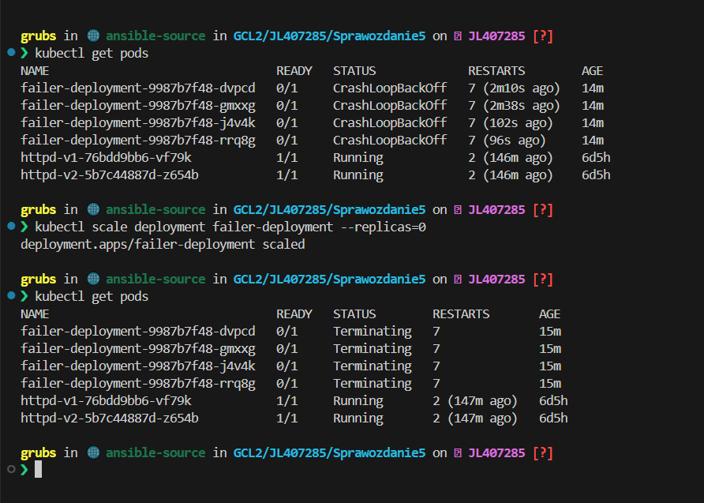

# Sprawozdanie 5

## Jakub Łach INO/GCL2

## Kubernetes

Kubernetes to otwartoźródłowa platforma do automatyzacji wdrażania, skalowania i zarządzania aplikacjami kontenerowymi. Została opracowana przez Google, a teraz jest zarządzana przez Cloud Native Computing Foundation (CNCF).
Najmniejszą jednostką wdrożeniową w Kubernetes jest **pod**, który może zawierać jeden lub więcej kontenerów. Kontenery w ramach jednego podu dzielą te same zasoby i sieć, co pozwala im na łatwą komunikację i współdzielenie danych.

Możemy wykorzystać również abstrakcję wyższego poziomu jaką jest **Deployment**. Deploymenty definiują, ile replik podów ma być uruchomionych i jakie aktualizacje mają być przeprowadzane. Umożliwiają zarządzanie wersjami aplikacji, automatyczne skalowanie oraz aktualizacje bez przestojów.

Innymi dostępnymi składnika wdrożenia są **Services**. Służą do definiowania stałego punktu dostępu (adres IP) do zestawu podów. Zapewniają zbalansowane obciążenie i stały sposób komunikacji między podami a resztą aplikacji.

Kubernetes pozwala na automatyzacje wdrażania i skalowania, odporność na błędy (jeżeli kontener przestanie działać kubernetes go odtworzy), skalowalność oraz szerokie wsparcie dla wielu środowisk jak chmura lub prywatne centra danych. 

Do pracy z Kubernetes zainstalujemy minikube. Poleceniem **minikube start** rozpoczniemy pracę z k8s.


Przetestujmy działanie k8s uruchamiając kontener.


Na systemie znajduje się kontener z minikube oraz poleceniem **kubectl get nodes** możemy wypisać działające node'y.
Jak widzimy działa węzeł kontrolny.

W moim przypadku nie było potrzeby mitygacji problemów związanych z zasobami maszyny, ponieważ przeznaczyłem więcej zasobów systemowych na główną maszynę.


Dashboard Minikube to graficzny interfejs użytkownika (GUI) dla Kubernetes, uruchamiany lokalnie przy pomocy narzędzia Minikube. Minikube to narzędzie, które umożliwia uruchomienie klastera Kubernetes na lokalnym komputerze, co jest idealne do testowania i rozwijania aplikacji.

Uruchommy dashboard i sprawdźmy stan klastrów.


Istnieją już deployment'y oraz pod'y z poprzednich zajęć.


Przeprowadźmy analizę posiadanego kontenera stworzonego w ramach laboratoriów z Jenkins'a. Nasz kontener Deploy nadaje się na wdrożenie na k8s. Jedyna rzecz o której musimy pamiętac to wywołać **npm start**, aby nie zakończył działania po zbudowaniu. Aplikacja działa na portcie 3000, zbadamy jej poprawnie działanie **curl'em**.

Dla pewności upewnijmy się, że wszystko działa w porządku.


Kontener działa, curl zwraca nam dane ze strony.


Uruchomimy teraz kontener na k8s. Wykorzystamy polecenie 
``` console
minikube kubectl run -- <nazwa-wdrożenia> --image=<obraz-docker> --port=<wyprowadzany port> --labels app=<nazwa-wdrożenia>
```

Polecenie **minikube kubectl run** jest używane do uruchamiania aplikacji kontenerowych na klastrze Kubernetes zarządzanym przez Minikube. **kubectl** to narzędzie wiersza poleceń do interakcji z klastrem Kubernetes. 

*minikube kubectl* jest sposobem na wywołanie kubectl skonfigurowanego do pracy z lokalnym klastrem Minikube.


Udało nam się utworzyć pod z wybraną aplikacją.
Sprawdźmy ile pod'ów istnieje na systemie.


Sporo czasu minęło z uwagi na bardzo wolny internet jaki był wtedy dostępny, ale udało nam się pobrać obraz i uruchomić pod'a.
Wyprowadziliśmy port przy tworzeniu pod'a, ale mozemy również sprecyzować to później korzystając z polecenia

```console
kubectl port-forward pod/<nazwa> port1:port2
```


Zweryfikujmy działania aplikacji.


W terminalu w którym wystawiliśmy port widzimy, że zwracana nam jest informacja kiedy następuje do obsługi połączenia.


## Wdrożenie jako plik

Zamiast ręcznie uruchamiać aplikacje w Kubernetes przy użyciu poleceń wiersza poleceń, można skonfigurować wdrożenie za pomocą pliku YAML. Pliki YAML są szczególnie przydatne, ponieważ pozwalają na deklaratywne zarządzanie konfiguracją aplikacji, co ułatwia wersjonowanie i automatyzację.

Utworzymy więc plik *nodeapp-deployment.yaml*, który posłuży nam dalej do wdrożeń.

```yaml
apiVersion: apps/v1
kind: Deployment
metadata:
  name: nodeapp-deployment
spec:
  replicas: 4   
  selector:
    matchLabels:
      app: nodeapp
  template:
    metadata:
      labels:
        app: nodeapp
    spec:
      containers:
        - name: nodeapp
          image: grubcio0/pipeline-repo:builder
          ports:
            - containerPort: 3000
          command: ["npm", "start"]

```

Istnieje sporo predefiniowanych zmiennych, które skracają i ułatwiają wdrożenie. Przykładowo w powyższym pliku, *spec* pozwala deklaratywnie opisać nazwe, obraz, wyprowadzane porty oraz polecenie jakie wywołać podczas tworzenia kontenera. Wyżej widzimy, że może też w prosty sposób manipulować ilością replik jakie będą istnieć.


Wykorzystajmy powyższy plik do przeprowadzanie wdrożenia.


Po pewnym czasie sprawdzamy istniejące pod'y.


Sprawdźmy stan deployment'u poleceniem

```console
kubectl rollout status deployment <nazwa-deploymentu>
```


### Nowy obraz

Przygotujemy nowy obraz, którego uruchomienie będzie się zawsze kończyć błędem. Zmodyfikujemy plik Dockerfile tak, aby obraz zwracał błąd podczas budowania.

```Dockerfile
FROM node:latest
RUN git clone https://github.com/devenes/node-js-dummy-test
WORKDIR /node-js-dummy-test
RUN npm install

CMD ["sh", "-c", "exit 1"]
```

Zbudujmy powyższy obraz oraz wprowadźmy na DockerHub.


Wprowadźmy deployment z **failerem** w życie.

```yaml
apiVersion: apps/v1
kind: Deployment
metadata:
  name: failer-deployment
spec:
  replicas: 4
  selector:
    matchLabels:
      app: failer
  template:
    metadata:
      labels:
        app: failer
    spec:
      containers:
        - name: failer
          image: grubcio0/failer:latest  
          ports:
            - containerPort: 3000
```

Wynik deploymentu


Po zmianie ilości replik na 4 i wyłączeniu wcześniej istniejących podów.


Przygotujemy również skrypt, który pozwoli na monitorowaniu stanu wdrożenia przez określony czas.

```bash
#!/bin/bash

DEPLOYMENT_NAME="failer-deployment"
TIMEOUT_SECONDS=60
INTERVAL_SECONDS=5
TIME_PASSED=0

while [ $TIME_PASSED -lt $TIMEOUT_SECONDS ]; do
    STATUS=$(kubectl get deployment $DEPLOYMENT_NAME -o jsonpath='{.status.conditions[?(@.type=="Available")].status}')

    if [ "$STATUS" == "True" ]; then
        echo "Deployment $DEPLOYMENT_NAME zostało wdrożone."
        exit 0
    fi

    sleep $INTERVAL_SECONDS
    TIME_PASSED=$((TIME_PASSED + INTERVAL_SECONDS))
done

echo "Przekroczono limit czasu ($TIMEOUT_SECONDS sekund) oczekiwania na wdrożenie $DEPLOYMENT_NAME."
exit 1
```

Ten skrypt sprawdza stan wdrożenia co **INTERVAL_SECONDS** sekund (domyślnie co 5 sekund) i przerywa, gdy stan **Available** zmienia się na True, co oznacza, że wdrożenie zostało zakończone pomyślnie. Jeśli wdrożenie nie zostanie zakończone w ciągu **TIMEOUT_SECONDS** sekund (domyślnie 60 sekund), skrypt zakończy się błędem.

Uruchamiamy skrypt na failure-deployu


Warto zaznaczyć, że kubectl pozwala na skalowaniu naszego wdrożenia na żywo używając polecenia

```bash
kubectl scale deployment <nazwa-deployment> --replicas=liczba_replik
```




Po użyciu polecenia nasz deploymentu, który umyślnie miał zakończyć się błedem jest wyłączany całkowicie, wcześniej k8s próbował periodycznie restartować pod'y licząć, że błąd wynika może z czynnikow zewnętrznych.


Ostatnią częścią laboratorium było zbadanie różnych strategii wdrożenia.

*   Recreate Deployment: Tworzy nową wersję wdrożenia i zatrzymuje wszystkie stare instancje, zanim uruchomi nowe. Jest to prosty sposób na wdrożenie, ale może prowadzić do czasowej niedostępności aplikacji.

*   Rolling Update Deployment: Aktualizuje wersję wdrożenia stopniowo, zatrzymując jednocześnie tylko część instancji i uruchamiając nowe. Może być skonfigurowany za pomocą parametrów maxUnavailable i maxSurge dla precyzyjnej kontroli nad procesem aktualizacji.

*   Canary Deployment: Wprowadza nową wersję aplikacji stopniowo, testując ją na niewielkiej liczbie instancji przed pełnym wdrożeniem. Jest to przydatne dla aplikacji, które wymagają dokładnego testowania nowych wersji przed udostępnieniem ich wszystkim użytkownikom.


Z uwagi na brak implementacji wersjonowania nie udało mi się przetestować na żywo różnych strategii wdrożenia, mimo to utworzyłem pliki odpowiadające każdej ze strategii oraz testowo uruchomiłem dwie z nich.


Pliki różnych strategii:

Rolling update 

```yaml
apiVersion: apps/v1
kind: Deployment
metadata:
  name: nodeapp-rolling-update
spec:
  replicas: 3
  selector:
    matchLabels:
      app: nodeapp-rolling-update
  template:
    metadata:
      labels:
        app: nodeapp-rolling-update
    spec:
      containers:
      - name: nodeapp
        image: grubcio0/pipeline-repo:builder
        ports:
        - containerPort: 3000
        command: ["npm", "start"]
  strategy:
    type: RollingUpdate
    rollingUpdate:
      maxUnavailable: 1
      maxSurge: 20%

```
Recreate

```yaml
apiVersion: apps/v1
kind: Deployment
metadata:
  name: nodeapp-recreate
spec:
  replicas: 3
  selector:
    matchLabels:
      app: nodeapp-recreate
  strategy:
    type: Recreate
  template:
    metadata:
      labels:
        app: nodeapp-recreate
    spec:
      containers:
        - name: nodeapp
          image: grubcio0/pipeline-repo:builder
          ports:
            - containerPort: 3000
          command: ["npm", "start"]

```
Canary

```yaml
apiVersion: apps/v1
kind: Deployment
metadata:
  name: nodeapp-canary
spec:
  replicas: 3
  selector:
    matchLabels:
      app: nodeapp-canary
  template:
    metadata:
      labels:
        app: nodeapp-canary
    spec:
      containers:
      - name: nodeapp
        image: grubcio0/pipeline-repo:builder
        ports:
        - containerPort: 3000
        command: ["npm", "start"]

```

W każdym przypadku użyto etykiet, aby oznaczyć zarówno wdrożenie, jak i jego odpowiadające usługi, co ułatwia zarządzanie i monitorowanie systemu. Dodatkowo, w przypadku wdrożeń z wieloma replikami, zaleca się używanie serwisów do zarządzania dostępem do tych replik i zapewnienia ich dostępności.