# Przedmowa
Do wykonania ustalonych zadań najpierw stworzyłem wirtualną maszynę z użyciem [Oracle VM VirtualBox](https://www.virtualbox.org/wiki/Downloads) oraz systemu [Ubuntu](https://ubuntu.com/download) w wersji 22.04.3 LTS. 

Instalację systemu przedstawia [poradnik](https://cs.pwr.edu.pl/kobylanski/dydaktyka/resources/instalacjaUbuntu.pdf) lecz możliwe są alternatywne metody.

W celu lepszej pracy ustawiłem większa liczbę pamięci RAM (4GB), oraz kartę sieciową na tryb bridged aby mogła korzystać z interfejsu sieciowego mojej domowej sieci LAN.
Z tak oto utworzoną maszyną wirtualną połączyłem się z pomocą programu [VS Code](https://code.visualstudio.com/download) oraz rozszerzenia Remote-SSH.

W celu połączenia maszyny wirtualnej poprzez SSH używam komendy. 

```bash
apt-get install openssh-client
```
Do instalacji na systemie linux można używać zarówno ```apt install``` jak i ```apt-get install```, ja natomiast w dalszej części będę stosował drugą wersję instalacji.

Następnie zainstalowałem pakiet ```net-tools``` w celu użycia opcji ```ifconfig``` w celu uzyskania adresu ip do połączenia.
```bash
apt-get install net-tools
ifconfig
```
 
W celu uniknięcia problemów z instalacjami i uprawnień na maszynie w większości używam konta root’a.
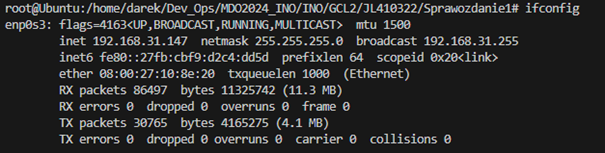

---

# Zajęcia 01

## 1.	Instalacja klienta Git i obsługi kluczy SSH
W celu dalszego używania oprogramowania Git należy je wpierw zainstalować za pomocą polecenia.
```bash
apt-get install git
```
Poprawną instalację można potwierdzić poprzez ```git –version```

W prawidłowym przypadku wypisze wersję git’a która jest obecna w systemie, podobnie można robić z kolejnymi programami i pakietami.

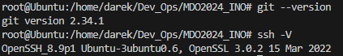
 
Zaś obsługa kluczy jest możliwa dzięki wcześniej zainstalowanemu pakietowi openssh-client, dlatego teraz jest możliwa generacja komendą.

```bash
ssh-keygen 
```

## General info
## 2.	Klonowanie repozytorium przedmiotowego za pomocą HTTPS
Do tego należy z GitHuba przedmiotu skopiować link do repozytorium.

```bash
git clone https://github.com/InzynieriaOprogramowaniaAGH/MDO2024_INO.git
```

## 3.	Zapewnienie dostępu do repozytorium jako uczestnik i sklonowanie za pomocą utworzonego klucza SSH
Generowanie  klucza z szyfrowaniem innym niż domyślne RSA, np.```ED25519``` zgodnie z zaleceniami dokumentacji GitHub’a dotyczącej generowania kluczy SSH bez hasła.

```bash
ssh-keygen -t ed25519 -C "########@###.#"
```
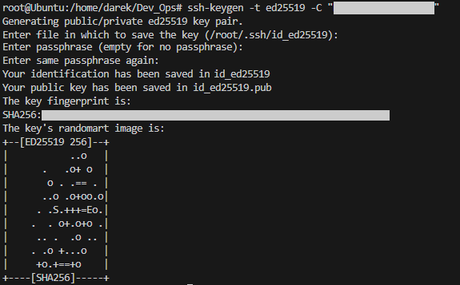
 
Następnie zawartość pliku id_ed25519.pub, czyli klucz prywatny należy przekopiować do konta GitHub.
 
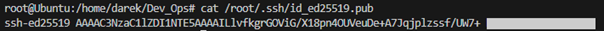

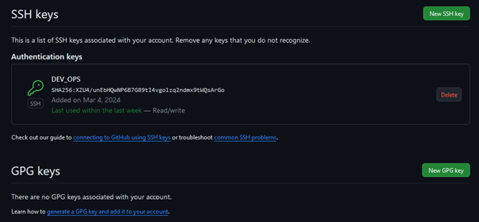

To samo należy zrobić z innym szyfrowaniem ```ecdsa``` tylko tym razem należy zastosować hasło.
 

 
Pobranie repozytorium za pomocą SSH.
```bash
git clone git@github.com:InzynieriaOprogramowaniaAGH/MDO2024_INO.git
```
## 4.	Przełączenie się na gałąź main, a następnie na gałąź grupy (GCL2)

```bash
git branch --all 
```
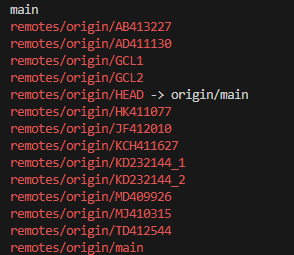
 
## 5.	Utworzenie gałęzi o nazwie JL410322

```bash
git branch JL410322
git switch JL410322
```
Alternatywnie można użyć komendy.
```bash
git checkout -d JL410322
```
## 6.	Praca na nowej gałęzi
Stworzenie katalogu o nazwie JL410322 wewnątrz katalogu odpowiadającego kierunkowi i grupie.
```bash
mkdir INO/GCL2/JL410322 -p
```
Pisanie git hook’a
W tym celu można skopiowanać przykładowy plik hook’a .

```bash
cp .git/hooks/commit-msg.sample .git/hooks/commit-msg
```
Dzięki temu plik będzie miał również odpowiednie uprawnienia, w innym przypadku trzeba je nadać poprzez.

```bash
chmod +x .git/hooks/commit-msg
```
Taki plik od razu znajduje się w lokalizacji pozwalającej na jego wykonanie, a nazwa zapewnia że będzie wykonywany podczas wykonywania commit’a.
Plik można zedytować za pomocą nano, bądź innego edytora tekstu np. vim.
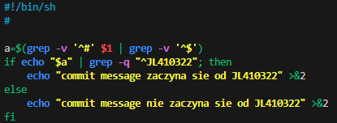

```bash
nano .git/hooks/commit-msg
```
 

Tworzenie folderu ze sprawozdaniem oraz pliku Markdown.

```bash
mkdir INO/GCL2/JL410322/Sprawozdanie1/          
touch INO/GCL2/JL410322/Sprawozdanie1/Readme.md
```

Skopiowanie pliku do utworzonego katalogu ze sprawozdaniem.
```bash
cp .git/hooks/commit-msg INO/GCL2/JL410322/Sprawozdanie1/
```

         
Zrzuty ekranu należy dodawać do katalogu ze sprawozdaniem (w podfolderze img), po czym należy je dodawać do sprawozdania w formacie ``````.

Całą stworzoną strukturę można sprawdzić poprzez ```tree```.

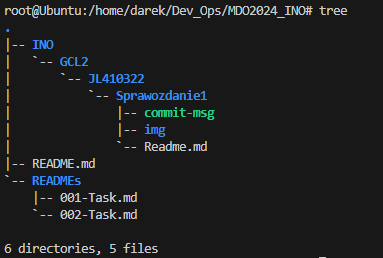


Dodaje się wszystkie zmiany do "indexu", aby Git mógł je uwzględnić przy zatwierdzaniu commit'a, po czym robimy commit, możliwe jest sprawdzenie przed tym statusu poprzez ```git status```.
```bash
git add .
git commit
```
Po czym następuje wysłanie zmian do zdalnego źródła, czyli do GitHub'a.
```bash
git push
```

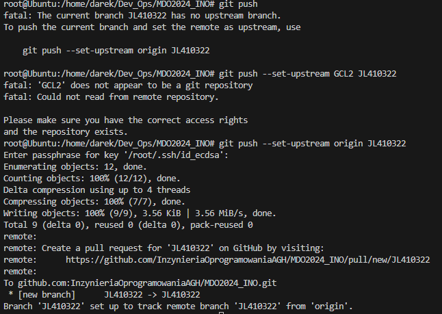

Po przejściu do gałęzi grupy wciągamy do niej swoje zmiany.
```bash
git push origin JL410322:GCL2
```

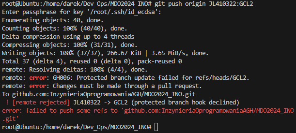

Prawdopodobnie z powodu problemów z dostępu do gałęzi niemożliwe jest wciągnięcie do niej brancha.

Na sam koniec dokonujemy ponownie commita po dodaniu zaktualizowanego sprawozdania i zrzutów ekranu.

---

# Zajęcia 02

## 1. Instalacja Dockera
```bash
snap install docker
```

## 2. Rejestracja w [Docker Hub](https://hub.docker.com/) i zapoznanie z sugerowanymi obrazami

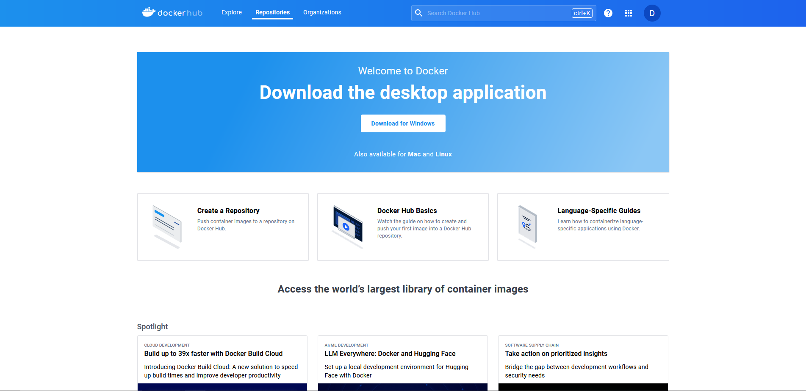

## 3. Pobranie obrazów ```hello-world```, ```busybox```, ```ubuntu``` lub ```fedora```, ```mysql```

```bash
docker pull hello-world
```

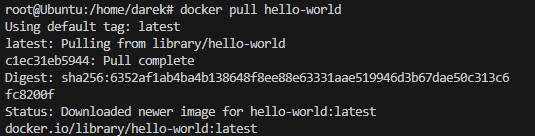

```bash
docker pull busybox
docker pull ubuntu
docker pull mysql
```
## 4. Uruchomienie kontenera z obrazu ```busybox```

```bash
docker run -it busybox
```

Wywołanie numeru wersji uruchomienego kontenera

```bash
uname -a
```

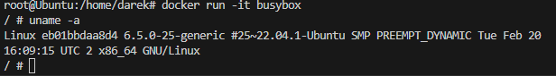

## 5. Uruchomienie "systemu w kontenerze" jako obrazu ```ubuntu```

Wypisanie ```PID1``` w kontenerze

```bash
ps -p 1
```

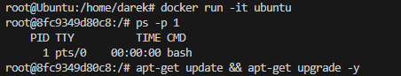

Wypisanie procesów dockera na hoście

```bash
ps aux | grep docker
```

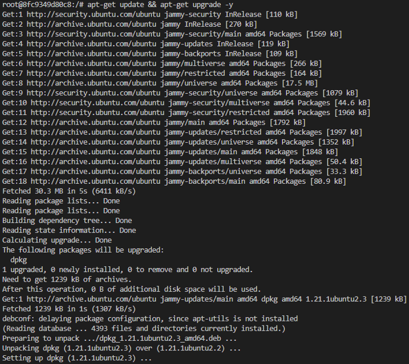

Aktualizacja pakietów

```bash
apt-get update && apt-get upgrade -y
```

Wyjście z kontenera

```bash
exit
```

## 6. Własnoręczne stworzenie, zbudowanie i uruchomienie pliku ```Dockerfile``` bazującego na systemie ```ubuntu```

Instalacja git'a w kontenerze i klonowanie repozytorium
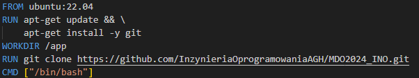

Tworzenie kontenera na podstawie pliku 

```bash
docker build -t my_ubuntu
```

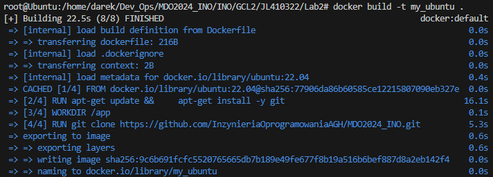

Sprawdzenie poprawności skopiowanego repozytorium

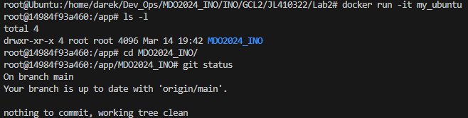

## 7. Pokazanie uruchomionych kontenerów oraz wyczyszczenie ich.

```bash
docker ps -a
```

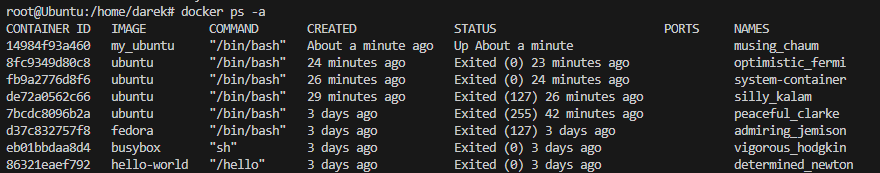


```bash
docker container prune
```


## 8. Czyszczenie obrazów

```bash
docker image prune -a
```

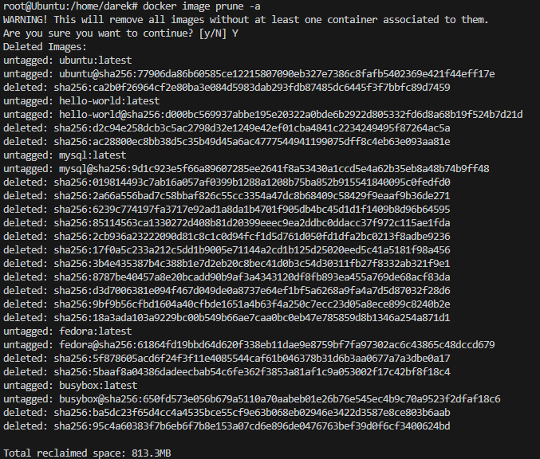


## 9. Dodanie pliku ```Dockerfile``` do folderu ```Sprawozdanie1```

## 10. Wystawienie *Pull Request'a* do gałęzi grupowej jako zgłoszenie wykonanego zadania# Przedmowa
Do wykonania ustalonych zadań najpierw stworzyłem wirtualną maszynę z użyciem [Oracle VM VirtualBox](https://www.virtualbox.org/wiki/Downloads) oraz systemu [Ubuntu](https://ubuntu.com/download) w wersji 22.04.3 LTS. 

Instalację systemu przedstawia [poradnik](https://cs.pwr.edu.pl/kobylanski/dydaktyka/resources/instalacjaUbuntu.pdf) lecz możliwe są alternatywne metody.

W celu lepszej pracy ustawiłem większa liczbę pamięci RAM (4GB), oraz kartę sieciową na tryb bridged aby mogła korzystać z interfejsu sieciowego mojej domowej sieci LAN.
Z tak oto utworzoną maszyną wirtualną połączyłem się z pomocą programu [VS Code](https://code.visualstudio.com/download) oraz rozszerzenia Remote-SSH.

W celu połączenia maszyny wirtualnej poprzez SSH używam komendy. 

```bash
apt-get install openssh-client
```
Do instalacji na systemie linux można używać zarówno ```apt install``` jak i ```apt-get install```, ja natomiast w dalszej części będę stosował drugą wersję instalacji.

Następnie zainstalowałem pakiet ```net-tools``` w celu użycia opcji ```ifconfig``` w celu uzyskania adresu ip do połączenia.
```bash
apt-get install net-tools
ifconfig
```
 
W celu uniknięcia problemów z instalacjami i uprawnień na maszynie w większości używam konta root’a.


---

# Zajęcia 01

## 1.	Instalacja klienta Git i obsługi kluczy SSH
W celu dalszego używania oprogramowania Git należy je wpierw zainstalować za pomocą polecenia.
```bash
apt-get install git
```
Poprawną instalację można potwierdzić poprzez ```git –version```

W prawidłowym przypadku wypisze wersję git’a która jest obecna w systemie, podobnie można robić z kolejnymi programami i pakietami.


 
Zaś obsługa kluczy jest możliwa dzięki wcześniej zainstalowanemu pakietowi openssh-client, dlatego teraz jest możliwa generacja komendą.

```bash
ssh-keygen 
```

## General info
## 2.	Klonowanie repozytorium przedmiotowego za pomocą HTTPS
Do tego należy z GitHuba przedmiotu skopiować link do repozytorium.

```bash
git clone https://github.com/InzynieriaOprogramowaniaAGH/MDO2024_INO.git
```

## 3.	Zapewnienie dostępu do repozytorium jako uczestnik i sklonowanie za pomocą utworzonego klucza SSH
Generowanie  klucza z szyfrowaniem innym niż domyślne RSA, np.```ED25519``` zgodnie z zaleceniami dokumentacji GitHub’a dotyczącej generowania kluczy SSH bez hasła.

```bash
ssh-keygen -t ed25519 -C "########@###.#"
```

 
Następnie zawartość pliku id_ed25519.pub, czyli klucz prywatny należy przekopiować do konta GitHub.
 


To samo należy zrobić z innym szyfrowaniem ```ecdsa``` tylko tym razem należy zastosować hasło.
 

 
Pobranie repozytorium za pomocą SSH.
```bash
git clone git@github.com:InzynieriaOprogramowaniaAGH/MDO2024_INO.git
```
## 4.	Przełączenie się na gałąź main, a następnie na gałąź grupy (GCL2)

```bash
git branch --all 
```

 
## 5.	Utworzenie gałęzi o nazwie JL410322

```bash
git branch JL410322
git switch JL410322
```
Alternatywnie można użyć komendy.
```bash
git checkout -d JL410322
```
## 6.	Praca na nowej gałęzi
Stworzenie katalogu o nazwie JL410322 wewnątrz katalogu odpowiadającego kierunkowi i grupie.
```bash
mkdir INO/GCL2/JL410322 -p
```
Pisanie git hook’a
W tym celu można skopiowanać przykładowy plik hook’a .

```bash
cp .git/hooks/commit-msg.sample .git/hooks/commit-msg
```
Dzięki temu plik będzie miał również odpowiednie uprawnienia, w innym przypadku trzeba je nadać poprzez.

```bash
chmod +x .git/hooks/commit-msg
```
Taki plik od razu znajduje się w lokalizacji pozwalającej na jego wykonanie, a nazwa zapewnia że będzie wykonywany podczas wykonywania commit’a.
Plik można zedytować za pomocą nano, bądź innego edytora tekstu np. vim.


```bash
nano .git/hooks/commit-msg
```
 

Tworzenie folderu ze sprawozdaniem oraz pliku Markdown.

```bash
mkdir INO/GCL2/JL410322/Sprawozdanie1/          
touch INO/GCL2/JL410322/Sprawozdanie1/Readme.md
```

Skopiowanie pliku do utworzonego katalogu ze sprawozdaniem.
```bash
cp .git/hooks/commit-msg INO/GCL2/JL410322/Sprawozdanie1/
```

         
Zrzuty ekranu należy dodawać do katalogu ze sprawozdaniem (w podfolderze img), po czym należy je dodawać do sprawozdania w formacie ``````.

Całą stworzoną strukturę można sprawdzić poprzez ```tree```.


Dodaje się wszystkie zmiany do "indexu", aby Git mógł je uwzględnić przy zatwierdzaniu commit'a, po czym robimy commit, możliwe jest sprawdzenie przed tym statusu poprzez ```git status```.
```bash
git add .
git commit
```
Po czym następuje wysłanie zmian do zdalnego źródła, czyli do GitHub'a.
```bash
git push
```


Po przejściu do gałęzi grupy wciągamy do niej swoje zmiany.
```bash
git push origin JL410322:GCL2
```


Prawdopodobnie z powodu problemów z dostępu do gałęzi niemożliwe jest wciągnięcie do niej brancha.

Na sam koniec dokonujemy ponownie commita po dodaniu zaktualizowanego sprawozdania i zrzutów ekranu.

---

# Zajęcia 02

## 1. Instalacja Dockera
```bash
snap install docker
```

## 2. Rejestracja w [Docker Hub](https://hub.docker.com/) i zapoznanie z sugerowanymi obrazami


## 3. Pobranie obrazów ```hello-world```, ```busybox```, ```ubuntu``` lub ```fedora```, ```mysql```

```bash
docker pull hello-world
```


```bash
docker pull busybox
docker pull ubuntu
docker pull mysql
```
## 4. Uruchomienie kontenera z obrazu ```busybox```

```bash
docker run -it busybox
```

Wywołanie numeru wersji uruchomienego kontenera

```bash
uname -a
```


## 5. Uruchomienie "systemu w kontenerze" jako obrazu ```ubuntu```

Wypisanie ```PID1``` w kontenerze

```bash
ps -p 1
```


Wypisanie procesów dockera na hoście

```bash
ps aux | grep docker
```


Aktualizacja pakietów

```bash
apt-get update && apt-get upgrade -y
```

Wyjście z kontenera

```bash
exit
```

## 6. Własnoręczne stworzenie, zbudowanie i uruchomienie pliku ```Dockerfile``` bazującego na systemie ```ubuntu```

Instalacja git'a w kontenerze i klonowanie repozytorium


Tworzenie kontenera na podstawie pliku 

```bash
docker build -t my_ubuntu
```


Sprawdzenie poprawności skopiowanego repozytorium


## 7. Pokazanie uruchomionych kontenerów oraz wyczyszczenie ich.

```bash
docker ps -a
```


```bash
docker container prune
```


## 8. Czyszczenie obrazów

```bash
docker image prune -a
```


## 9. Dodanie pliku ```Dockerfile``` do folderu ```Sprawozdanie1```

## 10. Wystawienie *Pull Request'a* do gałęzi grupowej jako zgłoszenie wykonanego zadania
