# Zajęcia 03 - Dockerfiles, kontener jako definicja etapu

## 1. Wybór oprogramowania na zajęcia

Wybrane repozytorium należy do aplikacji sqlite

repozytorium spełnia kryteria, ponieważ autor zrzeka się praw autorskich do kodu

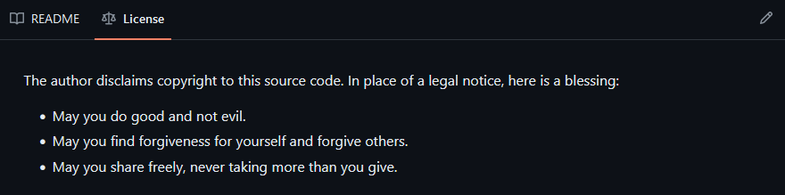

Jest również umieszczone w taki sposób, że mozliwe jest uruchomienie za pomocą pliku Makefile czegoś na kształt ```make build``` oraz ```make test```

Zawiera zdefiniowane i obecne w repozytorium testy

Po sklonowaniu repozytorium 
```bash
git clone https://github.com/sqlite/sqlite.git
``` 

Należy doinstalować wymagane zależności

```bash
apt-get -y update && apt-get -y install gcc tcl-dev
``` 

Nalezy uruchomić skrypt konfiguracyjny ```.configure```

Po czym możliwe jest dokonanie build'a ```make sqlite3``` oraz przeprowadzenie testów jednostkowych ```make devtest```

## 2. Przeprowadzenie buildu w kontenerze

### 1. Wykonanie kroków ```build``` i ```test``` wewnątrz konkretnego kontenera - ```fedora```

Ma na celu wykonanie podobnych kroków co w podpunkcie 1. lecz z pomocą konteneru dockera. Dla rozróżnienia ta część będzie wykonywana w kontenerze z fedorą.

Uruchomienie kontenera

```bash
docker run -it fedora /bin/bash
```

Zaopatrzenie kontenera w wymagania wstępne

```bash
dnf -y update && dnf -y install git gcc tcl-devel
```

Klonowanie repozytorium

```bash
git clone https://github.com/sqlite/sqlite.git
```

Uruchomienie skryptu konfiguracyjnego, po czym *build'u* narzędzia tekstowego oraz *testów*

```bash
cd sqlite/
./configure
make sqlite3
make devtest
```

### 2. Utworzenie plików ```Dockerfile``` automatyzujących powyższe kroki

```sqlite_builder.Dockerfile```

```Dockerfile
FROM fedora

RUN dnf -y update && \
    dnf -y install git gcc tcl-devel

RUN git clone https://github.com/sqlite/sqlite.git
WORKDIR /sqlite
RUN ./configure
RUN make sqlite3
```

```sqlite_tester.Dockerfile```


```Dockerfile
FROM sqlite_builder

WORKDIR /sqlite
RUN make devtest
```

### 3. Wdrożenie i sprawdzenie poprawnosci działania 

Stworzenie pierwszego obrazu ```sqlite_builder```

```bash
docker build -t sqlite_builder -f sqlite_builder.Dockerfile .
```

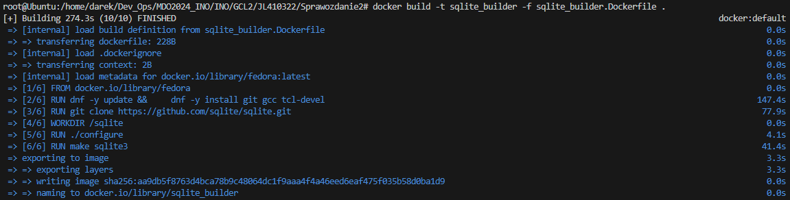

Utowrzenie obrazu ```sqlite_tester``` bazującego na już stworzonym

```bash
docker build -t sqlite_tester -f sqlite_tester.Dockerfile .
```

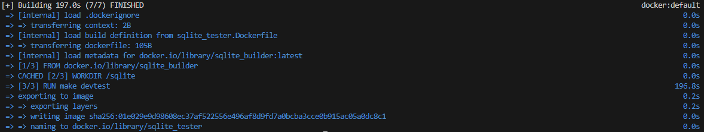

Sprawdzenie czy kontener działa poprawnie poprzez uruchomienie go

```bash
docker run -it sqlite_tester
```

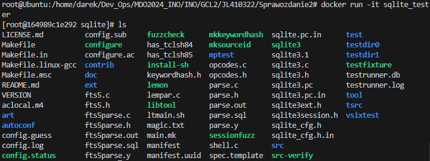

Nie pojawiają sie informacje o błędzie związanym z testowaniem, oraz wszystkie pliki zostały pobrane.


# Zajęcia 04 - 

## 1. Zachowywanie stanu

Zapoznanie z dokumentacją dockera dotyczącą [woluminów](https://docs.docker.com/storage/volumes/)

```bash
docker volume create V_in
docker volume create V_out
```

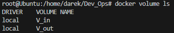

Tworzenie kontenera na podstawie obrazu fedory wraz z montażem dwóch woluminów do kontenera z 3 zajęć. 

```bash
docker run -it -v V_in:/input -v V_out:/output fedora
```

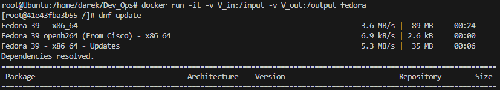

Kopiowanie plików ```sqlite``` z systemu hosta do woluminu wewnątrz kontenera oraz uruchomienie tego kontenera.

```bash
docker cp sqlite 41e43fba3b55:/input
docker start 41e43fba3b55
docker exec -it 41e43fba3b55 bash
```

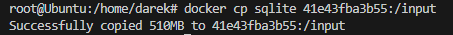
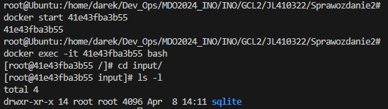

Uruchomienie builda i testów w woluminie wejściowym, następnie skopiowanie plików na wolumin wyjściowy i ponowne testy.

```bash
dnf update
dnf -y install gcc tcl-devel
./configure
make devtest
```

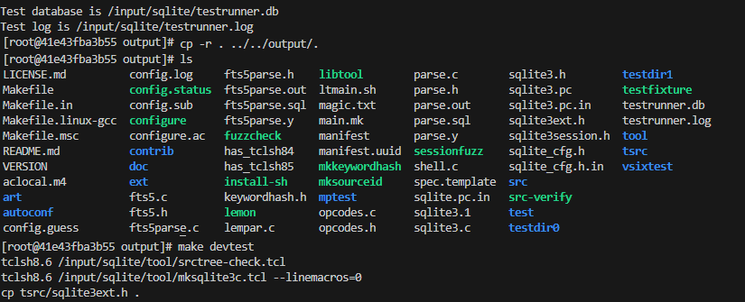

Pliki są dostepne na woluminie wyjściowym i przechodzą testy.
Możliwy jest dostep do nich po wyłączeniu kontenera.

## 2. Eksportowanie portu

Zapoznanie z dokumentacją [iperf](https://iperf.fr/)

Pobranie obrazu iperf - networkstatic/iperf3.
```bash
docker pull networkstatic/iperf3
```

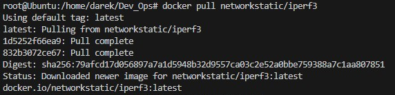

Uruchomienie serwera iperf3 wewnątrz kontenera.
```bash
docker run --rm -it --name=server -p 5201:5201 networkstatic/iperf3 -s
```

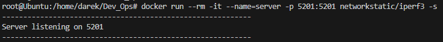

Połączenie się z drugiego kontenera z serwerem, zbadanie ruchu sieciowego.

W tym celu potrzebny jest adres ip serwera który można dostać poprzez wypisanie informacji dotyczących kontenera na którym działa
za pomocą ```docker inspect server```

```bash
docker run -it --rm networkstatic/iperf3 -c ${SERVER_IP_ADDRESS}
```

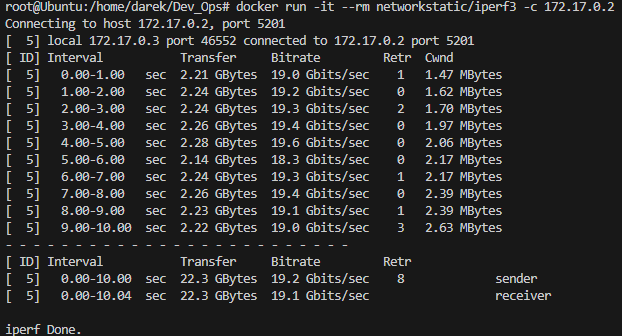

Zapoznanie z dokumentacją [```network create```](https://docs.docker.com/engine/reference/commandline/network_create/)

Tworzenie dedykowaniej sieci mostkowanej.

```bash
docker network create iperf-bridge
```

Użycie jej w celu połączenia się z serwerem iperf.

Uruchomienie serwera, który używa połączenia sieciowego .```iperf-bridge```


```bash
docker run --rm -it --name=server --network=iperf-bridge -p 5201:5201 networkstatic/iperf3 -s
```

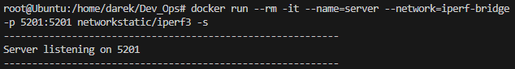

Połączenie się z innego kontenera, możliwe jest użycie nazwy konteneru serwerowego ```server``` zamiast adresu ip ```172.19.0.2```.

```bash
docker run --rm -it --name=client --network=iperf-bridge networkstatic/iperf3 -c server
```

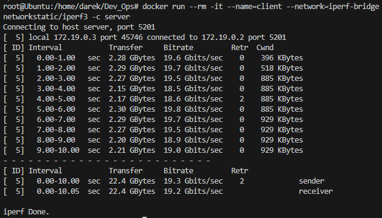

Połączenie się z hosta po zainstalowaniu aplikacji iperf3 za pomocą ```apt-get install iperf3```.

```bash
iperf3 -c 172.19.0.2
```


Połączenie się z innego komputera w sieci LAN poprzez użycie adresu kosta (komputera na którym jest maszyna wirtualna) ```192.168.31.120``` oraz ustawionej karty sieciowej na NAT.

W tym celu konieczna jest instalacja programu [iperf3 na system windows](https://iperf.fr/iperf-download.php#windows), a także dodania reguły przekierowania portów ```5201``` na maszynie wirtualnej.

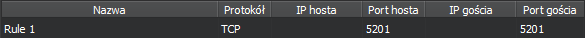

```bash
.\iperf3.exe -c 192.168.31.120
```

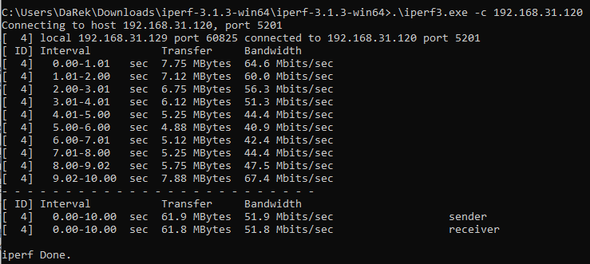

Dzięki temu możliwe jest połączenie się z hosta (systemu windows) na którym działa maszyna wirtualna.

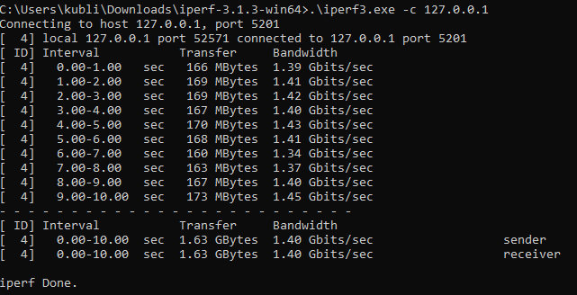

```txt
DOCKER NETWORK

    docker client - 22.3 GBytes

CREATED NETWORK

    docker client - 22.4 GBytes
    upuntu iperf3 - 24.7 GBytes
    windows host  - 1.63 GBytes
    windows host2 - 61.9 MBytes
```


Z uzyskanych pomiarów czasu można wywnioskować, że przepustowość osiągana poprzez zastosowanie własnej sieci mostkowanej jest zazwyczaj podobna w przypadku tego samego urządzenia i systemu operacyjnego. Jest natomiast znacząco mniejsza niż ta którą umożliwia domyslna sieć dockera w przypadku połączenia liunx-windows.
Najwolniejsze połączenie jest w przypadku komunikacji między serwerem linux a innym komputerem windows.

## 3. Instalacja Jenkins

Zapoznanie się z dokumentacją [Jenkins](https://www.jenkins.io/doc/book/installing/docker/).

Utworzenie sieci dla Jenkinsa.

```bash
docker newtork create jenkins
```

Uruchomienie obrazu ```docker:dind```

```bash
docker run \
  --name jenkins-docker \
  --restart=on-failure \
  --detach \
  --privileged \
  --network jenkins \
  --network-alias docker \
  --env DOCKER_TLS_CERTDIR=/certs \
  --volume jenkins-docker-certs:/certs/client \
  --volume jenkins-data:/var/jenkins_home \
  --publish 2376:2376 \
  docker:dind \
  --storage-driver overlay2
```

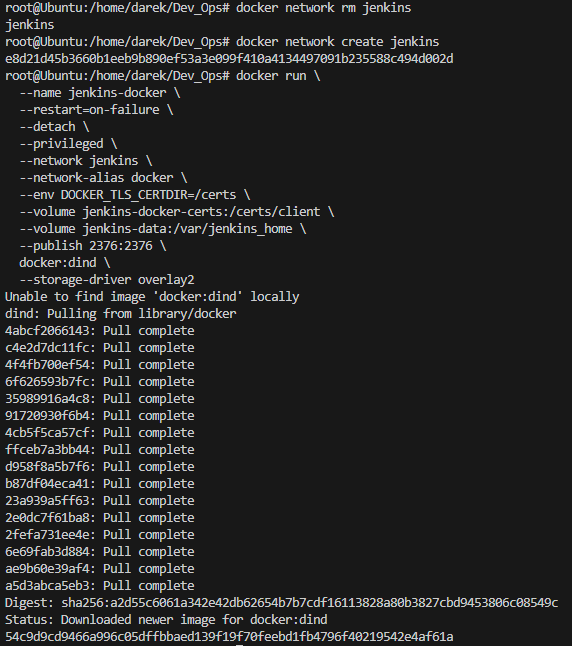

Stworzenie pliku do tworzenia obrazu jenkins ```jenkins.Dockerfile```.

```Dockerfile
FROM jenkins/jenkins:2.440.2-jdk17
USER root
RUN apt-get update && apt-get install -y lsb-release
RUN curl -fsSLo /usr/share/keyrings/docker-archive-keyring.asc \
  https://download.docker.com/linux/debian/gpg
RUN echo "deb [arch=$(dpkg --print-architecture) \
  signed-by=/usr/share/keyrings/docker-archive-keyring.asc] \
  https://download.docker.com/linux/debian \
  $(lsb_release -cs) stable" > /etc/apt/sources.list.d/docker.list
RUN apt-get update && apt-get install -y docker-ce-cli
USER jenkins
RUN jenkins-plugin-cli --plugins "blueocean docker-workflow"
```

Budowanie na podstawie pliku Dockera.

```bash
docker build -t jenkins_blueocean -f jenkins.Dockerfile .
```

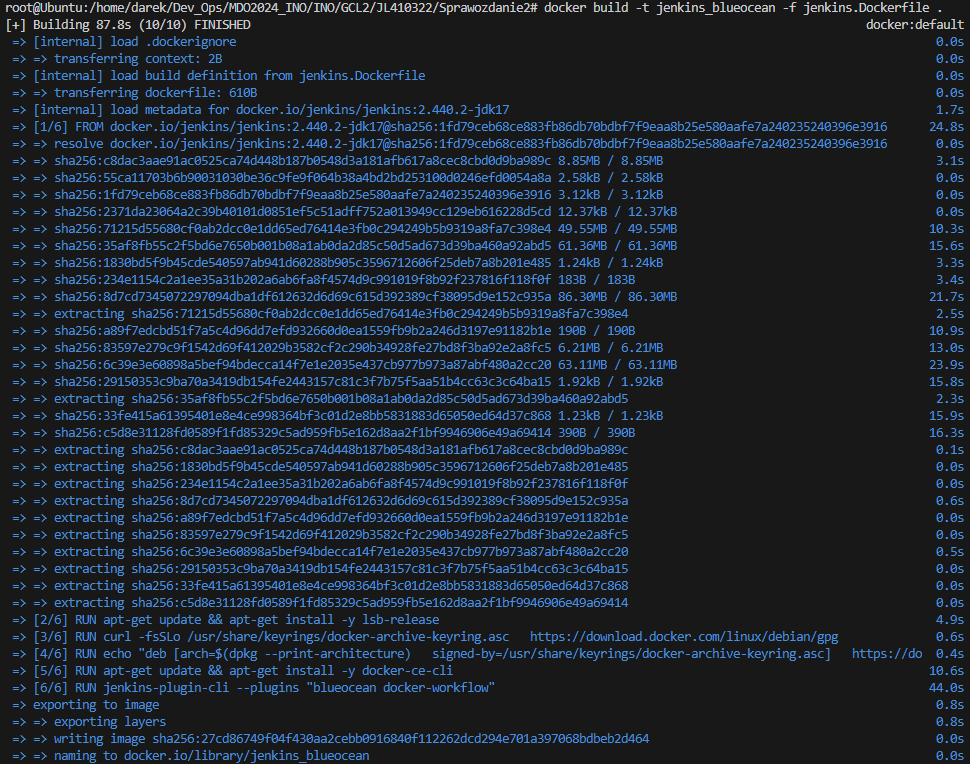

Uruchomienie kontenera z jenkinsem

```bash
docker run --rm -ir --name jenkins_blueocean --restart=on-failure \
    --network jenkins \
    -e DOCKER_HOST=tcp://docker:2376 \
    -e DOCKER_CERT_PATH=/certs/client \
    -e DOCKER_TLS_VERIFY=1 \
    -v jenkins-data:/var/jenkins_home \
    -v jenkins-docker-certs:/certs/client:ro \
    -p 8080:8080 -p 50000:50000 \
    jenkins_blueocean
```

Po uruchomieniu możliwe jest otwarcie programu w przeglądarce pod adresem ```localhost:8080```.

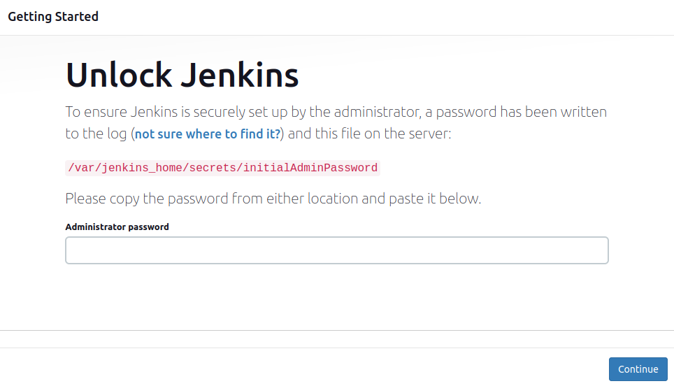

Do logowania potrzebne jest hasło widoczne w kontenerze.

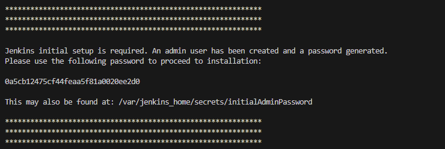

Widok po zalogowaniu jako administrator i podstawowej konfiguracji

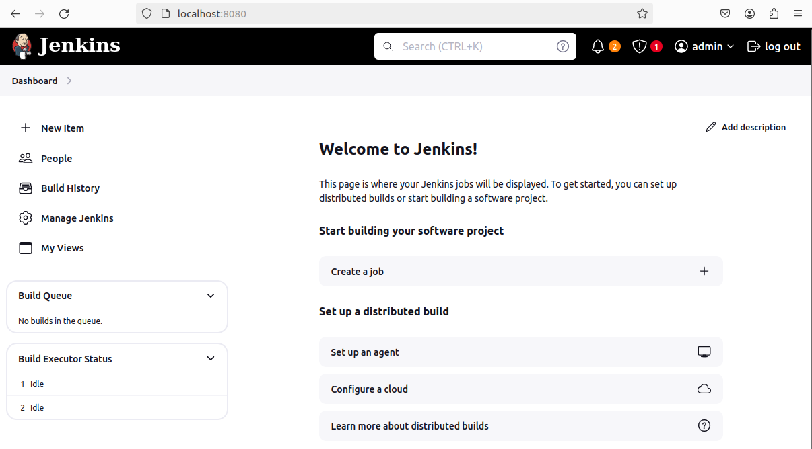