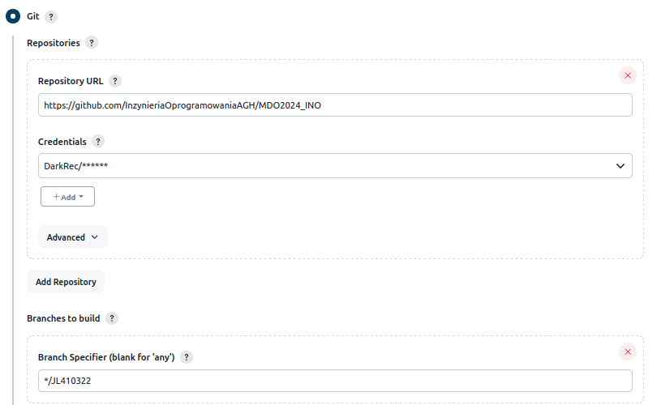

# Zajęcia 05 i 06 - Pipeline, Jenkins, izolacja etapów

Celem ćwiczeń była budowa oraz testowanie projektów, do tego były wykorzystywane programy Docker oraz Jenkins.
Z użyciem Jenkinsa możliwe jest tworzenie projektów oraz pipelinów, które pomagają automatyzować wcześniej zdokeryzowane projekty.


## 1. Uruchomienie

### Konfiguracja wstępna i pierwsze uruchomienie

* Projekt który wyświetla uname


* Projekt który zwraca błąd gdy godzina jest nieparzysta


### "Prawdziwy" projekt który kolunje repozytorium zmienia gałąź osobistą, buduje obrazy z Dockerfila



Dodanie Credentiali Githuba oraz zmiana branch'a.


Budowanie obrazu z Dockerfile


Poprawne działanie projektu

Wymagania wstępne:
Fork GitHub bibliteki nad którą pracujemy
Pliki Dockerfile
Środowisko ze skonfigurowanym Jenkinsem


* Diagram aktywności


* Diagram wdrożeniowy


## 2. Pipeline

Początkowo Pipeline składa się z części odpowiedzialnej za przygotowanie repozytorium (sklonowanie go), dokonanie builda i testa.

### Build i test
Służą do zbudowania oraz wykonania testó jednostkowych wybranej aplikacji, sa takie same jak na poprzednich alboratoriach


```pipeline
pipeline {
    agent any
    environment {
        GIT_REPO = 'https://github.com/DarkRec/sqlite.git'
    }
    stages {
        stage('Prepare') {
            steps {
                script {
                    deleteDir()
                    sh'''
                    git clone ${GIT_REPO}
                    '''
                }
            }
        }
        stage('Build') {
            steps {
                dir("sqlite") {
                    sh 'docker build -t sqlite_builder -f dockerfile_builder .'
                }
            }
        }
        stage('Test') {
            steps {
                dir("sqlite") {
                    sh 'docker build -t sqlite_tester -f dockerfile_tester .'
                }
                
            }
        }
    }
}
```


### Deploy
Tworzy kontener na podstawie builda w celu późniejszego używania aplikacji przez użytkownika.

```pipeline
        stage('Deploy') {
            steps {
                dir("sqlite") {
                    sh 'docker build -t sqlite_deploy -f dockerfile_deploy .'
                }
            }
        }
```

### Smoke Test
Sprawdzenie poprawności wykonywania

```pipeline
        stage('Smoke Test') {
            steps {
                echo 'Smoke test'
                sh '''
                docker run -it --rm --name deploy_container sqlite_deploy
                '''
            }
        }
```

### Publish
Tworzy archiwum zawierające określone pliki, po czym za pomocą credentiali loguje się do Docker Hub, taguje i wysyła obraz Docker. Archiwizuje utworzone artefakty dla późniejszego użytku w podobnym systemie CI/CD.

```pipeline
        stage('Publish') {
            steps {
                dir("sqlite") {
                    sh '''
                    TIMESTAMP=$(date +%Y%m%d%H%M%S)
                    tar -czf Artifact_$TIMESTAMP.tar.gz dockerfile_builder dockerfile_tester dockerfile_deploy
                    
                    echo $DOCKERHUB_TOKEN_PSW | docker login -u $DOCKERHUB_TOKEN_USR --password-stdin
                    NUMBER='''+ env.BUILD_NUMBER +'''
                    docker tag sqlite_deploy darkrec/sqlite:latest
                    docker push darkrec/sqlite:latest
                    docker logout
                    '''
                    archiveArtifacts artifacts: 'Artifact_*.tar.gz', fingerprint: true
                }
            }
        }
```

Token uzyskuje się w Docker hub


Efekty działania


W efekcie można w zautomatyzowany i sprawny sposób miec dostęp do aplikacji.

Napotkane problemy:


Problem z wykonaniem poleceń dockera poprzez napotkanie błędów przy połączeniu tcp.


Problem z docker compose, mimo zainstalowanej wersji, potwierdzonej w docker info, docker compose --version pokazuje że nie jest zainstalowane, jednocześnie doinstalowanie nie jest możliwe.
