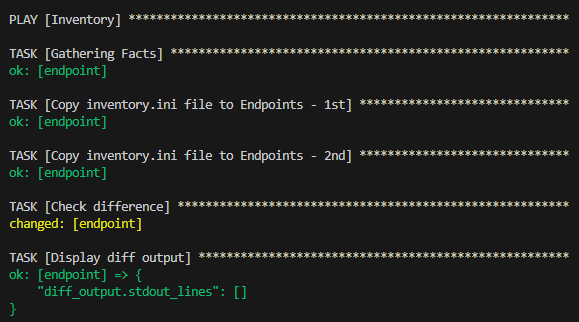

# Zajęcia 08 - Automatyzacja i zdalne wykonywanie poleceń za pomocą Ansible

## 1. Instalacja zarządcy Ansible

Tworzenie nowej maszyny wirtualnej z systemem ubuntu

Instalacja programu ```tar``` oraz serwera OpenSSH ```sshd```

```bash
    sudo apt-get update
    sudo apt-get install tar openssh-server
```
Zmiana hostname w pliku ```/etc/hostname``` na ```ansible-target```

```bash
    sudo nano /etc/hostname
```

Dodanie nowego użytkownika ```ansible```

```bash
    sudo useradd -m -s /bin/bash -G sudo ansible
```


Tworzenie migawki maszyny w Oracle VM VirtualBox

Instalacja ansible na głównej maszynie

Wymiana kluczy SSH między użytkownikami, aby możliwe było połączenie ```ssh``` .

* Ansible 
```bash
    ssh ansible@ansible-target
```


* Główna maszyna 
```bash
    ssh <user>@<hostname>
```


```bash
sudo apt install ansible
```


## 2. Inwentaryzacja

Ustalenie przewidywanych nazw komputerów

* Ansible 


* Główna maszyna 


Dodanie nazw domenowych ```DNS``` aby możliwe było łączenie bez adresów ip.

* Ansible ```/etc/hosts```


* Główna maszyna ```/etc/hosts```


* Ansible 
```bash
    ssh ansible@ansible-target
```


* Główna maszyna 
```bash
    ssh <user>@<hostname>
```


Ping otrzymuje odpowiedź oraz możliwe jest połączenie poprzez ssh pomiędzy komputerami.

Tworzenie pliku inwentaryzacji ```inventory.ini```

Stworzenie sekcji ```Orchestrators``` oraz ```Endpoints```. Wysłanie żądania ping do wszystkich maszyn.

```ini
[Orchestrators]
orchestrator ansible_host=darek ansible_user=darek

[Endpoints]
endpoint ansible_host=ansible-target ansible_user=ansible

[all:children]
Orchestrators
Endpoints
```


## 3. Zdalne wywoływanie procedur

Stworzenie [*playbooka*](https://docs.ansible.com/ansible/latest/getting_started/get_started_playbook.html) Ansible, który:
  * Wyśle żądanie `ping` do wszystkich maszyn

```yml
- name: Ping all hosts
  hosts: all
  become: false
  tasks:
    - name: Ping all hosts
      ping:
```


  * Skopiuje plik inwentaryzacji na maszynę `Endpoints`
  
```yml
- name: Inventory
  hosts: Endpoints
  become: false
  tasks:
    - name: Copy inventory.ini file to Endpoints - 1st
      copy:
        src: inventory.ini
        dest: /home/ansible/inventory_1.ini
```

  * Ponowi operację oraz porówna różnice w wyjściu



  
```yml
    - name: Copy inventory.ini file to Endpoints - 2nd
      copy:
        src: inventory.ini
        dest: /home/ansible/inventory_2.ini

    - name: Check difference
      shell: diff /home/ansible/inventory_1.ini /home/ansible/inventory_2.ini || true
      register: diff_output

    - name: Display diff output
      debug:
        var: diff_output.stdout_lines
```
  * Zaktualizuje pakiety w systemie
  


```yml
- name: Update packages and restart services
  hosts: Endpoints
  become: true
  tasks:
    - name: Update package repositories
      apt:
        update_cache: yes
      register: update_output
```

  * Zrestartuje usługi `sshd` i `rngd`


```yml
    - name: Display update output
      debug:
        msg: "{{ update_output }}"

    - name: Restart sshd service 
      systemd:
        name: sshd
        state: restarted

    - name: Restart rngd service
      service:
        name: rng-tools
        state: restarted
```

  * Przeprowadzi operacje względem maszyny z wyłączonym serwerem SSH, odpiętą kartą sieciową


```bash
    sudo systemctl stop ssh
```


  Po wyłączeniu usługi SSH na Endpoint

  


```bash
    sudo ifconfig enp0s3 down
```

  Po wyłączeniu karty sieciowej 

  Wyniki są podobne, ale przy wyłączonej karcie sieciowej trzeba dłużej poczekać na odpowiedź


# Zajęcia 09 - Pliki odpowiedzi dla wdrożeń nienadzorowanych

Instalacja Fedory z instalatora sieciowego

https://mirroronet.pl/pub/mirrors/fedora/linux/releases/39/Server/x86_64/iso/Fedora-Server-netinst-x86_64-39-1.5.iso   

Pobranie pliku odpowiedzi ```/root/anaconda-ks.cfg```

Dodanie wzmianek na temat ptrzebnych repozytoriów

```cfg
    url --mirrorlist=http://mirrors.fedoraproject.org/mirrorlist?repo=fedora-39&arch=x86_64
    repo --name=update --mirrorlist=http://mirrors.fedoraproject.org/mirrorlist?repo=updates-released-f39&arch=x86_64
```

Wyczysczenie dysku ```clearpart --all```


Ustawienie hostname ```network  --hostname=Fedora```

Rozszerzenie pliku odpowiedzi o repozytoria i oprogramowanie potrzebne do uruchomienia programu

```cfg
%post 

dnf -y install dnf-plugins-core
dnf config-manager --add-repo=https://download.docker.com/linux/fedora/docker-ce.repo

dnf install -y docker-ce docker-ce-cli containerd.io

systemctl enable docker

usermod -aG docker ignite

cat << 'EOF' > /etc/rc.d/rc.local

docker pull darkrec/sqlite:latest
docker run -d --name sqlite_container darkrec/sqlite:latest
EOF

%end

```


Utworzenie nowej maszyny i instalacja systemu z wykorzystaniem pliku ```anaconda-ks.cfg```


zastąpienie parametru quiet ścieżką do pliku w repozytorium


Automatyczna instalacja


Sqlite działa na nowo utworzonym systemie.