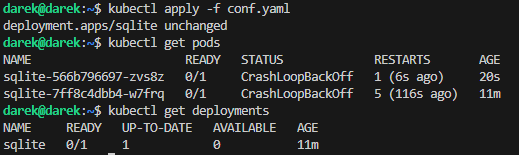

# Zajęcia 10 - Wdrażanie na zarządzalne kontenery: Kubernetes 

## 1. Instalacja klastra Kubernetes

Instalacja[*minikube*](https://minikube.sigs.k8s.io/docs/start/) zgodnie z dokumentacją ze strony . 


```bash
curl -LO https://storage.googleapis.com/minikube/releases/latest/minikube-linux-amd64
sudo dpkg -i minikube_latest_amd64.deb
```


Uruchomienie ```minikube```

```bash
minikube start
```


Instalacja narzędzi, ze względu na podpowiedzi dotyczące tego po wywołaniu komend

```bash
curl -LO "https://dl.k8s.io/release/$(curl -L -s https://dl.k8s.io/release/stable.txt)/bin/linux/amd64/kubectl"

sudo install -o root -g root -m 0755 kubectl /usr/local/bin/kubectl
```


Lista profili minikube

```bash
minikube profile list
```


Uruchomienie dashboard'a dostępnego w przeglądarce

```bash
minikube dashboard
```


Deploy aplikacji ```sqllite``` za pomocą komendy

```bash
kubectl create deployment sqlite --image=darkrec/sqlite:latest
deployment.apps/sqlite created
```


bądź za pomocą pliku ```conf.yaml```

```yaml
apiVersion: apps/v1
kind: Deployment
metadata:
  name: sqlite
spec:
  replicas: 1
  selector:
    matchLabels:
      app: sqlite
  template:
    metadata:
      labels:
        app: sqlite
    spec:
      containers:
        - name: sqlite
          image: darkrec/sqlite:latest
          ports:
            - containerPort: 80
```

```bash
kubectl apply -f conf.yaml
deployment.apps/sqlite created
```



### Podgląd uruchomionej aplikacji w Kubernetes

