# Sprawozdanie 2

---

## Część 1

## Wykonanie

1. Wybór oprogramowania

Oprogramowanie, które wybrałam zostało już przedstawione na zajęciach i jest to ```node-js-dummy-test```, czyli prosta aplikacja typu To Do stworzona przy użyciu Node.js i Express.js.

Posiada popularną otwartą licjencję Apache 2.0:
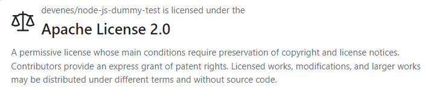

Oraz posiada własne narzędzia Makefile - ```npm``` (Node Package Manager), które jest menadżerem pakietów dla Node.js i służy do zarządzania zależnościami i skryptami.

Ostatnim koniecznym warunkiem jest posiadanie testów przez repozytorium, a te znajdują się w filderze ```src```.

Link:  https://github.com/devenes/node-js-dummy-test

Za pomocą protokołu SSH klonowałam repozytorium do utworzonego folderu:
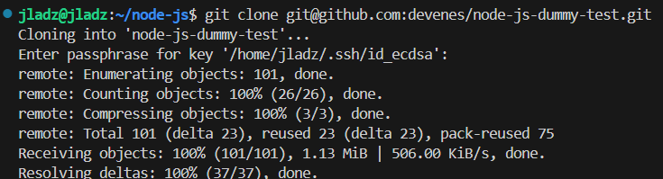

Przy budowaniu projektu z pomocą ```sudo apt install npm``` napotkałam problemy, przez które musiałam uaktualnić listę pakietów i zbudować go jeszcze raz. Mimo to przy uruchamianiu testów jednostowych brakowało mi pakietu, który musiałam doinstalować komendą ```sudo npm install jest```:
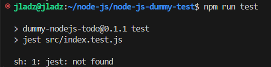
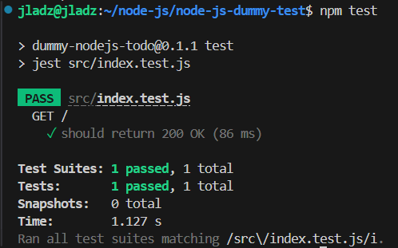

2. Przeprowadzenie buildu w kontenerze

Tworzę kontener ze środowiskiem ```node``` i łączę się z nim za pomocą TTY w celu interaktywnej pracy:

```bash
docker run -it node bash
```

Aplikacja oparta jest o Node.js i dzięki temu nie potrzebujemy żadnych dodatkowych wymagań wstępnych.

Następnie wewnątrz kontenera klonuje repozytorium, przeprowadzam build'a i wykonuje testy:

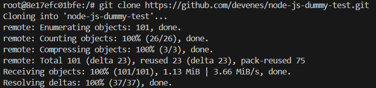
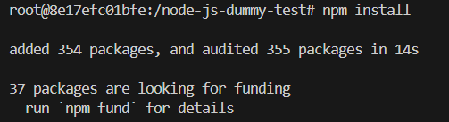
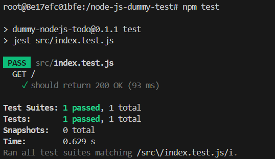

W celu automatyzacji powyższych kroków tworzę dwa pliki.

Pierwszy klonuje repozytorium, przechodzi do katalogu roboczego i wykonuje w nim build'a:

``` bash
FROM node

RUN git clone https://github.com/devenes/node-js-dummy-test.git
WORKDIR node-js-dummy-test
RUN npm install
```

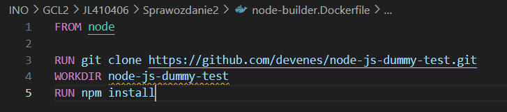

Obraz tego kontenera otrzymamy po wpisaniu komendy:

```bash
docker build -f ./node-builder.Dockerfile -t node-builder .
```

* -f określa ścieżkę do pliku
* -t nadaje nazwe zbudowanemu obrazowi


Drugi kontener uruchamia testy bazując na powstałym obrazie node-builder ze zbudowaną aplikacją.

```bash
FROM node-builder

RUN npm test
```

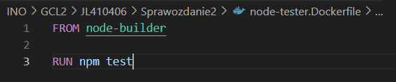

Budujemy obraz:

```bash
docker build -f ./node-tester.Dockerfile -t node-tester .
```

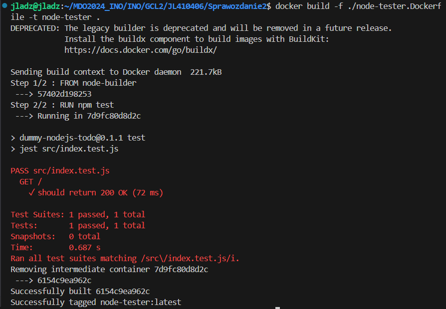

Testy wykonały się pomyślnie, a kolejny obraz został zbudowany. W razie problemów z testami obraz nie zostałby utworzony.

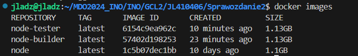

Po uruchomieniu kontenerów od razu kończą one swoje działanie, ponieważ wykonywały jednie operacje budowania i teraz zbudowany program znajdował się wewnątrz otrzymanych obrazów.

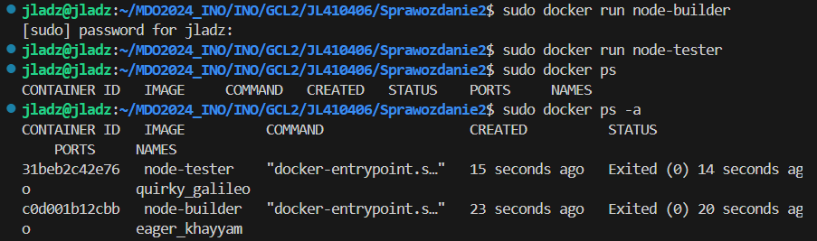

## Część 2

1. Zachowanie stanu

Przygotowywuję dwa woluminy, wejściowy i wyjściowy komendą:

```bash
docker volume create nazwa
```

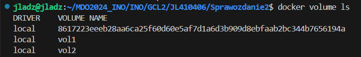

I podłączam je do kontenera bazowego node, z którego korzystałam we wcześniejszych zadaniach. posługuje się komendą:

```bash
docker run -it --rm --name node-vol --mount source=vol1,target=/vol1 --mount source=vol2,target=/vol2 node bash
```

Opcja ```--mount``` służy do montowania woluminów do kontenerów oraz określa ich ścieżki w kontenerze gdzie mają być zamontowane.

Klonowanie repozytorium na wolumin wejściowy wykonałam podpinając katalog z repozytorium sklonowanym lokalnie do woluminu. 

Aby przejść do lokalizacji woluminu przełączyłam się na konto roota i przeszłam do katalogu, gdzie sklonowałam repozytorium:

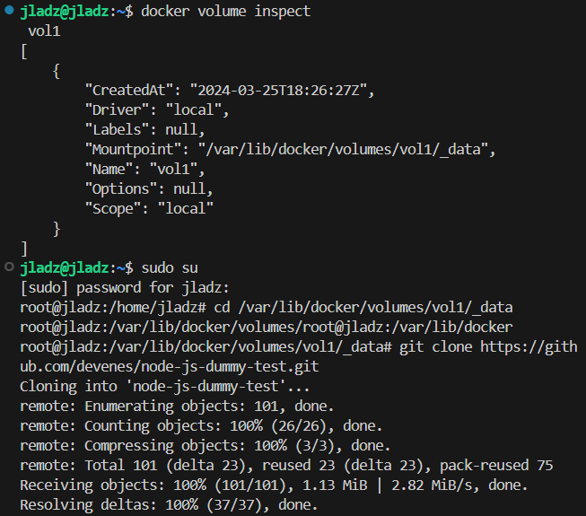

Sprawiło to, że repozytorium jest również dostępne w odpowienim folderze w kontenerze:

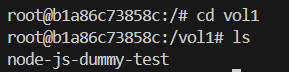

Uruchomiłam build i skopiowałam repozytorium do wnętrza kontenera za pomocą:

```bash
cp -r node-js-dummy-test/ ../
```

A wyniki zapisałam na woluminie wyjściowym, by były dostępne po wyłączeniu kontenera:

```bash
cp -r node_modules ../../vol2
```

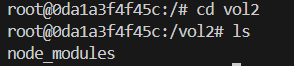

Aby kolonowanie na wolumin wejściowy przeprowadzić wewnątrz kontenera utworzyłam w woluminie wejściowym katalog i wewnątrz niego sklonowałam repozytorium podstawową komendą ```git clone```.

Powyższe kroki moglibyśmy zautomatyzować i wykonać za pomocą ```docker build``` i pliku ```Dockerfile```. Wystarczyłoby utworzyć odpowiedni plik, który zawierałby wszystkie operacje na woluminach podpinanie ich i klonowanie. 

2. Eksponowanie portu

Po zapoznaniu się z dokumentacją iperf, narzędzia służącego do pomiarów przepustowości, instaluje go na swój serwer:

```bash
apt-get install iperf3
```

A następnie uruchamiam w kontenerze za pomocą:

```bash 
iperf3 -s
```

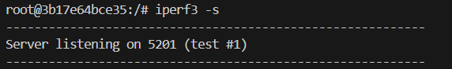

Do połączenia się z nim z drugiego kontenera muszę znać IP pierwszego, które sprawdzam komendą ```hostname -i``` i w drugim kontenerze wpisuję:

```bash
iperf3 -c 172.17.0.2
```

Otrzymałam wydajność połączenia pomiedzy serwerem a klientem:

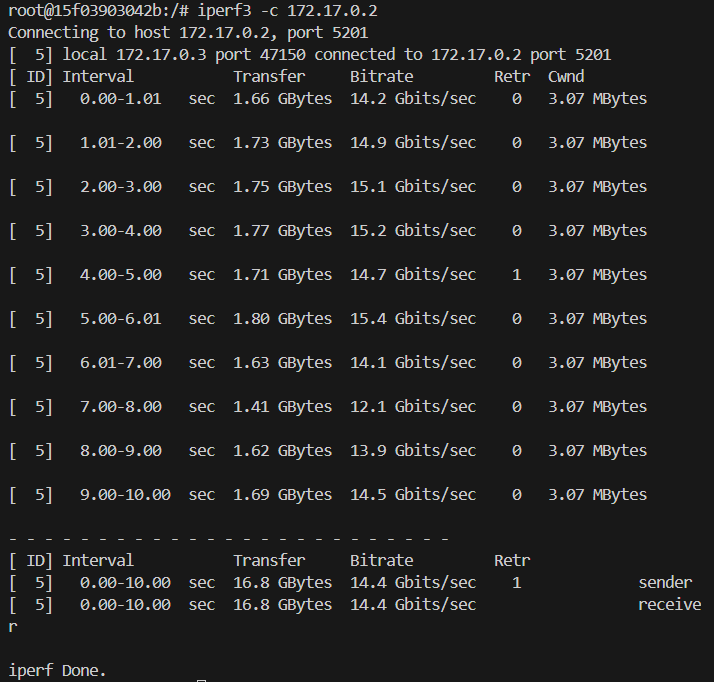
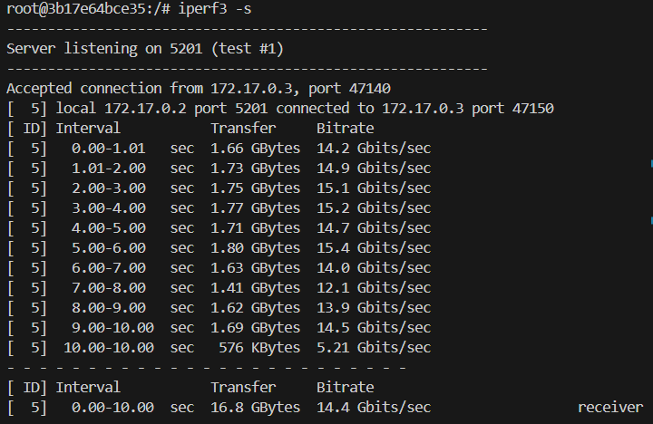

Moją dedykowaną sieć mostkową utworzyłam z wykorzystaniem komendy:

```bash
docker network create my-network
```

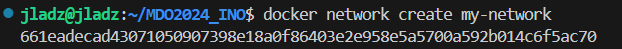

Utworzyłam dwa kontenery, które łączyłam z moja siecią i powtórzyłam kroki wykonane wyżej:

```bash
docker run -it --rm --name server --network my-network ubuntu bash 
```

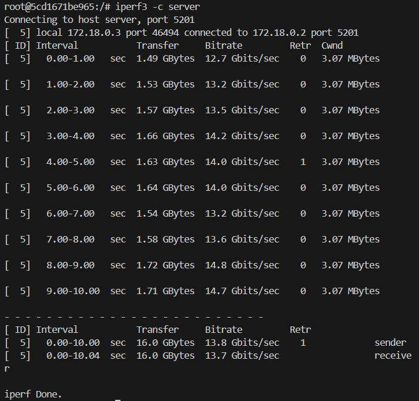
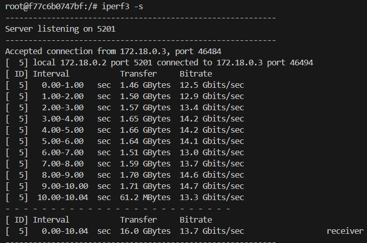

Do połączenia się z poza kontenera (z hosta lub spoza hosta) musimy uruchomić kontener z dodatkowymi opcjami.

Już przy tworzeniu innych serwerów w kontenerach mogliśmy zauważyć, że port obsługiwany przez nas to 5201, łączymy się z nim opcją ```-p```:

```bash
docker run -it --rm --name server -p 5201:5201 ubuntu bash
```

A na maszynie wirtualnej połączyć się z naszym serwerem z pozycji hosta:

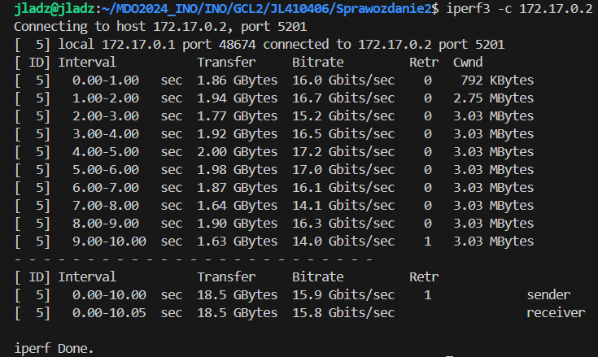

3. Instalacja Jenkins

Po zapoznaniu się z dokumentacją przeszłam do skonteneryzowanej instancji Jenkinsa.

Utworzyłam swoją sieć mostkową:

```bash
docker network create jenkins
```

Następnie pobrałam obraz dockera poprzez uruchomienie kontenera z odpowiednimi opcjami przedstawionymi w dokumentacji:

```bash
docker run --name jenkins-docker --rm --detach --privileged --network jenkins --network-alias docker --env DOCKER_TLS_CERTDIR=/certs --volume jenkins-docker-certs:/certs/client --volume jenkins-data:/var/jenkins_home --publish 2376:2376 docker:dind
```

Tworzę plik Dockerfile z odpowiednią zawartością:

```bash
FROM jenkins/jenkins:2.440.2-jdk17
USER root
RUN apt-get update && apt-get install -y lsb-release
RUN curl -fsSLo /usr/share/keyrings/docker-archive-keyring.asc \
  https://download.docker.com/linux/debian/gpg
RUN echo "deb [arch=$(dpkg --print-architecture) \
  signed-by=/usr/share/keyrings/docker-archive-keyring.asc] \
  https://download.docker.com/linux/debian \
  $(lsb_release -cs) stable" > /etc/apt/sources.list.d/docker.list
RUN apt-get update && apt-get install -y docker-ce-cli
USER jenkins
RUN jenkins-plugin-cli --plugins "blueocean docker-workflow"
```

Buduję go oraz ponownie uruchamiam kontener:

```bash
docker build -t myjenkins-blueocean:2.440.2-1 -f Jenkins.Dockerfile .
``

```bash
docker run --name jenkins-blueocean --restart=on-failure --detach --network jenkins --env DOCKER_HOST=tcp://docker:2376 --env DOCKER_CERT_PATH=/certs/client --env DOCKER_TLS_VERIFY=1 --volume jenkins-data:/var/jenkins_home --volume jenkins-docker-certs:/certs/client:ro --publish 8080:8080 --publish 50000:50000 myjenkins-blueocean:2.440.2-1
```

W celu uzyskania dostępu do serwera Jenkins muszę przekierować porty z maszyny wirtualnej do hosta, dlatego po sprawdzeniu adresu IP wchodzę w ustawienia serwera w ```Oracle VistualBox```, następnie w sieć i przekierowanie portów i dodaje nowy port:

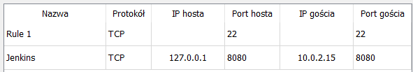

Teraz mogę uruchomić panel logowania Jenkinsa poprzez wpisane  ```localhost:8080``` w przeglądarce:

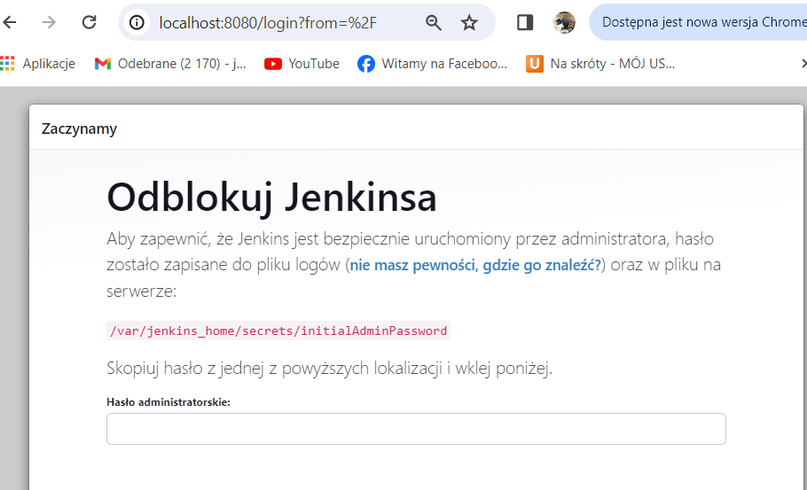