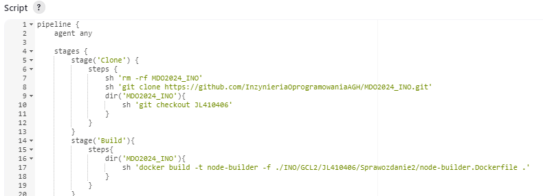

# Sprawozdanie 2

---

## Przygotowanie

W Sprawozdaniu 2 opisałam kroki instalacji Jenkinsa zgodnie z instrukcją https://www.jenkins.io/doc/book/installing/docker/. 
Po uruchomieniu go w przeglądarce i wpisaniu hasła administratora zalogowałam się i skonfigurowałam konto Jenkins. 

## Uruchomienie

W celu sprawdzenia sposobu działania oraz ćwiczeń utworzyłam projekt, któy za pomocą powłoki wyświetla uname w logach konsoli:


Następny projekt zwraca błąd, gdy godzina jest nieparzysta.


Projekt uruchomiłam o godzinie 13 i jak możemy zauważyć otrzymałam wynik negatywny:


Ostatnim zadaniem testowym przygotowującym do zadania głównego jest krótki pipeline. 
Ma na celu skonować nasze repozytorium, przejść na odpowiednią gałąź oraz zbudować obraz z dockerfila:




## Wstęp

Aplikacja, którą wybrałam była już wykorzystywana przeze mnie na poprzednich zajęciach.```node-js-dummy-test``` to prosta aplikacja typu To Do stworzona przy użyciu Node.js i Express.js.
Ważnym jej aspektem jest popularna otwarta licjencja Apache 2.0, a jej build przeprowadzałam już na serwerze jak i w kontenerze.

Forkowanie repozytorium jest niezbędną funkcją przy pracy zespołu nad rozwojem oprogramowania, wprowadzaniem zmian oraz stabilnością projektu. Z powodu prostoty aplikacji oraz akcji, które chcę wykonać postanowiłam nie wykonywać tego kroku.

Diagram aktywności, pokazujący następne etapy procesu CI:


Diagram wdrożeniowy, opisujący relacje między składnikami, zasobami i artefaktami:


## Pipeline

Biorąc pod uwagę dwa podejścia do wykonania zadania - z wykorzystaniem DIND lub budowaniem na kontenerze CI zdecydowałam się na to drugie. Docker in Docker (DIND) jest rozwiązaniem, w którym w środku Dockera działają procesy uruchomione jako kolejne Dockery. Pozwala to na pełną izolację środowiska oraz większe bezpieczeństwo w porównaniu do budowania w kontenerze CI. 
Jednakże drugie rozwiązanie jest prostsze i wymaga mniejszych zasobów, co w naszym wypadku jest wystarczające.

* stage Collect
Jest to kontener wstępny, który ma na celu przygotowanie środowiska pracy. 
Jego zadaniem jest utworzenie odpowiedniej sieci, jeśli taka nie istnieje, usunięcie starych plików repozytorium, by przy klonowaniu nie wystąpił żaden błąd związany z konfliktem wersji programu, czy pozostałościami plików, a następnie skolonowanie repozytorium oraz przejście na odpowiedni branch. Dzięki temu mamy pewność, że posiadamy najnowszą wesję kodu. 
Dodatkowo tworzy pliki przechowujące logi, czyli informacje dotycznące działania aplikacji lub wykonanych zdarzeń. Pomagają w monitorowaniu aktywności lub w diagonozowaniu problemów.

``` bash
stage('Collect') {
    steps {
        sh "docker network create node-network || true"
        sh "rm -rf MDO2024_INO"
        sh "git clone https://github.com/InzynieriaOprogramowaniaAGH/MDO2024_INO.git"
        dir("MDO2024_INO/INO/GCL2/JL410406/Sprawozdanie2"){
            sh "git checkout JL410406"
            sh "touch build.log"
            sh "touch test.log"
        }
    }
}
```

* stage Build
Buduje on obraz z odpowiedniego Dockerfile'a. Na jego podstawie możemy testować, tworzyć artefakty lub wdrażać naszą aplikację.
Logi zapisuje w uprzednio utworzonym pliku ```build.log``` oraz archiwizacje go jako artefakt.


```bash 
stage('Build') {
    steps {dir("MDO2024_INO/INO/GCL2/JL410406/Sprawozdanie2"){
            sh "docker build -t node-builder -f node-builder.Dockerfile . | tee build.log"
            archiveArtifacts artifacts: "build.log"
        }
    }
}
```

* stage Test
W tej części wykonywane są testy bazujące na powstałym obrazie node-builder ze zbudowaną w poprzednim kroku aplikacją:


``` bash
stage('Test') {
    steps {dir("MDO2024_INO/INO/GCL2/JL410406/Sprawozdanie2"){
            sh "docker build -t node-tester -f node-tester.Dockerfile . | tee test.log"
            archiveArtifacts artifacts: "build.log"
        }
    }
}
```

* stage Deploy
Deploy jest kluczowym etapem, który polega na wdrożeniu aplikacji na środowisko. Plik Dockerfile uruchamia aplikację bazując na obrazie node-builder.


Następnie usuwam stary kontener node jeśli tylko istnieje i tworzę nowy na podstawie zbudowanego obrazu, na porcie 3000 oraz łącząc go z siecią node-network.

``` bash 
stage('Deploy') {
    steps {dir("MDO2024_INO/INO/GCL2/JL410406/Sprawozdanie2"){
            sh "docker build -t node-deploy -f node-deploy.Dockerfile ."
                
            sh 'docker rm -f node || true'
            sh 'docker run -d -p 3000:3000 --name node --network node-network node-deploy'
        }
    }
}
```

* stage Publish
Etap ten ma na celu udostępnienie informacji, artefaktów jakie zostały wygenerowane w trakcie poprzednich etapów:
Przy sposobie publikacji zastanawiałam się nad wykorzystaniem archiwum tar.gz. Pozwala ono na stworzenie archiwum oraz skompresowanie go do mniejszych rozmiarów, by ułatwić przechowywanie i przesyłanie. Jednakże końcowo zdecydowałam się na publikację kontenera z obrazami. Od razu zapewnia nam izolację i spójność środowiska, a dzięki temu uniwersalność i łatwość dystrybucji. 
To zastosowania tego rozwiązania należy zalogować się do Docker Huba, następnie otagować obraz i opublikować go, wysłać do repozytorium na Docker Hubie.

``` bash
stage('Publish') {
    steps {dir("MDO2024_INO/INO/GCL2/JL410406/Sprawozdanie3"){
            sh "echo '$DOCKERHUB_TOKEN' | docker login --username jladz --password-stdin"
            sh "docker tag node-deploy jladz/node-deploy"
            sh "docker push jladz/node-deploy"
        }
    }
}
```

Porównując zaplanowane diagramy aktywności i wdrożenia, a otrzymany wynik można powiedzieć, że są do siebie zbliżone. Jedyną różnicą jest dodatnie logów i artefaktów w projekcie, których nie przemyślałam na etapie tworzenia diagramów.