# Sprawozdanie 4

---

Ansible jest otwartym oprogramowaniem służącym do automatyzacji, które może znacznie uprościć zarządzanie konfiguracją systemu, wdrażać oprogramowanie i organizować zaawansowane przepływy pracy w celu wspierania wdrażania aplikacji czy aktualizacji systemu.

## Instalacja zarządcy Ansible

* Tworzenie maszyny wirtualnej

Do zrealizowania tematu niezbędna jest druga maszyna wirtuala, posiadająca ten sam system operacyjny.

Przy tworzeniu maszyny wirtualnej popełniłam mały błąd i nadałam nazwę hosta "ansible". Dzięki komendzie:

```bash
sudo hostnamectl set-hostname ansible-target
```

zmieniłam ją i po wpisaniu ```hostname``` wyswietliła się już nowa poprawna nazwa:

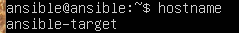

Na koniec utworzyłam migawkę maszyny.

* Instalacja oprogramowania Ansible

Na głównej maszynie uaktualniam pakiety, by uniknąć problemów z wersjami plików i instaluję ansible:

``` bash
sudo apt upgrade
sudo apt install ansible
```

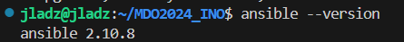

* Wymiana kluczy SSH

W celu logowania się na maszyny bez koniecznośći podawania haseł muszę utworzyć i wymienić pomiędzy nimi klucze SSH.

W pierwszej kolejności dodaję nową kartę sieciową dla obu maszyn:

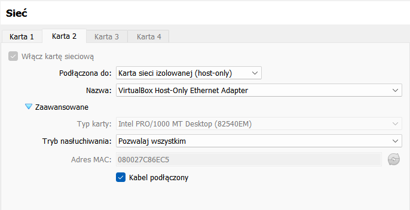

A następnie poleceniem

``` bash
sudo dhclient -1 enp0s8
```

uzyskuję adres IP za pomocą DHCP dla intefrejsu sieciowego enp0s8. Teraz mogę wygenerować klucz rsa i wymienić go pomiędzy maszynami:

``` bash
ssh-copy-id -i ~/.ssh/id_rsa ansible@192.168.56.102
```

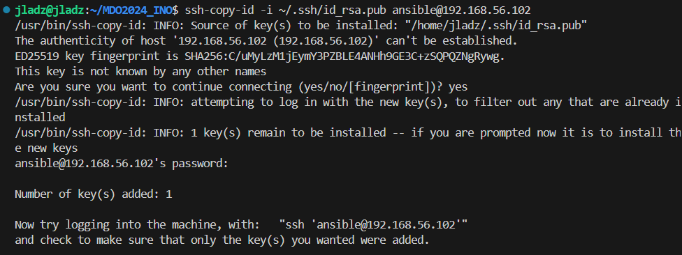

W celu sprawdzenia działania zalogowałam się na drugą maszynę z pierwszej:

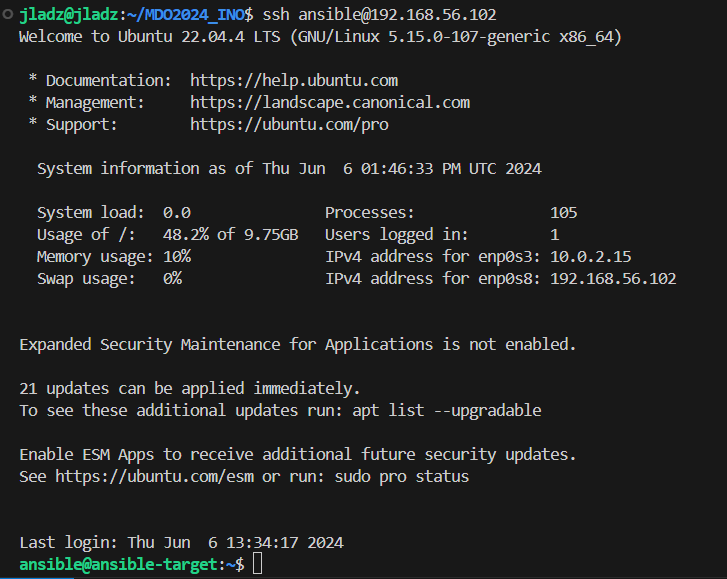

## Inwentaryzacja

* Inwentaryzacja systemów

Wykorzystując ```hostnamectl status``` sprawdzam statyczną nazwę hosta głównej maszyny:

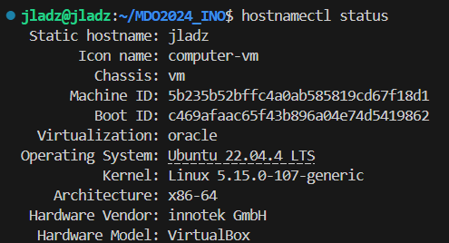

Uważam, że jest ona w porządku, dlatego nie wprowadzam zmian, a nazwa drugiej została zmieniona podczas instalacji zarządcy Ansible.

Gdy chciałam wymienić klucze pomiędzy maszynami i zamiast wpisać adres IP użyłam hostname'u maszyny napotkałam błąd. Dlatego by móc wywoływać maszynę bez konieczności wpisywania jej adresu IP należy przypisać jej nazwę DNS, dodając odpowiednie wpisy do pliku /etc/hosts:

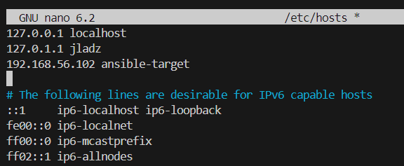

Łączność zweryfikowałam logując się na maszynę wirtualną za pomocą ```ssh ansible@ansible-target```.

Po zapoznaniu się z dokumentacją [plik inwentaryzacji](https://docs.ansible.com/ansible/latest/getting_started/get_started_inventory.html) utworzyłam plik ```inventory.ini``` i umieściłam w nim sekcje Orchestrators - zarządzającą oraz Endpoints - odbierającą:

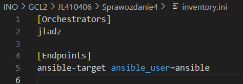

Zweryfikowałam inwentarz i wysłałam żądanie ping do maszyny Endpoints:

``` bash
ansible-inventory -i inventory.ini --list
ansible Endpoints -m ping -i inventory.ini
```

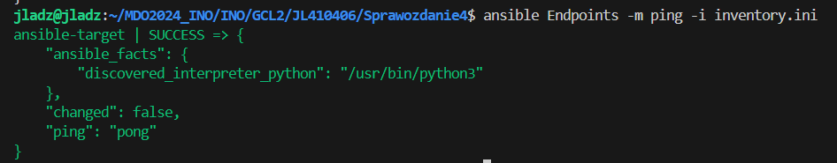

## Zdalne wywoływanie procedur

Tworzę plik ```playbook.yaml```. Playbook Ansible to plik w formacie YAML, który definiuje zestaw zadań, które mają być wykonane na zarządzanych hostach.

Ustalamy nazwę, hostów,  którzy będą wykonywać zadania, zmienną przechowywującą hasło dla super użytkownika (sudo) oraz listę zadań:

``` bash 
- name: playbook1
  hosts: Endpoints
  vars:
    ansible_become_pass: ansible 
  tasks:
```

* żądanie ping do wszystkich maszyn:

``` bash 
- name: Ping my hosts
     ansible.builtin.ping:
```

* kopiowanie pliku inwentaryzacji na maszynę Endpoints:

``` bash 
- name: Copy inventory
      copy:
      src: /home/jladz//MDO2024_INO/INO/GCL2/JL410406/Sprawozdanie4/inventory.ini
      dest: /home/ansible
```

* aktualizacja pakietów w systemie:

``` bash 
 - name: Update packages in the system
      become: yes
      package:
        name: "*"
        state: latest
```

* zrestartowanie usługi ```ssh``` i ```rngd```:

``` bash 
  - name: Restart sshd service
      become: yes
      service:
        name: sshd
        state: restarted
   - name: Restart rngd service
      become: yes
      service:
        name: rngd
        state: restarted
```

Playbooka uruchamiamy komendą:

``` bash 
ansible-playbook -i inventory.ini playbook.yaml
```

Wydruk terminala:

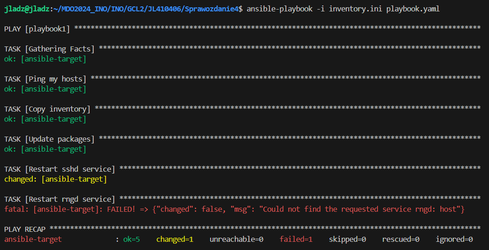

dla usługi ```rngd``` otrzymujemy błąd, ponieważ nie jest ona zainstalowana na serwerze.

Przy próbie wykonania operacji na maszynie z wyłączonym serwerem SSH otrzymałam nastęujące logi:

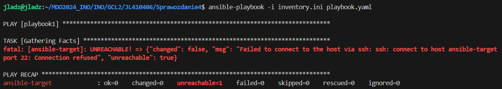

## Zarządzanie kontenerem

Drugi playbook służy do uruchomienia kontenera node-deploy wykorzystywanego na poprzednich zajęciach na maszynie ansible-target.

* Instalacja pakietu Docker:

``` bash
- name: Install Docker
      become: yes
      apt:
        name: docker
        state: present
```

* Uruchomienie usługi Docker:

``` bash
- name: Start docker
      become: yes
      systemd:
        name: docker
        state: started
        enabled: yes
```

* Skopiowanie pliku Dockerfile na zarządzanego hosta:

``` bash
- name: Copy Dockerfile
      copy:
          src: /home/jladz/MDO2024_INO/INO/GCL2/JL410406/Sprawozdanie2/node-deploy.Dockerfile
          dest: /home/ansible
```

* Budowa obrazu na podstawie skopiowanego pliku:

``` bash
- name: Build
      become: yes
      docker_image:
        name: node-deploy
        build:
          path: /home/ansible
          dockerfile: node-deploy.Dockerfile
        source: build
```

* Uruchomienie kontenera na podstawie zbudowanego obrazu:

``` bash
- name: Run
      docker_container:
        name: node-deploy
        image: node-deploy
        auto_remove: yes
        detach: yes
```

* Zatrzymanie i usunięcie kontenera:

``` bash
- name: Delete
      docker_container:
        name: node-deploy
        image: node-deploy
        state: absent
```

## Pliki odpowiedzi dla wdrożeń nienadzorowanych

Zainstalowałam system fedora stosując instalator sieciowy oraz wyciągnęłąm z niego plik odpowiedzi ```anaconda-ks.cfg```. 

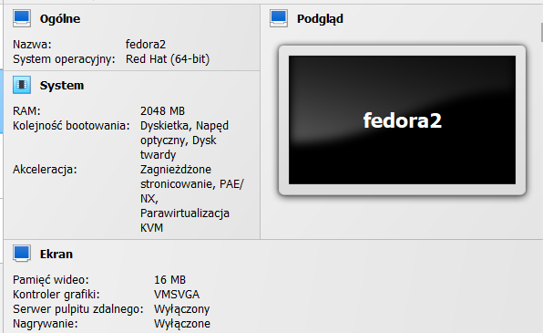

Dodałam do niego repozytorium podane w instrukcji oraz zmieniłam ustawienia formatowania dysku, by móc uruchamiać go wielokrotnie stosując ```clearpart --all```. Mój hostname ustawiony jest na "jladz".

Po przesłaniu pliku na githuba ponownie uruchomiłam instalację Fedory tym razem wykorzystując opcję "e" i dodając po ```inst.ks=``` link do mojego pliku Kickstart. Już przy wyświetlonym oknie instalacji widzimy, że wszystkie opcje zostały uzupełnione według naszego pliku odpowiedzi i po zatwierdzeniu przechodzimy do dalszej instalacji:

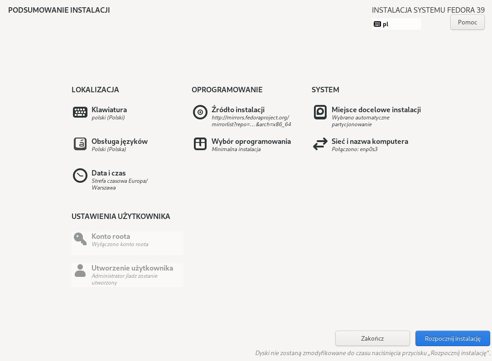