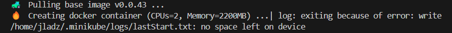

# Sprawozdanie 5

---

## Instalacja klastra Kubernetes

Korzystając ze strony [minikube](https://minikube.sigs.k8s.io/docs/start/?arch=%2Flinux%2Fx86-64%2Fstable%2Frpm+package) zaopatrzyłam się w implementację stosu k8s i przeprowadziłam instalację Minikube. Jest to narzędzie, które pozwala na łatwe uruchamianie klastra Kubernetes na lokalnym komputerze składające się tylko z jednego węzła. 

Mam pewność, że pobrałam wersję oryginalną i bezpieczną, ponieważ wykorzystałam do tego oficjalne źródło dystrybucji.


Następnie za pomocą polecenia

``` bash
minikube kubectl -- get po -A
```

wykonałam interakcję pomiędzy klastrem a serwerem Kubernetes, by zobaczyć listę wszystkich podów uruchomionych w klastrze zarządzanym przez Minikube.


Działający kontener:


Bardzo ważne jest, by upewnić się czy spełniamy wszystkie wymagania sprzętowe, ponieważ może nam to przysporzyć problemów podczas instalacji, czy dalszego korzystania z tego narzędzia. Przy pierwszej próbie instalacji otrzymałam bląd spowodowany właśnie za małą ilością miejsca na dysku:



W związku z tym musiałam wyczyścić mój dysk pozbywając się niepotrzebnych kontenerów i obrazów Docker.

Po wpisaniu komendy 

``` bash
minikube dashboard
```

uruchomiłam dashboard, który automatycznie otworzył przeglądarkę internetową i wyświetlił interfejs graficzny dashboardu:


## Analiza posiadanego kontenera

Wybrałam program ```dummy-test-js```, na którym pracowałam już na wcześniejszych zajęciach, ponieważ nadaje się do pracy w kontenerze i wyprowadza interfejs funkcjonalny przez sieć. 

Przygotowałam obraz Dockera z aplikacją, na jego podstawie uruchomiłam kontener i sprawdziłam, czy pracuje w trybie ciągłym i nie kończy swojej pracy natychmiast po wykonaniu:


## Uruchamianie oprogramowania

Aby uruchomić kontener na klastrze Kubernetes używam polecenia:

``` bash
minikube kubectl run -- <nazwa-wdrożenia> --image=<obraz-docker> --port=<wyprowadzany port> --labels app=<nazwa-wdrożenia>
```


Działający pod:


Port na którym jest moja aplikacja to 3000 i wyprowadziłam go przy tworzeniu poda. Teraz wpisując w przeglądarkę mogę uruchomić aplikację wpisując ```localhost:3000```.


Mogę też przekierować port wpisując:

``` bash
minikube kubectl port-forward pod/my-node-app 8080:3000
```


## Konwersja wdrożenia ręcznego na wdrożenie deklaratywne YAML

Zgodnie z udostępnioną dokumentacją w instrukcji zapisałam wdrożenie jako plik YML i wzbogaciłam go o 4 repliki dodając ```replicas: 4```:


Wdrożenie go rozpoczęłąm od

``` bash
kubectl apply -f mynode-deployment.yaml
```

Polecenie to czyta konfigurację z pliku i tworzy lub aktualizuje zasoby w klastrez Kubernetes. Następnie sprawdzam stan wdrożenia komendą:

``` bash
kubectl rollout status deployment
```


A dodatkowo wyniki możemy zobaczyć w dashboardzie:


## Przygotowanie nowego obrazu

Przygotowałam nową wersję Dockerfilea, dodając "error", następnie "err", "finish 1", "false" w sekcji CMD. 


Przygotowałam dwie wersje obrazu, których uruchomienie miało zakończyć się błędem, lecz za każdym razem mój pod działał, choć po uruchomieniu kontenera na serwerze kończył swoje działanie z błędem:


``` bash
docker build -f ./node-err-deploy.Dockerfile -t jladz/node-deploy:2.0 .
docker push jladz/node-deploy:2.0

minikube kubectl run -- my-node-app-2-0  --image=jladz/node-deploy:2.0 --port=3000 --labels app=my-node-app-2-0

docker run --name done-deploy-2-0 -d jladz/node-deploy:2.0
```

## Zmiany w deploymencie

Zaktualizowałam plik YAML z wdrożeniem zwiększając ilość replik do 8:


Spowodowało to utworzenie się 4 nowych podów by dorównać ilością do wymaganej liczby.

Następnie 1:


7 podów, które były nadmiarem zostało usuniętych.

do 0:


Zmieniłam wersję na nową edytując treść pliku YAML ```image: jladz/node-deploy:2.0```:


Również otrzymaliśmy niepoprawnie poprawny wynik

I wróciłam do staszej wykorzystując komendę:

``` bash
kubectl rollout undo deployment
```


## Kontrola wdrożenia

Napisałam skrypt weryfikujący, czy zdrożenie wdrożyło się przed upływem 60 sekund:


Pętla while sprawdza czy nie został spełniony warunek i aktualna sekunda nie jest równa wartości maksymalnej liczby sekund i dodatkowo przed kolejnym sprawdzeniem warunku odczekuje 5 sekund. Jeśli status zawiera komunikat o zakończeniu wdrożenia kończymy pętle z pozytywnym skutkiem.

