Kinga Kubajewska,
# Sprawozdanie 2, Zajecia 003: Dockerfiles, kontener jako definicja etapu
Cel:  Zrozumienie sposobu tworzenia obrazów Dockera za pomocą Dockerfile oraz nauka efektywnego zarządzania sieciami w Dockerze.
Kontenery Dockera stosuje się, aby uniknąć trudności związanych z instalacją zewnętrznych bibliotek i frameworków na różnych maszynach, izolując aplikacje i ich zależności od systemu operacyjnego, co zapewnia spójne środowisko uruchomieniowe i ułatwia wdrażanie aplikacji.
Dockerfile to narzędzie, które pozwala łatwo definiować konfigurację kontenerów, zawierając instrukcje do budowania obrazów, w tym instalowanie zależności, kopiowanie plików aplikacji i konfigurację środowiska.

Wybór oprogramowania na zajęcia:
Postanowiłam wykorzystać oprogramowania przedstawione na zajęciach, aby spełniały wszystkie wymogi wymienione w instrukcji. 
Które brzmią następująco:
 * dysponuje otwartą licencją
 * jest umieszczone wraz ze swoimi narzędziami Makefile tak, aby możliwe był uruchomienie w repozytorium czegoś na kształt make build oraz make test. Środowisko Makefile jest dowolne. Może to być automake, meson, npm, maven, nuget, dotnet, msbuild...
 * Zawiera zdefiniowane i obecne w repozytorium testy, które można uruchomić np. jako jeden z "targetów" Makefile'a. Testy muszą jednoznacznie formułować swój raport końcowy (gdy są obecne, zazwyczaj taka jest praktyka)
 Jest to:
 * Irssi(https://github.com/irssi/irssi) oraz node-js-dummy-test(https://github.com/devenes/node-js-dummy-test)
 Obydwa repozytoria posiadaja otwartą licencję. Makefile- są obecne wraz z możliwością uruchomienia procesu budowania i testowania poprzez komendy make build i make test.
  Proces budowy programu Irssi wykorzystuje narzędzia Meson i Ninja, natomiast proces budowy programu node-js-dummy-test wykorzystuje narzędzie npm.
  Testy: Zdefiniowane i dostępne w repozytorium, możliwe do uruchomienia jako cel w pliku Makefile (np. make test).

 ## Irsii
 ### Bulid bez kontenera
 Do sklonowania użyłam komendy:
```bash
git clone https://github.com/irssi/irssi
```

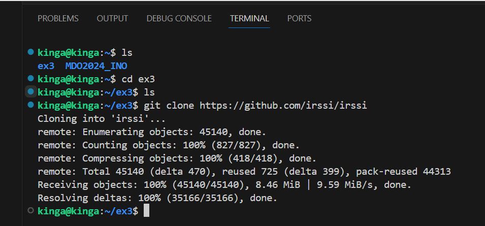
Weszłam w katalog irssi i przed budowaniem zainstalowałam mesona, cmake, pkg-config, libglib2.0-dev, czyli wszystkie potrzebne pliki do poprawnego zbudowania.
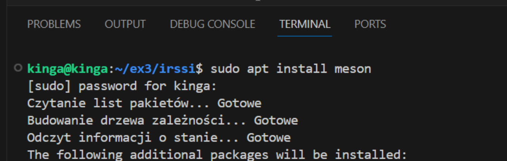
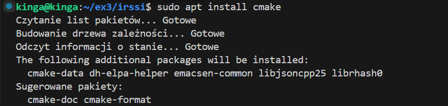
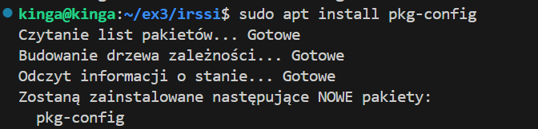
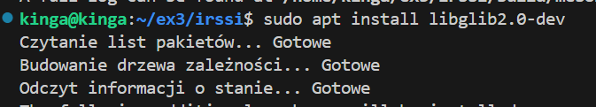

Następnie bez problemów wykonałam komendę, która uruchamia narzedzie budujące Ninja w katalogi Build:
``` bash
ninja -C home/kinga/ex3/irssi/Build
```
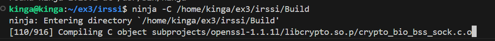
Na końcu uruchomiłam testy jednostkowe za pomocą komendy:
```bash
ninja test
```
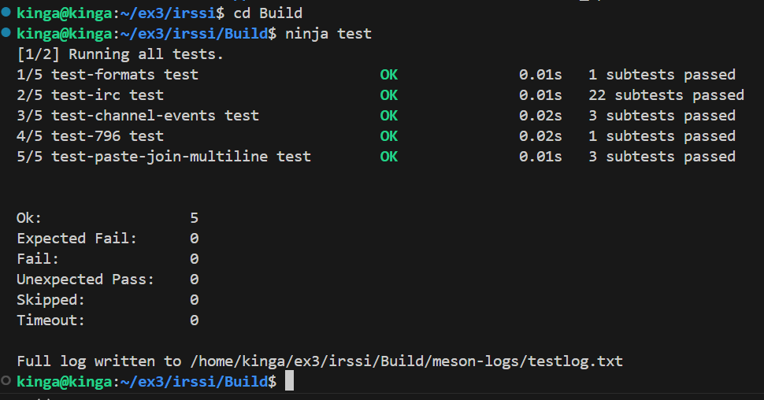

 Aby uprościć wyżej opisywany proces, możemy przeprowadzić build w kontenerze(to zabezpieczenie, że budowa i testy odbywają się w izolowanym środowisku), napisać prosty plik Dockerfile, który zawiera wszystkie potrzebne polecenia do instalacji zależności i budowy programu za pomocą jednej komendy docker build.
 ### Przeprowadzenie buildu w kontenerze
1. Wykonałam kroki `build` i `test` wewnątrz wybranego kontenera bazowego. 
Wybierałam "wystarczający" kontener -> ```fedora``` dla aplikacji C.
	* uruchomiłam kontener i podłączyłam do niego TTY celem rozpoczęcia interaktywnej pracy poprzez polecenie:
``` bash
    docker run --rm -it fedora
```    
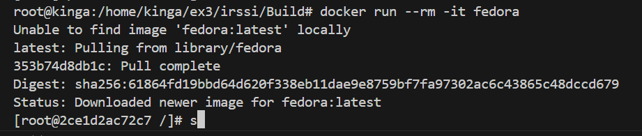
	* zaopatrzyłam kontener w wymagania wstępne 
zależności zainstalowałam poprzez:
```bash
dnf -y update ; dnf -y install git gcc meson ninja* glib2-devel utf8proc-devel
```
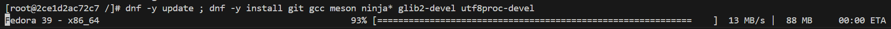
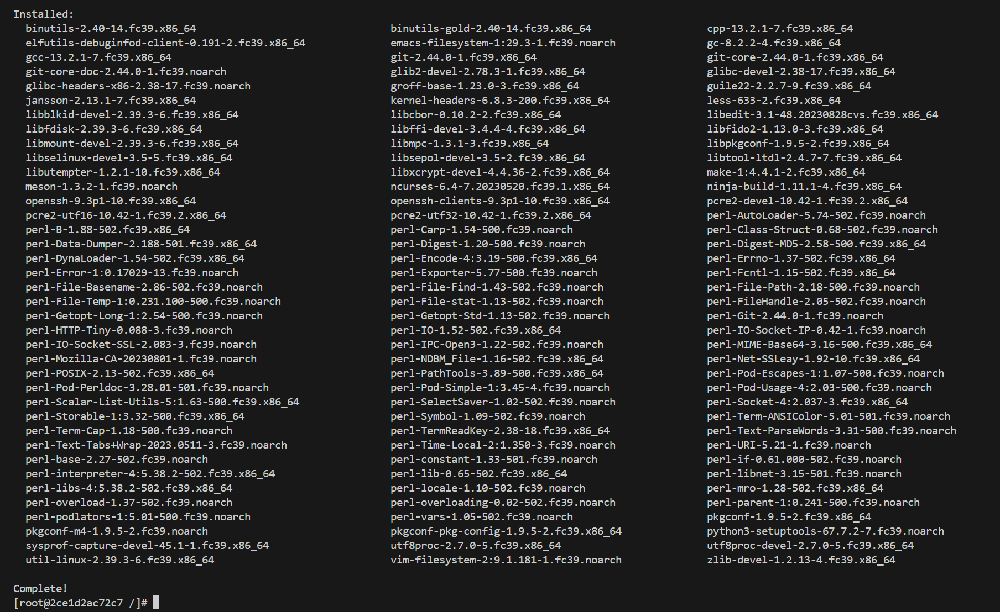
	* sklonowałam repozytorium jak poprzednio:
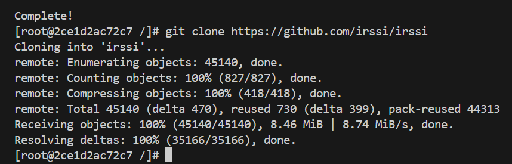

	* uruchomiłam *build* jak poprzednio
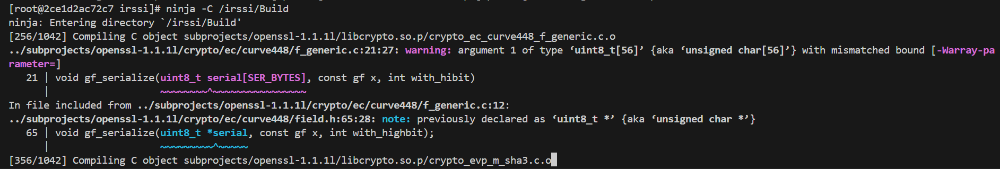
	* uruchomiłam testy:
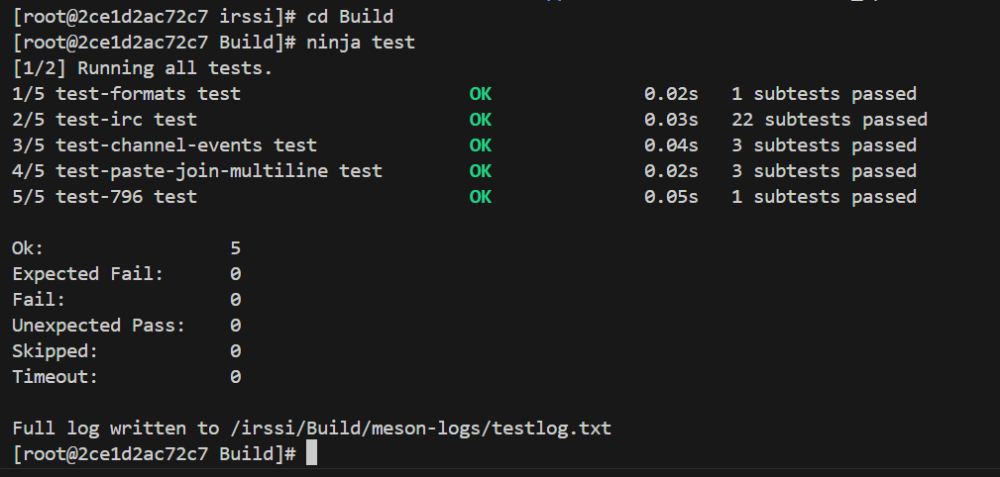

2. Stworzyłam dwa pliki `Dockerfile` automatyzujące kroki powyżej, z uwzględnieniem następujących kwestii:
	* Kontener pierwszy ma przeprowadzać wszystkie kroki aż do *builda*
    tworze plik o nazwie 'irssi.builder.Dockerfile' w którym:
```bash
    FROM fedora:
```
    określa obraz bazowy, który będzie uzywany do zdudowania nowego obrazu Dockera.
``` bash
RUN dnf -y update && \ dnf -y install git gcc meson ninja* glib2-devel utf8proc-devel ncurses* perl-Ext*
```
wykonuje aktualizację pakietów w systemie za pomocą menedżera pakietów DNF i instaluje potrzebne narzędzia i biblioteki, aby móc skompilować program Irssi.
``` bash
RUN git clone https://github.com/irssi/irssi
```
pobiera kod źródłowy programu Irssi z repozytorium na GitHubie i umieszcza go w bieżącym katalogu w kontenerze Docker.
``` bash
WORKDIR /irssi
```
ustala katalog roboczy na /irssi w kontenerze Docker.
``` bash
RUN ninja -C Build
```
Uruchamia proces budowania projektu za pomocą narzędzia Ninja w katalogu Build.

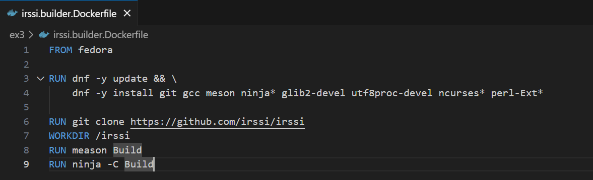
Budowa obrazu z pliku poprzez komendę:
``` bash
docker build -t irssi-builder -f ./irssi.builder.Dockerfile .
```
obraz utowrzno:
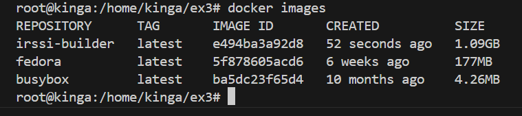
Uruchomienie kontenera za pomocą komendy run nic nie zmieni ponieważ w stworzonym pliku wykonano narazie samą budowę obrazu.
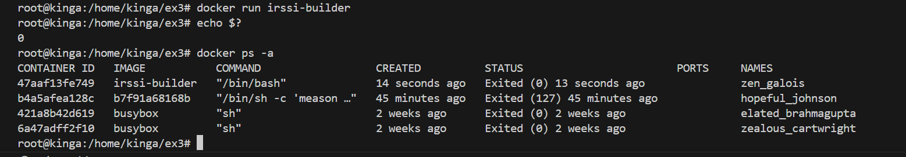

	* Kontener drugi ma bazować na pierwszym i wykonywać testy:
    Stworzono plik o nazwie irssi.test:
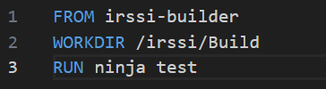
``` bash
RUN ninja test
```
Polecenie ninja test uruchamia testy, które zostały skonfigurowane wcześniej w procesie budowania.
Następnie zbudowano obraz z pliku:
```bash
docker build -t irssi-tester -f ./irssi.test.DockerFile .
```
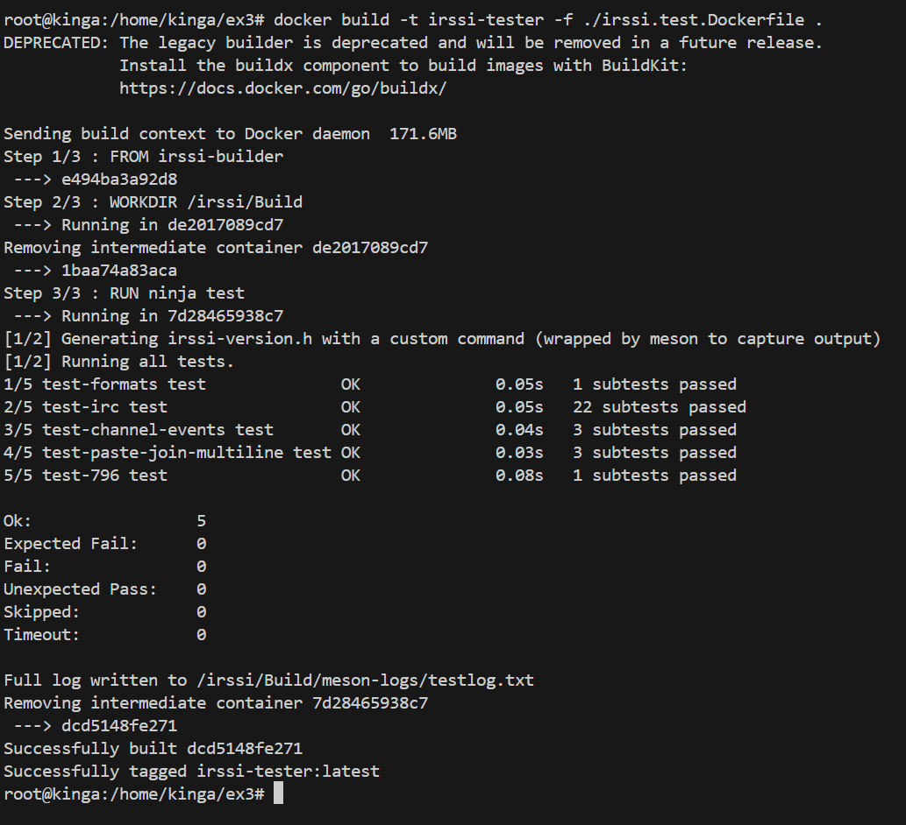

Testy zostały wykonane podczas tworzenia obrazu Docker z pliku Dockerfile. Gdy kontener zostanie uruchomiony, nie ma potrzeby ponownego uruchamiania testów, ponieważ ich wyniki zostały już uwzględnione w obrazie.

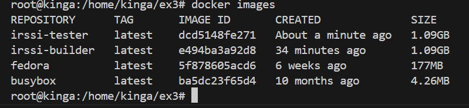
3. Wykaż, że kontener wdraża się i pracuje poprawnie. Pamiętaj o różnicy między obrazem a kontenerem. Co pracuje w takim kontenerze?
Zaczynam od uruchomienia kontenera z obrazu:
Za pomocą tego pliku Dockerfile tworzymy obraz kontenera, który zawiera wszystkie niezbędne narzędzia i zależności oraz buduje aplikację podczas procesu tworzenia obrazu, a nie podczas uruchamiania kontenera. 
 Po uruchomieniu kontenera nie wykonuje się żadna dodatkowa akcja, ponieważ obraz ten został zaprojektowany do instalacji i budowania aplikacji podczas procesu tworzenia obrazu, a nie uruchamiania kontenera.
 Nie zdefiniowano żadnych specjalnych instrukcji dla działania kontenera po jego uruchomieniu za pomocą CMD lub ENTRYPOINT. 
 Poprzez komendę:
 ```bash
 echo $?
 ```
 Sprawdzam czy poprawnie wdrożył się kontener, kod wyjścia równy zero, oznacza, że kontener został uruchomiony poprawnie.
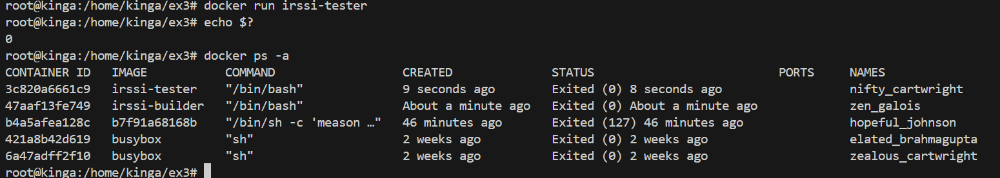
Takie same czynności wykonuje dla irssi-tester

Podczas uruchomiania kontenera nic się nie wykonuje. Tsty wykonywane są podczas budowy obrazu z pliku Dockerfile, a nie podczas uruchamiania kontenera.

## Dla node-js-dummy-test
### Build bez kontenera:
Klonowanie, instalacja pakietów zdefiniowanych w pliku package.json(nmp install) oraz wykonannie testów.
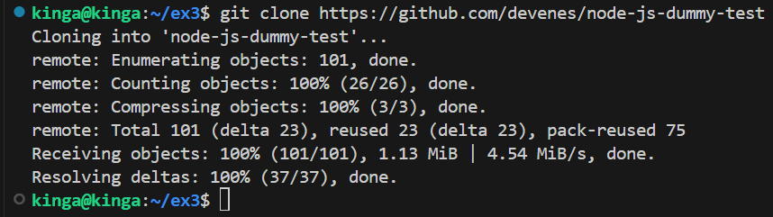
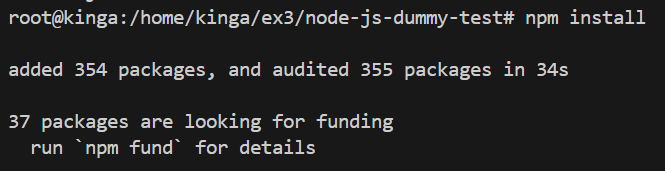
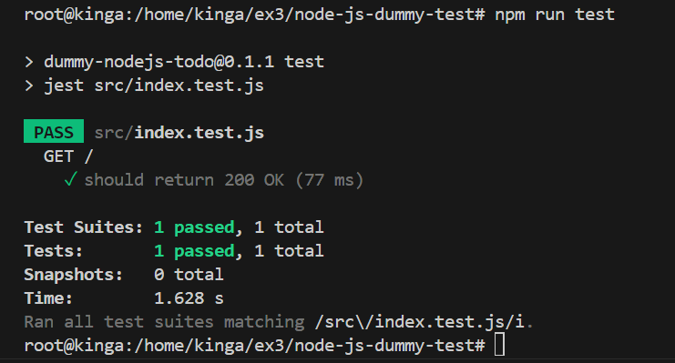

### Przeprowadzenie buildu w kontenerze
1. Wykonałam kroki `build` i `test` wewnątrz wybranego kontenera bazowego. 
Wybrałam "wystarczający" kontener ->  ```node``` dla Node.js

* uruchomiłam kontener i podłączyłam do niego TTY celem rozpoczęcia interaktywnej pracy poprzez polecenie:
```bash
docker run --rm -it node /bin/bash 
```
* nie trzeba instalować dodatkowych pakietów, ponieważ obraz Node.js sam w sobie jest kompletnym środowiskiem do pracy z aplikacjami Node.js.
* Sklonowałam repozytorium:
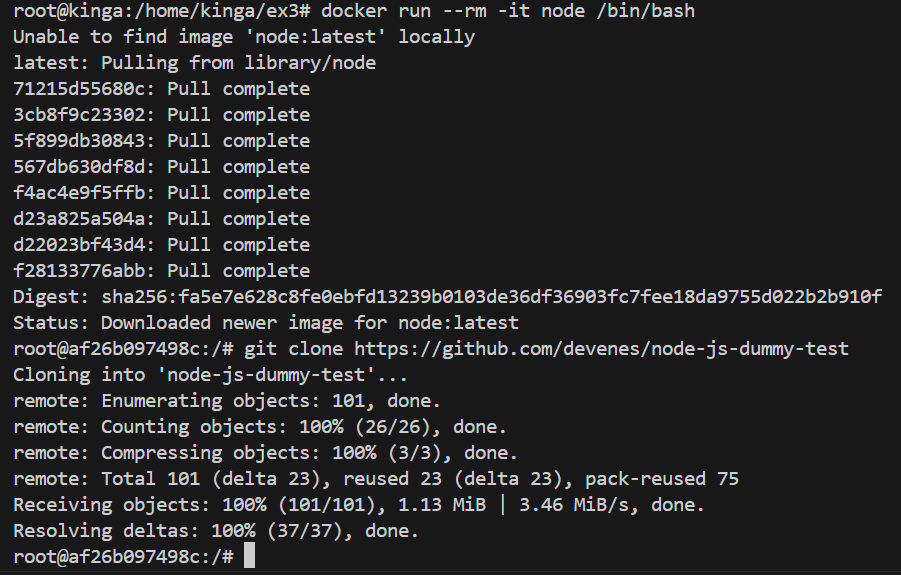
* zainstalowałam zależności nmp, uruchomiłam *build* i testy
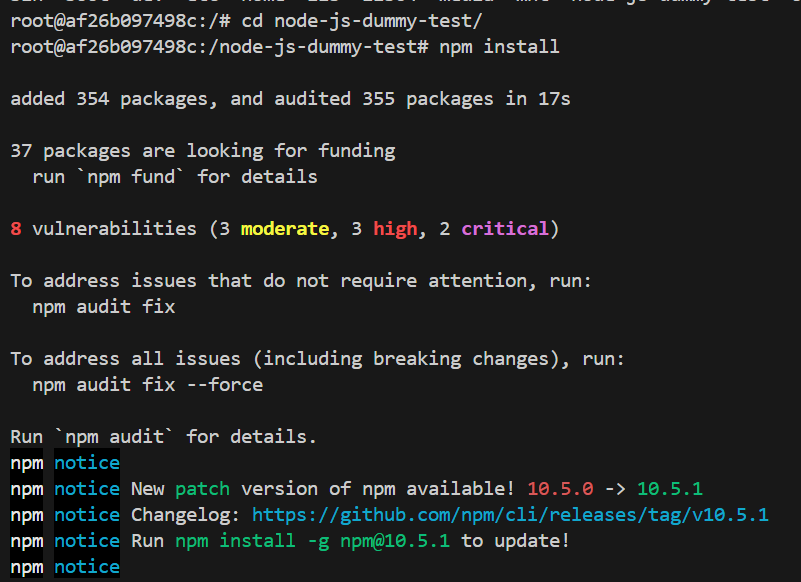
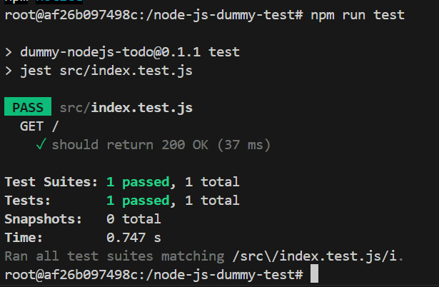


2. Stworzyłam dwa pliki `Dockerfile` automatyzujące kroki powyżej, z uwzględnieniem następujących kwestii:
	* Kontener pierwszy ma przeprowadzać wszystkie kroki aż do *builda*
    tworze plik o nazwie 'node.builder.Dockerfile' w którym:
```bash
FROM node
```
obraz Dockera będzie oparty na oficjalnym obrazie Node.js, który jest dostępny w repozytorium Docker Hub
```bash
RUN git clone https://github.com/devenes/node-js-dummy-test
```
klonuje repozytorium node-js-dummy-test z GitHuba do obrazu Docker
```bash
WORKDIR node-js-dummy-test
```
Ustawia katalog roboczy na node-js-dummy-test w kontenerze Docker. 
```bash
RUN npm install
```
pm install pobiera wszystkie zależności określone w pliku package.json
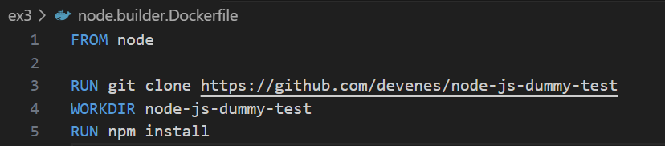

    Potem buduję obraz z pliku poprzez komendę:
``` bash
docker build -t node-builder -f ./node.builder.Dockerfile .
```
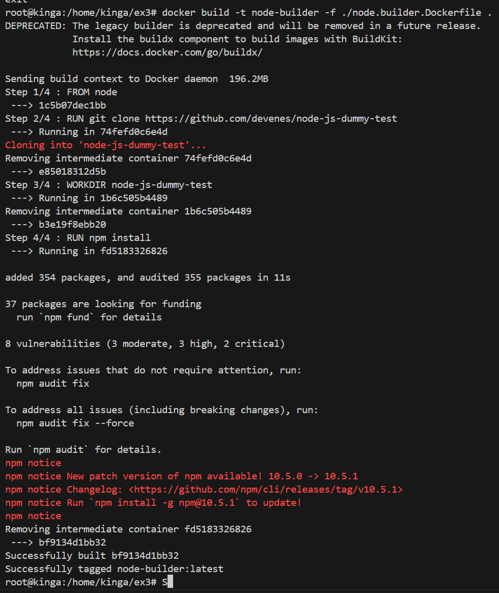

	* Kontener drugi ma bazować na pierwszym i wykonywać testy
    Stworzyłam plik o nazwie node.test:
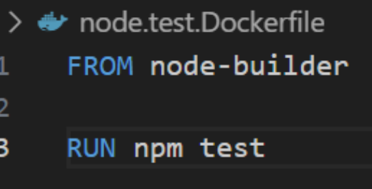 

Buduje obraz z pliku Dockerfile za pomocą komendy:
```bash
docker build -t node-tester -f ./node.test.Dockerfile .
```
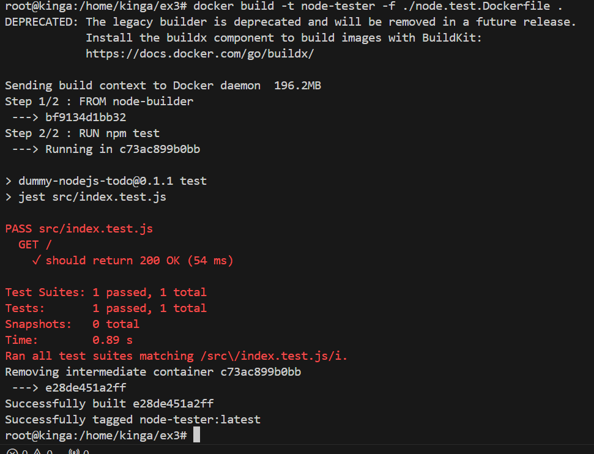 

Zbudowany został poprawnie.


3. Wykaż, że kontener wdraża się i pracuje poprawnie. Pamiętaj o różnicy między obrazem a kontenerem. Co pracuje w takim kontenerze?
Tak jak poprzednio dla irssi, wykonuje run i echo, dla plików node-builder i node-tester.
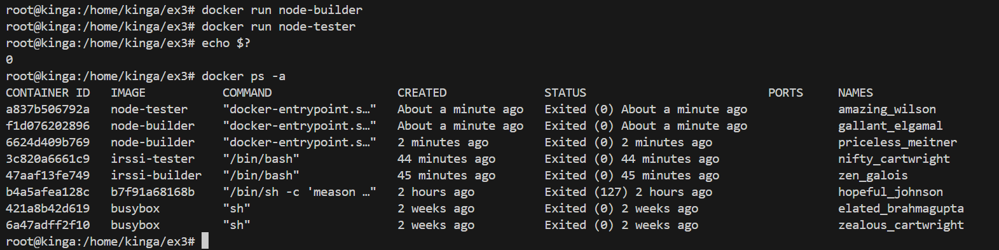

# Zajęcia 004: Dodatkowa terminologia w konteneryzacji, instancja Jenkins
## Zachowywanie stanu
Zapoznałam sie z dokumentacją: https://docs.docker.com/storage/volumes/

Woluminy umożliwiają przechowywanie danych między różnymi kontenerami oraz gwarantują trwałe przechowywanie danych nawet po zatrzymaniu lub usunięciu kontenera. 

* Przygotowałam woluminy wejściowy i wyjściowy za pomocą komendy:
```bash
docker volume create input_volume
docker volume create output_volume
```
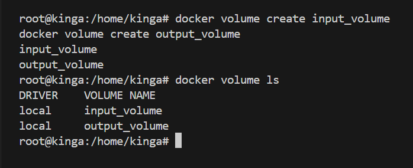

i podłączyłam je do kontenera bazowego, z którego rozpoczynałam poprzednio pracę, uruchomiłam kontener z obrazu fedora i zamontowałam dlwa woluminy poprzez polecenie:
```bash
docker run -it --name irssi_volume_container -v input_volume:/irssi -v output_volume:/irssi/Build fedora bash
```
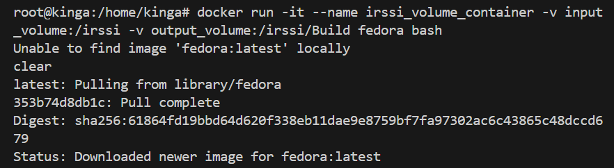

* Zainstalowałam niezbędne wymagania wstępne, ale bez gita
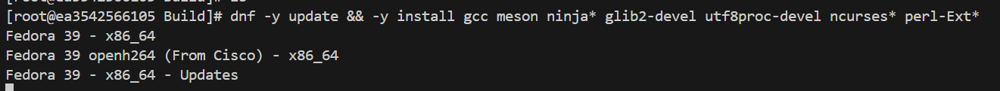
* Sklonowałam repozytorium na wolumin wejściowy:
Aby przekopiować repozytorium do woluminu wejściowego, sklonujowałam je na swoim komputerze do folderu, który jest powiązany z woluminem. W ten sposób repozytorium będzie w odpowiednim folderze w kontenerze.
W celu lokalizacji woluminu na hoście, w osobnym terminalu wykonuje:
```bash
docker volume inspect input_volume
```
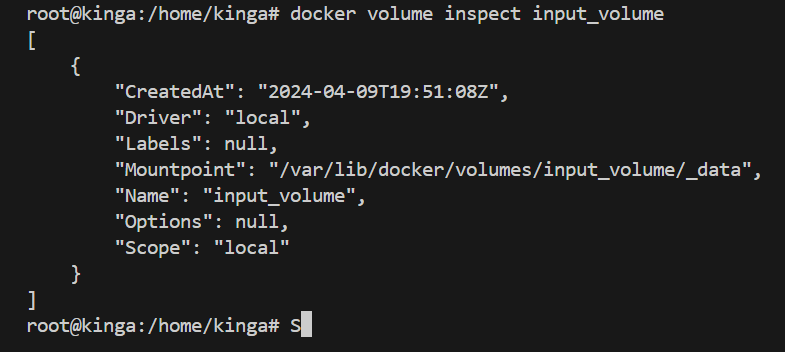
Następnie udaję sie do tego folderu i klonuje do niego repozytorium.
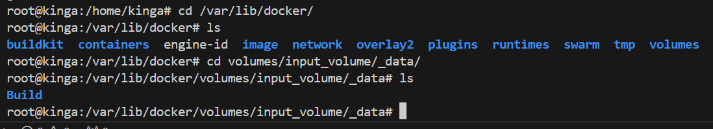
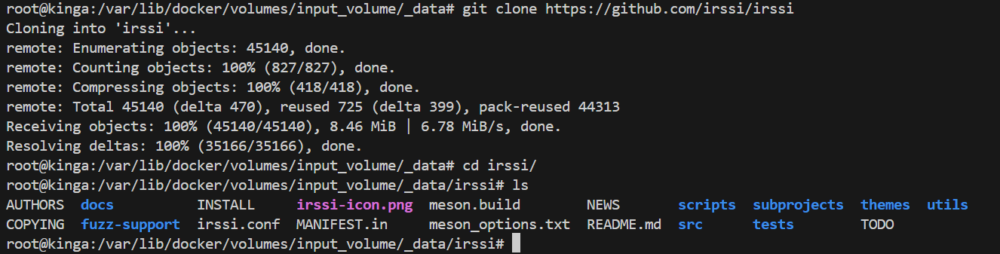
Pliki znajduja się w odpowiednim miejscu:
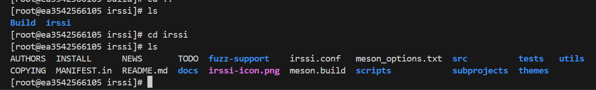

* Uruchamiam build w kontenerze:
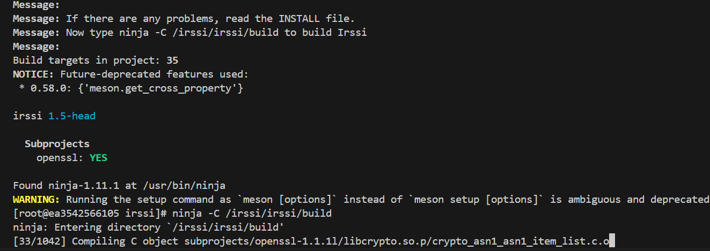
Katalog 'build' utworzył się poprawnie.
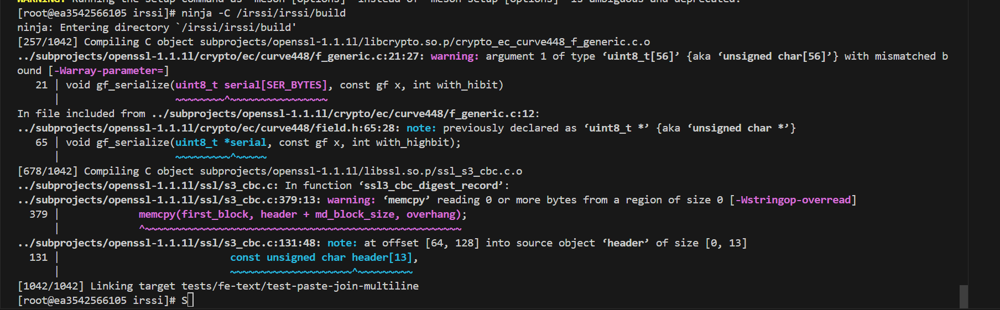

Za pomocą komendy cp -r możliwe jest skolonowanie repo do wnętrza kontenera.

* Zapisałam powstałe/zbudowane pliki na woluminie wyjściowym, tak by były dostępne po wyłączniu kontenera.
Skopiowałam katalog build, bo w nim znajdują sie zbudowae pliki, do katalogu z podpiatym woluminem wyjścionym.
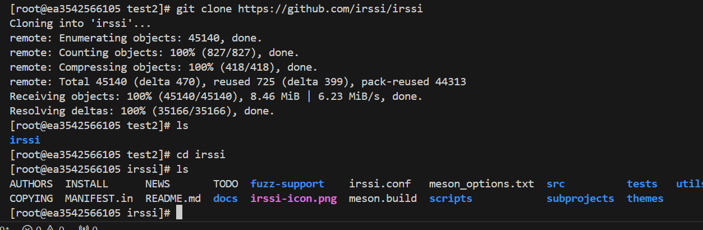

* Ponów operację, ale klonowanie na wolumin wejściowy przeprowadź wewnątrz kontenera
Aby tak sklonować trzeba utworzyć nowy folder wewnątrz kontenera w katalogu gdzie podpięty jest wolumin i tam skopiowałam repozytorium. 
* Przedyskutuj możliwość wykonania ww. kroków za pomocą docker build i pliku Dockerfile. (podpowiedź: RUN --mount)


Eksponowanie portu
Zapoznaj się z dokumentacją https://iperf.fr/
Uruchom wewnątrz kontenera serwer iperf (iperf3)
Połącz się z nim z drugiego kontenera, zbadaj ruch
Zapoznaj się z dokumentacją network create : https://docs.docker.com/engine/reference/commandline/network_create/
Ponów ten krok, ale wykorzystaj własną dedykowaną sieć mostkową. Spróbuj użyć rozwiązywania nazw
Połącz się spoza kontenera (z hosta i spoza hosta)
Przedstaw przepustowość komunikacji lub problem z jej zmierzeniem (wyciągnij log z kontenera, woluminy mogą pomóc)
Opcjonalnie: odwołuj się do kontenera serwerowego za pomocą nazw, a nie adresów IP
Instancja Jenkins
Zapoznaj się z dokumentacją https://www.jenkins.io/doc/book/installing/docker/
Przeprowadź instalację skonteneryzowanej instancji Jenkinsa z pomocnikiem DIND
Zainicjalizuj instację, wykaż działające kontenery, pokaż ekran logowania