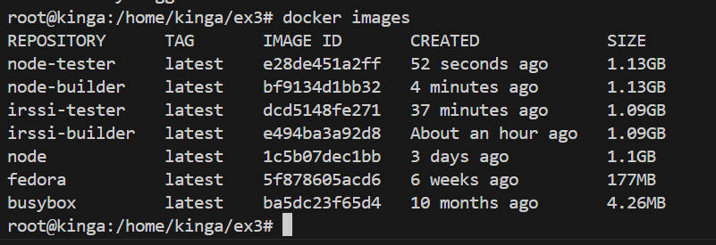

Kinga Kubajewska, Inżynieria Obliczeniowa
# Sprawozdanie 2, Zajęcia 003: Dockerfiles, kontener jako definicja etapu
Cel:  Zrozumienie sposobu tworzenia obrazów Dockera za pomocą Dockerfile oraz nauka efektywnego zarządzania sieciami w Dockerze.
Kontenery Dockera stosuje się, aby uniknąć trudności związanych z instalacją zewnętrznych bibliotek i frameworków na różnych maszynach, izolując aplikacje i ich zależności od systemu operacyjnego, co zapewnia spójne środowisko uruchomieniowe i ułatwia wdrażanie aplikacji.
Dockerfile to narzędzie, które pozwala łatwo definiować konfigurację kontenerów, zawierając instrukcje do budowania obrazów, w tym instalowanie zależności, kopiowanie plików aplikacji i konfigurację środowiska.

## Wybór oprogramowania na zajęcia:
Postanowiłam wykorzystać oprogramowania przedstawione na zajęciach, aby spełniały wszystkie wymogi wymienione w instrukcji. 
Które brzmią następująco:
 * dysponuje otwartą licencją
 * jest umieszczone wraz ze swoimi narzędziami Makefile tak, aby możliwe był uruchomienie w repozytorium czegoś na kształt make build oraz make test. Środowisko Makefile jest dowolne. Może to być automake, meson, npm, maven, nuget, dotnet, msbuild...
 * Zawiera zdefiniowane i obecne w repozytorium testy, które można uruchomić np. jako jeden z "targetów" Makefile'a. Testy muszą jednoznacznie formułować swój raport końcowy.

Jest to:

Irssi(https://github.com/irssi/irssi) oraz node-js-dummy-test(https://github.com/devenes/node-js-dummy-test)
Obydwa repozytoria posiadaja otwartą licencję. Makefile - są obecne wraz z możliwością uruchomienia procesu budowania i testowania poprzez komendy make build i make test.
Proces budowy programu Irssi wykorzystuje narzędzia Meson i Ninja, natomiast proces budowy programu node-js-dummy-test wykorzystuje narzędzie npm.
Testy: Zdefiniowane i dostępne w repozytorium, możliwe do uruchomienia jako cel w pliku Makefile (np. make test).

## Irsii
### Bulid bez kontenera:
 Do sklonowania użyłam komendy:
```bash
git clone https://github.com/irssi/irssi
```


Weszłam w katalog irssi i przed budowaniem zainstalowałam mesona, cmake, pkg-config, libglib2.0-dev, czyli wszystkie potrzebne pliki do poprawnego zbudowania.


Potem wykonałam komendę budującą:
```bash
meson build
```
Następnie wykonałam komendę, która uruchamia narzędzie budujące Ninja w katalogu Build:
``` bash
ninja -C home/kinga/ex3/irssi/Build
```


Na końcu uruchomiłam testy jednostkowe za pomocą komendy:
```bash
ninja test
```


Aby uprościć wyżej opisywany proces, możemy przeprowadzić build w kontenerze (jest to zabezpieczenie, że budowa i testy odbywają się w izolowanym środowisku), napisać prosty plik Dockerfile, który zawiera wszystkie potrzebne polecenia do instalacji zależności i budowy programu za pomocą jednej komendy docker build.
 
### Przeprowadzenie buildu w kontenerze
1. Wykonałam kroki `build` i `test` wewnątrz wybranego kontenera bazowego. 
Wybrałam "wystarczający" kontener -> ```fedora``` dla aplikacji C.
* uruchomiłam kontener i podłączyłam do niego TTY celem rozpoczęcia interaktywnej pracy poprzez polecenie:
``` bash
    docker run --rm -it fedora
```    


* zaopatrzyłam kontener w wymagania wstępne
   
Zależności zainstalowałam poprzez:
```bash
dnf -y update ; dnf -y install git gcc meson ninja* glib2-devel utf8proc-devel
```


* sklonowałam repozytorium jak poprzednio:
  


* uruchomiłam *build* jak poprzednio:
  


* uruchomiłam testy:
  


2. Stworzyłam dwa pliki `Dockerfile` automatyzujące kroki powyżej, z uwzględnieniem następujących kwestii:
* Kontener pierwszy ma przeprowadzać wszystkie kroki, aż do *builda*:

Tworzę plik o nazwie 'irssi.builder.Dockerfile' w którym:
```bash
    FROM fedora:
```
określa obraz bazowy, który będzie używany do zbudowania nowego obrazu Dockera.
``` bash
RUN dnf -y update && \ dnf -y install git gcc meson ninja* glib2-devel utf8proc-devel ncurses* perl-Ext*
```
wykonuje aktualizację pakietów w systemie za pomocą menedżera pakietów DNF i instaluje potrzebne narzędzia i biblioteki, aby móc skompilować program Irssi.
``` bash
RUN git clone https://github.com/irssi/irssi
```
pobiera kod źródłowy programu Irssi z repozytorium na GitHubie i umieszcza go w bieżącym katalogu w kontenerze Docker.
``` bash
WORKDIR /irssi
```
ustala katalog roboczy na /irssi w kontenerze Docker.
``` bash
RUN ninja -C Build
```
Uruchamia proces budowania projektu za pomocą narzędzia Ninja w katalogu Build.


Budowa obrazu z pliku poprzez komendę:
``` bash
docker build -t irssi-builder -f ./irssi.builder.Dockerfile .
```
obraz utworzono:

-t -> przypisanie nazwy obrazu,

-f -> nazwa Dockerfile do budowy obrazu,


Uruchomienie kontenera za pomocą komendy run nic nie zmieni, ponieważ w stworzonym pliku wykonano narazie samą budowę obrazu.


* Kontener drugi ma bazować na pierwszym i wykonywać testy:
  
Stworzono plik o nazwie irssi.test:


``` bash
RUN ninja test
```
Polecenie ninja test uruchamia testy, które zostały skonfigurowane wcześniej w procesie budowania.
Następnie zbudowano obraz z pliku:

```bash
docker build -t irssi-tester -f ./irssi.test.DockerFile .
```


Testy zostały wykonane podczas tworzenia obrazu Docker z pliku Dockerfile. Gdy kontener zostanie uruchomiony, nie ma potrzeby ponownego uruchamiania testów, ponieważ ich wyniki zostały już uwzględnione w obrazie.
Takie rozwiązanie pozwala zautomatyzować proces uruchamiania testów, poprzez bazowanie na wcześniej utworzonym obrazie, dodatkowo nie ma potrzeby od nowa tworzenia procesu budowania.


3. Wykaż, że kontener wdraża się i pracuje poprawnie. Pamiętaj o różnicy między obrazem a kontenerem. Co pracuje w takim kontenerze?
   
Zaczynam od uruchomienia kontenera z obrazu:
```bash
docker run irssi-builder
```
Za pomocą tego pliku Dockerfile tworzymy obraz kontenera, który zawiera wszystkie niezbędne narzędzia i zależności oraz buduje aplikację podczas procesu tworzenia obrazu, a nie podczas uruchamiania kontenera, dodatkowo nie zdefiniowałam żadnych specjalnych instrukcji dla działania kontenera po jego uruchomieniu za pomocą CMD lub ENTRYPOINT, dlatego też po powyższej komendzie nie wykonuje się żadna dodatkowa akcja.

Poprzez komendę:
```bash
echo $?
```
Sprawdzam czy poprawnie wdrożył się kontener, kod wyjścia równy zero, oznacza, że kontener został uruchomiony poprawnie.


Takie same czynności wykonuje dla irssi-tester:


Podczas uruchomiania kontenera nic się nie wykonuje. Testy wykonywane są podczas budowy obrazu z pliku Dockerfile, a nie podczas uruchamiania kontenera.

## Node-js-dummy-test
### Build bez kontenera:

Klonowanie, instalacja pakietów zdefiniowanych w pliku package.json(nmp install) oraz wykonannie testów.


### Przeprowadzenie buildu w kontenerze

1. Wykonałam kroki `build` i `test` wewnątrz wybranego kontenera bazowego. 
Wybrałam "wystarczający" kontener ->  ```node``` dla Node.js

* uruchomiłam kontener i podłączyłam do niego TTY celem rozpoczęcia interaktywnej pracy poprzez polecenie:
```bash
docker run --rm -it node /bin/bash 
```
* nie trzeba instalować dodatkowych pakietów, ponieważ obraz Node.js sam w sobie jest kompletnym środowiskiem do pracy z aplikacjami Node.js.
* Sklonowałam repozytorium:
  


* zainstalowałam zależności nmp, uruchomiłam *build* i testy:
  


2. Stworzyłam dwa pliki `Dockerfile` automatyzujące kroki powyżej, z uwzględnieniem następujących kwestii:
* Kontener pierwszy ma przeprowadzać wszystkie kroki aż do *builda*:
  
Tworzę plik o nazwie 'node.builder.Dockerfile' w którym:
```bash
FROM node
```
obraz Dockera będzie oparty na oficjalnym obrazie Node.js, który jest dostępny w repozytorium Docker Hub
```bash
RUN git clone https://github.com/devenes/node-js-dummy-test
```
klonuje repozytorium node-js-dummy-test z GitHuba do obrazu Docker
```bash
WORKDIR node-js-dummy-test
```
ustawia katalog roboczy na node-js-dummy-test w kontenerze Docker. 
```bash
RUN npm install
```
npm install pobiera wszystkie zależności określone w pliku package.json


Potem buduję obraz z pliku poprzez komendę:

``` bash
docker build -t node-builder -f ./node.builder.Dockerfile .
```


* Kontener drugi ma bazować na pierwszym i wykonywać testy:
Stworzyłam plik o nazwie node.test:

 

Buduje obraz z pliku Dockerfile za pomocą komendy:
```bash
docker build -t node-tester -f ./node.test.Dockerfile .
```
 

Zbudowany został poprawnie, świadczy to o tym, że podczas budowy testy wykonały się poprawnie.



3. Wykaż, że kontener wdraża się i pracuje poprawnie. Pamiętaj o różnicy między obrazem a kontenerem. 
Tak jak poprzednio dla irssi, wykonuje run i echo, dla plików node-builder i node-tester.


# Zajęcia 004: Dodatkowa terminologia w konteneryzacji, instancja Jenkins
## Zachowywanie stanu
* Zapoznałam sie z dokumentacją: https://docs.docker.com/storage/volumes/

Woluminy umożliwiają przechowywanie danych między różnymi kontenerami oraz gwarantują trwałe przechowywanie danych nawet po zatrzymaniu lub usunięciu kontenera. 

* Przygotowałam woluminy wejściowy i wyjściowy za pomocą komendy:

```bash
docker volume create input_volume
docker volume create output_volume
```


i podłączyłam je do kontenera bazowego, z którego rozpoczynałam poprzednio pracę, uruchomiłam kontener z obrazu fedora i zamontowałam dwa woluminy poprzez komendę:

```bash
docker run -it --name irssi_volume_container -v input_volume:/irssi -v output_volume:/irssi/Build fedora bash
```


* Zainstalowałam niezbędne wymagania wstępne, bez gita:
  


* Sklonowałam repozytorium na wolumin wejściowy:
  
Aby przekopiować repozytorium do woluminu wejściowego, sklonwałam je na hoście do folderu, który jest powiązany z woluminem. W ten sposób repozytorium będzie w odpowiednim folderze w kontenerze.

W celu lokalizacji woluminu na hoście wykonuje:

```bash
docker volume inspect input_volume
```


Przechodzę do tego folderu i klonuje do niego repo.


Pliki znajdują się w odpowiednim miejscu:


* Uruchamiam build w kontenerze:
  


Katalog 'build' utworzył się poprawnie.


* Zapisałam powstałe pliki na woluminie wyjściowym, tak by były dostępne po wyłączniu kontenera.
  
Skopiowałam katalog build, bo w nim znajdują sie zbudowane pliki, do katalogu z podpiętym woluminem wyjściowym. Katalog znajduję się w odpowiednim miejscu.


* Ponowiłam operację, ale klonowanie na wolumin wejściowy przeprowadziłam wewnątrz kontenera.
  
Aby tak sklonować trzeba utworzyć nowy folder wewnątrz kontenera w katalogu gdzie podpięty jest wolumin i tam skopiować repozytorium.


* Wykonanie ww. kroków za pomocą docker build i pliku Dockerfile, jest możliwe.
  
W tym celu należy w pliku Dockerfile umieścić instrukcje montujące woluminy wejsciowy i wyjściowy:
```bash
RUN --mount type=bind,source=/var/lib/docker/volumes/volume_in,target=/input
RUN --mount type=bind,source=/var/lib/docker/volumes/volume_out,target=/output
```
Pierwsza linia montuje wolumin wejściowy z lokalizacji /var/lib/docker/volumes/volume_in do katalogu /input w kontenerze, a druga linia montuje wolumin wyjściowy z lokalizacji /var/lib/docker/volumes/volume_out do katalogu /output w kontenerze.

## Eksponowanie portu

* Zapoznałam się z dokumentacją https://iperf.fr/.

* Uruchomiłam wewnątrz kontenera serwer iperf (iperf3).
  
Pracę rozpoczełam od uruchomienia kontenera z obrazu ubuntu poprzez komendę:
```bash
sudo docker run -it --rm --name iperf-serv ubuntu /bin/bash
```


Potem zainstalowałam na nim iperf3 poprzez:
```bash
apt install iperf3
```


Uruchomienie nastąpiło poprzez komendę:
```bash
iperf3 -s
```


to wszytsko powtórzyłam na uruchomionym drugim kontenerze - klienta.

Aby połączyć się z nim z drugiego kontenera, sprawdziłam adres serwera za pomocą komendy:

```bash
docker inspect iperf-serv
```


Łączenie następuję poprzez komendę:

```bash
iperf3 -c <adres>
```
Klient:


Serwer:


* Zapoznałam się z dokumentacją network create: https://docs.docker.com/engine/reference/commandline/network_create/
  
* Połączyłam się, ale wykorzystując własną dedykowaną sieć mostkową.
  
Tworzę sieć:

```bash
docker network create -d bridge siec_lokalna
```
Uruchamiam dwa kontenery z obrazu ubuntu poprzez:

```bash
docker run --rm -it --network siec_lokalna --name serwer ubuntu /bin/bash
docker run --rm -it --network siec_lokalna --name klient ubuntu /bin/bash
```


Następuje automatyczne pobranie adresu IP przez system - więc nie trzeba ręcznie szukać ani wpisywać, tak jak poprzednio, zatem komenda wygląda następująco:

```bash
iperf3 -c serwer
```


Sprawdziłam stan sieci:

```bash
docker network inspect siec_lokalna
```


Kontenery zostały połączone z moją siecią ich adresy to 172.18.0.2 i 172.18.0.3.

* Spróbowałam połączenia spoza kontenera.

Do uruchomienia kontenera użyłam polecenia:
```bash
docker run -it --rm --network siec_lokalna --name serwer -p 5201:5201 --mount source=output_volume,target=/logs ubuntu bash
```
Do podłączenia użyłam komendy iperf3 -c co widać na poniższym screenie, ale niestety nie udało mi się połaczyć, bo otrzymałąm nastepujący błąd:


* Przedstawiam przepustowość komunikacji dla:

Połączenia dwóch kontenerów przez domyślną sieć Dockera: 9.22 Gbits/s
oraz 
Połączenia dwóch kontenerów przez własną dedykowaną sieć mostkową: 12.8 Gbits/s

* Logi z kontenera:
  
W celu zapisania logów do wolumina podłączonego do kontenera, należy po utworzeniu wolumina uruchomić kontener z podłączonym woluminem, za pomocą komendy:

```bash
docker run -d --name nazwa --mount source=volumin,target=/sciezka/w/kontenerze obraz_kontenera
```
Następnie za pomocą polecenia find możemy znależć logi.

## Instancja Jenkins
* Zapoznałam się z dokumentacją: https://www.jenkins.io/doc/book/installing/docker/

* Przeprowadziłam instalację skonteneryzowanej instancji Jenkinsa z pomocnikiem DIND:

Utworzyłam sieć mostkową:
```bash
docker network create jenkins
```


Uruchomiłam kontener z DIND:

```bash
docker run \
 --name jenkins-docker \
 --rm \
 --detach \
 --privileged \
 --network jenkins \
 --network-alias docker \
 --env DOCKER_TLS_CERTDIR=/certs \
 --volume jenkins-docker-certs:/certs/client \
 --volume jenkins-data:/var/jenkins_home \
 --publish 2376:2376 \
 docker:dind \
 --storage-driver overlay2
```

* Inicjalizuje instację.

Za pomocą utworzonego pliku jenkins.Dockerfile, którego treść wygląda następująco:

```bash
FROM jenkins/jenkins:2.440.2-jdk17
USER root
RUN apt-get update && apt-get install -y lsb-release
RUN curl -fsSLo /usr/share/keyrings/docker-archive-keyring.asc \
https://download.docker.com/linux/debian/gpg
RUN echo "deb [arch=$(dpkg --print-architecture) \
signed-by=/usr/share/keyrings/docker-archive-keyring.asc] \
https://download.docker.com/linux/debian \
$(lsb_release -cs) stable" > /etc/apt/sources.list.d/docker.list
RUN apt-get update && apt-get install -y docker-ce-cli
USER jenkins
RUN jenkins-plugin-cli --plugins "blueocean docker-workflow"
```
buduje nowy obraz poprzez komendę:

```bash
docker build -t myjenkins-blueocean:2.440.2-1 -f jenkins.Dockerfile .
```


Następnie uruchamiam kontener Jenkinsa:


Chcąc uzyskać dostęp do serwera Jenkinsa, który działa na mojej wirtualnej maszynie, muszę przekierować odpowiednie porty z wirtualnej maszyny do systemu gospodarza. Najpierw sprawdzam IP hosta:


W VirtualBox przekierowuje porty:


Na koniec wystarczy, że wpiszę w przeglądarce localhost:8080, aby pokazać ekran logowania:


