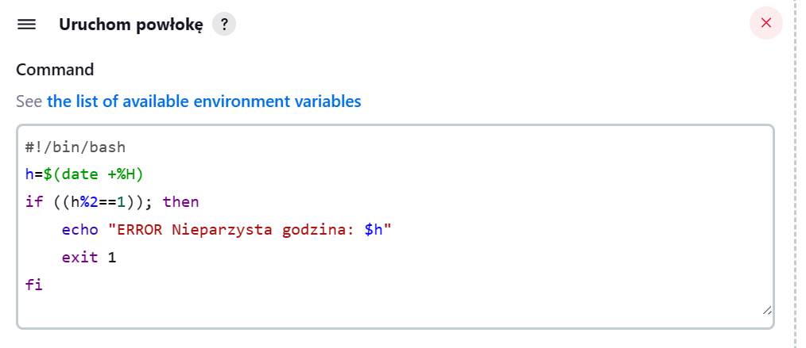

# Sprawozdanie 3
Kinga Kubajewska, Inżynieria Obliczeniowa, GCL2
## Pipeline, Jenkins, izolacja etapów
### Cel ćwiczenia:
Zajęcia miały na celu wykorzystanie Dockera i Jenkinsa do usprawnienia procesu tworzenia oprogramowania poprzez automatyzację. Naszym zadaniem było ułożenie "pipelina" - zestawu kroków, które wykonują się automatycznie, prowadząc nas przez etapy budowania, testowania i wdrażania aplikacji. Składa się on z różnych etapów, takich jak pobieranie kodu źródłowego, kompilacja, testowanie oraz przenoszenie aplikacji do różnych środowisk. To wszystko po to, by zapewnić szybkie iteracje i bezpieczne wdrożenia, zawsze z raportowaniem wyników na końcu trasy.
### Przebieg ćwiczenia 005:
Proces instalacji Jenkinsa przebiegał zgodnie z zamieszczoną na stronie instrukcją, opisany został w poprzednim sprawozdaniu.
### Proste projekty w Jenkins:
* Konfiguracja wstępna i pierwsze uruchomienie:
  * Utworzyłam projekt, który wyświetla nazwę systemu operacyjnego i nazwę użytkownika:
W tym celu kliknęłam w nowy projekt na stronie Jenkins. W konfiguracji wybrałam opcję **kroki budowania**, oraz wybrałam uruchom powłokę. Wpisałam komendę **whoami** oraz **uname -a**, aby wypisać wyżej wymienione informacje.
Po wykonaniu otrzymałam następujące logi:


  * Utworzyłam projekt, który zwraca błąd, gdy godzina jest nieparzysta:
    
W krokach budowania powłokę uzupełniłam kodem:



Po uruchomieniu otrzymałam logi konsoli:


* Sugerując się wskazówkami podanymi na labolatorium, nie tworzyłam kolejnego projektu tylko odrazu zaczęłam od pierwszego pipelinu, który:
  * sklonował nasze repozytorium,
  * przeszedł na moją osobistą gałąź,
  * zbudował obraz z dockerfile'a.
  
 

Po wykonaniu otrzymałam następujące logi:


### Wstęp
Na wstępie chciałam zaznaczyć, że byłam zmuszona przenieść się na inne urzadzęnie, gdyż stan pamięci i procesora poprzedniego komputera ZNACZNIE wydłużał pracę.
Na nowym urządzeniu postanowiłam przenieść się na Fedore, kierując się zapewnieniami, że pracuje się na niej lepiej, niż na Ubuntu. Po ponownym zainstalowaniu Jenkinsa, wybrałam repozytorium do dalszej pracy.
Oto link do repozytorium:

```
https://github.com/irssi/irssi.git
```

Wymagania wstępne środowiska:
Repozytorium to zawiera kod źródłowy aplikacji o nazwie Irssi.
Jest to otwarte oprogramowanie, które korzysta z licencji GNU General Public License v2.0 (GPL-2.0), która potwierdza możliwość swobodnego korzystania z kodu, w tym jego modyfikowania, dystrybuowania i wykorzystywania w różnych celach, zgodnie z warunkami tej licencji. 

  * Utworzyłam diagram aktywności:
    


  * Następnie utworzyłam diagram wdrożeniowy:
    


### Pipeline
Pierwszy krok, który nazwałam "Prepare" ma na celu przygotowanie środowiska pracy do dalszych działań, w skład czego wchodzą następujące kroki: usunięcie starego katalogu, clone repozytorium przedmiotu i checkout na moją gałąź.


Wykonało się poprawnie:


Następnie postanowiłam utworzyć pliki, w których przechowywane będą logi z etapów build i test.


Uruchomiłam:


* Zdefiniowałam pipeline korzystający z kontenerów celem realizacji kroków `build -> test`
Treść pipeline'u wygląda następująco:
  


Składa się on z komendy, która buduje obraz Dockerowy do której dopisałam polecenie tee, które przekierowuje zarówno wyjście standardowe, jak i błędy procesu budowania do wcześniej utworzonego pliku "b.log", jednocześnie wyświetlając je na standardowym wyjściu. Dzięki temu można śledzić postęp budowania obrazu oraz zapisywać logi w pliku.

```
docker build -t build_container -f Dockerfile_build . | tee b.log
```
W drugiej linijce:

```
 archiveArtifacts artifacts: "b.log"
```
Zaimplementowałam archiwizacje artefaktów.

Główną funkcjonalną różnicą między wykorzystaniem DIND, a budowaniem na kontenerze CI bez użycia dedykowanego kontenera DIND  jest to, gdzie faktycznie odbywa się budowanie i testowanie aplikacji.
Pierwsze podejście, czyli w przypadku wykorzystania DIND, tworzony jest oddzielny kontener Docker wewnątrz innego kontenera Docker, czyli wewnątrz kontenera Jenkinsa. Ten dodatkowy kontener Docker (DIND) umożliwia budowanie obrazów Dockerowych oraz uruchamianie kontenerów Docker wewnątrz kontenera Jenkinsa. Jest to przydatne w przypadku, gdy chcemy wykonać bardziej zaawansowane operacje związane z Dockerem, na przykład budowanie obrazów, uruchamianie testów, czy też przeprowadzanie wdrażania w kontenerach Dockerowych w trakcie procesu CI/CD.
Natomiast, budowanie na kontenerze CI bez użycia dedykowanego kontenera DIND (Docker-in-Docker), oznacza, że proces budowania i testowania odbywa się bezpośrednio na kontenerze CI, który jest już uruchomiony. W tym przypadku nie ma potrzeby uruchamiania dodatkowego kontenera Docker wewnątrz kontenera CI. Jest to możliwe, ponieważ kontenery Docker zazwyczaj korzystają z zasobów systemowych hosta, co pozwala na bezpośrednie budowanie i testowanie aplikacji w kontenerze CI.
Jak widać na powyższym screenie, ja zdecydowałam się na to drugie rozwiązanie.

Natomiast treść użytego Dockerfile to:


Etapy przebiegły prawidłowo:


Te same kroki przeprowadziłam dla wykonania testów:
* Pipelinie z odpowiednimi plikami Dockerfile i t.log:
  


* Dockerfile bazujący na kontenerze build:


Etapy przebiegły prawidłowo:


Nastepnie zajęłam sie krokiem DEPLOY:

Plik deploy.dockerfile wygląda nastepująco:


Zawarte zostały w nim polecenia slużą do konfiguracji środowiska aplikacji, przez to mamy pewność, że wszystkie wymagane zależności są zainstalowane wewnątrz kontenera Docker przed uruchomieniem aplikacji.

Mój fragment pipeline ze stagem deploy wygląda nastepująco:


* wchodzę w katalog Deploy,
* buduję obraz Dockerowy na podstawie pliku Dockerfile,
* uruchamiam kontener Dockerowy na podstawie obrazu "build_container" (który został zbudowany wcześniej) w trybie tła (-d), nadając mu nazwę "ddeploy" oraz montując w nim wolumin o nazwie "output",
* uruchamiam kolejny kontener Dockerowy na podstawie obrazu "deploy" w trybie tła (-d), nadając mu nazwę "ccopy" oraz montując w nim wolumin o nazwie "output",
* kopiuję plik z podanego kontenera Dockerowego ("ddeploy") do bieżącego katalogu w kontenerze Jenkinsa, pod nazwą "irssi_deployed",
* kopiuję wcześniej skopiowany plik "irssi_deployed" do katalogu "output" w drugim kontenerze Dockerowym ("ccopy"),
* tworzę archiwum tar zawierające plik "irssi_deployed" oraz plik README.md z katalogu "artifacts",
* zatrzymuję kontenery "ddeploy" i "ccopy".

Na koniec stage Publish:

Fragment pipeline:


Aby udostępnić ostateczny artefakt, dołączyłam program jako końcowy produkt, używając archiwum tar. Następnie oczyściłam niepotrzebne zasoby za pomocą polecenia `docker system prune --all --volumes --force`. Dodatkowo, w pliku README.md zamieściłam informacje o niezbędnych zależnościach, takich jak libutf8proc-dev oraz libcrypt1.


Wszytskie etapy przebiegły poprawnie:


Utworzony Jenkinsfile wygląda nastepująco:
```
pipeline {
 agent any

 stages {
     stage('Prepare') {
         steps {
             
                 sh '''
                 rm -rf MDO2024_INO
                 git clone https://github.com/InzynieriaOprogramowaniaAGH/MDO2024_INO.git
                 cd MDO2024_INO
                 git checkout KK406795
                 '''
         
         }
     }
     stage('Create logs') {
         steps {
             dir('MDO2024_INO/INO/GCL2/KK406795/Sprawozdanie3/Build'){
                 sh 'touch b.log'
             }
             dir('MDO2024_INO/INO/GCL2/KK406795/Sprawozdanie3/Test'){
                 sh 'touch t.log'
             }
         }
         
     }
     stage('Build '){
         steps{
             dir('MDO2024_INO/INO/GCL2/KK406795/Sprawozdanie3/Build'){
                 sh 'docker build -t build_container -f irssi_builder.Dockerfile . | tee b.log'
                 archiveArtifacts artifacts: "b.log"

             }
         }
     }
     stage('Tests'){
         steps{
             dir('MDO2024_INO/INO/GCL2/KK406795/Sprawozdanie3/Test'){
                 sh 'docker build -t test_container -f irssi_test.Dockerfile . | tee t.log'
                 archiveArtifacts artifacts: "t.log"
             }
             
         }
     }
     
     
      stage('Deploy'){
 steps{
     dir('MDO2024_INO/INO/GCL2/KK406795/Sprawozdanie3/Deploy') {
         sh 'docker build -t deploy . -f deploy.Dockerfile'
         
         sh 'docker run -t -d -e TERM=xterm --name ddeploy -v output:/output build_container'
         sh 'docker run -t -d -e TERM=xterm --name ccopy -v output:/output deploy'
         
         sh 'docker cp ddeploy:./irssi/Build/src/fe-text/irssi ./irssi_deployed'
         sh 'docker cp ./irssi_deployed ccopy:/output'
         
         sh 'tar -cvf artifacts/art.tar ./irssi_deployed ../artifacts/README.md'
     
         sh 'docker stop ddeploy'
         sh 'docker stop ccopy' 
     }    
    }
  }
     
     stage('Publish'){
     steps{
         dir('MDO2024_INO/INO/GCL2/KK406795/Sprawozdanie3/Deploy'){
         archiveArtifacts artifacts: "artifacts/art.tar"
         sh 'docker system prune --all --volumes --force'
             }    
         }
     }
 }
}
```
Tak wygląda konfiguracja mojego pliku na moim koncie Jenkins przez Pipeline script from SCM.


  
