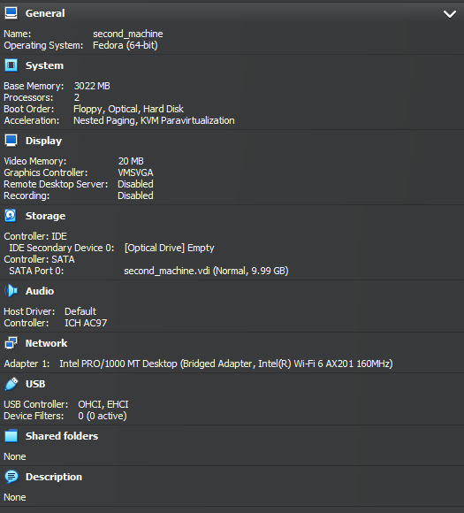
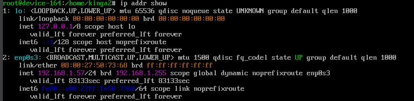
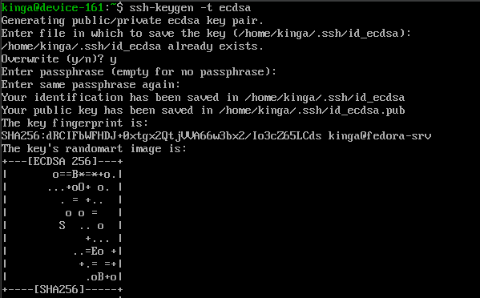
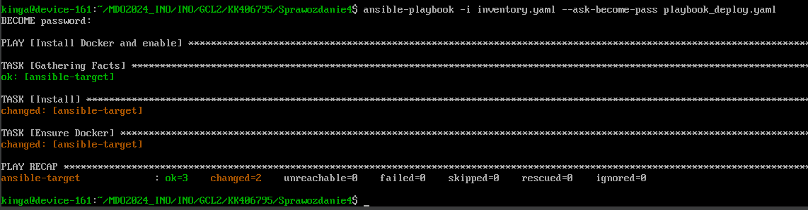
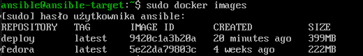

KINGA KUBAJEWSKA
406795
# Sprawozdanie 4

### Cel ćwiczenia:
Po ukończeniu zajęć zdobyto wprawę w konfigurowaniu infrastruktury za pomocą Ansible i przeprowadzaniu inwentaryzacji, co umożliwiło płynną komunikację między serwerami. Ponadto, opanowano tworzenie skryptów automatyzujących oraz zarządzanie zasobami poprzez wymianę kluczy SSH. Zapewnia to solidne fundamenty w obszarze automatyzacji i efektywnego zarządzania infrastrukturą IT. 

### Przebieg ćwiczenia 008:

### Instalacja Ansible

* Utworzyłam drugą maszynę wirtualną o **jak najmniejszym** zbiorze zainstalowanego oprogramowania.
Jako, że moja pierwsza maszyna jest na fedorze, drugą też na niej zrobiłam.
Poniżej przedstawiam danej nowej maszyny:



* Następnie skonfigurowałam ustawienia sieciowe →ustawiłam opcje **bridged adapter**, czyli sieć mostkową na potrzeby komunikacji między maszynami wirtualnymi.


* Zapewniłam obecność serwera OpenSSH (`sshd`) poprzez komendę:
```
systemctl status sshd
```


Sprawdziłam obecność  programu `tar` poprzez polecenie:
```
tar –version
```


Sprawdzam ip nowej maszyny za pomocą:

```
ip addr show
```


* Nadałam maszynie *hostname* `ansible-target` poprzez komendę:

```
sudo hostnamectl set-hostname ansible-target
```


* Utworzyłam w systemie użytkownika `ansible` poprzez szereg komend:
```
sudo useradd ansible

sudo passwd ansible

sudo usermod -aG wheel ansible

su – ansible
```
Wyjaśnienie ich działania:
1. Tworzę nowego użytkownika o nazwie "ansible".
2. Ustawiam hasło dla nowego użytkownika "ansible".
3. Dodaję użytkownika "ansible" do grupy "wheel". Grupa "wheel" w wielu dystrybucjach Linuxa ma specjalne uprawnienia, które umożliwiają członkom tej grupy wykonywanie komend jako super użytkownik przy użyciu sudo.
4. Przełączam na użytkownika "ansible".


* Następnie na starej maszynie za pomocą komendy:
```
sudo dnf update 
```
zaktualizowałam listę dostępnych pakietów do najnowszych wersji, aby zapobiec potencjalnym konfliktom lub problemom zależności podczas instalacji nowego oprogramowania, takiego jak Ansible. 


Przeszłam do instalacji za pomocą komendy:
```
sudo dnf install ansible
```


Poprzez komendę 
```
ansible –version
```
sprawdzam zainstalowaną wersję oraz czy wszystko zainstalowało się poprawnie.


* Wymieniłam klucze SSH między użytkownikiem w głównej maszynie wirtualnej, a użytkownikiem `ansible` z nowej tak, by logowanie `ssh ansible@ansible-target` nie wymagało podania hasła.
  
a) Tworzenie klucza na głównej maszynie:



b) Kopiowanie klucza na nową maszynę:


c) Tworzenie na nowej maszynie klucza i kopiowanie do starej:


Po tych zabiegach możliwe było poprawne logowanie ze starej maszyny na nową i na odwrót bez użycia hasła, poprzez komendę:
```
ssh ansible@ansible-target
```


### Inwentaryzacja
* Dokonałam inwentaryzacji systemów.
* Aby uzyskać potencjalne nazwy komputerów, stosuje się komendę hostnamectl. W celu uniknięcia konieczności korzystania wyłącznie z adresów IP do komunikacji z maszynami, można przypisać im nazwy DNS, dodając odpowiednie wpisy do pliku /etc/hosts. Tak też zrobiłam:


* Zweryfikowałam łączność poprzez komendę ping:


* Stworzyłam plik inwentaryzacji inventory.yaml, który służy do określenia, które maszyny Ansible ma kontrolować oraz jak się do nich łączyć.
W sekcji orchestrators zdefiniowany jest host o nazwie fedora, który ma przypisany adres fedora-srv i używa użytkownika kinga do logowania -> (główna maszyna).
W sekcji endpoints zdefiniowany jest host ansible-target, który ma przypisany adres ansible-target i używa użytkownika ansible do logowania -> (nowa maszyna).


* Żądanie `ping` wysłałam do wszystkich maszyn poprzez komendę:
```
ansible -i inventory.yaml all -m ping
```
użyte polecenie all wskazuje, że komenda ma być wykonana na wszystkich hostach zdefiniowanych w pliku inwentaryzacji.


  
### Zdalne wywoływanie procedur
Za pomocą utworzonego pliku playbook o nazwie ping-all.yaml jak sama nazwa wskazuje wysyłam żądanie `ping` do wszystkich maszyn:


Ten playbook kopiuje plik inventory.yaml z lokalnej maszyny do zdalnego katalogu /home/ansible/ na hostach z grupy Endpoints, a następnie sprawdza łączność z tymi hostami, wysyłając do nich polecenie ping.

Następnie poprzez komendę:
```
ansible-playbook -i inventory.yaml ping-all.yaml 
```
Uruchamiam playbook Ansible (ping-all.yaml), korzystając z pliku inwentaryzacji (inventory.yaml) zawierającego informacje o hostach, na których mają być wykonane zadania. 
Otrzymuje wyniki:


Playbook został pomyślnie uruchomiony na hoście ansible-target, który pomyślnie przeszedł przez wszystkie zadania. Widoczny na screenie status changed oznacza wprowadzone zmiany.
* Gdy ponowiłam operacje otrzymałam:


Jak widać na otrzymanym screenie nie zostały wprowadzone żadne zmiany (nie występuje status changed), ponieważ operacja kopiowania została już wykonana.
* Zaktualizowałam pakiety w systemie:
  
Utworzyłam nowy plik o nazwie upd.yaml, którego zawartość wygląda następująco:
```
name: Update
  hosts: Endpoints
  tasks:
    - name: Upgrade
      ansible.builtin.dnf:
        name: "*"
        state: latest
      become: true
```
poprzez wywołanie odpowiedniej komendy z flagą `--ask-become-pass` uruchomiona zostanie opcja z podaniem hasła.


* Aby zrestartować usługę `sshd` odpowiedzialną za obsługę połączeń na serwerze utworzyłam plik restart-ssh.yaml:
```
name: Restart ssh
  hosts: Endpoints
  become: true
  tasks:
   - name: restart sshd
     systemd:
      name: sshd
      state: restarted
```


* Przeprowadziłam operacje względem maszyny z odpiętą kartą sieciową:
  
Rozłączenie następuje w ustawieniach nowej maszyny:


Po wykonaniu playbooka otrzymałam komunikat, że nie udało się nawiązać połączenia.
  


### Zarządzanie kontenerem

Za pomocą stworzonego nowego playbooka o nazwie playbook_deploy.yaml uruchomiłam kontener Deploy, którego plik Dockefile wygląda następująco:
```
FROM fedora:latest
RUN dnf -y update && dnf -y install glib2 utf8proc-devel libxcrypt
```
Treść playbooka:


Pozwala to na instalacje, aktywowanie i uruchomienie Dockera.



Następnie do playbooka dopisałam następującą treść:


a) do grupy hostów Endpoints dopisałam zadanie kopiowania pliku Dockerfile.

b) W zadaniu Build : tworzy się obraz o nazwie deploy z pliku deploy.Dockerfile, następnie uruchamia się kontener o nazwie new_container na bazie obrazu deploy, ustawione jest aby kontener, był automatycznie usuwany po zatrzymaniu i aby działał w tle.


Sprawdzam, czy utworzył się obraz:



* Za zatrzymanie i usunięcie kontenera odpowiada fragment:


Wywołanie:


Potwierdzenie usunięcia:


* Aby ubrać powyższe kroki w role za pomocą szkieletowania `ansible-galaxy`, wykorzystuję polecenie:

```
ansible-galaxy init irssi-roles
```
które służy do inicjalizacji nowej roli w Ansible.

Ansible Galaxy generuje strukturę katalogów i plików niezbędnych dla nowej roli. Jest to standardowa struktura, która pomaga w organizacji kodu Ansible. 
Po wykonaniu tego polecenia, w bieżącym katalogu zostaną utworzone następujące pliki i katalogi: 


  
    • defaults/main.yml: Domyślne wartości zmiennych dla roli.
    • handlers/main.yml: Plik do definiowania handlerów.
    • meta/main.yml: Plik metadanych, zawierający informacje o autorze, zależnościach itp.
    • tasks/main.yml: Główny plik zadań, w którym definiuje się, co rola ma robić.
    • tests/: Katalog zawierający podstawową konfigurację do testowania roli.
    • vars/main.yml: Plik do definiowania zmiennych dla roli. 
    • README.md: Plik do dokumentacji roli.


Następnie do katalogu task w pliku main wrzuciłam zawartość mojego playbooka.


Teraz w celu wdrożenia kontenera z wykorzystaniem irssi_roles tworzę playbook o nazwie playbook_roles.yaml:


Ten playbook Ansible jest zaprojektowany do uruchomienia roli irssi_roles na grupie hostów endpoints z uprawnieniami administratora. 
Wykonało się tak samo.


### Przebieg ćwiczenia 009:

## Zagadnienie
Niniejszy temat jest poświęcony przygotowaniu źródła instalacyjnego systemu dla maszyny wirtualnej/fizycznego serwera/środowiska IoT. Źródła takie stosowane są do zautomatyzowania instalacji środowiska testowego dla oprogramowania, które nie pracuje w całości w kontenerze.

## Zadania do wykonania
* Zainstalowałam system Fedora 39 stosując instalator sieciowy netist.


* Skopiowałam plik odpowiedzi `/root/anaconda-ks.cfg` komendą:
  
```
sudo cp /root/anaconda-ks.cfg ~/anaconda-ks.cfg
```
Dodałam do niego następujące zmiany zgodnie z poleceniami w instrukcji:

```
url --mirrorlist=http://mirrors.fedoraproject.org/mirrorlist?repo=fedora-39&arch=aarch64

repo --name=update --mirrorlist=http://mirrors.fedoraproject.org/mirrorlist?repo=updates-released-f38&arch=aarch64

clearpart –all

```
* Ustawiłam hostname inny niż domyślny:

```
network  -–hostname=kinga01
```
w sekcji %packages wymieniłam pakiet Docker.

Plik wygląda następująco:


Plik skopiowałam do katalogu ze Sprawozdaniem numer 4  na lokalnym repozytorium i następnie wypchnęłam na zdalne repozytorium. 
Następnie przystąpiłam do utworzenia nowej maszyny wirtualnej Fedora. 
Wybrałam opcję -e aby otworzyć tryb GRUB, w którym mogłam podać link do pliku, który wrzuciłam na Githuba. 


Konfiguracja została ustawiona automatycznie, następnie instalacja systemu przebiegła pomyślnie.


Po zakończeniu instalacji i zrestartowaniu systemu widać, że nazwa hosta jest zgodna z tą określoną w pliku konfiguracyjnym. 


