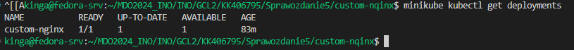
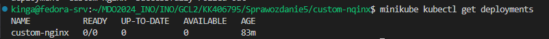
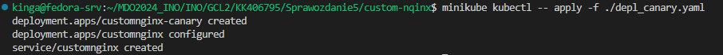

# Sprawozdanie 5
Kinga Kubajewska
406795
# Lab 10

### Cel ćwiczenia:
Podczas zajęć głównym celem było skonfigurowanie i uruchomienie klastra Kubernetes za pomocą narzędzi takich jak Minikube oraz kubectl. Ważne było zapewnienie bezpieczeństwa podczas instalacji oraz spełnienie wymagań sprzętowych. Przygotowano własny obraz Docker i uruchomiono swoją aplikację jako kontener na platformie Minikube. Następnie sprawdzano poprawność działania za pomocą Dashboardu oraz narzędzia kubectl. W kolejnym etapie należało zapisywać konfigurację w plikach YAML i przeprowadzić próbne wdrożenie przykładowego deploymentu. Istotnym elementem było również zapewnienie dostępności co najmniej dwóch wersji obrazu oraz przetestowanie aktualizacji i przywracania poprzednich wersji wdrożeń. W celu ułatwienia procesu weryfikacji poprawności wdrożenia, pisano skrypty automatyzujące ten proces. 

## Zadania do wykonania
### Instalacja klastra Kubernetes
* Zaopatrzyłam się w implementację stosu k8s: [minikube] z linku podanego w instrukcji.
Minikube to narzędzie, służące do tworzenia i uruchamiania klastrów Kubernetes bezpośrednio na komputerze użytkownika, niezależnie od systemu operacyjnego.

* Przeprowadziłam instalację, poziom bezpieczeństwa instalacji odbywa się poprzez pobieranie potrzebnych narzędzi tylko z oficjalnych źródeł i stałe aktualizacje oprogramowania :

```
curl -LO https://storage.googleapis.com/minikube/releases/latest/minikube-latest.x86_64.rpm

sudo rpm -Uvh minikube-latest.x86_64.rpm
```


* Zaopatrzyłam się w polecenie `kubectl` w wariancie minikube poprzez polecenie:
```
minikube kubectl -- get po -A
```

to narzędzie pozwala tworzyć, aktualizować i monitorować zasoby takie jak pody, deploymenty itp.


* Uruchomiłam Kubernetes stosując komendę:
```
minikube start

```


Status klastra sprawdzam poprzez:

```
minikube status

```


Sprawdzam działający kontener:


* Odnośnie wymagań sprzętowych, które były zawarte w dokumentacji, czyli co najmniej 2 procesory, 2 GB wolnej pamięci oraz 20 GB wolnego miejsca na dysku poprzednia zmiana urządzenia okazałaby się być niezbędna przy wykonywaniu poleceń z tego sprawozdania, wymienione wyżej wartości przydzielone zostały mojej maszynie.

* Uruchomiłam Dashboard wpisując w terminalu polecenie
```
minikube dashboard

```
poprzez to otworzyłam od razu w przeglądarce:


* Zapoznałam się z koncepcjami funkcji wyprowadzanych przez Kubernetesa (*pod*, *deployment* itp.).

 
### Analiza posiadanego kontenera

Postanowiłam kontynuować pracę na serwerze Nginx, ponieważ mój wcześniejszy projekt oparty na Irssi nie nadawał się do pracy ciągłej w kontenerze.
Na początku stworzyłam domyślną stronę serwowaną przez serwer Nginx, aby sprawdzić, czy serwer działa poprawnie i jest w stanie dostarczyć treści HTML do przeglądarki użytkownika. 
W odpowiednim katalogu umieściłam plik HTML i Dockerfile o następującej treści:


Kod HTML tworzy prostą stronę internetową z nagłówkiem "Hello from NGINX!" i paragrafem "Created by Kinga Kubajewska". Zawiera również tytuł strony "Welcome to NGINX", który pojawia się na karcie przeglądarki. 


Plik Dockerfile tworzy obraz Docker na bazie najnowszej wersji Nginx i kopiuje plik index.html do katalogu /usr/share/nginx/html, aby serwer Nginx mógł serwować tę stronę internetową.

Następnie zbudowałam obraz komendą docker build:


* Aplikacja pracuje jako kontener:


Kolejno poprzez poniższą komendę wypycham obraz Dockerowy w wersji 1.0 z lokalnego systemu do zdalnego repozytorium.

```
docker push kinia01/custom-nginx:1.0 
```


Operacja push powiodła się:


   
### Uruchamianie oprogramowania

* Uruchomiłam kontener na stosie k8s poprzez komendę:
```
minikube kubectl run -- <nazwa-wdrożenia> --image=<obraz-docker> --port=<wyprowadzany port> --labels app=<nazwa-wdrożenia>
```
* Kontener uruchomiony w minikubie zostanie automatycznie ubrany w pod.
* Przedstawiam, że pod działa (via Dashboard oraz kubectl):
via Dashboard stosuje komendę:
``` 
minikube dashboard

```


kubectl – stosuje komendę:

```
kubectl get pods
```


* Wyprowadziłam port celem dotarcia do eksponowanej funkcjonalności komendą:

```
kubectl port-forward pod/<nazwa-wdrożenia> <LO_PORT>:<PODMAIN_CNTNR_PORT> 
```


Port 8082 był przekierowany na lokalny host. 

## LAB 012

### Konwersja wdrożenia ręcznego na wdrożenie deklaratywne YAML
Plik który jest manifestem YAML dla Kubernetes, definiującym zasób typu Deployment o nazwie depl.yaml wzbogaciłam o 4 repliki kontenera aplikacji. Plik wygląda następująco:


uruchamia on cztery repliki kontenera custom-nginx z obrazu kinga01/customnginx:1.0, nasłuchującego na porcie 80. 

* Rozpoczęłam wdrożenie za pomocą komendy:

```
kubectl -- apply -f ./depl.yaml 
```


* Zbadałam stan za pomocą:

```
kubectl rollout status deployments/custom-nginx
```


Proces przebiegł prawidłowo.

Poprzez komendę:

```
minikube kubectl get deployments
```

Wyświetliłam informacje o moim deploymencie uruchomionym w klastrze Kubernetes.


Przedstawiam Dashboard mojego wdrożenia:


### Przygotowanie nowego obrazu
* Zarejestrowałam nową wersję swojego obrazu `Deploy` w Docker Hub poprzez polecenie:
```
docker commit <contener id>
```
 * Potrzebny jest "gotowiec" → **własny** kontener: zmodyfikowany względem oryginału i opublikowany na własnym koncie DH.
 * Wymagało to prze zemnie:
* przepakowania wybranego obrazu samodzielnie przez ```commit```, przez co stworzyłam dwie wersje zawierające tag 2.0 i 3.0. W takim przypadku tylko zmiana tagu była potrzebna do utworzenia nowych wariantów obrazu.

Obie wersje wypchnęłam na Docker Hub przez polecenie push:


Wszystko przebiegło poprawnie:


* Przygotowałam wersję obrazu, której uruchomienie kończy się błędem. W pliku Dockerfile umieściłam linijkę: CMD ["ERR"].


Obraz zbudowałam.


Sprawdziłam, czy kontener uruchomił się w Dashboardzie:


Jak widać powyżej polecenie CMD ["ERR"], spowodowało błąd przy uruchomieniu kontenera.

### Zmiany w deploymencie

* Aktualizowałam plik YAML z wdrożeniem i przeprowadziłam je ponownie po zastosowaniu następujących zmian:

* zwiększyłam repliki do 8 (6 linijka kodu na zrzucie ekranu):


Zmiany zostały wprowadzone.


* zmniejszenie liczby replik do 1




* zmniejszenie liczby replik do 0





* Zastosowanie nowej (2.0) wersji obrazu:

Wykonałam to zadanie z wykorzystaniem strategii Rolling Update, która jest używana do aktualizacji Deploymentu w sposób, który minimalizuje przestoje aplikacji. W tym celu zmodyfikowałam plik depl.yaml, w następujący sposób:


Oznacza to, że Kubernetes będzie aktualizował pody jeden po drugim, zapewniając, że w danym momencie maksymalnie jeden pod jest niedostępny i maksymalnie jeden nowy pod jest uruchomiony ponad zadeklarowaną liczbę replik. Ta strategia pomaga w zachowaniu ciągłej dostępności aplikacji podczas procesu aktualizacji. 

Następnie poprzez szereg komend zobrazowanych na zrzucie ekranu poniżej przeprowadziłam deployment zmodyfikowanej wersji:


Wyniki zobrazowane na Dashboardzie:


* Przywracałam poprzednie wersje wdrożeń za pomocą poleceń:

   ```kubectl rollout history```
   ```kubectl rollout undo```


### Kontrola wdrożenia

* Napisałam skrypt weryfikujący, czy wdrożenie "zdążyło" się wdrożyć. Gdy udało mi się osiągnąć sukces dla 60 sekund, postanowiłam sprawdzić, czy wszystko przebiegnie poprawnie w ciągu 30 sekund.

Mój plik ze skryptem wygląda następująco:


Czekam 30 sekund, sprawdzam status wdrożenia poprzez kubectl rollout status i przypisuje go do zmiennej status, jeżeli status zawiera słowo „successfully” → wdrożenie zakończyło się sukcesem i wypisane zostaje słowo „End” oraz status wdrożenia. Jeżeli nie to wypisany jest komunikat „In progress” i wycofane zmiany → kubectl undo.


Udało się, został wypisany odpowiedni komunikat co oznacza, że 30 sekund wystarczyło na wdrożenie.

 
### Strategie wdrożenia

* Przygotowałam wersje wdrożeń stosujące następujące strategie:

* Recreate → powoduje, że podczas aktualizacji:

Wszystkie stare pody są najpierw usuwane. 
Nowe pody są tworzone dopiero po usunięciu starych.
Może wystąpić przerwa w dostępności aplikacji podczas tego procesu, jest to przydatne, gdy aplikacja nie może obsługiwać różnych wersji jednocześnie, a chwilowy brak dostępności jest akceptowalny. 


* Rolling Update (z parametrami `maxUnavailable` > 1, `maxSurge` > 20%)
Minimalizuje przestoje poprzez stopniową aktualizacje aplikacji przez zastępowanie starych instancji nowymi. Ta strategia umożliwia płynne przejście między wersjami w odróżnieniu od Recreate, która wyłącza i usuwa cały klaster, co jest mniej stabilne i bardziej ryzykowne dla systemu.
Zastosowanie rolling update i wpisanie odpowiednich parametrów:


* Canary Deployment workload
Plik z tą wersją wygląda następująco: 


Strategia Canary Deployment w moim pliku YAML uruchamia nową wersję aplikacji (kinga01/custom-nginx:2.0-canary) jako jeden pod, równocześnie z trzema podami stabilnej wersji (kinga01/custom-nginx:2.0). Dzięki temu, nowa wersja może być testowana na małej części ruchu produkcyjnego, minimalizując ryzyko wpływu na całą aplikację w przypadku błędów.




* Podsumowanie różnic strategii:

W Canary Deployment nowa wersja aplikacji jest wprowadzana stopniowo, początkowo dla niewielkiego podzbioru użytkowników, co pozwala na monitorowanie jej wydajności i stabilności zanim zostanie w pełni wdrożona dla wszystkich użytkowników. W przypadku Recreate, nowa wersja jest wdrażana poprzez zatrzymanie i usunięcie poprzedniej wersji, a następnie uruchomienie całkowicie nowej instancji, co może prowadzić do przerw w dostępności aplikacji. W Rolling Update nowa wersja jest wprowadzana stopniowo, ale w sposób bardziej ciągły niż w Canary Deployment, gdzie stare instancje są stopniowo zastępowane nowymi, co zmniejsza ryzyko przerw w działaniu aplikacji.


