# Sprawozdanie 1
Maksymilian Kubiczek - IO

## Cel laboratoriów
Celem opisanych laboratoriów było sprawdzenie umiejętności przygotowania środowiska do pracy z dostępem do wspólnego repozytorium, poznanie podstawowych operacji w gicie oraz zrozumienie czym jest docker i po co się go stosuje. Stworzymy klucze SSH, swojego własnego brancha oraz pierwszego git hook'a oraz pierwsze kontenery w Dockerze.

## Punktowe streszczenie wykonanych kroków

### 1. Zainstalowanie klienta Git i obsługi kluczy SSH
Krok ten został wykonany już przy instalowaniu serwera Ubuntu na wirtualnej maszynie poprzez zaznacznie opcji, która uwzględnia pobranie OpenSSH w trakcie instalacji. Git w systemie Linux zainstalowany jest automatycznie. Finalne sprawdzenie poprawnego działania dokonujemy komendą:

    git --version && ssh --V

Powoduje to sprawdzenie wersji gita oraz openSSH, co jest potwierdzeniem zainstalowania klienta na naszej maszynie.
Poniżej znajduje się wynik działania komendy:

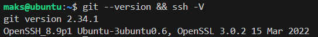

### 2. Sklonowanie repozutorium przedmiotowego za pomocą HTTPS i personal access token
Aby sklonować repozytorium za pomocą HTTPS, musimy udać się na githuba i skopiować odpowiednio link w zakładce HTTPS. Komenda, którą będziemy wykorzystywać to:
    
    git clone https://github.com/InzynieriaOprogramowaniaAGH/MDO2024_INO.git

Aby dokonać klonowania w ten sposób musimy odpowiednio podać naszą nazwę użytkownika na Githubie oraz hasło, które pełni funkcję personal access tokena. Aby go wygenerować udajemy się do ustawień konta na Githubie (Settings/Developer Settings/Token).

Jednak w przypadku korzystania z Remote SSH w Visual Studio Code potwierdzenie tożsamości może odbywać się w inny sposób. Przy podłączonym koncie Github z VSCode należy w pliku .gitconfig podać odpowiednie dane, które pozwolą zweryfikować tożsamość:
    
    git config --global user.email "maksymiliankubiczek@gmail.com"

Sama weryfikacja polega na zalogowaniu się na swoje konto GitHub w okienku, które nam następnie wyskakuje

Samo sklonowanie repozytorium przebiega w następujący sposób:

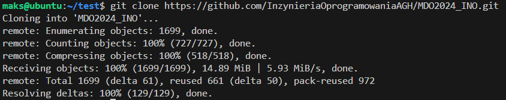

### 3. Sklonowanie repozytorium za pomocą klucza SSH

- #### Utworzenie kluczy SSH
  Klucze SSH pomogają usprawnić proces przygotowywania stanowiska pracy, ponieważ nie będziemy musieli podawać loginu oraz tokenu za każdym razem chcąc skopiować repozytorium
  na którym pracujemy. Klucze generujemy przy pomocy:
    
      ssh-keygen

  Wybrałem klucz *ed25519*. Wygenerowałem go następującą komendą:

      ssh-keygen -t ed25519 -C "maksymiliankubiczek@gmail.com"

  Klucze generują się w dwóch wersjach: publicznej i prywatnej.

  Przy tworzeniu klucza ustawiłem również hasło, które będę podawać kiedy klucz będzie wykorzystywany. Hasła tworzymy w momencie kiedy pojawiają się następujące komunikaty:

      Enter passphrase (empty for no passphrase): 
      Enter same passphrase again: 

  Zrzut ekranu pokazujący generowanie klucza SSH:
  
  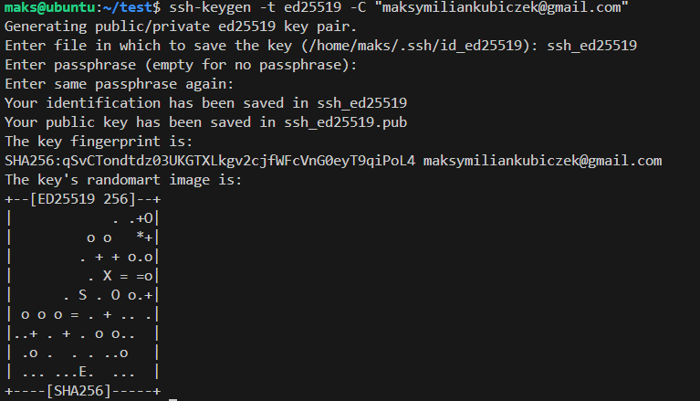

  Wygenerowane klucze w foldrze '~/ssh':

  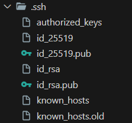

- #### Konfiguracja klucza SSH jako metody dostępu do GitHuba
   Aby poprawnie skofigurować klucz SSH, by spełaniał swoje zadanie dodałem go do konta GitHub. Dzięki temu działania powiązane z moim kontem nie będą musiały być uwierzytelniane za każdym razem przeze mnie będzie to wykonywane automatycznie.

   Aby to wykonać udajemy się do folderu, w którym stworzyliśmy i przechowujemy nasze klucze SSH i kopiujemy zawartość ***PUBLICZNEGO*** klucza, następnie wchodzimy w ustawienia konta na GitHubie i w zakładce Klucze SSH i GPG dodajemy klucz, nadajemy mu tytuł oraz wklejamy skopiowaną wcześniej zawartość.

   Dodany klucz wygląda następuąco:

   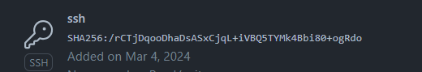

- #### Skopiowanie repozytorium 

  Końcowy etap, który potwierdza poprawne działanie klucza, będzie próba skopiowanie repozytorium za jego pomocą. Ten poprawnie działający powienien nas poprosić tylko o hasło ustawione przez nas w trakcie tworzenia (już bez konieczności logowania się na GitHuba oraz podawanie tokena).

  Klonowanie wykonujemy poprzez komendę:
      
      git clone git@github.com:InżynieriaOprogramowaniaAGH/MDO2024_INO.git

  Znajdziemy go również w zakładce SSH w naszym repozytorium.

  Poprawne klonowanie po wpisaniu hasła dostępu do używanego klucza zwrócić nam folder główny repozytorium

### 4. Tworzenie oraz przełączanie się pomiędzy gałęziami.
  Po sklonowaniu repozytorium ważne jest, aby wiedzieć jak się po nim poruszać. Aby była możliwość równoległej pracy na jednym repozytorium przez wiele osób został stworzone gałęzie. Po wejściu do folderu repozytorium jesteśmy sprawdzić jakie gałęzie istnieją oraz stworzyć kolejne, jeśli jest to konieczne.
  Wyświetlenia gałęzi dokonujemy za pomocą następującej komendy:

      git branch --all

  Pozwala nam to na wybranie gałęzi, na której chcemy rozpocząc pracę.
  Aby zmienić gałąź korzystamy z komendy:
      
      git checkout nazwa_galezi_docelowej
  
  Poniżej znajduje się zrzut ekranu z utworzonymi gałęziami w repozytorium:

  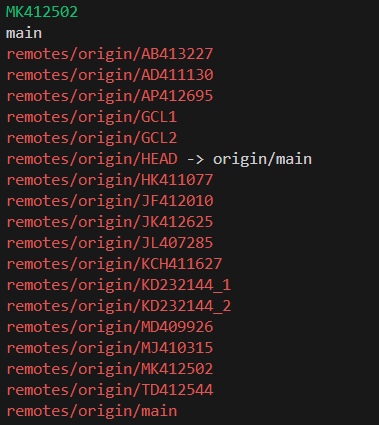

### 5. Utworzenie własnej gałęzi "MK412502"
  Podczas wszystkich ćwiczeń będziemy pracować na własnej gałezi, aby praca innych osób z dostępem do repozytorium była nienaruszona, przez nasze zmiany. Dlatego też tworzymy własną gałąź z unikatową nazwą (będzie się ona składać z inicjałów oraz numeru indeksu - dlatego w moim przypadku jest to MK412502).
  Gałąź tworzymy za pomocą tej samej komendy co przemieszczanie się pomiezy nimi dodając opcję **-b**. Po stworzeniu gałęzi automatycznie się na nią przełączamy.
  Komenda tworząca gałąź:

      git checkoout -b MK412502

### 6. Rozpoczęcie pracy na nowej gałęzi
- #### Stworzenie katalogu 
  Będąc już na własnej gałęzi kolejnym krokiem było utworzenie wewnątrz katalogu o tej samej nazwie co gałąź **(inicjały + numer indeksu)** 
  Tworzenie katalogu wykonujemy w terminalu poprzez:

      mkdir MK412502
  
- #### Napisanie Git Hook'a oraz umieszczenie go w odpowiednim miejscu
  Nasz Git Hook miał weryfikować każdy mój "**commit message**", w taki sposób, że gdy nie rozpoczynał się od konkretnej sekwencji znaków (MK412502) zwraca komunikat i nie pozwala na wykonanie commit'a. Wszystkie Git Hook'i przechowujemy w katalogu ".git/hooks", a w tym przypadku skorzystałem z hook'a commit-msg
  Poniżej widzimy zawartość skryptu:

  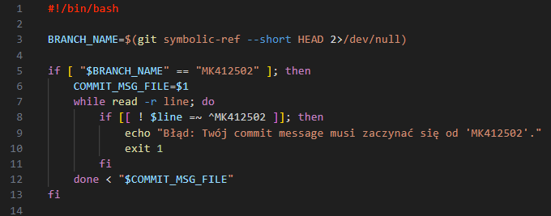

- #### Tworzenie sprawozdania 
  Podczas naszych ćwiczeń sprawozdania zapisywać będziemy jako "Markdown" w pliku **README.md**, w odpowiednim katalogu. Katalogiem, w którym przechowujemy sprawozdanie to **Sprawozdanie_nrSprawozdania** 

  Poniżej jest zamieszczona poprawna struktura plików:

  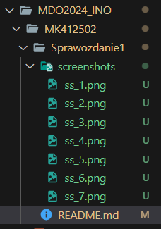

- #### Dodawanie zrzutów ekranu
  W sprawozdaniach dołączam zrzuty ekranu jako *inline* wykorzystując następującą składnie:

      
  
  Efekt takiego dołączania zdjęć jest widoczny np. powyżej w sprawozdaniu

- #### Wysyłanie zmian do zdalnego źródła
  Wysyłanie zmian do zdalnego zródła następuje za pomocą następującej sekwencji komend:

      git add
      git commit
      git push
  
  Każda z nich ma inne zadanie:
  Git add odpowiedzialna jest za dodanie naszych zmian, czyli nowych lub edytowanych plików.
  Git commit jest to stworzenie adnotacji, jaką chcemy dopisać do naszej zmiany, aby opisać co zostało dodane/zmienione.
  Finalnie poprzez Git push wypychamy zmiany do źródła. 
  W ten sposób w kilku krokach jesteśmy w stanie przesłać zmiany do zdalnego repozytorium na GitHubie.

  Podczas tego typu operacji przydatna bywa komenda:

      git status

  pokazuje ona jakie zmiany zaszły wzgłedem obecnej wersji repo.
  Przykład działania:

  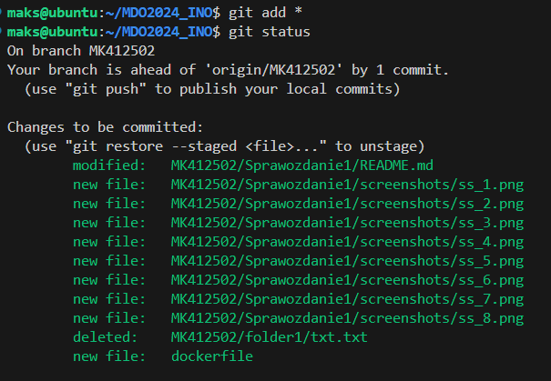

## Wykonaie poleceń z zajeć nr 2
### 1. Zainstalowanie Dockera w systemie linuksowym

Pobieranie dockera wykonujemy z pozycji terminala za pomocą komendy:

    sudo apt install docker

A następnie pobrałem zawarte w instrukcji obrazy: **hello-world, busybox, ubuntu oraz mysql**
Instrukcje wymagane do pobrania obrazów to:
    
    sudo docker pull hello-world
    sudo docker pull busybox
    sudo docker pull ubuntu
    sudo docker pull mysql

Przykładowy wynik użycia komendy i pobrania obrazu:

  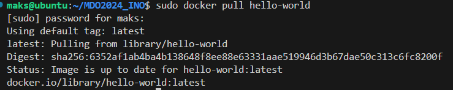

A oto obrazy pobrane przeze mnie:

  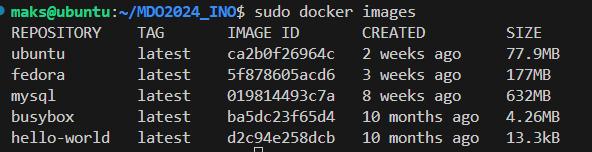

### 2. Rejestracja w Docker Hub i zapoznanie się z sugerowanymi obrazami

Rejestracji na stronie wykonałem poprzez połaczenia konta GitHub z kontem Docker Hub, powoduje to spersonalizowanie sugerowanych obrazów względem moich potrzeb.

  

### 3. Uruchomienie kontenera z obrazu busybox
Pierwsze uruchomienie kontenera z obrazu **busybox** wykonujemy poprzez:

    sudo docker run busybox

- #### Efekt uruchomienia naszego kontenera
  Terminal nic nie zwrócił, jednakże błędu też żadnego nie było, dlatego też poprzez komendę:

    sudo docker container list --all

  możemy zobaczyć wszystkie kontenery jakie powstały i nie zostały usunięte z listy

  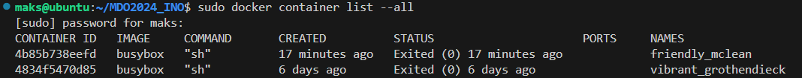

  Jak widzimy działanie kontenera zostało przerwane z błędem 0, czyli kontener poprawnie zakończył pracę, ponieważ nie miał żadnej zleconej.

- #### Podłączenie interaktywne do kontenera oraz wywołanie nr wersji
  Podłączenie interaktywne charakteryzuje się możliwością korzystania z komend w momencie kiedy kontener jest cały czas uruchomiony. Uzyskujemy to poprzez modyfikację komendy, jaką wykorzystaliśmy do uruchomienia kontenera:

      sudo docker run -it busybox

  Następnie wewnątrz kontenera:

      cat --help

  oraz finalnie, aby opuścić kontener:

      exit

  W ten sposób otrzymujemy komplet informacji oraz wykonanych operacji, które pokazują jak podłączyć się do kontenera oraz jak pokazać numer wersji obrazu busybox.

   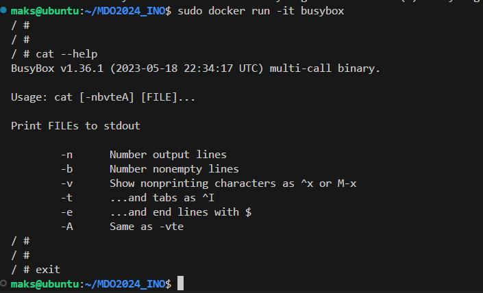

### 4. Uruchomienie systemu w kontenerze
System jaki będę uruchamiał to ubuntu. Zrobiłem to wykorzystując komendę:

    sudo docker run -it ubuntu

Wszystkie operacje związane z tym komentarzem wykonuje w osobnym terminalu, aby mieć podgląd na działanie kontenera z zewnątrz.
- #### Wyświetlenie PID1
  **PID1** jest odpowiedzialny za inicjację pozostałych procesów, a listę procesów uruchomionych w kontenerze uzuskamy za pomocą:

      ps

  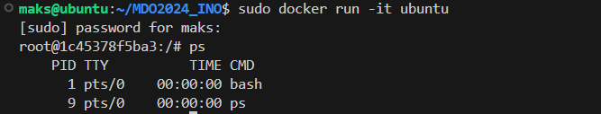

- #### Aktualizacja pakietów
Aktualizacje pakietów w kontenerze wykonuje się identycznie jak w zwykłym systemie. Używając komendy:

    apt update && apt update -y

Łączymy tutaj sprawdzenie możliwych aktualizacji pakietów oraz samo pobranie aktualizacji

Wynik aktualizowania:
  
  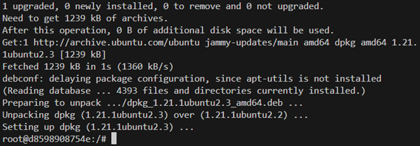 

### 5. Dockerfile
Mój dockerfile oparty jest o ubintu, dlatego też zaczyna się on od:
    
    FROM ubuntu:latest

- #### Trzymanie się dobrych praktyk
  Pierwszym krokiem już w samym naszym dockerfile'u jest stworzenie wymogu aktualizowania pakietów oraz pobranie gita oraz ssh, które będą potrzebne do wykonania kolejnych króków. Uczynimy to poprzez dodanie:

      RUN apt-get update && apt-get install -y git ssh
  
  Następnie musimy pobrać argument, jaki będziemy dodawać przy budowaniu projektu. Będzie to klucz prywatny dzięki któremu skopiujemy nasze repozytorium.

      ARG SSH_PRIVATE_KEY
  
  Ostatni fragment odpowiedzialny jest za dodanie kluczy i nadanie odpowiednich uprawnień, aby wszystkie operację były możłiwe do wykonania

      RUN mkdir /root/.ssh/ && \
      echo "${SSH_PRIVATE_KEY}" > /root/.ssh/id_ed25519 && \
      chmod 600 /root/.ssh/id_ed25519 && \
      touch /root/.ssh/known_hosts && \
      ssh-keyscan github.com >> /root/.ssh/known_hosts && \
      git clone git@github.com:InzynieriaOprogramowaniaAGH/MDO2024_INO.git

  Następnie sprawdzamy czy wszytko działa poprawnie: wpisujemy komendę:

      docker build --build-arg SSH_PRIVATE_KEY="$'ścieżka do naszego klucza'" -t nazwa_obrazu .

  Po zakończeniu budowania widzimy gotowy efekt:

    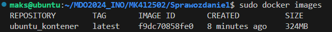D
  
  Kontener jest widoczny oraz możliwy do uruchomienia w sposó interaktywny.
  Po uruchomieniu kontenera, ukazuje nam się sklonowane repozytorium i działający git wewnątrz kontenera:

    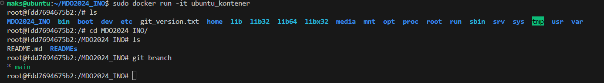

### 6. Uruchomione kontenery i czyszczenie
Listę uruchamianych kontenerów zobaczymy korzystając z komendy:

    sudo docker ps -a

Natomiast, aby wyczyścić tą listę musimy wykorzystać:

    sudo docker rm - usuwanie pojedyncze
    sudo docker rm $(sudo docker ps -a -f status=exited -q) - usuwanie masowe

Wynik usunięcia:

  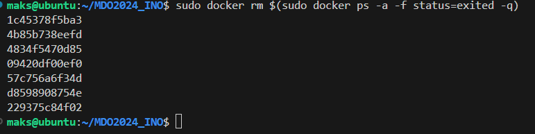

### 7. Czyszczenie obrazów
Liste obrazów dockera wypisuje komenda:

    sudo docker images -a

Aby je usunąc stosujemy komendę podobną do usuwania kontenerów:

    sudo docker rmi $(sudo docker images -a -q)

Efekt:

  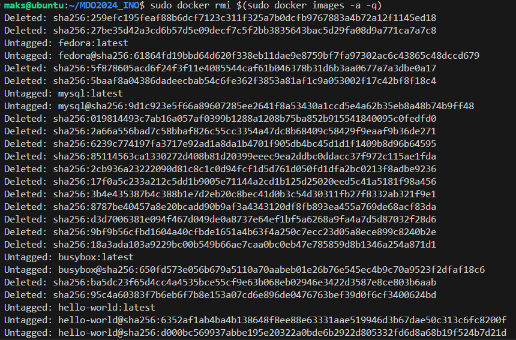

### 8. Dodanie plików dockerfile do folderu Sprawozdanie1 w repozytorium
Pliku nie musiałem przenosić, gdyż od samego początku tworzyłem go w tym katalogu

### 9. Wystawienie pull requesta do gałęxi grupowej
Wykonałem go po wypchaniu wszystkich zmian do lokalnego źródła. Samego pull requesta wykonałem już bezpośrednio na GitHubie.
Ważne jest tylko, żeby wiedzieć co i gdzie wpinamy (w tym przypadku swoją gałąź do gałęzi grupowej GCL2).
