# Sprawozdanie 2
Maksymilian Kubiczek INO CL2

## Cel ćwiczeń:
Celem tego cyklu zajęć jest poznanie sposobów budowania aplikacji, poszerzenie wiedzy z konteneryzacji, nauka czym jest wolumin oraz do czego służy.
Ostatnia część będzie dotyczyć komunikacji między kontenerami, jakie mamy możliwości oraz na co one pozwalają.

## Streszczenie wykonanych kroków

### Zajęcia nr 3

- #### Wybranie oprogramowania spełniającego wytyczne instrukcji:

Moim wyborem zostało zaprezentowane repozytorium **node-js-dummy-test**, ponieważ aplikacja jest prosta oraz schemat budowania jej nie jest skomplikowany co pozwala na sprawną weryfikację poprawności moich działań.

Dodatkowo w repozytorium znajdują się wszystkie wymagane narzędzia Makefile.

- #### Testowa budowa projektu

Po sklonowaniu repozytorium korzytstając z Gita oraz SSH komendą:

    git@github.com:devenes/node-js-dummy-test.git

budujemy cały projekt korzystając z narzędzia nodejs **npm** (node package modules), czyli managera pakietów tego środowiska.
Budowanie odbywa się za pomocą komendy:

    npm install

W ten sposób jedną komendą pobieramy wszystkie zależności oraz potrzebne paczki.

Natomiast testowanie wykonujemy stosując również komendę **npm**

    npm test

Poniżej zaprezentowane został kolejne kroki to zbudowania i testowania naszej aplikacji

- #### Klonowanie repozytorium:

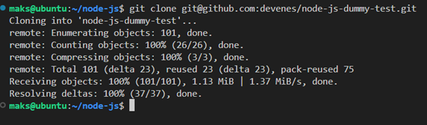

- #### Budowanie projektu

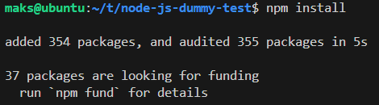

- #### Wykoanie testów

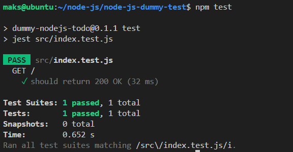

### Przeprowadzenie buildu w kontenerze
#### 1. Wykonanie kroków `build` i `test` wewnątrz wybranego kontenera bazowego.

- #### uruchomienie konteneru z podłączonym TTY

Aby uruchomić interaktywny kontener wraz ze środowiskiem node musimy posłużyć się komendą:

    docker run -it node bash

**Ta komenda pobiera obraz node (jeżeli go nie posiadamy).**
Natomiast opcje są odpowiedzialne za 2 istotne funkcje: -t pozwala na uruchomienie kontenera wraz z TTY (teletype), który jest umożliwia podstawowe I/O, zaś -i pozwala na połączenie STDIN.

- #### zaopatrz kontener w wymagania wstępne (jeżeli proces budowania nie robi tego sam)

W tym przypadku proces budowania uwzględnia podłączenie gita do obrazu.

- #### sklonuj repozytorium

Repozytorium podobnie jak przedtem klonujemy wykorzystując polecenie **git clone**, natomiast teraz posłużymy się **HTTPS** zamiast SSH:

    https://github.com/devenes/node-js-dummy-test.git

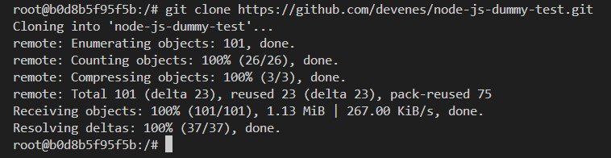

- #### uruchom build

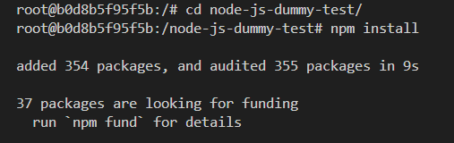

- #### uruchom testy

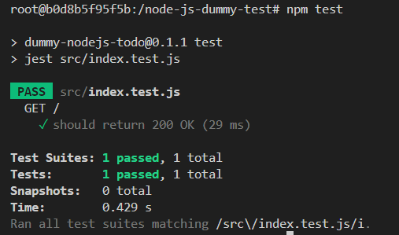


#### 2. Stworzenie dwóch plików `Dockerfile` automatyzujących kroki powyżej:
- #### 1. Builder - kontener nr 1 przeprowadza wszystkie operacje, aż do builda

Kod stworzonego Dockerfile, który zawiera wykorzystywane wcześniej przez nas komendy:

    FROM node:latest

    # Clone this project
    RUN git clone https://github.com/devenes/node-js-dummy-test

    # Access
    WORKDIR cd node-js-dummy-test

    # install all needed dependencies
    RUN npm install

Ważne jest aby dodać przejście do odpowiedniej lokalizacji przed wywołaniem ```npm install```.

Obraz takiego kontenera budujemy poprzez wywołanie następującego polecenia:

    docker build -f ./builder.Dockerfile -t build_node .

Opcje odpowiadają za:

* f - odpowiada za wyznaczenie ścieżki do pliku .dockerfile
* t - odpowiada za nadanie nazwy dla obrazu 

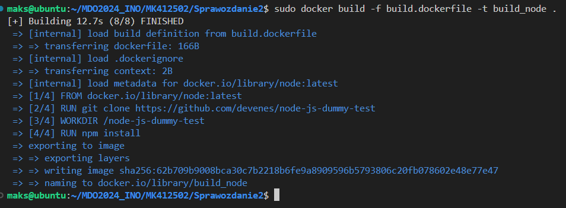

- #### 2. Tester - wykonuje testy bazując na pierwszym kontenerze
Zawartośc Dockerfila:

    FROM build_node
    WORKDIR /node-js-dummy-test
    RUN npm test

Ten dockerfila posiada tylko przejście do odpowiedniej lokalizacji oraz uruchomienie testów (już bez wykonywania buildu). Spowodowane jest to faktem, że bazujemy na wcześniej zbudowanym obrazie build_node (zawieramy go w FROM).

Budujemy go poprzez:

    docker build -f tester.dockerfile -t tester_node --progress=plain --no-cache .

Tworząc obraz w ten sposób jesteśmy w stanie zobaczyć wszystkie informacje, kiedy krok po kroku wykonuje się dockerfile (potrzebujemy tego do uzyskania wyników testów).

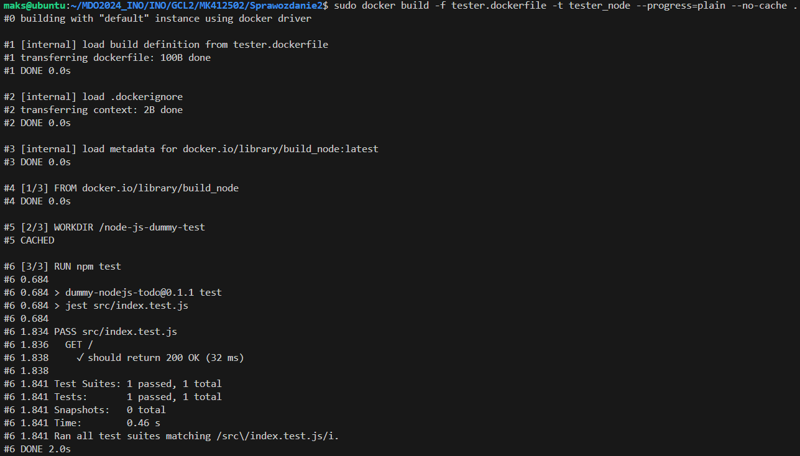

#### 3. Wykazanie, że kontener wdraża się i pracuje poprawnie. 

Pamiętając, że zbudowany obraz nie jest tym samym co działający kontener. Aby uruchomić kontener wykorzystujemy ```docker run```.
Jako, że nic w nich nie wykonujemy, to wynik tego, czy kontenery wdrażają się i pracują można sprawdzić poprzez:

    docker container list --all

Wynik wypisze nam listę stworzonych kontenerów oraz ich status:

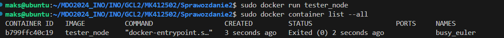

W konterze po zbudowaniu nie pracuje nic. W tym dockerfilu nie korzystamy z **CMD**, zatem uruchomienie nie powoduje wykonania niczego.
Warto również wyjaśnić, że testy wykonujemy w **RUN**, a nie przy pomocy **CMD**, ponieważ testy te dotyczą kodu świeżo zbudowanwgo kodu, a nie uruchomionej aplikacji. Dlatego wykonywane są tylko raz.

## Zajęcia nr 4
### Zachowywanie stanu
#### 1. Przygotowanie woluminu wejściowego i wyjściowego i podłączenie ich do kontenera bazowego, z którego rozpoczynano poprzednio pracę.

Wolumin umożliwia zachowywanie danych stworzonych w dockerze lub znajdującym się w nim.
Możemy go przygotować za pomocą komendy:

    docker volume create nazwa_woluminu

Natomiast listę woluminów możemy sprawdzić poprzez:

    docker volume ls

Na nasze potrzeby tworzymy 2 woluminy:

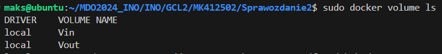

Naszym kontenerem bazowym będzie **node**, ponieważ korzystałem z niego na trzecich zajęciach. Aby podłączyć do kontenera wolumin stosujemy odpowiednie flagi --mount (dla każdego woluminu stosujemy osobne flagi). Należy również określić *source*, która jest nazwą woluminu oraz *target*, czyli jego lokalizację w schemacie plików kontenera.
Schemat pełnej komendy to:

    docker run -it --rm --name my_node --mount source=v_01,target=/folder1 --mount source=v_02,target=/folder2 node bash

Po zbudowaniu kontenera możemy sprawdzić, czy znajdują się w nim nasze woluminy, które powinny stworzyć swoje własne foldery, jakie określono w targetach.
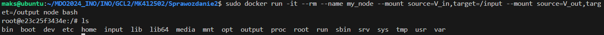

#### 2. Uruchomienie konteneru, zainstalowanie niezbędnych wymagań wstępnych (pamiętając o nieużywaniu *gita*).

Wszystkie wymagania wstępne potrzebne do sklonowania repozytorium są zawarte w odrazie noda.

#### 3. Sklonowanie repozytorium na wolumin wejściowy.
Aby wykonać to polecenie możliwe są różne rozwiązania m.in. stworzenie kontenera pomocniczego z wbudowanym gitem oraz woluminem, który będzie stanowić wolumin wejściowy kontenera właściwego lub skopiowanie plików na wolumin przy pomocy komency docker cp. Ja skorzystam z pierwszego podejścia, ponieważ pomoże mi to lepiej zrozumieć mechanizm działania na wielu kontenerach.

uruchomienie kontenera:

    docker run -it --rm --name tmp_node --mount source=V_in,target=/input node bash

Następnie wewnątrz kontenera klonujemy repozytorium w folderze podpiętym do naszego woluminy (target).

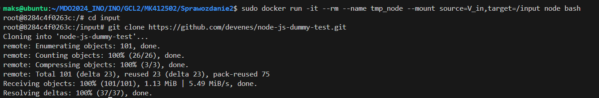

### 4. Uruchomienie buildu w kontenerze oraz skopiowanie repozytorium do wewnątrz kontenera.

Wracamy teraz po pierwotnego konterenera (z dwoma woluminami), następnie w odpowiednim kontenerze wykonujemy build przy pomocy ```npm install```

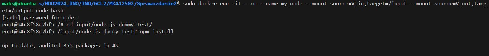

Skopiowałem repozytorium również do wnętrza kontenera z woluminu wejściowego poprzez komendę cp:

    cp -r node-js-dummy-test/ ../

### 5. Zapisanie zbudowanych plików na woluminie wyjściowym, tak by były dostępne po wyłączniu kontenera.
Zbudowane pliki w projekcie przechowywane są głównie w folderze node_modules, zatem możemy je skopiować do woluminy wyjściowego (w naszym przypadku to folder ~/output), dlatego pełna komenda będzie miała postać:

    cp -r node_modules/ ../../output/

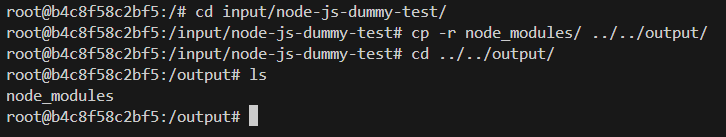

Pliki zawarte w woluminach możemy również znaleźć zapisane lokalnie w hierarchii plików dockera: ```var/lib/docker/volumes```

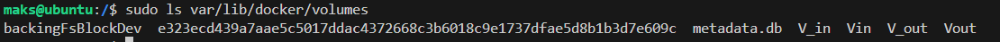

### 6. Ponowienie operacji, ale klonowanie na wolumin wejściowy przeprowadzono wewnątrz kontenera przy użyciu gita.
Klonowanie wewnątrz kontenera jest proste. Wykorzystamy ten sam kontener (z 2 woluminami) i skonujemy repozytorium do osobnego folderu w celu weryfikacji pomyślności operacji

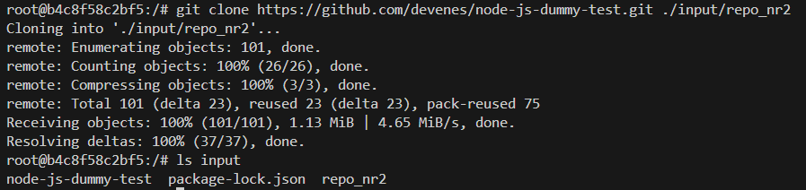

Jak widzimy folder repo_nr2 powstał, a w nim nasze repozytorium.

### 7. Przedyskutowanie możliwość wykonania ww. kroków za pomocą `docker build` i pliku `Dockerfile`.

Aby stworzyć odpowiedni dockerfile musimy zawrzeć wszystkie polecenia niezbędne do operacji na woluminach, "podpięcie ich" do kontenera sklonowanie repozytorium oraz samego buildu, dlatego nasz przykładowy dockerfile wygląda tak:

    FROM node:latest

    RUN mkdir input
    RUN mkdir output

    RUN --mount=type=bind,source=v_in,target=/input,rw
    RUN --mount=type=bind,source=v_out,target=/output,rw

    WORKDIR /input

    RUN git clone https://github.com/devenes/node-js-dummy-test.git

    WORKDIR /input/node-js-dummy-test

    RUN npm install
    RUN cp -r node_modules ../../output/n_node_modules

Wykorzystując `RUN --mount` przyłączamy woluminy do obrazu. Reszta kroków jest powtórką całego procesu jaki wykonywaliśmy przedtem.


### Eksponowanie portu
#### 1. Uruchomienie wewnątrz kontenera serweru iperf (iperf3).
clea
Iperf służy do pomiaru wydajności łącza oraz jego analizy.
Testy będę wykonywać na kontenerze z Ubuntu. Początkowo należy zainstalować iperf3 komendą:

    apt-get install iperf3

oraz uruchomić poprzez:

    iperf3 -s

#### 2. Połączenie się z nim z drugiego kontenera oraz zbadanie ruchu.
Połączenie z nowego kontenera jako klient wykonamy następująco:

    iperf3 -c <adres_serwera>

Znając adres serwera możemy wykonać (w moim przypadku to 172.17.0.1):

    iperf3 -c 172.17.0.1

Po wykonaniu otrzymamy wyniki testu
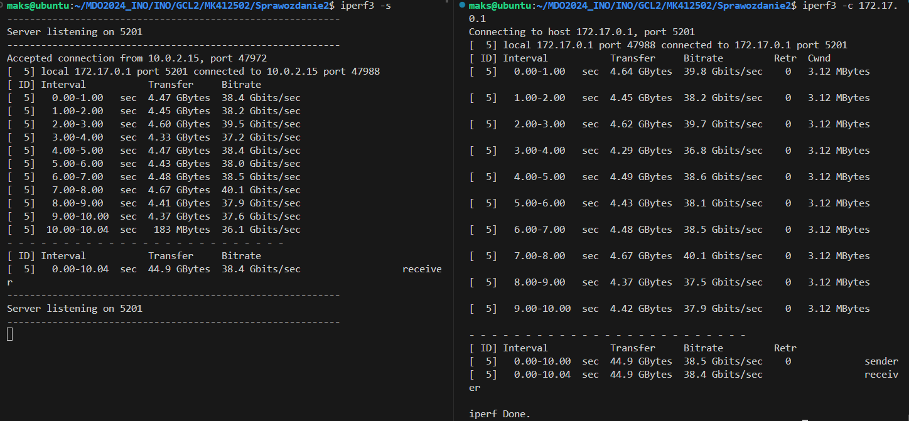

Jest to test przesyłu danych pomiędzy kontenerami (serwerem, a klientem), który do operacji wymagał znajomości adresu.

#### 3. Wykorzystanie własnej dedykowanej sieci mostkowej i próba połączenie z serwerem iperf.

Własną sieć mostkową możemy stworzyć korzystając z `docker network create`. Przykładowa komenda znajduje się poniżej:

    docker network create my_network

Teraz stworzymy kontenery, które chcemy włączyc do naszej sieci. Jeden będzie spełniał zadania serwera, drugi zaś klienta.
Stworzenie kontenerów:

    docker run -it --rm --name server --network my_network ubuntu bash

    docker run -it --rm --name client --network my_network ubuntu bash

Następnie uruchamiamy serwer, aby sprawdzić jaki adres otrzymaliśmy.

    iperf3 -s

Następnie sprawdzamy id naszej nowej sieci:

    docker network ls

i sprawdzamy adresy dołączonych do niej kontenerów:

    docker network inspect <NETWORK_ID>

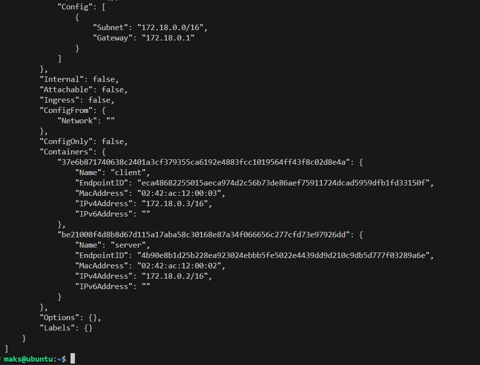

Połączenie pomiędzy serwerem, a klientem uzyskamy za pomocą naszej nazwy kontenera serwera:

    iperf3 -c server

Wyniki:
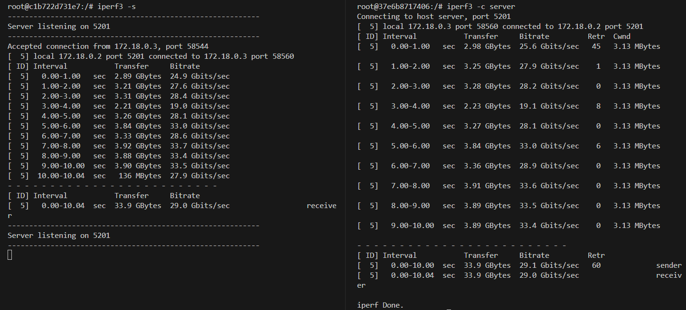

#### 4. Połączenie się spoza kontenera (z hosta i spoza hosta).

Teraz spróbujemy połaczyć się do tej sieci z pozycji hosta (maszyny wirtualnej). Tutaj warto pamiętać, że docker tworzy własną sieć, która odróżnia się od tej z wirtualnej maszyny.

Połączenie spoza hosta robimy jako klient do działającego serwera w kontenerze, aby móc porównać szybkość przesyłania z poprzednimi.
Aby mieć dokładny wgląd uruchomimy kontener z dodatkowymi funkcjami:

    docker run -it --rm --network my_network --name iperf3_serv -p 5201:5201 --mount source=v_out,target=/logs ubuntu bash

W ten sposób ustalamy, że będziemy nasłuchiwać port 5201 (odpowiada za to opcja -p)

Teraz powtarzamy cały proces z różnicą, że nasza maszyna wirtualna jest klientem.
Poniżej mamy wyniki:

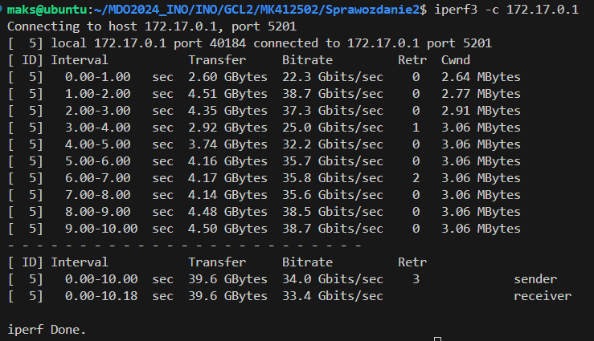

### Instalacja Jenkins
#### 1. Po zapoznaniu się z dokumentacją przeprowadzenie instalacji skonteneryzowanej instancji Jenkinsa z pomocnikiem DIND.
Instalacje jenkinsa zaczynamy od stworzenia sieci mostkowej:

    docker network create jenkins

Następnie pobieramy docker image poprzez uruchomienie konteneru z opdowiednimi opcjami (zawarte są w instrukcji):

    docker run \
    --name jenkins-docker \
    --rm \
    --detach \
    --privileged \
    --network jenkins \
    --network-alias docker \
    --env DOCKER_TLS_CERTDIR=/certs \
    --volume jenkins-docker-certs:/certs/client \
    --volume jenkins-data:/var/jenkins_home \
    --publish 2376:2376 \
    docker:dind \
    --storage-driver overlay2

#### 2. Zainicjalizowanie instacji oraz wykazanie działających kontenerów.

Następnie tworzymy dockerfile (na jego bazie stworzymy customowy obraz jenkinsa):

    FROM jenkins/jenkins:2.440.2-jdk17
    USER root
    RUN apt-get update && apt-get install -y lsb-release
    RUN curl -fsSLo /usr/share/keyrings/docker-archive-keyring.asc \
    https://download.docker.com/linux/debian/gpg
    RUN echo "deb [arch=$(dpkg --print-architecture) \
    signed-by=/usr/share/keyrings/docker-archive-keyring.asc] \
    https://download.docker.com/linux/debian \
    $(lsb_release -cs) stable" > /etc/apt/sources.list.d/docker.list
    RUN apt-get update && apt-get install -y docker-ce-cli
    USER jenkins
    RUN jenkins-plugin-cli --plugins "blueocean docker-workflow"


Kolejny krok to uruchomienie budowania poprzez:

    docker build -t myjenkins-blueocean:2.440.2-1 -f jenkins.dockerfile .

Finalnie uruchamy nasz kontener:

    docker run \
    --name jenkins-blueocean \
    --restart=on-failure \
    --detach \
    --network jenkins \
    --env DOCKER_HOST=tcp://docker:2376 \
    --env DOCKER_CERT_PATH=/certs/client \
    --env DOCKER_TLS_VERIFY=1 \
    --publish 8080:8080 \
    --publish 50000:50000 \
    --volume jenkins-data:/var/jenkins_home \
    --volume jenkins-docker-certs:/certs/client:ro \
    myjenkins-blueocean:2.440.2-1 

Następnie w celu weryfikacji sprawdzamy czy nasz kontener jest uruchomiony:
W tym celu korzystamy z :
    docker container list --all

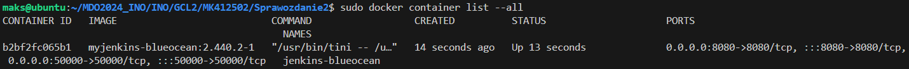

Jednak, żeby ujrzeć już samo okno logowania musimy ustawić jeszcze parę rzwczy. Jest to spowodowane wyborem VM (VirtualBox).
Wystepuje tutaj konieczność przekierowania portów VM do hosta. 

Zaczynamy od szukania ip VM:

    ip a

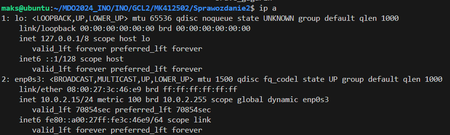
Mamy wynik 10.0.2.15

Teraz udajemy się do ustawień zaawansowanych aby przekierować odpowiednio porty:
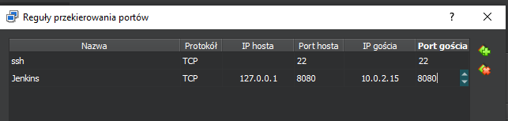

Dzięki temu możemy wejść w przeglądarce do jenkinsa poprzez:

    localhost:8080

Wynik widzimy poniżej:
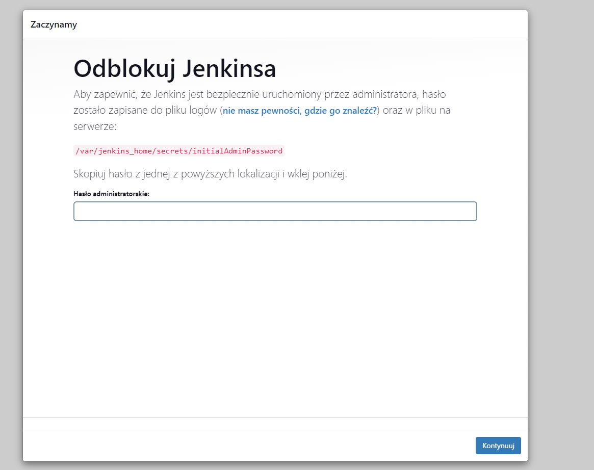


