# Sprawozdanie 3

## Maksymilian Kubiczek INO CL2

## Cel ćwiczeń:

Celem tej grupy labaratorium jest zdobycie niezbędnej wiedzy na temat pipeline'ów - z czego się składają, po co z nich korzystamy oraz zbudujemy nasz pierwszy działający pipeline.
Poniżej znajdziemy listę kroków poruszonych podczas wykonywania poszczególnych instrukcji.

## Streszczenie wykonanych kroków

**[X] Aplikacja została wybrana**

Mój wybór padł na minimalistyczny framework do tworzenia aplikacji webowych w Node.js - express.
Taki, a nie innych wybór, ponieważ repozytorium to posiada dobrze napisaną dokumentacje, nie wymaga wielu preinstalowych narzędzi czy bibliotek oraz jest proste w obsłudze. 
Link do repozytorium:

    https://github.com/expressjs/express

**[X] Licencja potwierdza możliwość swobodnego obrotu kodem na potrzeby zadania**

Repozytorium działa na otwartej licencji MIT, dzięki czemu możemy swobodnie edytować kod:
Link do pliku LICENSE:

    https://github.com/expressjs/express/blob/master/LICENSE

**[X] Wybrany program buduje się**

Pracę z naszym repozytorium rozpoczynamy od próby zbudowania aplikacji lokalnie na naszej maszynie wirtualnej. W tym celu wykonujemy następujące kroki:

Klonowanie repozytorium:

    git clone https://github.com/expressjs/express.git

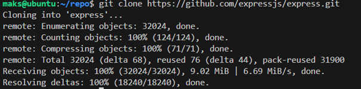

Pobieramy dependencję projektu

    npm install express

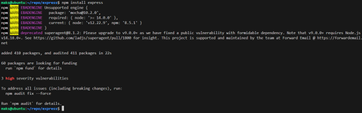

Istotna jest konieczność posiadania Node.js w wersji 0.10 lub nowszej.

**[X] Przechodzą dołączone do niego testy**

Testy uruchamiamy za pomocą komendy menadżera plików Node.js npm:

    npm test

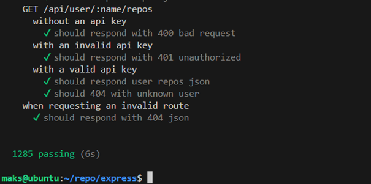

Finalnie możemy uruchomić aplikację wykonując kilka następujących po sobie komend:

    express ./tmp/foo && cd ./tmp/foo

W tym momencie tworzymy hierarchie pików naszej aplikacji podając główny folder z którego będziemy uruchamiać aplikację.

Następnie poprzez ```npm install``` zaciągamy wymagane dependencje, by teraz finalnie w katalogu głównym (w tym przypadku to katalog ./tmp/foo) wykonać polecenie

    DEBUG=foo:* npm start

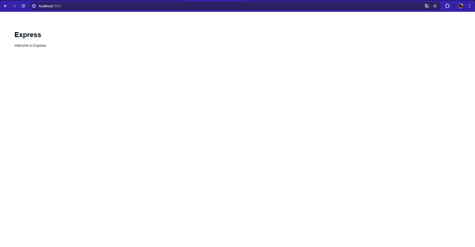

Dodajemy tutaj wzmiankę o zmiennej środowiskowej, aby mieć dostęp do logów debugowania

Poniżej zaprezentowano zrzut ekranu przeglądarki z aplikacją
**[X] Wybrano kontener bazowy lub stworzono odpowiedni kontener wstępny (runtime dependencies)**

Drugą próbą budowy i uruchomienia aplikacji przeprowadzimy przy pomocy Dockera i kontenerów. Jako kontener bazowy będziemy korzystać z obrazu Node'a.

**[X] Build został wykonany wewnątrz kontenera**

Build przeprowadzamy tak samo jak poprzednio, z różnicą taką, że finałem zbudowania naszego projektu będzie gotowy obraz dockera. Do jego stowrzenia korzystamy z Dockerfil'a (Builder.dockerfile):

    FROM node:latest

    #Cloning
    RUN git clone https://github.com/expressjs/express.git

    WORKDIR express

    # RUN npm install express

    RUN npm install -g express-generator@4

    RUN express ./tmp/foo

    WORKDIR tmp/foo

    RUN npm install


Następnie budujemy kontener posługując się poniższą komendą:

    docker build -t build-app -f builder.dockerfile .

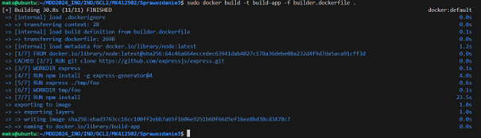

**[X] Testy zostały wykonane wewnątrz kontenera**
**[X] Kontener testowy jest oparty o kontener build**

Kolejne dwa kroki łączymy tworząc kontener testowy który będzie bazować na kontenerze buildowym.
Kroki poczynione w tym punkcie znajdują się poniżej w Dockerfil'u (Tester.dockerfile):

    FROM build-app

    WORKDIR /express/tmp/foo

    RUN npm install

    RUN npm test --watch

Dzięki opcji --watch możemy zobaczyć czy poszczególne testy przechodzą poprawnie i czy nie mamy jakiś błędów w programie.
Następnie budujemy kontener posługując się poniższą komendą:

    docker build -t build-test -f tester.dockerfile .

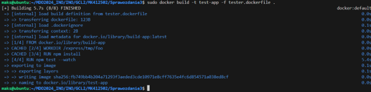

**[X] Zdefiniowano kontener 'deploy' służący zbudowanej aplikacji do pracy**

Jako trzeci kontener będziemy tworzyć kontener do deploy'u aplikacji, będzie on się różnić od poprzednich faktem, że poza samym zbudowaniem kontenera będziemy go uruchamiać (Dockerfile będzie zawierać entry point do aplikacji - będzie on mógł pozostać uruchomiony)
Poniżej znajduje się zawartość trzeciego pliku .dockerfile:

    FROM build-app

    WORKDIR express/tmp/foo

    CMD ["npm", "start"]


Teraz powtarzamy proces budowania kontenera tym razem do deploy:

    docker build -t deploy-app -f deploy.dockerfile .

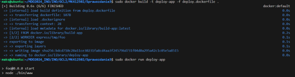

By potem móc uruchamiać program wraz z uruchomieniem kontenera ```docker run deploy-app```.
Finalnie ponownie dostajemy uruchomioną naszą aplikację do której możemy dotrzeć poprze port 3000.

---

## W tym miejscu rozpoczynamy pracę już w Jenkinsie

Pierwszym krokiem będzie stworzenie 2 kontenerów: Jenkinsa i Dind'a - oba są wymagane do poprawnego działania pipeline'u.

Podczas procesu tworzenia posiłkowałem się instrukcją zamieszczoną pod poniższym adresem URL:

    https://www.jenkins.io/doc/book/installing/docker/

Dlatego też utworzyłem obraz Blueocean - na podstawie obrazu Jenkinsa oraz Dind - jest to obraz umożliwiający uruchomienie kontenerów Docker wewnątrz kontenera Docker.

Sprawdzenie stanu obrazu **Blueocean**:

    docker ps

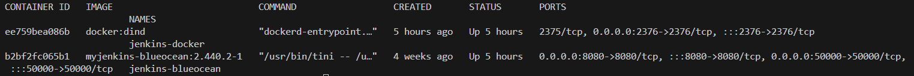

Teraz logujemy się na Jenkinsa oraz wstępnie jego konfigurujemy.

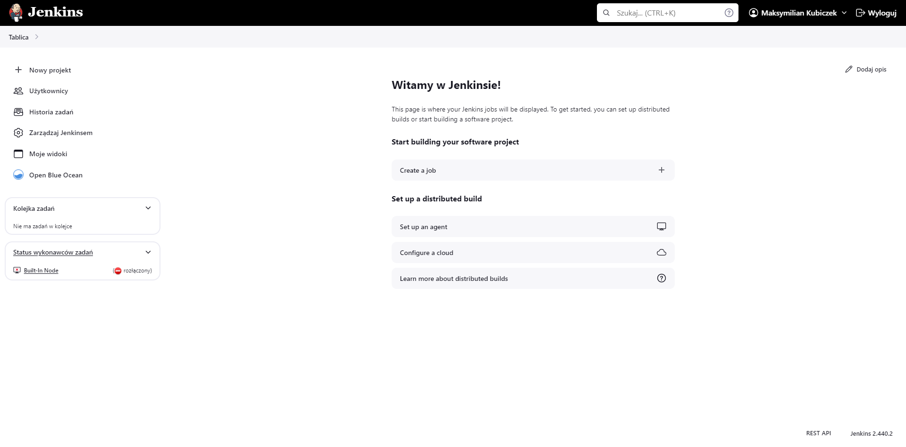

---
### Tworzenie pipeline

Jenkins Pipeline to narzędzie do automatyzacji pracy, które pomaga w budowaniu, testowaniu i wdrażaniu aplikacji. Umożliwia stworzenie skryptu, który opisuje cały proces tworzenia oprogramowania, dzięki czemu jest on szybszy i bardziej niezawodny. To rozwiązanie jest przydatne szczególnie w dużych projektach, gdzie wiele osób pracuje nad jednym programem.
Zawartość mojego skryptu pipeline znajduje się w katalogu sprawozdania w pliku jenkinsfile.

Poniżej opiszemy każdy z elementów skryptu:

    agent any


W Jenkins Pipeline, pojęcie "agenta" odnosi się do maszyn lub środowisk, na których będą uruchamiane poszczególne kroki pipeline'a. Agent jest kluczowym elementem, który pozwala na elastyczne zarządzanie zasobami, gdzie mogą być wykonywane różne zadania pipeline'a.
W naszym przypadku **agent any** mówi nam o możliwości uruchomienia pipelina na dowolnym agencie jenkins'a.

### Kolejne bloki (stages) pipeline'a:
---

#### Environment:

    environment {
    CREDS=credentials('reizde-dockerhub')
    }

Ustawia zmienną środowiskową CREDS, która przechowuje dane uwierzytelniające do logowania w Docker Hub, zdefiniowane w Jenkins jako reizde-dockerhub.
Aby dodać te dane należy wykonać następującą sekwencję kroków:

1. Zaloguj się do Jenkins
2. Przejdź do zarządzania Jenkins - Na stronie głównej Jenkins kliknij na opcję "Manage Jenkins" (Zarządzaj Jenkinsem).
3. Przejdź do zarządzania danymi uwierzytelniającymi
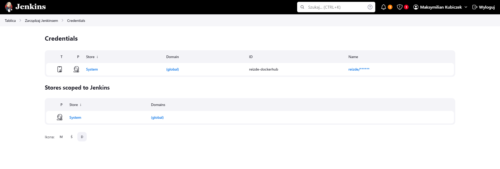
4. Wybierz domenę - Wybierz domenę, do której chcesz dodać dane uwierzytelniające. Najczęściej używa się domeny (global).
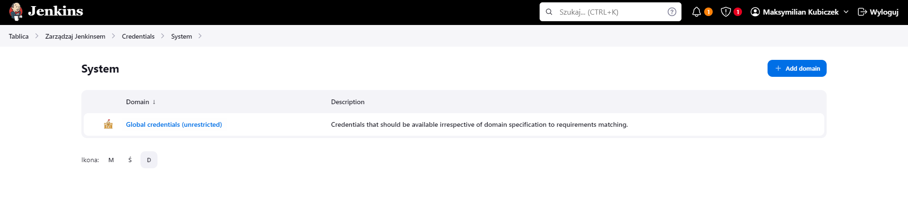
5. Dodaj nowe dane uwierzytelniające


#### Stage 'Clone':

    stage('Clone') {
        steps {
            script {
                sh "rm -rf MDO2024_INO || true"
                sh "git clone https://github.com/InzynieriaOprogramowaniaAGH/MDO2024_INO.git MDO2024_INO"
                sh "docker network create pipeline || true"
                dir ("MDO2024_INO/INO/GCL2/MK412502/Sprawozdanie3") {
                    sh "git checkout MK412502"
                }
            }
        }
    }

- Usuwa istniejący katalog MDO2024_INO, jeśli istnieje.
- Klonuje repozytorium z GitHub.
- Tworzymy sieć Docker pipeline, jeżeli jeszcze nie istnieje.
- Przechodzi do określonego katalogu i wykonuje git checkout na gałęzi MK412502.

#### Stage 'Build':

    stage('Build') {
        steps {
            dir ("MDO2024_INO/INO/GCL2/MK412502/Sprawozdanie3") {
                sh "docker build -t node-builder -f ./builder.dockerfile ."
            }
        }
    }

Blok ten odpowiedzialny jest za przeprowadzenie procesu budowania projektu, i zamknięcie go w obrazie dockera.
- Wskazuje katalog z kodem.
- Buduje obraz Docker o nazwie node-builder przy użyciu pliku builder.dockerfile.

#### Stage 'Test':

    stage('Test') {
        steps {
            dir ("MDO2024_INO/INO/GCL2/MK412502/Sprawozdanie3") {
                sh "docker build -t node-test -f ./tester.dockerfile ."
            }
        }
    }

Blok ten zleca przeprowadzenie testów w nowym kontenerze bazującym na obrazie uzyskanym w bloku Build.
- Przechodzi do katalogu z kodem.
- Buduje obraz Docker o nazwie node-test używając pliku tester.dockerfile.

#### Stage 'Deploy':

    stage('Deploy') {
        steps {
            dir ("MDO2024_INO/INO/GCL2/MK412502/Sprawozdanie3") {
                sh "docker build -t app-jenkins -f ./deploy.dockerfile ."
                sh "docker tag app-jenkins reizde/node-jenkins"
                sh "docker rm -f node-jenkins || true"
                sh "docker run --name node-jenkins --rm -d -p 3000:3000 --network=pipeline reizde/node-jenkins"
            }
        }
    }

- Buduje obraz Docker o nazwie app-jenkins z pliku deploy.dockerfile.
- Oznacza ten obraz jako reizde/node-jenkins.
- Usuwa istniejący kontener node-jenkins, jeśli taki istnieje.
- Uruchamia nowy kontener node-jenkins z portem 3000 otwartym na zewnątrz, korzystając z sieci pipeline.

#### Stage 'Publish':

    stage('Publish') {
        steps {
            sh "docker rmi curlimages/curl || true"
            script {
                def response = sh script: "docker run --network=pipeline --rm curlimages/curl:latest -L -v http://node-jenkins:3000", returnStdout: true
                if (response.contains("Express")) {
                    sh "echo $CREDS_PSW | docker login -u reizde --password-stdin"
                    sh 'docker push reizde/node-jenkins'
                } else {
                    error "Response does not contain App!"
                }
            }
        }
    }

- Usuwa istniejący obraz curlimages/curl, jeśli taki istnieje.
- Uruchamia kontener curl i sprawdza odpowiedź serwera aplikacji uruchomionej na node-jenkins.
- Jeśli odpowiedź zawiera słowo "Express", loguje się do Docker Hub i przesyła obraz reizde/node-jenkins.
- Jeśli odpowiedź nie zawiera słowa "Express", pipeline kończy się błędem.

Czasy ostatniego przejścia pipelina:

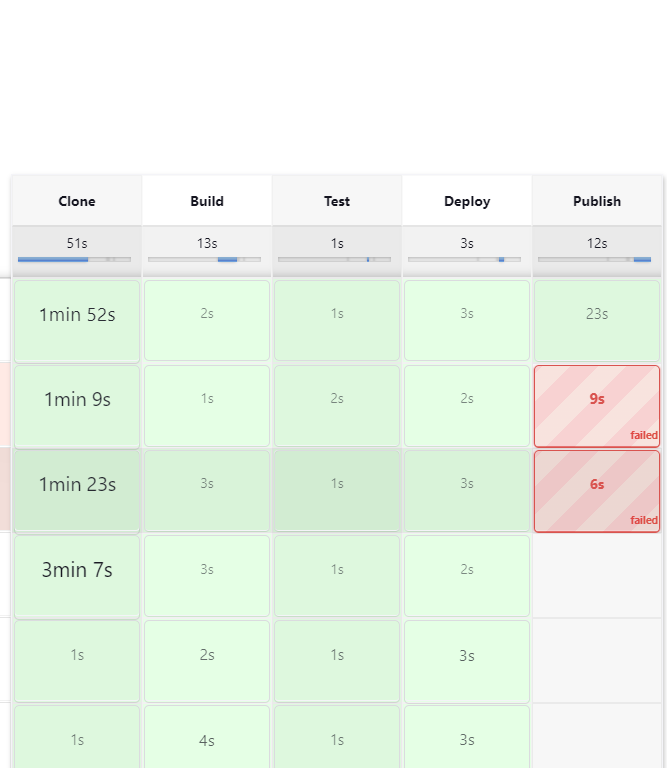


Finalnym wynikiem naszego pipelina jest stworzenie obrazu dockera oraz umieszczenie go na dockerHub.
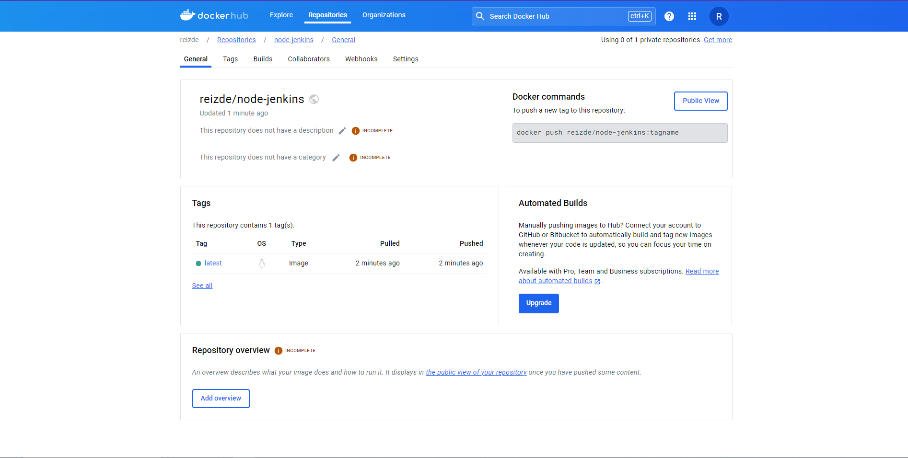


**[X] Pliki Dockerfile i Jenkinsfile dostępne w sprawozdaniu w kopiowalnej postaci oraz obok sprawozdania, jako osobne pliki**

Pliki Dockerfile oraz Jenkinsfile są załączone w folderze ze sprawozdaniem.
