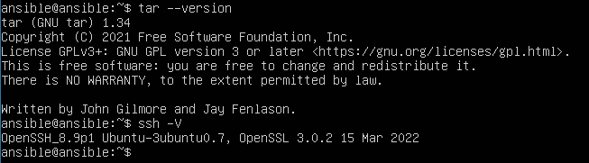
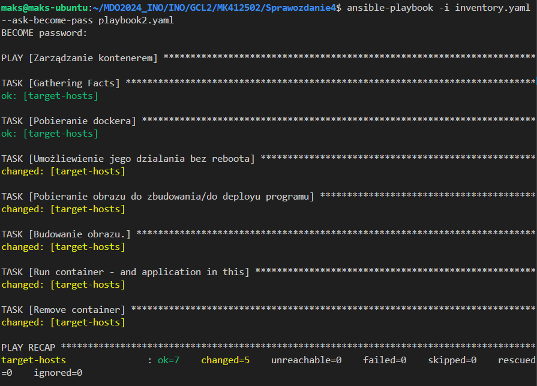

# Sprawozdanie 4

## Maksymilian Kubiczek IO GCL2

### Automatyzacja i zdalne wykonywanie poleceń za pomocą Ansible

### Cel projektu

Celem projektu jest nauczenie się korzystania z Ansible, które pozwala na zdalne wykonywanie poleceń na wielu maszynach jednocześnie. Planuje się wykorzystanie Ansible do instalacji, konfiguracji i zarządzania serwerami oraz aplikacjami, co usprawni procesy administracyjne i zapewni spójność środowiska. Projekt obejmuje również zarządzanie kontenerami za pomocą Ansible, co umożliwi elastyczne i efektywne zarządzanie aplikacjami w kontenerach.

### Instalacja zarządcy Ansible
* Utwórz drugą maszynę wirtualną o **jak najmniejszym** zbiorze zainstalowanego oprogramowania

    W programie VirtualBox utworzyłem nową maszynę wirtualną z systemem operacyjnym Ubuntu, takim samym jak na maszynie głównej. Ustawiłem minimalne zasoby i konfiguracje. Podczas instalacji w interfejsie graficznym zaznaczyłem opcję instalacji serwera OpenSSH. Program 'tar' był już zainstalowany domyślnie. Następnie sprawdziłem wersje programów 'tar' i serwera 'OpenSSH(sshd)', aby upewnić się, że są zainstalowane.

    

* Na głównej maszynie wirtualnej (nie na tej nowej!), zainstaluj [oprogramowanie Ansible](https://docs.ansible.com/ansible/latest/installation_guide/index.html), najlepiej z repozytorium dystrybucji

     

* Wymień klucze SSH między użytkownikiem w głównej maszynie wirtualnej, a użytkownikiem `ansible` z nowej tak, by logowanie `ssh ansible@ansible-target` nie wymagało podania hasła

Zanim wymieniłem klucze między maszynami podjąłem próbę połaczenia się z maszyny głównej do maszyny ansible-target. Aby było to możliwe musiałem odpowiednio zmodyfikować ustawienia sieci w maszynach. W tym celu stworzyłem wewnętrzną sieć NAT, a następnie w ustawieniach poszczególnych maszyn dodałem opcję korzystania z tej właśnie sieci, tak aby maszyny miały różne adresy (początkowo obie pokazywały 10.0.2.15)
  
  

Konieczne było też przekazanie portów wewnątrz sieci. Poniżej znajduje się wynik pierwszego łączenia maszyn

  

Również możemy łączyć się za pomocą hostname'a maszyny

  

Jak widzimy podczas łączenia jesteśmy proszeni o podanie hasła wymaganego do zalogowania na maszynę. Dlatego konieczna jest wymiana kluczy, aby podczas kolejnych operacji pominąć konieczność wpisywania hasła. W tym celu przekazałem PUBLICZNY klucz do maszyny ansible-target za pomocą:

    ssh-copy-id -i ~/.ssh/id_rsa.pub ansible@ansible-target

  

Dzięki przekazaniu klucza logowanie odbywa się bez konieczności podawania klucza

  

### Inwentaryzacja

####  Ustalenie nazw i zweryfikowanie łączności między maszynami.

Nazwy maszyn zostały wcześniej zdefiniowane. Maszyna główna nazywa się maks-ubuntu, a druga maszyna to ansible. Proces dodawania nazwy do serwera DNS, czyli pliku /etc/hosts, został opisany powyżej w kontekście dodawania nowej maszyny. Host jakub-serv został również dodany do nowej maszyny w ten sam sposób.

Potwierdzenie nazw hostów możemy wykonać za pomocą komendy hostname:

  

  

Co do potwierdzenia dodania nazw do serwera DNS, zrobimy to sprawdzając łączność za pomocą komendy:

    ping -c 4

Spowoduje to wysłanie 4 pakietów i zwróci wyniki dot. łączności.

  

#### Stworzenie pliku inwentaryzacji

Korzystając z załączonej instrukcji, stworzyłem plik w formacie .yaml, ponieważ uważam, że jest bardziej czytelny i przejrzysty. Dzięki plikowi inventory.yaml Ansible może zarządzać wieloma hostami przy użyciu jednej komendy, co znacząco upraszcza pracę.

W pliku inwentarza wyróżnię dwie sekcje: Orchestrators oraz Endpoints. Głównym serwerem będzie maks-ubuntu, a serwerem docelowym będzie ansible-target. Oba serwery zostaną dodatkowo umieszczone w grupie networks.

Cały plik prezentuje się następująco:

    Orchestrators:
    hosts:
        host-maks-ubuntu:
          ansible_host: maks-ubuntu
          ansible_user: maks

    Endpoints:
        hosts:
            target-hosts:
              ansible_host: ansible-target
              ansible_user: ansible
            
    network:
      children:
        Orchestrators:
        Endpoints:

#### Żądanie ping do wszystkich maszyn:

Grupa network pozwala mi na wysłanie ping'a do wszystkich maszyn korzystając z pliku inwentaryzacyjnego.
Aby to uczynić korzystamy z poniższej komendy:

    ansible -i inventory.ini network -m ping

Poszczególne opcje są odpowiedzialne za kolejno: -i określa plik inwentaryzacyjny, -m określa moduł z jakiego będziemy korzystać (w tym przypadku jest to ping).

  

Trzeba nadmienić fakt, że początkowo występował jeden problem dotyczącego nie posiadania permisji do naszego "dyrygenta", ponieważ nie wymieniliśmy klucza, z maszyny na której pracujemy do niej samej. Po przekazaniu klucza problem zostaje rozwiązany.

Możemy też uściślić, dla jakich maszyn wykonać dany moduł. Na przykład ping dla samych punktów docelowych uzyskamy stosując:

    ansible -i inventory.yaml Endpoints -m ping

  

### Zdalne wywoływanie procedur

Wszystkie wymienione kroki w tej części wykonam zawierając je w jenym playbook'u.

Playbook to plan automatyzacji w formacie YAML, który Ansible wykorzystuje do wdrażania i konfigurowania zarządzanych węzłów.
Plik, nad którym będę pracować, to playbook.yaml. Umieszczę w nim odpowiednie zadania zgodne z tymi wymienionymi w instrukcji.

Wyślij żądanie `ping` do wszystkich maszyn

    - name: Żądanie ping do wszystkich maszyn
      hosts: network
      tasks:
      - name: Ping all
          ansible.builtin.ping:

Definiuję hosty jako całą sieć i używam wtyczki ansible.builtin.ping.

Skopiuj plik inwentaryzacji na maszyny/ę `Endpoints`
W tym kroku używam modułu 'copy' z wbudowanych modułów Ansible. Najpierw określam źródło, czyli lokalną ścieżkę do pliku inventory na głównej maszynie. Następnie wskazuję ścieżkę, do której plik ma być skopiowany na zdalnym hoście. Dodatkowo powtarzam operację kopiowania, aby porównać różnicę w wynikach.

    - name: Zadania dotyczące hostów w Endpoints
      hosts: Endpoints
      tasks:
        - name: Kopiowanie pliku inwentaryzacji na maszynę Endpoints
          copy:
            src: ~/MDO2024_INO/INO/GCL2/MK412502/Sprawozdanie4/inventory.yaml
            dest: ~/inventory.yaml

Ponów operację, porównaj różnice w wyjściu

    - name: Ponowna operacja kopiowania
      copy:
        src: ~/MDO2024_INO/INO/GCL2/MK412502/Sprawozdanie4/inventory.yaml
        dest: ~/inventory.yaml

Zaktualizuj pakiety w systemie
Aktualizacja pakietów zostanie wykonana za pomocą wtyczki ansible.builtin.apt. Musimy określić, co chcemy zrobić: pobrać, zaktualizować, usunąć. Dlatego określiłem nazwę jako '*', co pozwala na aktualizację wszystkich pakietów, a stan jako 'latest', co oznacza, że pakiety zostaną zaktualizowane do najnowszych wersji.

    - name: Aktualizacja pakietów
      become: true
      ansible.builtin.apt:
        name: "*"
        state: latest

Zrestartuj usługi `sshd` i `rngd`
W tym kroku w playbooku Ansible wykonuję restart dwóch usług systemowych: 'sshd' i 'rngd'. Do zarządzania nimi używam wbudowanego modułu Ansible 'systemd_service', przeznaczonego do manipulacji usługami systemowymi na systemach używających 'systemd'. Określam nazwę odpowiednich usług systemowych i ustalam docelowy stan usługi na 'restarted', co oznacza, że usługa zostanie zrestartowana.

    - name: Restart usługi sshd
      become: true
      ansible.builtin.service:
        name: sshd
        state: restarted

    - name: Restart usługi rng-tools
      become: true
      ansible.builtin.service:
        name: rng-tools
        state: restarted

Różnica pomiędzy pierwszym kopiowaniem pliku a drugim, polega na tym, że pierwszy raz zwraca nam status CHANGED, a drugi OK. Oznacza to, że za pierwszym razem dokonaliśmy zmian (skopiowaliśmy plik), za drugim nie było takiej potrzeby, bo plik był juz na miejscu, dostaliśmy więc odpowiedni status.

Poniżej znajduje się wynik wykonania poleceń z playbook'a.

  

### Zarządzanie kontenerem

Ten fragment instrukcji polega na wdrożeniu aplikacji działającej w trybie ciągłym na maszynie ansible-target. Wykonamy to poprzez napisanie odpowiedniego playbook'a i modyfikacji plików dockerfile w celu zawarcia całego procesu w jednym pliku.

Zawartość playbook'a:

    - name: Zarządzanie kontenerem
      hosts: Endpoints
      tasks:
        - name: Pobieranie dockera
          become: true
          ansible.builtin.apt:
            name: docker.io
            state: latest
      
        - name: Umożliewienie jego dzialania bez reboota
          become: true
          command: systemctl enable --now docker

        - name: Pobieranie obrazu do zbudowania/do deployu programu
          copy:
            src: ~/MDO2024_INO/INO/GCL2/MK412502/Sprawozdanie4/deploy.dockerfile
            dest: ~/node_app/Dockerfile

        - name: Budowanie obrazu.
          become: true
          community.docker.docker_image:
            name: deploy
            build:
              path: /home/ansible/node_app/
            source: build

        - name: Run container - and application in this
          become: true
          community.docker.docker_container:
            name: app
            image: deploy

        - name: Remove container
          become: true
          community.docker.docker_container:
            name: app
            state: absent

W pierwszej kolejności wykonujemy polecenia aktualizacji pakietów oraz instalacji Dockera bez którego nie jesteśmy w stanie pracować na skonteneryzowanej aplikacji.
Następnie na podstawie dockerfile'a skopiowałem go na maszynę docelową oraz zbudowałem obraz (drugą możliwą opcją było pobranie obrazu z docker Huba, jednakże nie byłem zadowolony odnośnie tamtego zbudowanego obrazu podczas zajęć z pipeline). Minuesem tego rozwiązania jest zajmowanie dodatkowego miejsca na dysku maszyny wdrożeniowej, ponieważ nie uwzględniłem usunięcie kontenera bazowego po etapie budowania. Finalenie na podstawie obrazu uruchamiamy kontener.

Po uruchomieniu playbook'a otrzymujemy następujący wydruk:

  

Dodatkowo widzimy na maszynie, że obraz został poprawnie zbudowany:

  

### Nienadzorowana instalacja

Głównym celem zajęć jest przygotowanie źródła służącego do instalacji systemu dla maszyny wirtualnej.

Finalnym efektem zajęć będzie uzyskanie nienadzorowanej instalacji wybranego systemy operacyjnego (w moim przypadku będzie to fedora 39). Dodatkowo na maszynie uruchomimy aplikację w trybie ciągłym.

Pierwszym krokiem będzie przeprowadzenie standardowej instalacji fedory w trybie nadzorowanym. Po pomyślnym przejściu całego procesu instalacyjnego utworzy się plik **anaconda-ks.cfg** znajdujący się w lokalizacji : /root/:. Jest to plik zawierający odpowiedzi na pytania zadaniwane podczas procesu instalacyjnego. Dlatego też kopiujemy go i umieszczamy na naszej gałęzi w repozytorium w folderze ze sprawozdaniem.
Kolejnym krokiem jest edycja pliku, tak ayb uzupełnić go o wymagane elementy.

  

Dopisanie wzmianek o wykorzystanych repozytoriach, ponieważ pliki nie zawierają o nich żadnych informacji:

    url --mirrorlist="http://mirrors.fedoraproject.org/mirrorlist?repo=fedora-39&arch=x86_64"
    repo --name=updates-released --mirrorlist=http://mirrors.fedoraproject.org/mirrorlist?repo=updates-released-f39&arch=x86_64

Czyszczenie partycji przy instalacji

    clearpart --all

Nadanie hostname:

    network  --hostname=mkubiczek

I na samym końcu dodajemy polecenie do ponownego boot'a

    reboot

W tym momencie otrzymujemy kompletny plik pozwalający na nienadzorowana instalację systemu fedora 39.
Teraz skoro aktualny plik znajduje się na naszej gałęzi jesteśmy w stanie przekazać go do instalatora. Wykorzystamy do tego zmienną inst.ks, którą uzupełnimy podczas instalacji.
W virtualboxie podczas instalacji używamy tego wraz z początkiem instalacji. Przy uruchomieniu pierwszych opcji naciskamy przyciks **e**, która otwiera tryb GRUB, gdzie dodajemy wcześniej wspomniają zmienną i przypisujemy jej link do pliku anaconda-ks.cfg w trybie RAW na githubie (umożliwia to pobranie pliku poprzez wget).
Dlatego w moim przypadku będzie to wyglądać w następujący sposób:

    inst.ks=https://raw.githubusercontent.com/InzynieriaOprogramowaniaAGH/MDO2024_INO/MK412502/INO/GCL2/MK412502/Sprawozdanie4/anaconda-ks.cfg

  

I po uruchomieniu cała instalacja przebiega w sposób automatyczny:

  
  

Po zakończeniu instalacji po raz kolejny pojawia się ekran instalacyjny. Tym razem jednak należy wejść w zakładkę Troubleshooting i wejść w opcję Boot first drive.