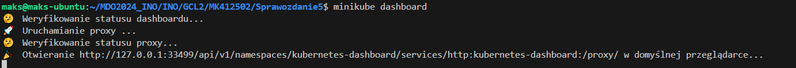

# Sprawozdanie 5
## Instalacja Kubernetes
Wykorzystałem załączoną [instrukcję](https://minikube.sigs.k8s.io/docs/start/?arch=%2Flinux%2Fx86-64%2Fstable%2Frpm+package) zainstalowałem minikube na swoim systemie (w moim przypadku jest to Ubuntu Server):


Zapewniłem również, aby moja maszyna spełniała wymagania minimalne do poprawnego działania Kubernetesa (20 GB wolnej pamięci dyskowej, minimum 2 rdzenie procesora oraz +2GB RAMu).
Następnie uruchomiłem minikube następującą komendą:

```
minikube start
```


Następnie pobrałem kubectl, które służy do monitorowania zasobów użytkownika, takich jak działanie podów, deploymentów czy usług. Wykonałem polecenie:

```
minikube kubectl -- get po -A
```

a także utworzyłem alias, aby ułatwić sobie dalszą pracę:

```
alias kubectl="minikube kubectl --"
```

Następnie możemy już uruchomić nasz dashboard Kubernetes. Jest to graficzny interfejs pozwalający użytkownikowi na swobodne zarządzanie clustrami. W moim przypadku dashboard uruchomił się automatycznie, ponieważ korzystam z Visual Studio Code, posiadającego port forwarding.

```
minikube dashboard
```




Obecnie dashboard jest pusty, ponieważ to jest moje pierwsze uruchomienie dashboarda.

## Wdrażanie kontenera za pomocą Kubernetes
Podczas wdrażania kontenera trzeba zwrócić uwagę na jego sposób działania. W tym przypadku wybrałem prostego Nginx'a, który wyświetla tekst oraz aktualną datę, godzinę oraz dzień tygodnia.

W tym celu stworzyłem Dockerfila, który posłuży do zbudowania obrazu dockera:

```
FROM nginx:alpine

COPY Deploy/index.html /usr/share/nginx/html/index.html
```

Zamiast logować się do Docker Hub w celu opublikowania tego testowego kontenera, możemy utworzyć lokalny rejestr dla Minikube i ustawić odpowiednią opcję "imagePullPolicy". Warto jednak pamiętać, że jest to rozwiązanie tymczasowe dla każdego otwartego terminala i może nie nie zadziałać w środowisku produkcyjnym.

```
eval $(minikube docker-env)

docker build -t simple-nginx .
```

Ten obraz jest zbudowany lokalnie (dla daemona minikube), aby miał do niego bezpośredni dostęp. Teraz należy sprawdzić, czy nasz zbudowany obraz jest w stanie działać w trybie ciągłym, zatem uruchamiamy go:

```
docker run -d --rm -p 50:50 --name simple-nginx simple-nginx
```


Po nadaniu tagu w celu rozpoznania wersji 1.0, można uruchomić go na stosie k8s za pomocą komendy:

minikube kubectl -- run simple-nginx --image=simple-nginx:1.0 --port=50 --image-pull-policy=Never

Wyniki obserwujemy w dashboardzie:


Aby przeglądać pody z poziomu terminala możemy wspomóc się komendą:

```
minikube kubectl get pods
```

Możemy też wprowadzić port-forwarding korzystajać z polecenia:

```
minikube kubectl port-forward pod/simple-nginx 5050:50
```

