# Sprawozdanie 1 
Maciej Radecki
Numer indeksu 413227
Inżynieria Obliczeniowa grupa II
# Cel projektu
Celem projektu było zapoznanie się z GitHubem, czy jest i jak działa repozytorium oraz nauka podstawowych komend do obsługi Githuba. Drugie zajęcia miały na celu pokazanie nam podstawowych komend używanych z Docker'em. 
# Wykonanie 
### 1. Instalacja klienta Git i obsługa kluczy SSH
Pierwszym krokiem było zainstalowanie Ubuntu na maszynie wirtualnej, podczas instalacji zaznaczona została opcja umożliwiająca pobranie OpenSSh automatycznie. Nastepnie zostało sprawdzone za pomocą poniższego polecenia czy instalacja przebiegła prawidłowo.
```
git --version
```
Po wpisaniu tej komendy powinna się wyświetlić aktualna wersja Gita.
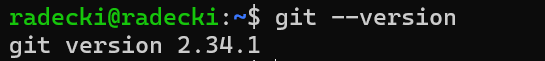 
Sytuacja dotycząca zarządzania kluczami SSH jest bardzo podobna. Jeśli wcześniej zdecydowaliśmy się na instalację OpenSSH, nie powinniśmy napotkać żadnych problemów z obsługą kluczy. W końcu stanowi to element protokołu SSH.
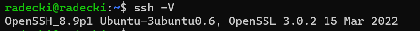
### 2. Klonowanie repozytorium za pomocą protokołu HTTPS i personal access token
Aby prawidłowo skopiować repozytorium za pomocą protokołu HTTPS wykorzystano poniższą komendę. 
```
git clone link_https_do_repozytorium
```
Polenie w terminalu wyglądało następująco:
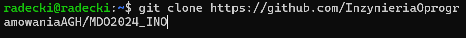
Kolejnym krokiem tego zadanie było utworzneie na swoim koncie token, który wykorzystano do osobnego sklonowania repozytorium. Token został utworzony w utawieniach a następnie w ścieżce Developer settings -> Personal access tokens -> Fine-grained tokens. 
```
git clone https://wygenerowany_token@dalsza_czesc_linku_skopiowanego_z_githuba
```
Przy pomocy powyższego polecenia wykonano klonowanie repozytorium. Poniższy screen przedstawia wykonanie tego klonowania.
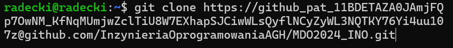
### 3. Klonowanie repozytorium za pomocą protokołu SSH
Kolejnym zadanie polegało na utworzeniu klucza SSH. W celu utworzenia go użyto nastepyjącego polcenia.
```
ssh-keygen 
```
Następnie użyto poniższego polecenia w celu wyświetlenia zawartości publicznego klucza SSH (id_rsa.pub) w terminalu lub konsoli systemu. 
```
cat ./.ssh/id_rsa.pub
```
Poniższy screen przedstawia wykonane zadanie.
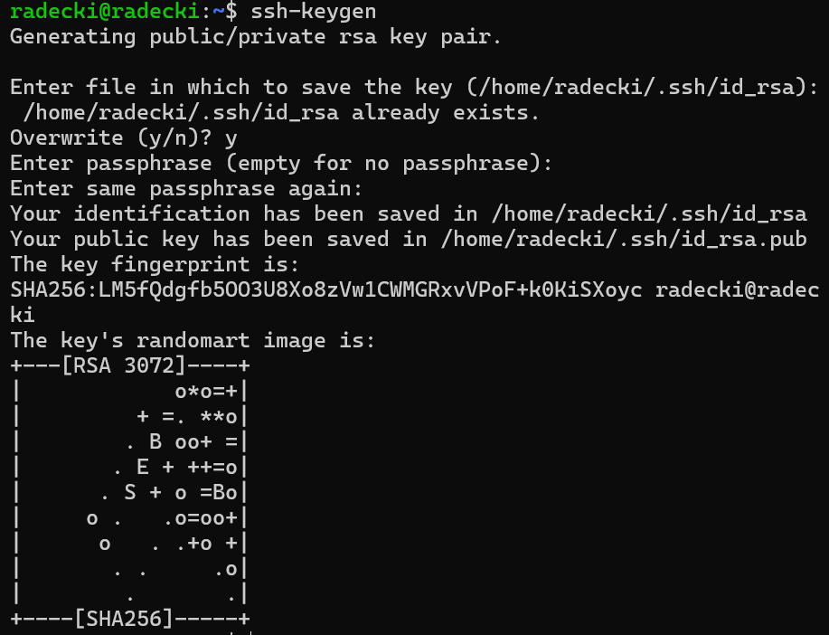
Następnie klucz publiczny został skopiowany i dodany do konta na Githubie
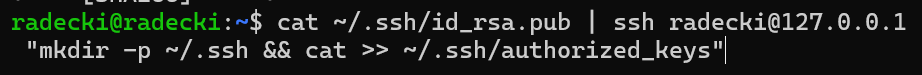
Plik "id_rsa.pub" miał w sobie zapisany publiczny klucz SSH, co umożliwiało zmiany w repozytorium bez potrzeby autoryzacji za pomocą hasła. Zostało to wykonane za pomocą poniższego polecenia.
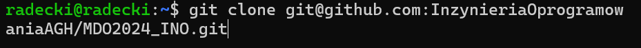
### 4. Utworzenie i przełączenie się na swoją indywidualną gałąź
Moja osobista gałąź będzie miała nazwę MR410206. Przy klonowaniu repozytorium automatycznie znajdujemy się na gałęzi "main". W celu przełączenia się na inną gałąź użyłem poniższego polecenia.
```
git checkout NAZWA_GALEZI
```
Aby utworzyć nową gałąź wystarczy dodać opcje -b. Przy tworzeniu nowej gałęzi, od razu przenosimy się na nowoutworzoną gałąź. W celu wykonania zadania czyli utworzenia własnej gałęzi należało najpierw przejść na gałąź odpowiedniej grupy, a nastepnie utworzenie gałęzi <inicjały><numer_indeksu> czyli w moim wypadku: MR410206. Aby sprawdzić na jakiej gałęzi obecnie się znajdujemy można użyć poniższego polecenia.
```
git branch
```
Poniżej znajduje się screen z wykonania nowej gałęzi. 
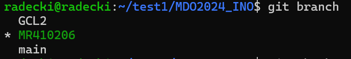
### 5. Utworzenie Git hook
W tym zadaniu należało utworzyć własny skrypt, który sprawdza poprawność commit message przed wykonaniem funkcji commit. W celu wykonania tego podpunktu wzorowałem się na git hook'u z folderu .git/hooks.
Na początku został utworzony plik o nazwie commit-msg we wcześniej utworzonym katalogu MR410206 oraz przekopiowano go w miejsca gdzie będzie on aktywowany na każdym poziomie, nie tylko w moim folderze. Czyli został on przekopiowany do folderu .git/hooks. Poniższy screen przedstawia opisane kroki.
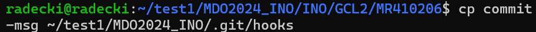
Za pomoca poniższego polecenia zostały dodane odpowiednie uprawnienia.
```
chmod +x commit-msg
```
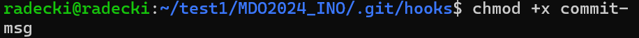
Powyższy screen przedstawia wykonanie komendy "chmod".
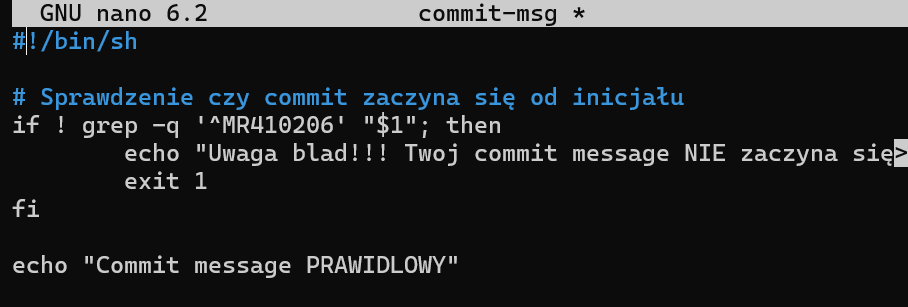
Utworzony Git hook analizuje treść wiadomości wprowadzonej podczas wykonywania commita, porównując ją do wzoru składającego się z moich inicjałów i numeru legitymacji czyli MR410206. W przypadku, gdy treść wiadomości nie zgadza się z tym schematem, pojawia się komunikat o błędzie. Natomiast, jeżeli wiadomość spełnia wymagania formatu, commit jest realizowany bez problemów. Poniższy screen przedstawia efekty uruchomienia git hook'a.
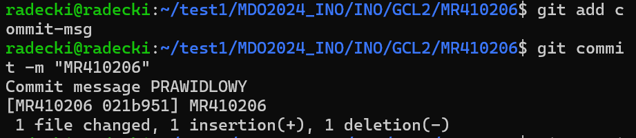
### 6. Napisanie sprawozdania
Sprawozdanie wykonano w formacie markdown, a umieszczono je w katalogu MR410206. Zrzuty ekranu będą dodawane jako zdjęcia inline. Zdjęcia tworzą się przy użyciu zapisu.
```

```
Ścieżka do zdjęcia wyglądała zgodnie z poniższym wzore.
```
./ss/<nazwa zdjęcia>
```
Do przesłania sprawozdania na Github przydatne były poniższe komendy:
```
git add
```
Polecenie to służy do przenoszenia zmodyfikowanych plików do obszaru roboczego w celu zatwierdzenia. 
```
git status
```
Służy do sprawdzenia co zostało do tej pory zmodyfikowane.
```
git commit
```
Polecenie to przenosi zmiany z obszaru roboczego do lokalnego repozytorium. 
```
git push origin "nazwa_gałęzi"
```

Ta komenda przenosi zmiany z lokalnego do zdalnego repozytorium, w ten sposób zmiany zostaną opublikowane i udostępnione. Dzięki powyższemu poleceniu można wysłać zniany  na konkretną gałąź.
# Część druga Docker
### 1. Instalacja Docker w systemie linuksowym
Zadanie polegało na zainstalowaniu Dockera, zostało to wykonane przy pomocy poniższej komendy.
```
sudo zypper install docker
```
Następnie została uruchomiona instalacja przy pomocy poniższego polecenia.
```
sudo apt install docker.io
```
Poniższa komenda służy do wyświetlenia aktualnego statusu usługi Docker.
```
cudo systemctl status docker
```
Poniższy screen przedstawia działanie komendy systemctl status docker, dzięki czemu możemy wnioskować że Docker został dobrze zainstalowany.
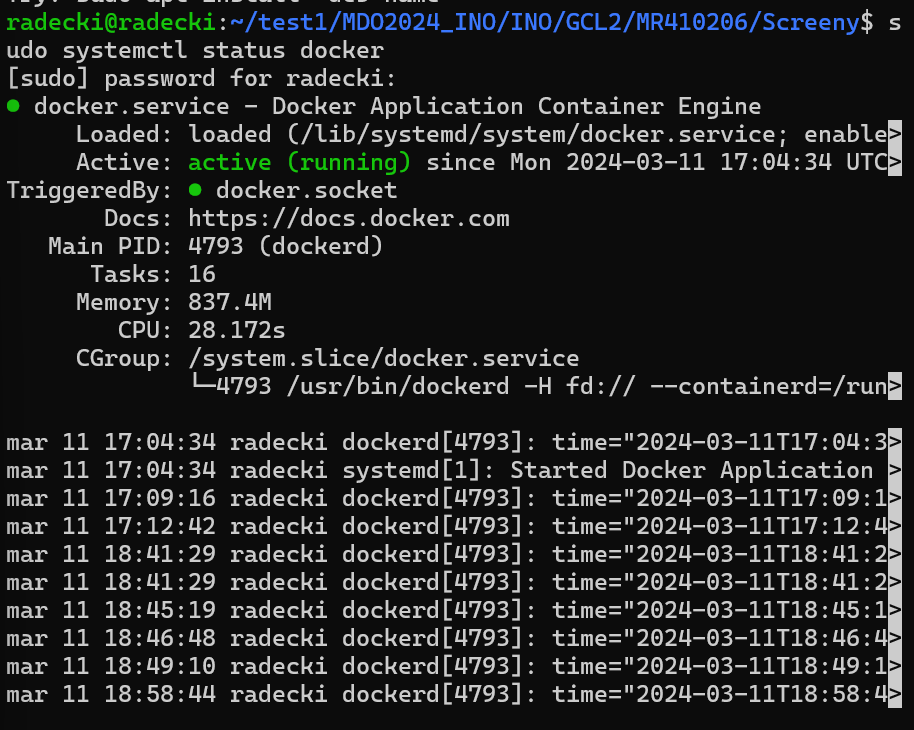
### 2. Rejestracja w systemie Docker Hub
Kolejnym zadaniem było zalogowanie się do systemu Docker Hub, który jest największą społecznością i repozytorium, gdzie 
można przechowywać obrazy Dockera.
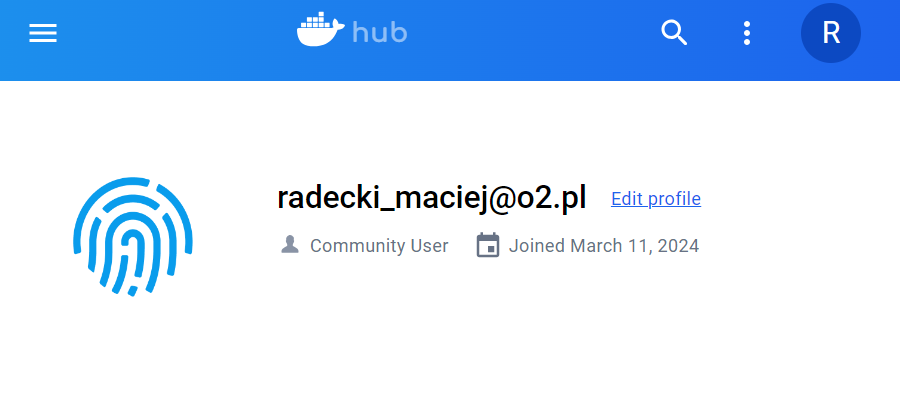
### 3. Pobranie obrazów
Następne zadanie polegało na pobraniu obrazów hello-world, busybox, ubuntu, mysql. Zostałoto wykonane przy pomocy poniższej komendy.
```
docker pull <nazwa_obrazu>
```
Poniższe screeny przedstawiają ściągnięcie podanych obrazów.
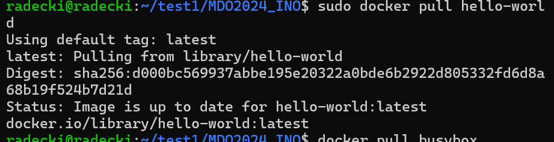
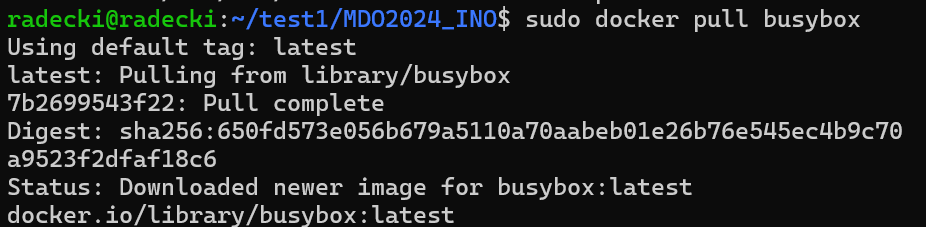

### 4. Uruchomienie kontenera z obrazu busybox
Ogólną komendą do uruchamiania obrazu jest poniższe polecenie.
```
docker run <nazwa_obrazu>
```
Poniższa komenda udowadnia, że kontener został uruchomiony. Funkcja --all pozwala zobaczyć wszystkie kontenery działające i niedziałające.
```
docker container list --all
```
Uruchowmienie i pokazanie wnętrza kontenera busybox przedstawia screen poniżej.
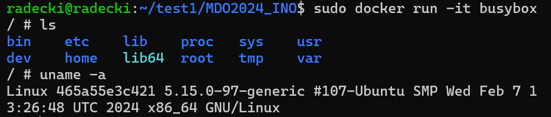

### 5. Uruchomienie systemu w kontenerze
Aby uruchomić system w kontenerze została użyta poniższa komenda.
```
docker run -it nazwa_obrazu
```
Poniższy screen przedstawia odpalenie podanej komendy, oraz polecenia ```ps``` który wyświetla infomacje o procesach w systemie ubuntu.
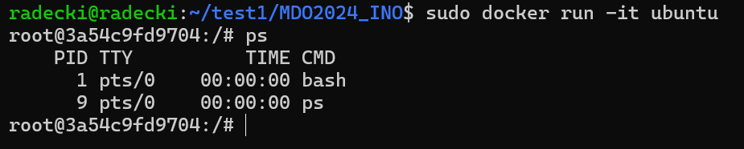
Kolejnym poleceniem było ```top``` W porównaniu do poprzedniego polecenia było narzędzie do interaktywnego monitorowania procesów. Oprócz tego zostały wyświetlone inne informacje takie jak: obciążenie CPU, zużycie pamieci czy też czas działania systemu. Poniższy screen przedstawia konsekwencje uruchomienia tego polecenia.
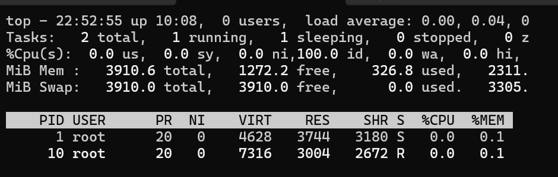
Kolejnym krokiem była aktualizacja pakiety przy użyciu poniższego polecenia.
```
apt update
```
Poniższy screen przedstawia uruchomienie uaktualnienia.
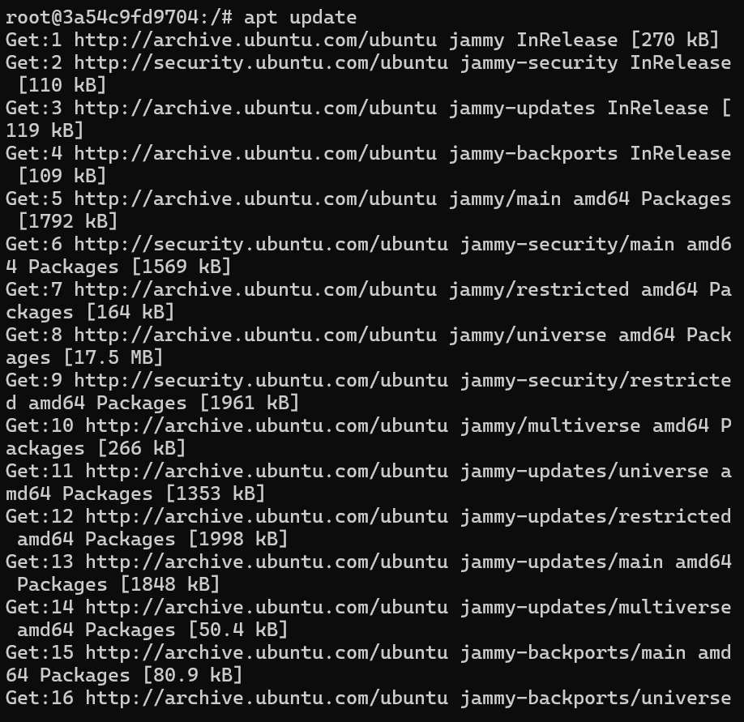

### 6. Utworzenie pliku Dockerfile i klonowanie repozytorium
Pierwszym krokiem było utworzenie pliku Dockerfile. Treść powstawłego pliku przedstawia screen poniżej.
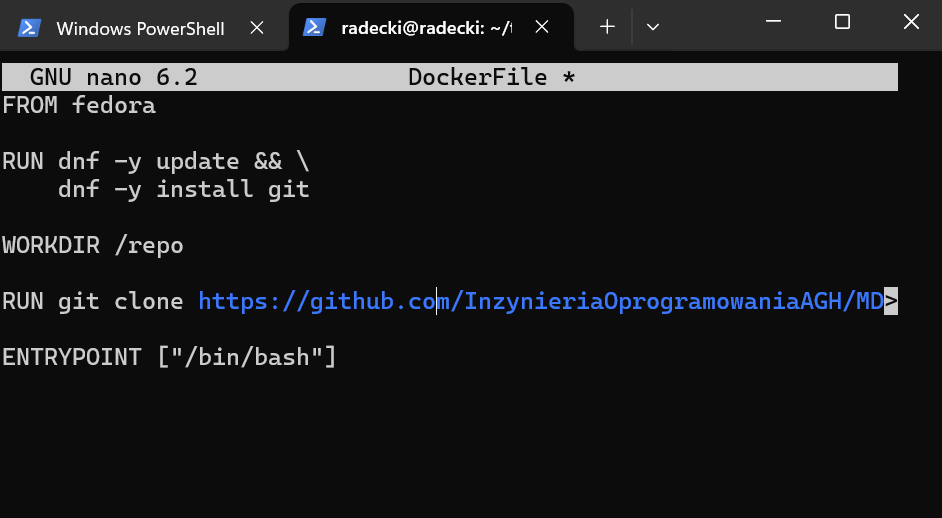
Instrukcja bazuje na obrazie Fedora jako fundament dla tworzenia nowego obrazu.
Za pomocą polecenia ```RUN```, system aktualizuje wszystkie pakiety oraz instaluje narzędzie Git, co umożliwia zarządzanie kodem źródłowym.
Następnie, używając Git, dokonuje się klonowania wybranego repozytorium.
Polecenie ```WORKDIR``` ustawia /repo jako katalog roboczy, co oznacza, że wszystkie kolejne operacje będą wykonywane właśnie w tym miejscu.
Ostatecznie, dzięki ```ENTRYPOINT```, domyślną czynnością kontenera jest uruchomienie interaktywnej sesji Bash. To znaczy, jeśli przy starcie kontenera nie zostanie określone inne polecenie, automatycznie aktywowany zostanie terminal Bash.

Przy pomocy poniższego polecenia zostało uruchomione budowanie obrazu.
```
docker build -t nazwa_pliku .
```
Poniższy screen przedstawia uruchomienie polecenia.
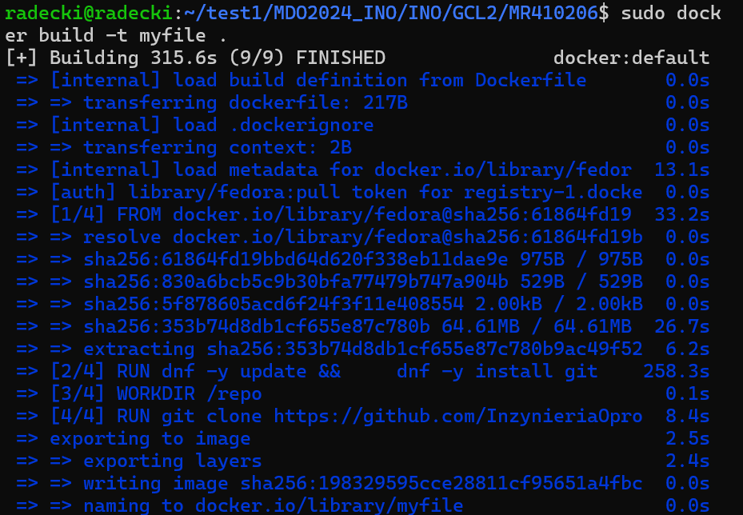
Następnie zostało sprawdzone czy nasz obraz się wybudował i czy zawiera sklonowane repozytorium.
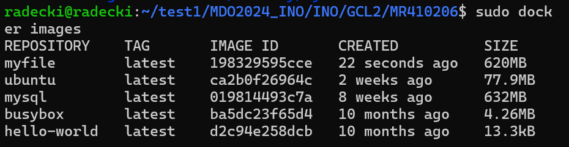


### 7. Uruchomione ( != "działające" ) kontenery i ich czyszczenie
W celu znalezienia wszystkich działających użyto poniższej komendy
```
docker ps -a -f status=exited
```
Opcja -f status=exited pozwalała na ograniczenie wyników do kontenerów które miały status exited - niedziałających.
Poniższy screen przedstawia uruchomienie tego polecenia.
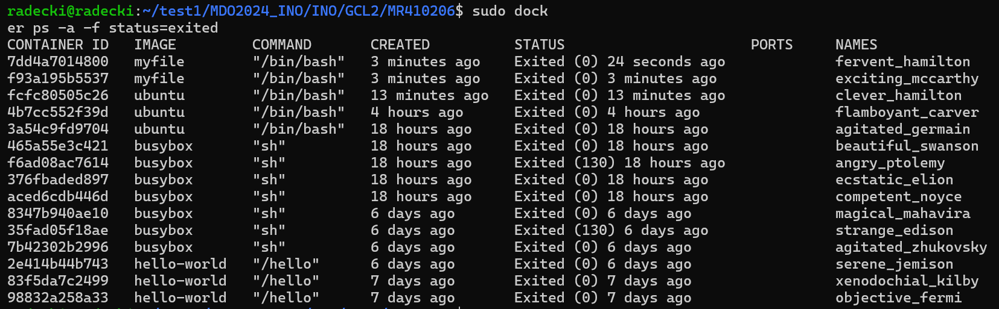
W celu wyczyszczenia niedziałających kontenerów użyto ponizszego polecenia.
```
docker container rm -f $(sudo docker ps -q -a -f status=exited)
```
Polecenie ```rm``` powodowało usunięcie kontenerów, natomiast konkretne polecenia powodowały "-f" wymuszenie tego usunięcia, "-q" zwrócenie identyfikatora, "-a" wypisanie wszystkich. Poniższy screen przedstawia uruchomienie tego polecenia.
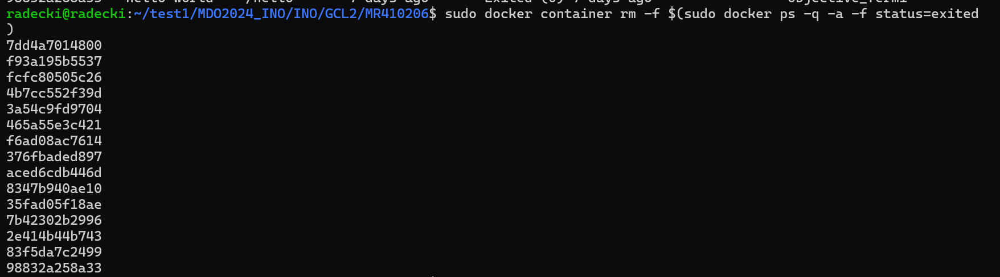
### 8. Usunięcie obrazu
Ostatnim poleceniem do wykonania było usunięcie obrazów, było ono dość analogiczne do czyszczenia kontenerów, jednak z poleceniem "rmi". Dokładne polecenie znajduje się poniżej.
```
docker rmi $(sudo docker images -q -a)
```
Poniższy screen przedstawia uruchomienie polecenia usuwania obrazu.
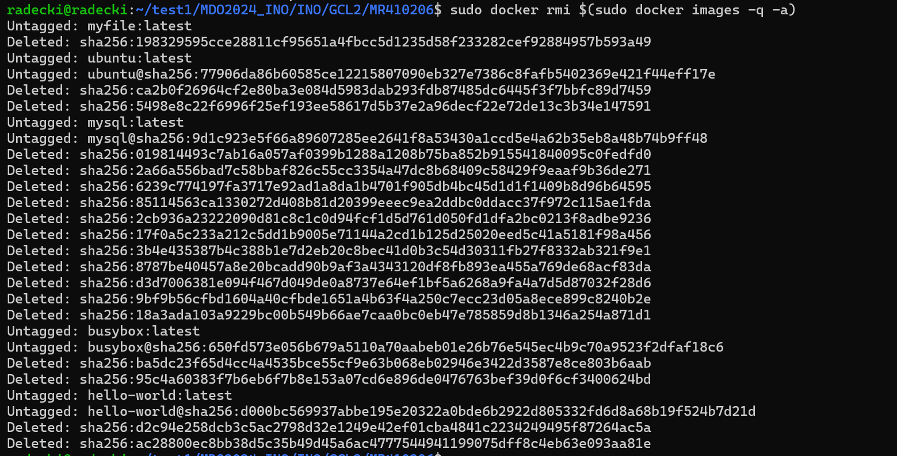
