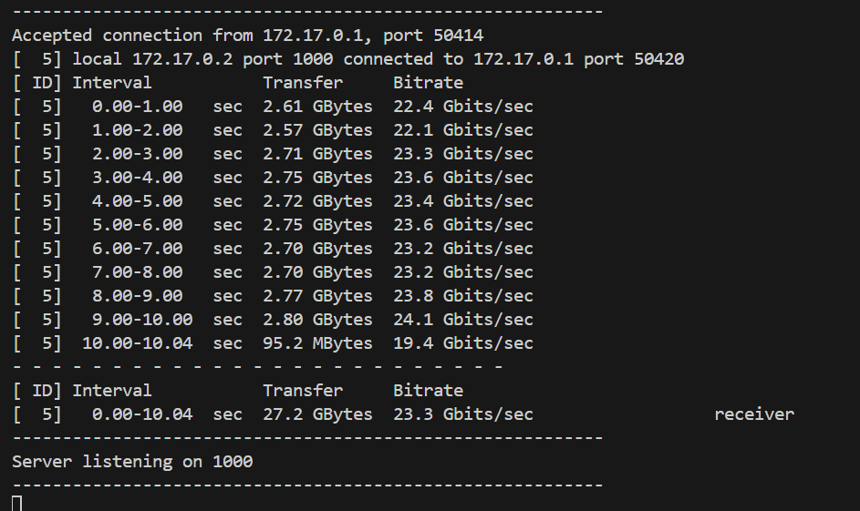

# Sprawozdanie 2
Maciej Radecki 410206
## Cel ćwiczenia
Celem wykonanego ćwiczenia było zapoznanie się z procesem budowy, testowania i wdrażania dowolnego oprogramowania. W tym celu użyto narzędzia Docker. Należało wybrać odpowiednie oprogramowanie i przeprowadzić budowę w kontenerze. W kolejnym etapie zadaniem było stworzenie woluminów i ich podłączenie do kontenera bazowego. Celem było zaznajomienie się z operacjami na kontenerach w Dockerze oraz z narzędziem iperf3, służącym do pomiaru przepustowości sieciowej. Ostatecznie zainstalowano Jenkinsa.
# 1. Wybranie oprogramowania 
Pierwszyk krokiem tego laboratorium było odnalezienie repozytorium na GitHubie, które spełni kilka wymagań. Mianowicie będzie posiadać otwartą licencje, jest zamieszczone wraz ze swoimi narzedziami Makefile tak aby, można było uruchomić make oraz zawiera zdefiniowane i obecne w repozytorium testy, które można uruchomić np. jako jeden z "targetów" Makefile'a. Klonowanie repozytorium odbyło się przy pomicy poniższego polecenia.
```
git clone https://github.com/sanity/LastCalc.git
```
Po sklonowaniu należało przeprowadzić build programu oraz wykonać testy. W tym celu najpierw należało zainstalować odpowiednie środowisko Java przy pomocy poniższego polecenia.
```
sudo apt-get install default-jdk
```
W celu sprawdzenia poprawności instalacji użyto polecenia ```java --version```

Kolejnymi krokami była instalacja Mavena oraz ponownie sprawdzenie instalacji przy pomocy ```mvn --version```

Sugerując się instrukcją zawartą w repozytorium przez autora, w celu uruchomienia buildu oraz testów należalo użyć kolejno po sobie poniższych komend.
```
mvn appengine:devserver
```
```
mvn test
```
Po uruchomieniu podanych komend dostaliśmy informacje o prawidłowym zbudowaniu programu oraz uruchomieniu testów, co przedstawiają screeny poniżej.


Kolejnym krokiem było wykonanie buildu oraz testów w wybranym kontenerze, zdecydowano, że na potrzeby ćwiczenia zostanie to wykonane w kontenerze ubuntu. Na paczątku należąło go uruchomić w trybie interaktywnym, czyli przy pomocy poniższego polecenia.
```
sudo docker run -it ubuntu
```

Następnie należąło ponownie zainstalować wcześniejsze elementy oraz dodatkowo należało dodac do nich gita. Wykonano to przy pomocy poniższego polecenia
```
apt-get install default-jdk
```
```
apt-get install maven
```
```
apt-get install git
```
Po instalacji odpowiednich narzędzi sklonowano repozytorium tym samym poleceniem co wcześniej.
```
git clone https://github.com/sanity/LastCalc.git
```

A na końcu ponownie przeprowadzono budowanie oraz uruchomiono testy porównując je z wynikami poprzednich, ponownie przy pomocy poniższych komend.
```
mvn appengine:devserver
```
```
mvn test
```

# 2. Tworzenie plików Dockerfile
Kolejnym zadaniem było utworzenie dwóch Dockerfile, które miały za zadanie automatyzacje wcześniej wykonanych czynności. Dockerfile jest plikiem konfiguracyjnym, który definiuje wszystkie etapy budowy obrazu kontenera, rozpoczynając od określenia jego nazwy w pierwszej linii. W kolejnych trzech liniach następuje instalacja niezbędnych narzędzi: Git, Java, a także Maven. Po zainstalowaniu wymaganych zależności, Dockerfile instruuje system, aby pobrał kod źródłowy z określonego repozytorium. Następnie, zmienia bieżący katalog na katalog repozytorium, gdzie zostaje uruchomiony proces budowy projektu.

Następnie po utworzeniu powyższego Dockerfile przy pomocy polecenia ```sudo docker build .``` rozpoczęto budowę.

Następnie uruchomiono go przy pomocy poniższego polecenia oraz przy pomocy odpowiednich poleceń sprawdzających wersje mavena i gita sprawdzono czy został on prawidłowo napisany.
```
sudo docker run -it [ID]
```

Zmieniono też REPOSITORY przy pomocy poniższej komendy.
```
sudo docker image tag [IMAGE ID] pierwszy
```

Kolejnym krokiem było utworzenie nowego Dockerfile, tak aby nowy bazował na poprzednim. Nowy Dockerfile miał być teraz odpowiedzialny za testy. Jego treść przedstawia screen poniżej.

Ponownie uruchomiono jego budowę, teraz przy pomocy troszkę zmodyfikowanej komendy ze względu na nową nazwę DockerfileTest.
```
sudo docker build -f DockerfileTest .
```

Ponownie zmieniono REPOSITORY oraz uruchomiono utworzony obraz sprawdzając czy wszytsko zostało poprawnie zainstalowane.


## Dodatkowa terminologia w konteneryzacji
### 3. Przygotowywanie woluminów
Na samym początku przygotowano woluminy wejścia i wyjścia przy pomocy poniższej komendy.
```
sudo docker volume create
```
Następnie przy pomocy kolejnego polecenia została sprawdzona ścieżka gdzie dokładnie się znajdują. Wykonujemy to by w przyszłości wiedzieć gdzie będą się znajdować pliki "in" i "out"
```
sudo docker volume inspect
```

Następnie uruchomiono kontener i zainstalowano ponownie te same elementy co wceśniej, czyli java i maven. Uzyto poniższych poleceń.
```
apt install default-jdk
```
```
apt install maven
```
Kolejnym krokiem było sklonowanie repo na woluminy wejścia. Należąło przejść do miesjca gdzie znajduje się wolumin wejściowy. Za pomocą polecenia ```cd``` udało się przejść do folderu lib. W tym miejscu przy pomocy ```git clone``` został skomplikowane repozytorium. 

Następnie uruchomiono kontener w którym użyto poniższego polecenia.
```
mvn appengine:devserver
```

Po tej komendzie powstał nowy katalog target który został skopiowany na wolumin wyjścia.

To był ostatni krok jeżeli chodzi o zadanie związane z woluminami.
### 4. Eksponowanie portu
Kolejnym zadaniem było eksponowanie portu. Uruchomiono kontener ubuntu, tak jak na screenie poniżej.

Następnie zaisntalowano w nim iperf3 za pomocą ponizszego polecenia.
```
apt install iperf3
```
Kolejnym krokiem było uruchomienie serwera nasłuchując portu o numerze 1000. Wykonano to poniższym poleceniem.
```
iperf3 -s -p 100
```

Następnie należało sprawdzić czy serwer będzie się w stanie połączyć z innegi kontenera. W tym celu zapisany został przeze mnie tak zwany container_id, czyli znaki po root@. Następnie w celu uzyskania odresu IP użyto poniższego polecenia.
```
sudo docker inspect -f '{{range.NetworkSettings.Networks}}{{.IPAddress}}{{end}}' conatiner_id
```

Kolejnym krokiem było otworzenie nowego terminala, otwarcie ponownie kontenera ubuntu, ponowna instalacja iperf3 i użycie poniższego polecenia w celu połączenia.
```
iperf3 -c 172.17.0.2 -p 1000
```

Teraz przechodząc do pierwszego terminalu można zaobserwiwaź też skutki tego połączenia.

Kolejnym zadaniem było połączenie się poprzez własną dedykowaną sieć mostkową. Został uwtorzona własna sieć o nazwie bridges, przy użyciu poniższego polecenia.
```
sudo docker network create bridges
```

Następnie po odczytaniu nazw sieci przy pomocy polecenia ```sudo docker ps``` połączono nowo utworzoną sieć przy pomocy poniższego polecenia.
```
sudo docker network connect nazwa1 nazwa2
```

W celu upewnienia się czy wszystko działa użyto poniższego polecenia.
```
sudo docker network inspect
```
Jak można zaobserwować na poniższym screenie wszystko idzie dobrze.

Następnym poleceniem było połączenie się z serwerem pierwszego kontenera z poziomu hosta. W celu wykoanania tego zadania użyto poniższej komendy.
```
iperf3 -c 172.17.0.2 -p 1000
```

Oraz po raz kolejny mozna było zaobserwować konsekwencje tego połaczenia w terminalu przedstawiającym stronę serwera.

Próby połaczenia się z poza hosta mimo kilku prób i różnych sposobów niestety się nie powiodły.
### 5. Instalacja jenkinsa
Ostatnim zadaniem była instalacja jenkinsa zgodnie z instrukcją ze strony https://www.jenkins.io/doc/book/installing/docker/. Na początku został uwtorzony bridge network z pomocą poniższego polecenia.
```
sudo docker network create jenkins
```

Następnie użyto poniższego polecenia.
```
docker run    --name jenkins-docker    --rm    --detach    --privileged    --network jenkins    --network-alias docker    --env DOCKER_TLS_CERTDIR=/certs    --volume jenkins-docker-certs:/certs/client    --volume jenkins-data:/var/jenkins_home    --publish 2376:2376    docker:dind    --storage-driver overlay2
```
Następnie utworzono nowego Dockerfile o poniższej treści

A kolejnym krokiem było wybudowanie programu za pomocą.
```
sudo docker build -t DockerfileJenkins
```

Nastepnie uruchomiono poniższe polecenie.
```
docker run    --name jenkins-blueocean    --restart=on-failure    --detach    --network jenkins    --env DOCKER_HOST=tcp://docker:2376    --env DOCKER_CERT_PATH=/certs/client    --env DOCKER_TLS_VERIFY=1    --publish 8080:8080    --publish 50000:50000    --volume jenkins-data:/var/jenkins_home    --volume jenkins-docker-certs:/certs/client:ro    DockerfileJenkins
```
Po uruchomieniu tej komendy wyskoczyło okno w przeglądarce o adresie http://localhost:8080 na której to ukazał się Jenkins. 

