# Sprawozdanie 3
Maciej Radecki 410206
## Cel ćwiczenia

## 1. Konfiguracja Jenkinsa

Po zainstalowaniu Jenkinsa na podczas wykonywania poprzedniej instrukcji, należało po otwarciu linku http://localhost:8080 wpisać w odpowiednie okno hasło administratora. 

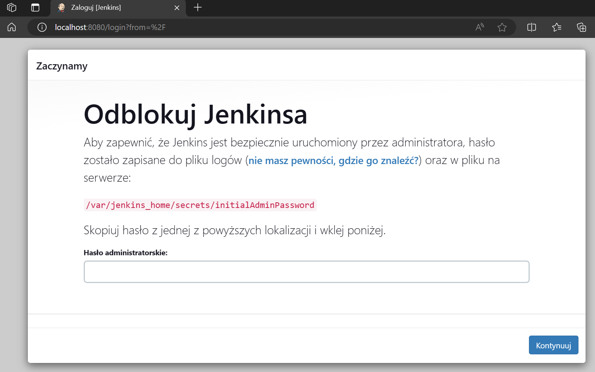

Hasło to odnalazłem dzięki zamieszczonej ścieżce do poliku na owej stronie, której screen znajduje się powyżej. Następnie przeszedłem do dalszej konfiguracji, niestety zapomniałem udokumentować tych kroków, ale po wpisaniu hasła administratora pojawił się wybór dwóch opcji dostosowania Jenkinsa. Wybrałem opcje "Zainstaluj sugerowane wtyczki" lub coś brzmiącego w tym stylu, w każdym razie zainstalowałem sugerowane przez system opcje. Następnie musiałem podać swoje dane do logowania oraz ustawiłem URL Jenkinsa jako http://localhost:8080/. Po czym moim oczom ukazał się obraz taki jak na poniższym zdjęciu.

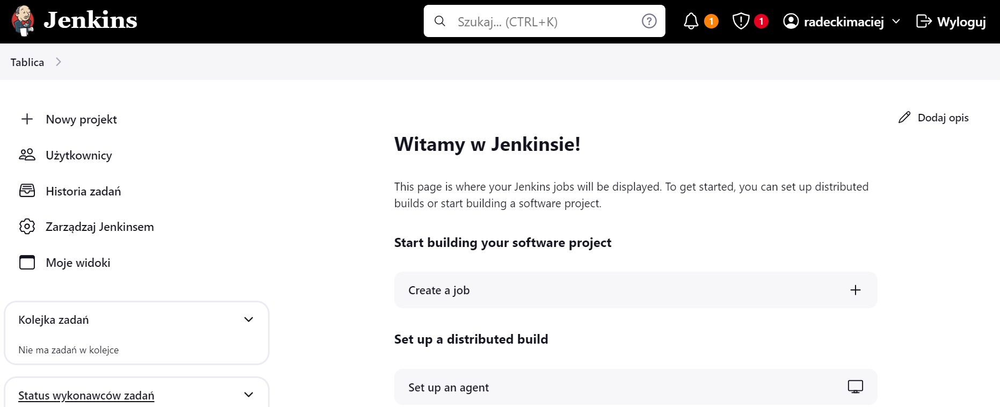

## 2. Pierwsze projekty w Jenkinsie

Na samym początku utowrzyłem nowy projekt o nazwie "uname". Podczas tworzenia użyłem opcji "Ogólny projekt"

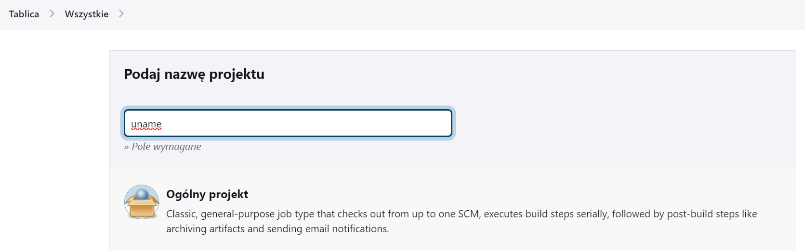

Następnie należało wybrać opcje uruchomienia powłoki również tak jak na screenie ponieżej.

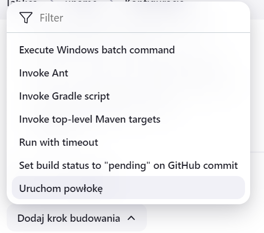

W oknie tekstowym który się pojawił po wybraniu powyższej opcji wpisałem ```uname``` 

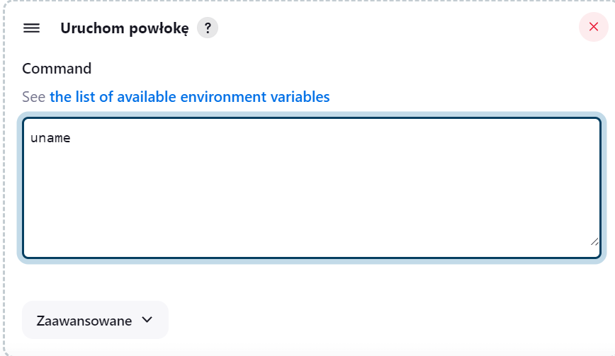

Tak utworzony projekt zostal zapisany, nastepnie uruchomiony. Logi konsoli tego projektu znajdują się poniżej.

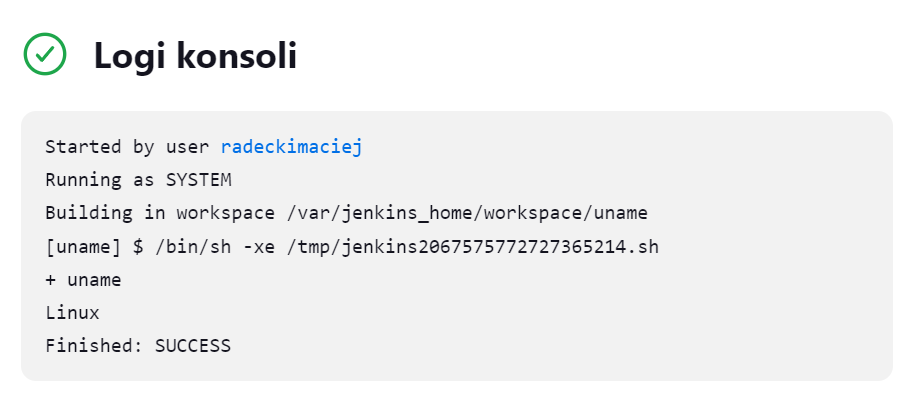

Następnym projektem było zadanie które działa prawidłowo w przypadku gdy godzina jest parzysta, natomiast w przeciwnym przypadku nie będzie działać. W celu wykonanie tego zadania w ten sam sposób utworzyłem nowy projekt, jednak w powłoce został umieszczony odpowiedni kod który ma zrealizować zadanie.

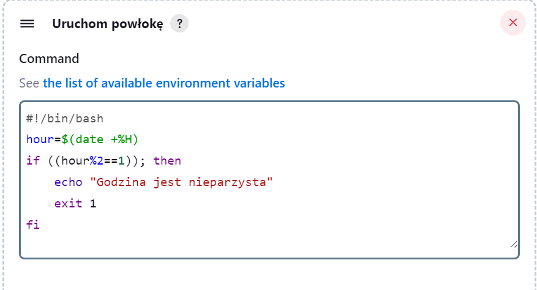

Po uruchomieniu programu sprawdzone zostały logi przy różnych godzinach.


Poniżej screeny dotyczące przypadku godziny nieparzystej.

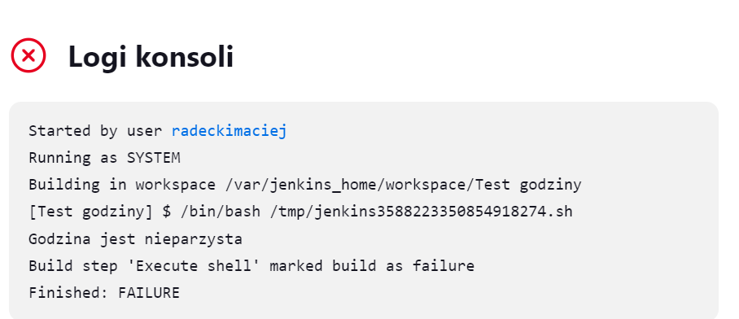
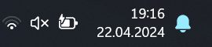

Ostatnim "prostym" zadaniem do wykonania było utworzenie projektu, tak aby następowało kloniwanie repoztorium, przechodzenie na odpowiednią gałąź, czyli MR410206 oraz budowanie obrazów z dockerfiles. Jak poprzednio został utworzony nowy projekt, ponownie z opcją "ogólny projekt", natomiast w tym przypadku została bygrana opcja "Git" która została uzupełniona dokładnie tak jak na poniższym zdjęciu.

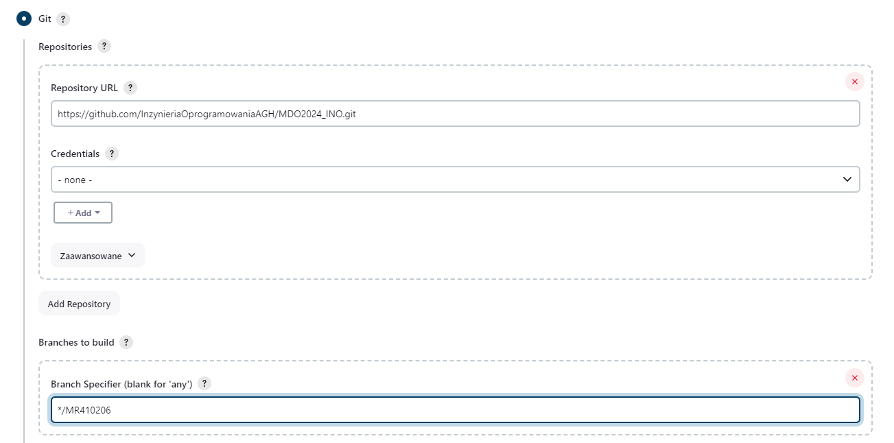

Powłoka została uzupełniona o poniższy kod.

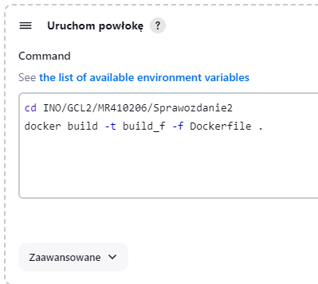

Po zapisaniu projektu i uruchomieniu otrzymano poniższe logi.

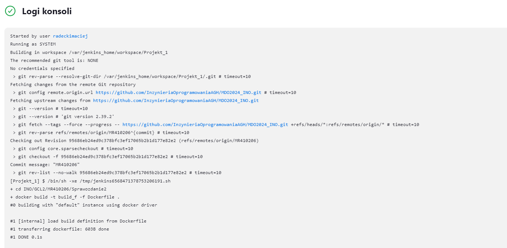

## 3. Indywidualny projekt

Początkowy projekt został oparty na repozytorium, którego używone bylo na poprzednich laboratoriach. Jendnak po trzech tygodniach walki i wyrwaniu praktycznie połowy swoich włosów, zostawiłem je w spokoju i zmieniłem na nowe repozytorium. Zgodnie z zawartą w repozytorium informacją licencja pozwalała na korzystanie z tego repo. Na samym początku zostały utworzony plan przeprowadzanych kroków oraz diagram wdrożenia. Prezentują się one następująco:

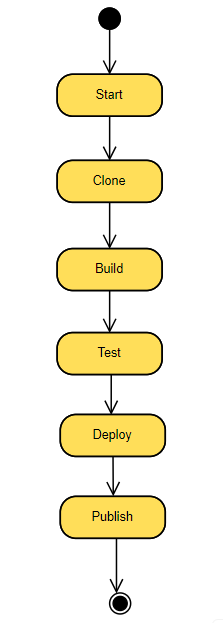

Start: Początek procesu pipeline, czyszczenie wcześniejszych artefaktów.

Clone: Klonowanie repozytorium Git i przejście do odpowiedniego branch.

Build: Budowanie obrazu Docker z kodem źródłowym.

Test: Testowanie obrazu Docker.

Deploy: Wdrażanie obrazu Docker na serwerze i sprawdzanie jego stanu.

Publish: Publikowanie obrazu Docker do rejestru Docker Hub i archiwizacja artefaktów.

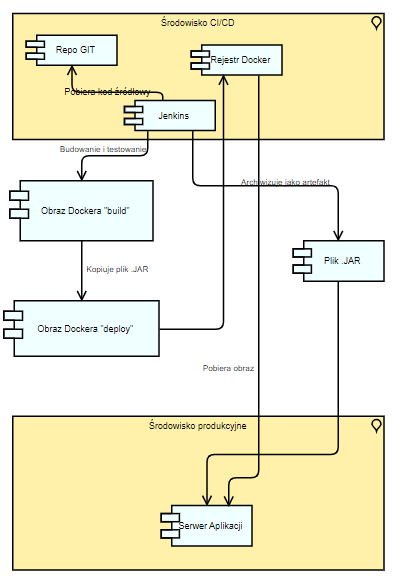

Następnie przystąpiono do pracy. Utworzony został pipline. ``Nowy projekt -> Pipline`` nazwa została ustawiona na "Indywidualny_projekt". Pierwszym krokiem było utworzenie ``stage ('Start')`` który usuwa niepotrzebne elementy, czyli na przykład wcześniej skopiowane repozytorium czy też kontenery oraz tworzy plik z logami, który będzie wykorzystywany póżniej. 

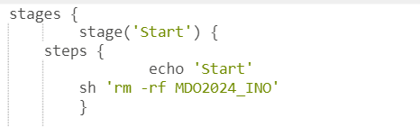

Kolejny stage był ``stage ('Clone')``. Klonowanie repozytorium to kluczowy krok, pozwalający na pobranie najnowszej wersji kodu źródłowego. Działanie to jest niezbędne do lokalnej pracy nad projektem. Checkout do konkretnego brancha (MR410206) gwarantuje pracę na odpowiedniej wersji projektu, co jest istotne dla zachowania spójności i przejrzystości testów i budowania.

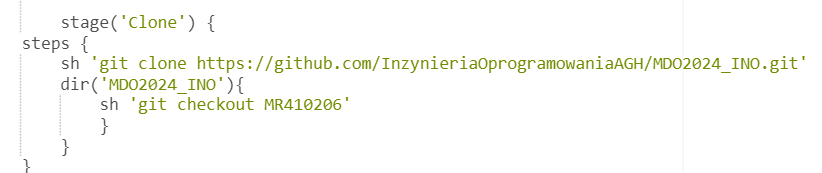

Następnie wykonano ``stage ('Build')``. Budowanie obrazu Docker w tym kontekście polega na przygotowaniu środowiska aplikacji w izolowanym kontenerze, co jest kluczowe dla zapewnienia jej przenośności i powtarzalności. Wyświetlenie zawartości katalogu oraz wykonanie budowy obrazu to działania pozwalające na weryfikację poprawności struktury plików oraz samą budowę środowiska wykonawczego.

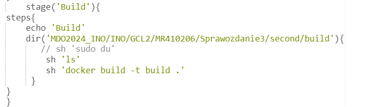

Dockerfile wykorzystany w tym kroku wyglądął następująco:

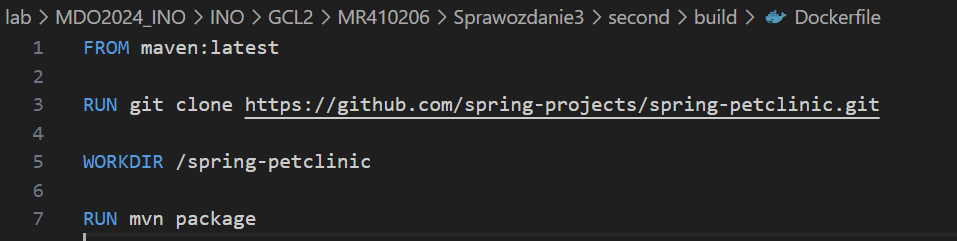

Kolejny stage był ``stage ('Test')``. Podczas etapu testowania, wylistowano dostępne obrazy Docker oraz zbudowano obraz Docker przeznaczony do testowania.

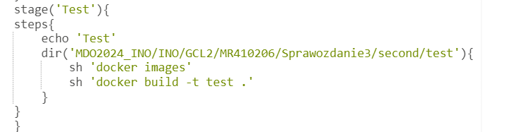

Dockerfile wykorzystany w tym kroku wyglądął następująco:

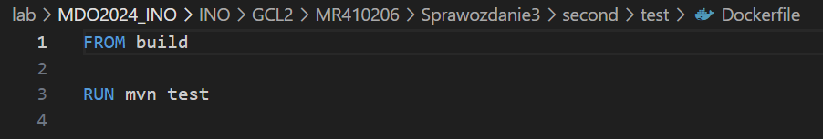

W kolejnym kroku w środowisku pracy określono zmienne takie jak repozytorium Docker (DOCKER_REPO), poświadczenia do Dockera (DOCKER_CRE) oraz tag obrazu Docker (imageTag). Tak jak na zdjęciu poniżej.

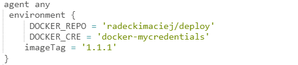

Następnie wykonano ``stage ('Deploy')``. Wdrożenie aplikacji to złożony etap, w którym używa się kilku komend Docker do zarządzania siecią i kontenerami. Tworzenie dedykowanej sieci dla kontenerów i uruchomienie aplikacji w izolowanym kontenerze Docker gwarantuje kontrolę nad środowiskiem, w którym aplikacja jest uruchamiana. Przetestowanie dostępności aplikacji za pomocą curl jest krytycznym krokiem w celu zapewnienia, że aplikacja działa poprawnie po wdrożeniu.

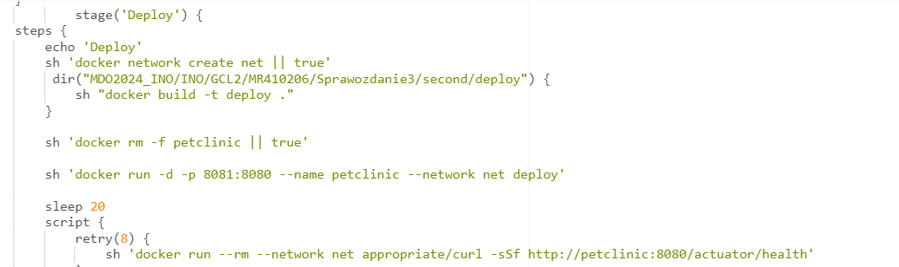

Dockerfile wykorzystany w tym kroku wyglądął następująco:

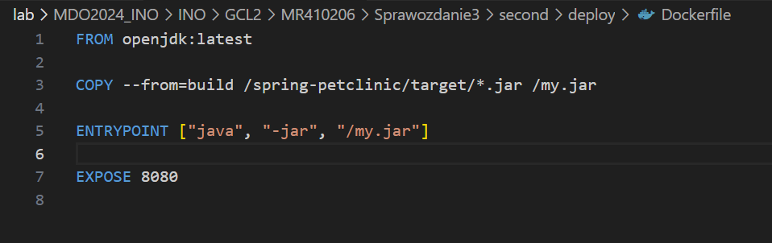

Kolejnym i ostatnim stage był ``stage ('Publish')``. Finałowy etap, polegający na publikacji wyników pracy, zabezpiecza artefakty (pliki jar) przez ich archiwizację oraz udostępnia zbudowany obraz Docker w zdalnym repozytorium. Jest to szczególnie ważne dla umożliwienia dostępu do aplikacji przez innych użytkowników oraz dla utrzymania rejestru wersji aplikacji.

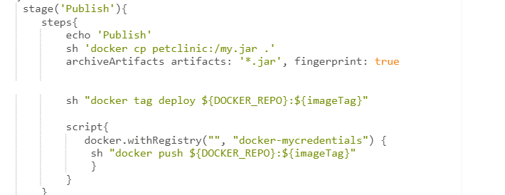

`sh "docker tag deploy ${DOCKER_REPO}:${imageTag}"` Komenda ta służy do otagowania lokalnego obrazu Docker, przygotowując go do wypchnięcia do zdalnego repozytorium.


`script`: Blok script wykorzystuje docker.withRegistry, konfigurując sesję Docker do korzystania ze specyficznych poświadczeń i repozytorium.


Natomiast `sh "docker push ${DOCKER_REPO}:${imageTag}"` użyta została w celu wypchnięcia otagowanego obrazu Docker do zdalnego repozytorium na DockerHub. Repozytorium na DockerHub:

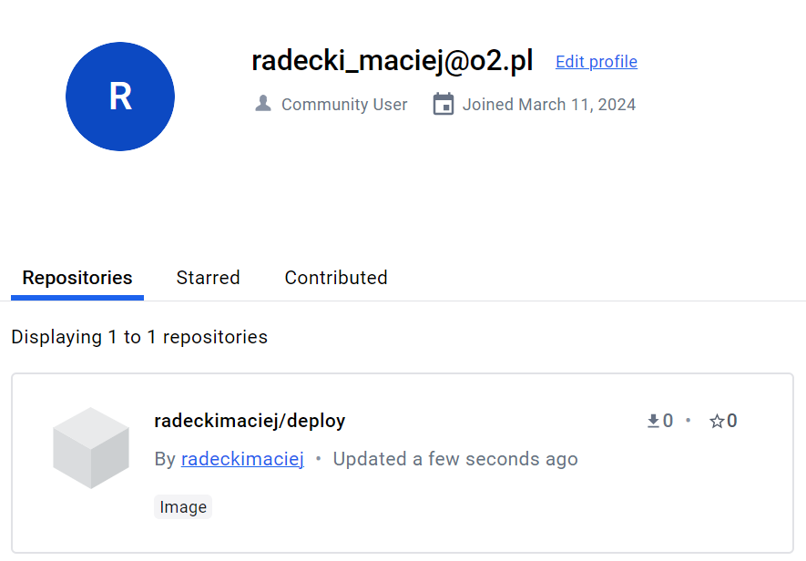

Aby prawidłowo wykonać wszytkie wcześniej opisane elementy należało też utworzyć "New Credentials" w Jenkinsie, odpowiednie pola zostały uzupełnione tak jak poniżej.
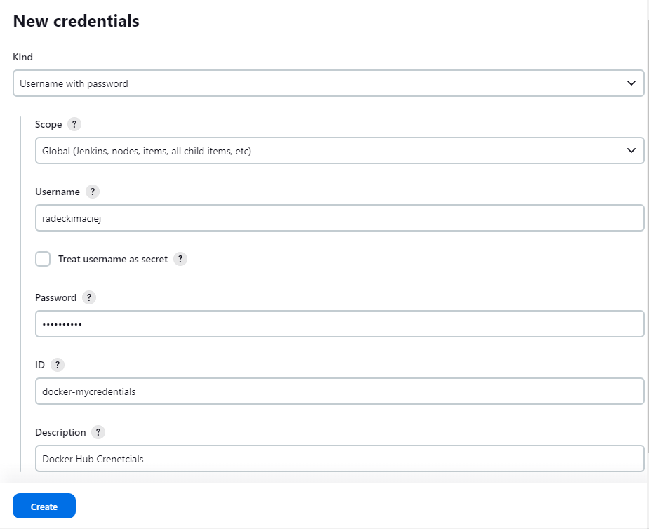

Po uruchomieniu pipline, otrzymaliśmy informacje, że wszystkie etapy przeszły pomyślnie, oczywiście nie od razu. 
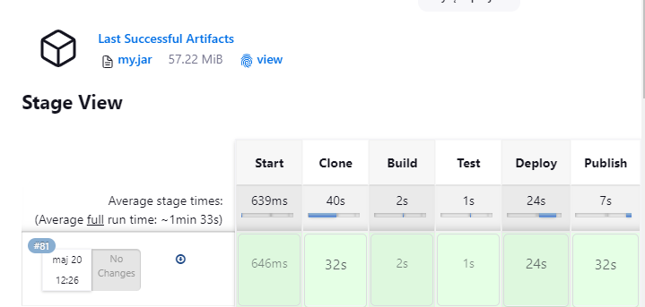

Archiwizacje pliku JAR można opisać w trzech etapach. Najpierw w `stage ('Build')` aplikacja zostaje skompilowana a pliki JAR znajdują się w katalogi `target`. Następnie w `stage ('Publish')` następuje skopiowanie tego pliku z kontenera z `stage ('Deploy')` do bieżącego katalogu. A później jest on archiwizowany przy pomocy poniższego polecenia 

``` archiveArtifacts artifacts: '*.jar', fingerprint: true ```

Dzięki procesowi archiwizacji, plik JAR aplikacji jest dostępny jako pobieralny obiekt w ramach rezultatów przebiegu procesu.


Podczas wykonywania zadania napotkałem liczne problemy wynikające albo z mojej nieuwagi bądź głupoty. Rozwiązanie jednogo z nich chciałbym opisać. Problem dotyczył małej ilości miejsca w pamięci masyzny wirtualnej.

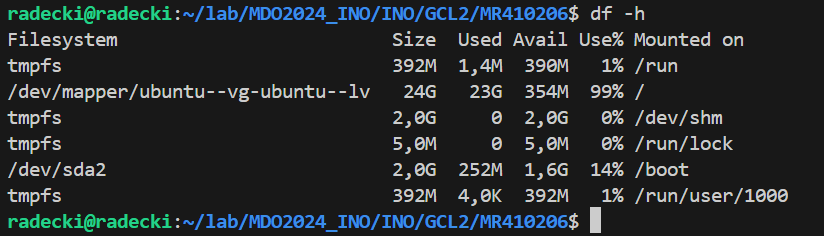

Zgodnie z odnalezionym poradnikiem, zalecano użycie następujących komend, aby umożliwić wykorzystanie 100% przypisanych zasobów dyskowych dla systemu Ubuntu.

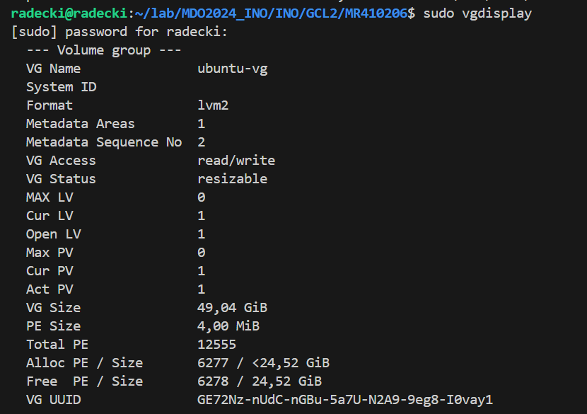
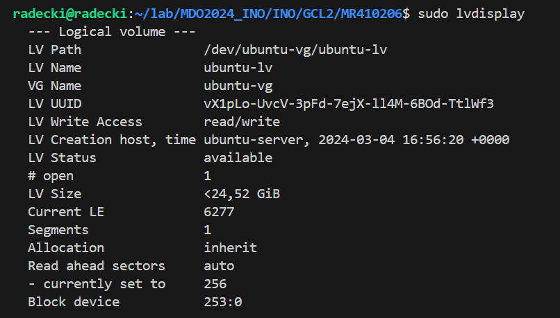
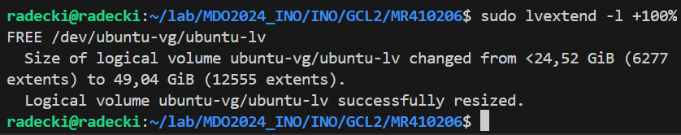

Oprócz zwiększenia pojemności pamięci, konieczne było również jej przydzielenie do odpowiedniej partycji. Jak widać na załączonym obrazku, proces ten zakończył się powodzeniem, co zaowocowało uzyskaniem dodatkowych GB wolnego miejsca, które wcześniej nie było dostępne do wykorzystania.

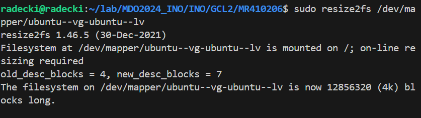
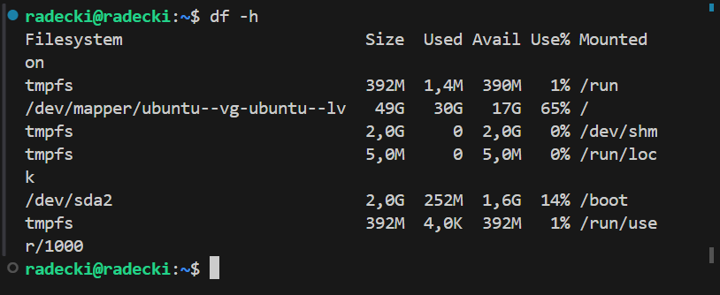

## Jenkinsfile
```
pipeline {
    agent any
     environment {
         DOCKER_REPO = 'radeckimaciej/deploy'
         DOCKER_CRE = 'docker-mycredentials'
        imageTag = '1.1.1'
    }
        stages {
                stage('Start') {
            steps {
				        echo 'Start'
                sh 'rm -rf MDO2024_INO'
                //sh 'docker container prune --force'
                sh 'touch build.log'
                  }
                }
                
                stage('Clone') {
            steps {
                sh 'git clone https://github.com/InzynieriaOprogramowaniaAGH/MDO2024_INO.git'
                dir('MDO2024_INO'){
                    sh 'git checkout MR410206'
                    }
                }
            }
                stage('Build'){
            steps{
                echo 'Build'
                dir('MDO2024_INO/INO/GCL2/MR410206/Sprawozdanie3/second/build'){
                   // sh 'sudo du'
                    sh 'ls'
                    sh 'docker build -t build .'
                 }
            }
            }
            stage('Test'){
            steps{
                echo 'Test'
                dir('MDO2024_INO/INO/GCL2/MR410206/Sprawozdanie3/second/test'){
                    sh 'docker images'
                    sh 'docker build -t test .'
                }
            }
            }
                    stage('Deploy') {
            steps {
                echo 'Deploy'
                sh 'docker network create net || true'
                 dir("MDO2024_INO/INO/GCL2/MR410206/Sprawozdanie3/second/deploy") {
                    sh "docker build -t deploy ."
                }
                
                sh 'docker rm -f petclinic || true'
                
                sh 'docker run -d -p 8081:8080 --name petclinic --network net deploy'
                
                sleep 20
                script {
                    retry(8) {
                        sh 'docker run --rm --network net appropriate/curl -sSf http://petclinic:8080/actuator/health'
                    }
                }
            }
        }
         stage('Publish'){
            steps{
                echo 'Publish'
                sh 'docker cp petclinic:/my.jar .'
                archiveArtifacts artifacts: '*.jar', fingerprint: true
                

                sh "docker tag deploy ${DOCKER_REPO}:${imageTag}"
                
                script{
                   docker.withRegistry("", "docker-mycredentials") {
                    sh "docker push ${DOCKER_REPO}:${imageTag}"
                    }  
                }
            }  
        }
    }
}
```
