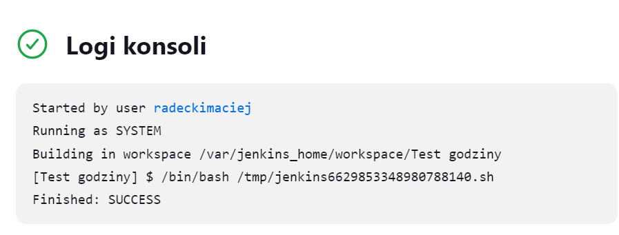
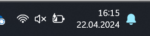

# Sprawozdanie 3
Maciej Radecki 410206
## Cel ćwiczenia

## 1. Konfiguracja Jenkinsa
Po zainstalowaniu Jenkinsa na podczas wykonywania poprzedniej instrukcji, należało po otwarciu linku http://localhost:8080 wpisać w odpowiednie okno hasło administratora. 

Hasło to odnalazłem dzięki zamieszczonej ścieżce do poliku na owej stronie, której screen znajduje się powyżej. Następnie przeszedłem do dalszej konfiguracji, niestety zapomniałem udokumentować tych kroków, ale po wpisaniu hasła administratora pojawił się wybór dwóch opcji dostosowania Jenkinsa. Wybrałem opcje "Zainstaluj sugerowane wtyczki" lub coś brzmiącego w tym stylu, w każdym razie zainstalowałem sugerowane przez system opcje. Następnie musiałem podać swoje dane do logowania oraz ustawiłem URL Jenkinsa jako http://localhost:8080/. Po czym moim oczom ukazał się obraz taki jak na poniższym zdjęciu.

## 2. Pierwsze projekty w Jenkinsie
Na samym początku utowrzyłem nowy projekt o nazwie "uname". Podczas tworzenia użyłem opcji "Ogólny projekt"

Następnie należało wybrać opcje uruchomienia powłoki również tak jak na screenie ponieżej.

W oknie tekstowym który się pojawił po wybraniu powyższej opcji wpisałem ```uname``` 

Tak utworzony projekt zostal zapisany, nastepnie uruchomiony. Logi konsoli tego projektu znajdują się poniżej.

Następnym projektem było zadanie które działa prawidłowo w przypadku gdy godzina jest parzysta, natomiast w przeciwnym przypadku nie będzie działać. W celu wykonanie tego zadania w ten sam sposób utworzyłem nowy projekt, jednak w powłoce został umieszczony odpowiedni kod który ma zrealizować zadanie.

Po uruchomieniu programu sprawdzone zostały logi przy różnych godzinach.


Poniżej screeny dotyczące przypadku godziny nieparzystej.


Ostatnim "prostym" zadaniem do wykonania było utworzenie projektu, tak aby następowało kloniwanie repoztorium, przechodzenie na odpowiednią gałąź, czyli MR410206 oraz budowanie obrazów z dockerfiles. Jak poprzednio został utworzony nowy projekt, ponownie z opcją "ogólny projekt", natomiast w tym przypadku została bygrana opcja "Git" która została uzupełniona dokładnie tak jak na poniższym zdjęciu.

Powłoka została uzupełniona o poniższy kod.

Po zapisaniu projektu i uruchomieniu otrzymano poniższe logi.

## 3. Indywidualny projekt
Projekt został oparty na repozytorium, którego używone bylo na poprzednich laboratoriach. Zgodnie z zawartą w repozytorium informacją licencja pozwalała na korzystanie z tego repo. Na samym początku zostały utworzony plan przeprowadzanych kroków oraz diagram wdrożenia. Prezentują się one następująco:


Następnie przystąpiono do pracy. Utworzony został pipline. ``Nowy projekt -> Pipline`` nazwa została ustawiona na "Indywidualny_projekt". Pierwszym krokiem było utworzenie ``stage ('Start')`` który usuwa niepotrzebne elementy, czyli na przykład wcześniej skopiowane repozytorium czy też kontenery oraz tworzy plik z logami, który będzie wykorzystywany póżniej. 

Kolejny stage ma za zadanie pobranie repozytorium oraz przejście na odpowiedni branch. Zostaje to wykonane przy pomocy poniższego kodu.


