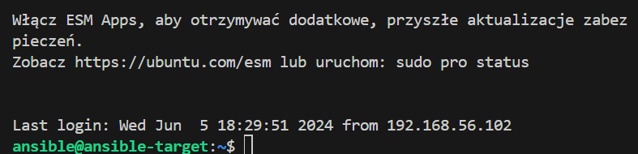
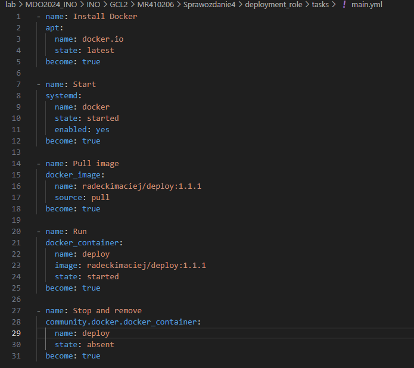

# Sprawozdanie 4
Maciej Radecki 410206
## Instalacja nowej maszyny i jej konfiguracja
Pierwszym krokiem jakie należało wykonać na podanych laboratoriach było utworzenie nowej maszyny "ansible-target" z użytkownikiem "ansible". Maszyna miała być jak najmniejsza oraz tego samego typu co głowna. Tak więc została ona utworzona podonbnie do poprzedniej


Sprawdziłem również czy hostname oraz podany użtkownik istnieje. Okazało się, że przy okazji aby być pewnym co do użytkownika, powstało ich aż trzech.


Następnie zapewniono obecność tar


Następnie zgodnie z odpowiednią dokumentacją na maszynie głównej został zainstalowant Ansible
```
sudo apt update
sudo apt install software-properties-common
sudo add-apt-repository --yes --update ppa:ansible/ansible
sudo apt install ansible
```


Instalacja powiodła się 


W celu prawidłowej komunikacji pomiędzy maszynami dodałem do każdej maszyny nową kartę sieciową tak jak na zdjęciu poniżej"


Następnie na obu maszynach użułem polecenia 
```
sudo dhclient -1 enp0s8
```
Które powoduje dynamiczną konfigurację protokołu IP dla interfejsu sieciowego o nazwie "enp0s8". Następnie przystąpiłem do generowania nowego klucza na nowej maszynie i przekazania go do maszyny głównej, oraz póżniej odwrotnie. Użyto poniższego polecenia.
```
ssh-keygen -t rsa
```
Czyli najpierw do wygenerowania klucza.


A następnie polecenia:
```
ssh-copy-id -i ~/.ssh/id_rsa <nazwa uzytkownika>@<konkretne IP>
```
Do skopiowania klucza do konkretnej maszyny wirtualnej. Następnie sprawdziłem połączenie czy aby na pewno nie wymaga podawania hasła.




## Inwentaryzacja
W celu przeprowadznia inwentaryzacji w pierwszym kroku potrzebowałem pozać nazwę główej maszyny. 


Jest to "radecki". Aby nie trzeba było wprowadzać adresów IP podanych maszyn dodano ich IP z nazwami do /etc/hosts.


Następnie sprawdziłem łączenie przy pomocy poniższej komendy:
```
ssh ansible@ansible-target
```
Powiodło się:


Następnie utworzono plik inwentaryzacji ibook.ini. Jego treść wyglądała następująco:


W miejscu "orchestrators" umieszczona została nazwa głowej maszyny "radecki", natomiast w "endpoints" został umieszczona nazwa "ansibole-target" oraz "ansible_user=ansible" Następnie użyto poniższego polecenia:
```
ansible-inventory -i inventory.ini --list
```
Następnie wykonane komende pingu:


Oraz na koniec komende pingu dla wszystkich


## Zdalne wykonanie procedur 
Stworzono pleybooka Ansible o nazwie playbook1.yaml, jego treść znajduje się poniżej:


Następnie przy pomocy poniższego polecenia wykonano polecenia wysłania żądania "ping" od wszystkich maszyn.
```
ansible-playbook -i ibook.ini playbook.yaml
```


Następnie przeszedłem do wykonania polecenia związanego z skopiowaniem pliku inwentaruzacji na maszynę "Endpoints". nowy Playbook wyglądął następująco:


Po uruchomieniu go przy pomocy poniższego polecenia otrzymaliśmy poniższe logi:


Nastepnym pokleceniem było zaktualizowanie pakietu w systemie, co zostało wykonane przy pomocy poniższego playbooka:


Po uruchomieniu otrzymaliśmy poniższe logi:


Następnie wykonano polecenie dotyczące zrestartowania usługi "sshd" oraz "rngd". Należało upewnić się czy serwisy są zainstalowane na naszym hoście. A nastęnie utworzono playbook4.yaml:


Po uruchomieniu otrzymaliśmy poniższe logi:


Kolejne zadanie dotyczyło przeprowadzenia operacji względem maszyny z wyłączonym SSH. Pierwszym krokiem było zatrzymanie serwera ssh na hoście ansible-target.


Po uruchomieniu playbooka1 otrzymano następujące logi:


Następnie odłączono kartę sieciową w ustawieniach virtualboxa i otrzymano poniższe wyniki.


## Zarządzanie kontenerem
Kolejnym zadanie było uruchomienie aplikacji dostarczanej kontenerem Deploy/Publish, oraz podłączneie storage oraz wyporwadzenie portu. Pobierany obraz to obraz z poprzednich labolatoriów z DockerHub. Należało napisać kolejny playbook, który prezentował się następująco:


Po uruchomieniu otrzymano następujące logi:


Następnie na serwerze ansible dokonano sprawdzenia:


Następne polecenie polegało na zatrzymaniu u usunięciu kontenera. Ponownie utworzono kolejny playbook:


Po uruchomieniu otrzymano logi:


Ostatnim poleceniem z bieżącej instrukcji było ubranie powyższych kroków w rolę, za pomocą szkieletowania "ansible-galaxy". Po zorganizowaniu wcześniejszych zadań jako role, unikniemy powtarzania tych samych zadań w różnych playbookach. Zamiast tego, będziemy korzystać z ról do zarządzania instalacją i deploymentem aplikacji na hostach. Zaczynamy od utworzenia szkieletu roli:


Otrzymaliśmy poniższą struktóre plików:


Następnie aktualozwana zostało "tasks/main.yml"



Następnie aktualizowane zostaje "defaults/main.yml"


Kolejnym krokiem jest wykonanie prostego playbooka z wykorzystaniem roli.


Po uruchomieniu:


## Instalacja systemu Fedora
Celem drugiej części laboratoriów była była instalacja systemu operacyjnego Fedora za pomocą instalatora sieciowego (netinst) w trybie nienadzorowanym, a następnie konfiguracja systemu poprzez plik odpowiedzi.  Zadanie rozpoczeto od istalacji oprogramowanie przy pomocy VirtualBoxa.


Podczas instalacji w wersji graficznej wybrano mininmalną werjsę.


Następnie należało skopiować pliki odpowiedzi z katalogu root do katalogu nad nim, tak aby było możliwe edytowanie. Do pliku zostały dodana lokalizacja serwerów lustrzanych z repozytorium fedory i aktualizacja, które pozwolą na niezależną instalacje.

```
url --mirrorlist=http://mirrors.fedoraproject.org/mirrorlist?repo=fedora-39&arch=x86_64
repo --name=update --mirrorlist=http://mirrors.fedoraproject.org/mirrorlist?repo=updates-released-f39&arch=x86_64
```

Oraz zgodnie z instrukcją upenwiono się że plik zawsze będzie formatowac całość, używając komendy:
```
clearpart --all
```
Kolejnym krokiem było utworzneie skecji %packages oraz %post, tak jak poniżej:


Sekcja %packages określa pakiety, które mają zostać zainstalowane. Instalujemy minimalne środowisko, narzędzia do zarządzania kontenerami oraz środowisko serwera.


Sekcja %post zawiera polecenia, które zostaną wykonane po zainstalowaniu pakietów, ale przed zakończeniem instalacji systemu. Dodaje użytkownika root do grupy docker.
Włączam usługę docker. Tworzę nową usługę systemową docker-java-deploy.service, która pobiera obraz kontenera radeckimaciej/deploy:1.1.1 i uruchamia go na porcie 8080. Uruchamiamy usługę docker-java-deploy.service.
Cały plik anaconda-ks.cfg wyglądał następująco:


Następnie plik ten został umieszczony na githubie. Uruchomiono instalator w visualBox i za pomocą `e` zaraz po odpaleniu wpisano odpowiednią linikę, w okienku które się pojawiło:
```
inst.ks=https://raw.githubusercontent.com/InzynieriaOprogramowaniaAGH/MDO2024_INO/MR410206/INO/GCL2/MR410206/Sprawozdanie4/anaconda-ks.cfg
```
Po uruchomieniu instalatora otrzymano następujące logi:


Niestety nie udało się prawidłowo zalogować.


