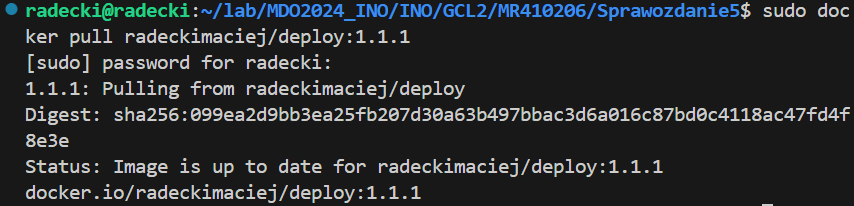
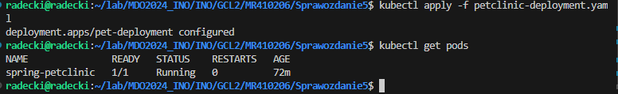
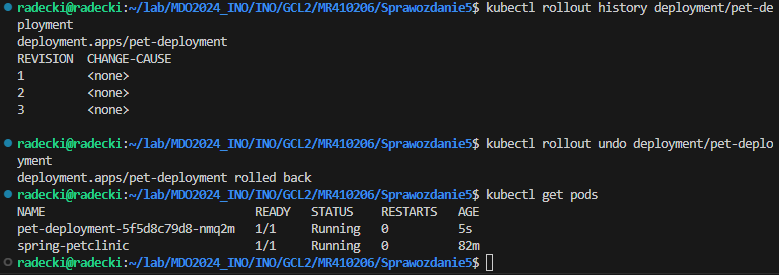

# Sprawozdanie 5
Maciej Radecki 410206
## Instalacja klastra Kubernetes
Zgodnie z załączoną instrukcją przystąpiono do instalacji minikube. Zaopatrzono się w implementacje stosu k8s: minikube. Instalacje wykonano dla Ubuntu na architekturze x84-64 przy pomocy poniższego polecenia:
```
curl -LO https://storage.googleapis.com/minikube/releases latest/minikube-linux-amd64
sudo install minikube-linux-amd64 /usr/local/bin/minikube && rm minikube-linux-amd64
```
Po przejściu kroków z podanej instruckji, uruchomiono klaster minikube przy pomocy poniższego polecenia.
```
minikube start
```


Zapewniono bezpieczęństwo instalacji poporzez aktualizacje oprogramowania oraz pobieranie narzędzi z oficjalnych źródeł. Minikube ma następujące wymagania sprzętowe: 2CPU, 2GB RAM, 20GB wolnego miejsca na dysku. Na zajęciach nie udało się uruchomić klastra ze względu na zbyt małą ilość miejsca na dysku, jednak po zwolnieniu pomięci nie było z tym problemu. Następnie zostało sprawdzone czy zosatł utworzony kontener.
```
sudo docker ps
```

Oraz sprawdzono status klastra.
```
minikube status 
```

Następnie uruchomiony został Dashboard.
```
minikube dashboard
```
Po wpisaniu powyższej komendy otworzyło się okno w przeglądarce.

Po otwarciu Dashboard, możliwe było zobaczenie wizualizacji statusu klastra Kubernetes, w tym informacji o podach, deploymentach, usługach i innych zasobach klastra.
## Analiza posiadanego klastra
Pierwszym krokiem było przygotowanie obrazu Docker z naszą wcześniejszą aplikacją, sprawdzenie że ten kontener Deploy na pewno pracuje, a nie natychmiast kończy pracę, wykonano to tak jak poniżej.
```
sudo docker pull radeckimaciej/deploy:1.1.1
```

Następnie:
```
sudo docker run -d --name petclinic -p 8081:8080 radeckimaciej/deploy:1.1.1
```

A póżniej
```
docker ps
```
Użyto tego polecenia aby sprawdzić czy kontener pracuje.

## Uruchomienie oprogramowania
Pierwszym krokiem było uruchomienie kontenera z aplikacją Sprong PetClinic w minikube za pomocą poniższego polecenia.
```
kubectl run spring-petclinic --image=radeckimaciej/deploy:1.1.1 --port=8080 --labels app=spring-petclinic
```


Następnie wyświetlamy pody przy pomocy.
```
kubectl get pods
```

Oraz pokazano ponownie dashboard.


Następnie za pomocą poniższego polecenia należąło wykonać przekierowanie portów. Wykonano to aby uzyskać dostęp do aplikacji z zewnętrznego klastra
```
kubectl port-forward pod/spring-petclinic 8080:8080
```


## Konwersja wdrożenia ręcznego na wdrożenie deklaratywne YAML
Pierwszym krokiem było zapisanie wdrożenia za pomocą pliku YAML. Utworzono nowy plik o nazwie petclinic-deployment.yaml który wyglądał następująco.

Następnie rozpoczęto wdrożenie.
```
kubectl apply -f petclinic-deployment.yaml
```

Następnie zbadano stan za pomocą poniższego polecenia.
```
kubectl rollout status deployment/pet-deployment
```

Nastepnie odpalono Dashboard i otrzyamno poniższe wyniki.


## Stworzenie obrazu kończącego się błedem
Kolejnym zadaniem było dokonanie takiej modyfikacji dotychczasowego Dockerfile z deploymentem aby otrzymać błąd. Aby tego dokonać namieszano w ENTRYPOINT.

Następnie zbudowano obraz na podstawie tego Dockerfile i wrzucono go na DockerHub

Następnie edytowano petclinik-deployment.yaml zmieniając liczbę replik na 8, 

póżniej na 1, 

a na samym końcu na 0. 

Po zmniejszeniu liczby replik do 0 i zastosowaniu zmian, Kubernetes rozpoczął proces terminacji wszystkich istniejących podów. Podsumowując, w procesie zwiększania liczby replik, Kubernetes inicjuje tworzenie dodatkowych podów, aby dopasować się do ustalonej żądanej liczby. Z kolei, gdy liczba replik jest zmniejszana, Kubernetes usuwa nadmiarowe pody, dostosowując się do zmienionej konfiguracji.
Kolejnym krokiem było zastosowanie nowej wersji obrazu z błędem. Dokonano edycji pliku .yaml.

Zastosowano zmiany i otrzymaliśmy następujące logi.

Otrzymany nowy pod  jest w stanie CrashLoopBackOff, co oznacza, że Kubernetes wielokrotnie restartuje ten pod bez powodzenia. Kontener wewnątrz tego poda ciągle się zawiesza po uruchomieniu. Po odpaleniu Dashboard można zaobserwować:


W celu przywrócenia poporzedniej wersji wdrożeń można użyć poniższych poleceń:
```
kubectl rollout history deployment/pet-deployment
```
Służy do wyświetlenia historii wdorżeń
```
kubectl rollout undo deployment/pet-deployment
```
Służy do przywrócenia poporzednieij werjsi, zachowując ciągłość działania dzięki strategi RollingUpdate.

## Kontrola wdrożenia
Kolejne zadanie polegało na  napisaniu skryptu kontroli wdrożenia. Które zwraca informacje czy nasze wdrożenie zdąży się wdrożyć w 60 sek. Oto treść naszego skryptu.

Na początku skryptu zaimplemenrowano zmienne, a następnie komendy:

``minikube kubectl -- apply -f $FILE`` — polecenie służące do zastosowania konfiguracji z pliku YAML w klastrze Kubernetes zarządzanym przez Minikube.

``minikube kubectl -- rollout status deployment/$NAME --timeout=${MAX_WAIT}s`` — to polecenie sprawdza status rozwijania (rollout) deploymentu o nazwie określonej w zmiennej $NAME. Używa limitu czasu określonego przez zmienną MAX_WAIT, aby zdecydować, jak długo czekać na zakończenie rozwijania przed przerwaniem operacji. Jeśli rollout zakończy się przed upływem tego czasu, zwróci sukces.

``ROLLOUT_STATUS=$?`` — zapisuje wynik ostatniego polecenia (kubectl rollout status) do zmiennej ROLLOUT_STATUS. W Bash $? zwraca kod wyjścia ostatniego wykonanego polecenia, gdzie 0 oznacza sukces, a każda inna wartość oznacza błąd.
Oraz otrzymane logi po uruchomieniu.

## Strategie wdrożenia
Ostatnią częściął do wykonania sprawozdania było przygotowanie wdrożeń stosując:
### Recreate:
Utworzono następujący plik o nazwie pet-recreate.yaml.

Dzięki temu otrzymaliśmy w Dashboard następujące wyniki.

Strategia Recreate pasuje do sytuacji, w których aplikacja nie musi być nieprzerwanie dostępna podczas aktualizacji, lub gdy wprowadzane są duże zmiany mogące wywołać problemy kompatybilności podczas inkrementacyjnej aktualizacji.
### RollingUpdate
Następnie utworzono kolejny plik pet-roll.yaml

Gdzie maxUnavailable: 1 Określa maksymalną liczbę podów, które mogą być niedostępne, a maxSurge: 1 Określa maksymalną liczbę podów, które mogą być uruchomione ponad żądaną liczbę replik podczas aktualizacji. Po uruchomieniu otrzynano poniższe wyniki.

### Canary Deployment workload
Ostatni utworzony plik wyglądął następująco.

Należąło poprawnie ustawić strategię RollingUpdate z odpowiednimi parametrami tak jak powyżej.
Po uruchomieniu otrzymano poniższe wyniki w Dashboard.

### Podsumowanie
Strategia Recreate pasuje do sytuacji, w których aplikacja nie musi być nieprzerwanie dostępna podczas aktualizacji, lub gdy wprowadzane są duże zmiany mogące wywołać problemy kompatybilności podczas inkrementacyjnej aktualizacji.

Podczas aktualizacji aplikacji przy użyciu strategii RollingUpdate, Kubernetes sukcesywnie zamienia stare pody na nowe, stosując się do konfiguracji parametrów maxUnavailable i maxSurge.

Strategia wdrażania typu Canary Deployment opiera się na sukcesywnym wprowadzaniu nowej wersji aplikacji. Początkowo monitoruje się jej wydajność, a następnie stopniowo zwiększa liczbę replik tej nowej wersji aż do całkowitego zastąpienia poprzedniej wersji. Ustawienie replicas: 1 wraz z parametrami maxSurge: 1 oraz maxUnavailable: 0 umożliwia Kubernetesowi uruchomienie jednej repliki nowej wersji, podczas gdy stare pody nadal funkcjonują, zapewniając ciągłość działania usługi podczas aktualizacji.

