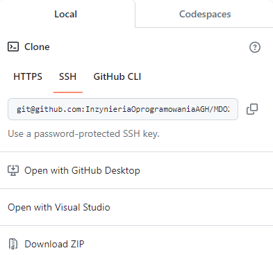

Paweł Ząbkiewicz, IO

# Cel Projektu

Celem projektu było zaznajomienie się z podstawowymi operacjami wykonywanymi przy pracy z systemem kontroli wersji Git oraz platformą GitHub. Dzięki wykonanym w tym projekcie zadaniom można nauczyć się m.in. korzystania z klienta Git, obsługi kluczy SSH, klonowania repozytorium, pisania commitów i korzystania z githooków.

# Streszenie Projektu

Na samym wstępie zainstalowalem program Oracle VM VirtualBox i postawiłem wirtualną maszynę na systemie Ubuntu w wersji 22.04.3 LTS. Ustawilem w niej odpowiednie parametry posługując się instrukcją. 

### 1. Zainstalowanie klienta Git i obsługa kluczy SSH

Do zaintalowania klienta Git posłuzyłem się komendą:

    apt-get install git

Do zaintalowania obsługi kluczy ssh użyłem polecenia: 

    apt-get install openssh-client

Następnie w celu sprawdzenia wersji i poprawności instalacji użyłem poleceń: 

    git --version 
    ssh -V

### 2. Sklonowanie repozytorium przedmiotowego za pomocą HTTPS i personal access token

W celu sklonowania repozytorium przedmiotowego za pomocą HTTPS muszę na początku wygenerować Personal Access Token. 
Generuje go w serwisie GitHub w (Setting/Developer Settings/Personal access tokens/Tokens(classic)):

Następnie mogę w terminalu sklonować repozytorium za pomocą odpowiedniego linku z serwisu GitHub: 

Polecenie do klonowania repozytorium za pomocą HTTPS wygląda następująco: 

### Utworzenie kluczy SSH i sklonowanie za ich pomocą repozytorium

Tworzę dwa klucze inne niż RSA, w tym jeden zabezpiecozny hasłem. 
Pierwszy wygenerowany klucz jest bez hasła i jest to ed25519. Posługuję sie poleceniem: 

    ssh-keygen -t ed25519 -C "pbz2002@gmail.com"

Drugi klucz jest zabezpiecozny hasłem i jest to klucz ecdsa. Generuje go za pomocą odpowiedniego polecenia i ustawiam w nim hasło: 

    ssh-keygen -t ecdsa -C "pbz2002@gmail.com"

klucze, które zostały wygenerowane domyślnie znajdują sie w katalogu .ssh i wystepują w dwóch wersjach (publicznej i prywatnej):

Kolejno za pomocą komendy 'cat' wyświetlam zawartość klucza publiczengo: 

Wklejam zawartość klucza publicznego w odpowiendie miejsce w ustawieniach konta: 

Tym razem klonuje repozytorium korzystając z drugiej zakladki SSH: 

Klonuje repozytorium za pomocą komendy: 

    git clone git@github.com:InzynieriaOprogramowaniaAGH/MDO2024_INO.git

