Paweł Ząbkiewicz, IO

# Cel projektu

Celem projektu jest zapoznanie się z podstawowymi operacjami wykonywanymi przy pracy z systemem kontroli wersji Git oraz platformą GitHub. Dzięki zadaniom zawartym w projekcie można nauczyć sie m.in. korzystac z Git'a, obsługiwać klucze SSH, klonować repozytorium, tworzyć gałęzie, pisać commity oraz githooki. Na drugich zajęciach zaznajomiłem się z Dockerem, który umożliwia wdrażanie i uruchamianie aplikacji w kontenerach. Nauczyłem się uruchamiania kontenerów oraz zbudowania własnego obrazu za pomocą Dockerfila. 

# Streszczenie projektu

Na samym wstępie utworzyłem maszynę wirtualną za pomocą programu Oracle VM VirtualBox na systemie Ubuntu w wersji 22.04.3 LTS. Ustawiłem odpowiednie parametry w maszynie wirutalnej zgodnie z instrukcją. 

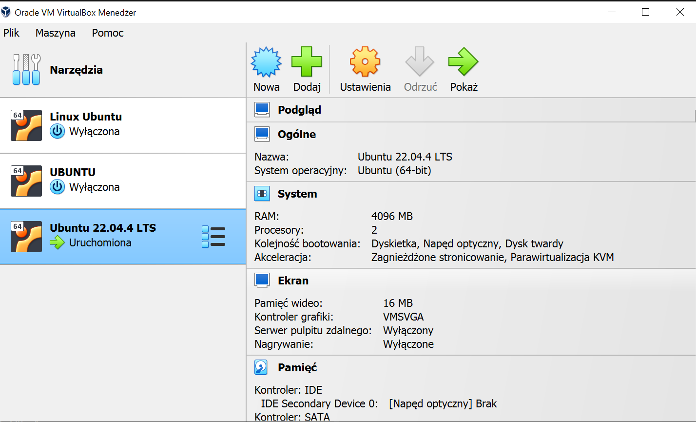

### Zainstalowanie klienta Git i obsługa kluczy SSH

Klienta Git zainstalowałem za pomocą komendy: 

    apt-get install git

Do obsługi ssh zainstalowałem openssh-client za pomocą komendy: 

    apt-get install openssh-client

Następnie w celu sprawdzenia poprawności instalacji i wersji użyłem następujących komend: 

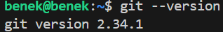

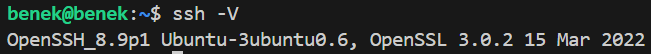

# Sklonowanie repozytorium przedmiotowego za pomocą HTTPS i personal access token

Aby dokonać skolonowania repozytorium za pomocą HTTPS najpierw musiałem wygenerować personal access token w ustawieniach mojego konta na GitHub -> Settings -> Developer settings -> Personal access token -> Tokens(classic). 

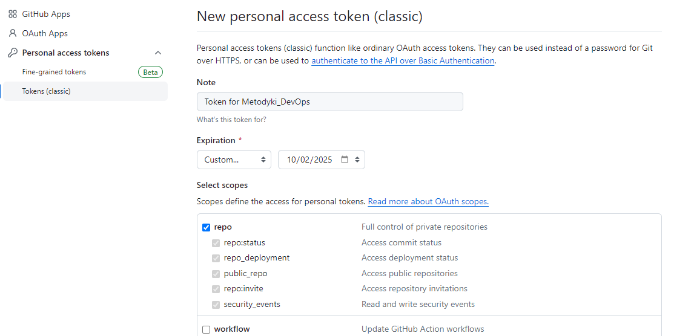

Następnie w celu sklonowania repozytorium za pomocą HTTPS należy wejść do odpowiedniej zakładki w repozytorium i skopiować link. 

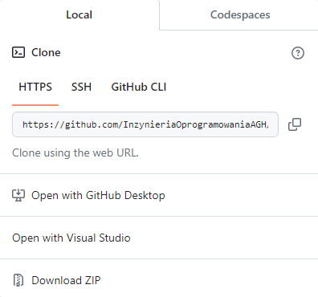

Komenda, którą należy wykonać wygląda następująco: 

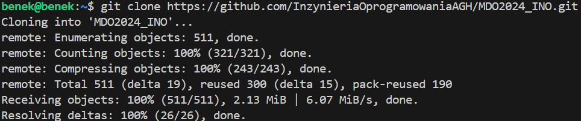

# Utworzenie kluczy SSH i sklonowanie repozytorium za ich pomocą

W celu utworzenia kluczy SSH należy poslużyć się poleceniem: 

    ssh-keygen

Wygenerowałem dwa klucze z czego jeden jest zabezpieczomny hasłem. 

Pierwszy klucz to ed25519, którego nie zabezpieczam hasłem. W tym celu podczas konfiguracji pozostawiam puste pola na hasło. Komenda jaką wykorzystałem to: 

    ssh-keygen -t ed25519 -C "pbz2002@gmail.com"

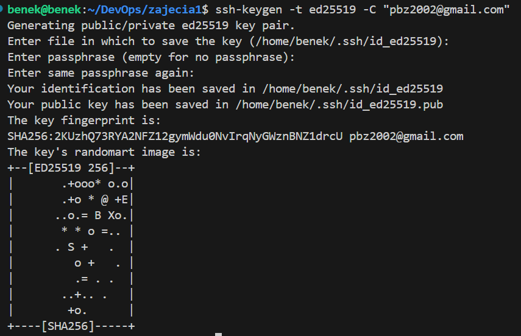

Drugi klucz to klucz ecdsa, który zabezpieczam hasłem. Używam komendy: 

    ssh-keygen ecdsa -C "pbz2002@gmail.com"

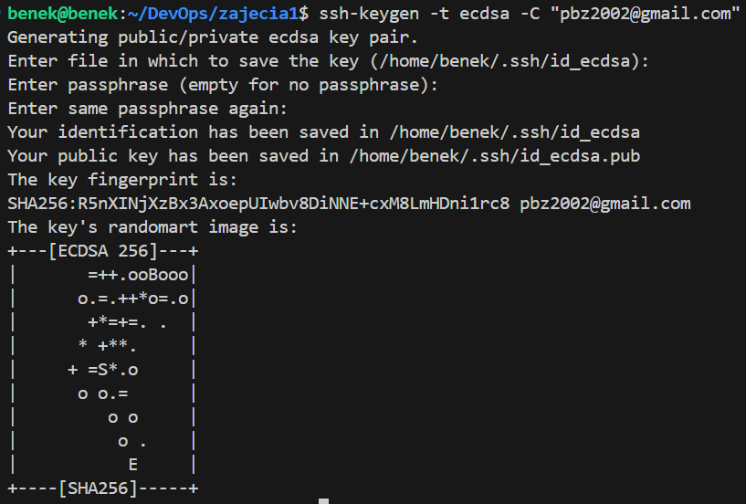

Wygenerowane klucze znajdują się domyślnie w katalogu '~/.ssh'. Znajduje się tam wersja prywatna i publiczna klucza: 

Za pomocą komendy cat można wyświetlić zawartość klucza publicznego: 

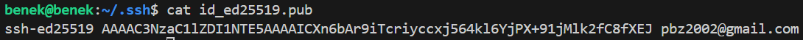

Następnie należy w ustawieniach konta w serwisie GitHub dodać wcześniej utworzone klucze. Dzięki temu uzyskujemy bezpieczne i wygodne uwierzytelnianie podczas komunikacji z repozytoriami w GitHub za pomocą protokołu SSH. 

Widok dodanych kluczy SSH w serwisie GitHub:

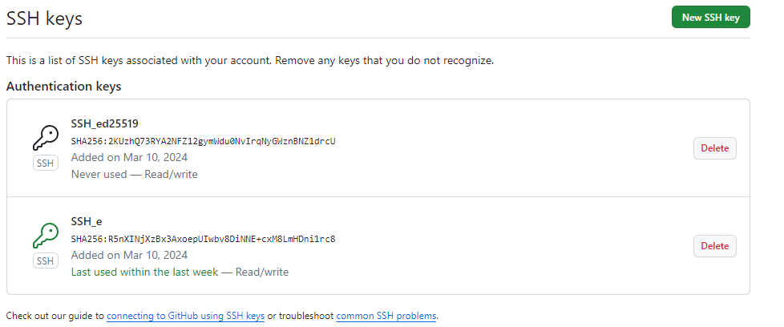

Po dodaniu kluczy SSH do serwisu GitHub można przejść do sklonowania repozytorium za pomocą protokołu SSH. 

Link to sklonowania repozytorium znajduję sie pod zakładką SSH: 

Wykonuje to za pomocą komendy: 

    git clone git@github.com:InzynieriaOprogramowaniaAGH/MDO2024_INO.git

# Przełącznenie na gałaź main, a potem na gałąź swojej grupy

Przełączam się na gałąź main, a nastepnie na gałąź swojej grupy. Aby sprawdzić na jakiej gałęzi jest się obecnie nalezy użyć komendy: 

    git branch

W celu sprawdzenia wszystkich istniejących gałęzi należy posłużyć się poleceniem: 

    git branch --all

Aby przełaczyć się na gałąź naszej grupy trzeba użyć komendy: 

    git checkout GCL2

# Utworzenie gałęzi o nazwie "inicjały & nr indeksu"

Gdy znajduję sie na galęzi mojej grupy, mogę utworzyć i przełączyć sie na moją gałąź za pomocą komendy: 

    git checkout -b PZ410049

Sprawdzam, czy jestem na odpowiendiej gałęzi: 

    git branch

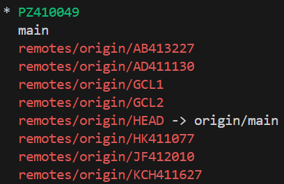

# Rozpoczęcie pracy na nowej gałęzi

### Tworzę katalog o nazwie "inicjały & nr indeksu" w folderze grupy 

Tworzę katalog dla grupy "GLCL2" i w nim tworzę katalog o nazwię "PZ410049" za pomocą polecenia:
    mkdir PZ410049

### Napisanie Git hooka i dodanie go do wcześniej utworzonego katalogu

Git hook ma wefyfikować każdy "commit message". Skrypt ten ma sprawdzać, czy "commit message" zaczyna się od inicjałów i numeru indeksu, czyli w moim przypadku "PZ410049".

W celu jego utworzenia modyfikuje plik w folderze ".git/hooks" o nazwie "commit-msg.sample". Należy umieścić skrypt w tym pliku i zmienić jego nazwę na "commit-msg". Dzięki tej nazwie skrypt będzie uruchamiany automatycznie przy każdym commitowaniu. 

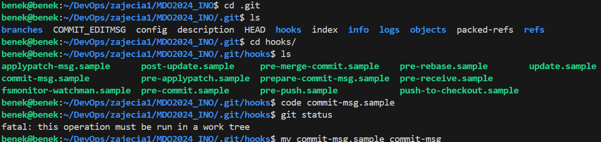

Następnie kopiuje ten skrypt do wcześniej utworzonego katalogu o nazwie "PZ410049".

Skrypt ten używa polecenia "grep" do sprawdzenia, czy zawartość pliku "COMMIT_MSG_FILE" (czyli plik z wiadomością commitu) rozpoczyna się od wzorca "PZ410049". Jeśli wzorzec nie znajdzie znaleziony to skrypt wyświetli odpowiedni komunikat.

Wyświetlony komunikat w przypadku błędnej treści commita: 

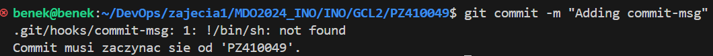

Treść Git Hooka wygląda następująco: 

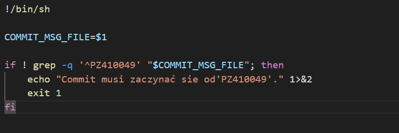

W katalogu o nazwie "PZ410049" tworzę katalog o nazwie "Sprawozdanie1" i umieszczam w nim sprawozdanie o nazwie "README.md" w formacie "Markdown". 

Utworzyłem również katalog o nazwie "screenshots", w którym umieszczam zrzuty ekranu. 

Dodaje do sprawozdania zrzuty ekranu jako inline. Realizuje to poprzez użycie formatu: 

    

W moim przypadku ścieżka ta wyglada następująco: 

    

### W tym kroku wysyłamy zmiany do zdalnego źródła

Na tym etapie pomocna jest komenda: 

    git status

Służy ona do wyświetlania informacji na temat stanu repozytorium. 

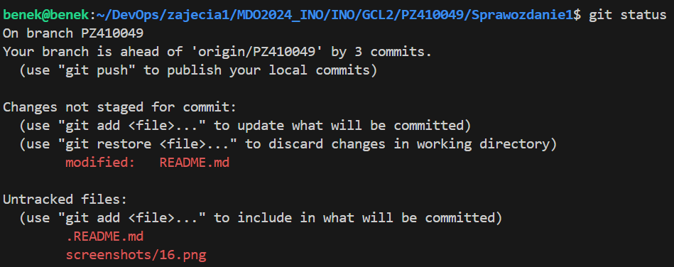

W tym celu na początku dodaje pliki do obszaru stage. Jest to pośredni etap, gdzie możemy przygotować nasze zmiany przed zatwierdzeniem ich za pomocą commita. Realizuje to za pomocą polecenia: 

    git add 

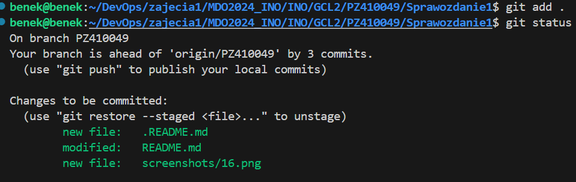

Następnie tworzę nowy commit z zatwierdzonymi zmianami w obszarze stage. Do tego służy komenda: 

    git commit

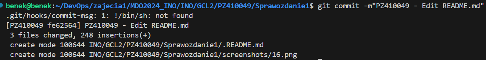

Końcowym etapem jest wysłanie wszystkich zatwierdzonych commitów z repozytorium lokalnego do repozytorium zdalnego przy użyciu komendy: 

    git push

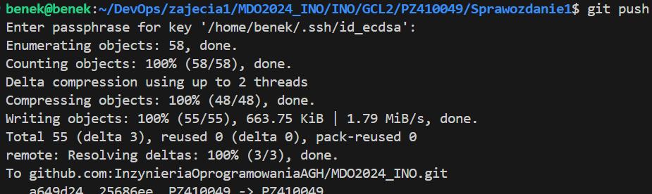

### Próbujemy wciągnać swoją gałąź do gąłęzi grupowej

W tym celu przechodze na galąź naszej grupy za pomocą komendy: 

    git checkout GCL2

Następnie używam komendy:

    git merge PZ410049

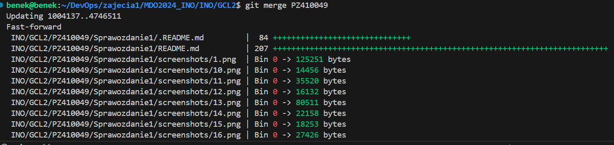

Dzięki tej komendzie zmiany z gałęzi PZ410049 zostają wciągnięte do gałęzi grupy, lecz ze względu na to, że nie posiadam odpowiednich uprawnień nie mogę przesłać zmian do repozytorium poprzez 'git push'. Zamiast tego musiałbym użyć mechanizmu 'pull request'. Jest to prośba o zaakceptowanie wprowadzonych zmian poprzez przeglądnięcie ich i zatwierdzenie przez odpowiednią osobę. Jest to mechanizm, który pomaga uniknąć ewentualnych błędów. 

Zastosowanie komendy 'git merge' i informacja o błędzie:

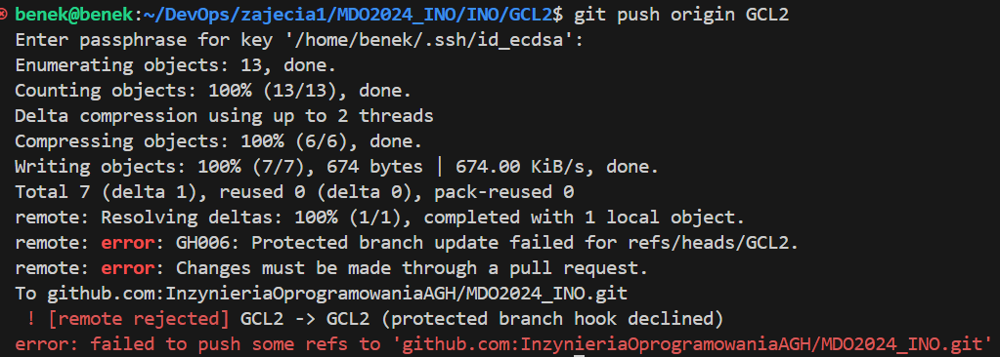

Ostatnim etapem jest zaktualizowanie sprawozdania o ten krok i wysłanie aktualizacji do zdalnego źródła za pomocą: 

    git add

    git commit
    
    git push

# Zajęcia 2

### Zainstalowanie Dockera w systemie linuksowym

Przed samym zaintalowaniem Dockera zrobiłem migawkę na wypadek, gdyby coś poszło nie tak. 
W celu zapewnienia aktualności oraz poprawności instalowanych pakietów wykonuje polecenie: 

    sudo apt-get update

Następnie instaluje dockera na Ubuntu z repozytorium Ubuntu za pomocą komendy:

    sudo apt install docker.io

Kolejno wykonuje polecenie, które włącza i natychmiastowo uruchamia usługę Dockera, a także konfiguruję ją do automatycznego uruchamiania przy kolejnych startach systemu: 

    sudo systemctl enable docker

Na koniec, aby wyświetlić i sprawdzić czy Docker dziala poprawnie używam komendy: 

    sudo systemctl status docker

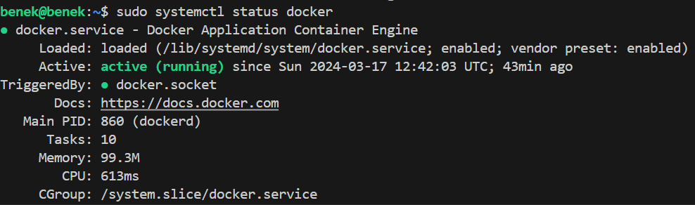

### Zarejestrowanie się w Docker Hub i zapoznanie się z sugerowanymi obrazami

### Pobranie obrazów

W celu pobrania obrazów używam polecenia 'docker pull'. Jesli nie zostaje podany tag to domyślnie Docker pobierze ostatnią wersję obrazu oznaczoną jako 'latest'. Przykładowe pobranie obrazu 'hello-world':

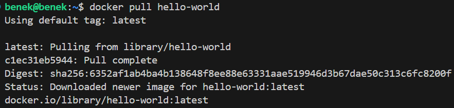

Wyświetlam zainstalowane obrazy za pomocą komendy: 

    docker images

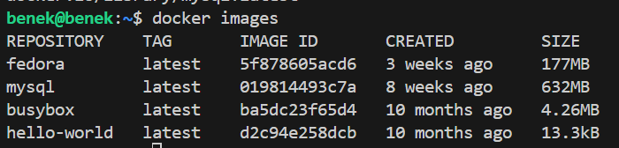

### Uruchomienie kontenera z obrazu busybox

### Efekt uruchomienia kontenera

Uruchamiam kontener busybox poprzez komendę: 

    docker run busybox

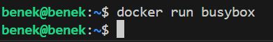

Kontener się uruchomił, lecz z racji tego, że nie podałem żadnej komendy do wykonania wewnątrz kontenera to kontener natychmiast po uruchomieniu zakończył swoją pracę. 

Za pomocą komendy 'docker ps' można wyświetlić listę działających kontenerów. Jak widać kontener busybox nie znajduję się wśród działących kontenerów: 

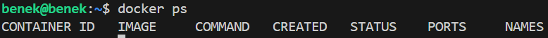

Natomiast jeśli użyję komendy 'docker ps -a' to wyświetli ona pełną listę kontenerów wsród której znajduję się kontener utworzony z obrazu busybox: 

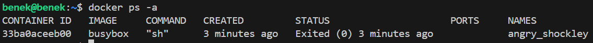

Można zauważyć, że jego status to 'Exited' co oznacza, że kontener został uruchomiony, ale zakończył swoje działanie i obecnie jest zatrzymany. 

### Podłączenie się interaktywnie do kontenera i wywołanie numeru wersji

Interaktywne podłączenie do kontenera umożliwia użytkownikowi interakcję z systemem operacyjnym w kontenerze oraz dostęp do terminala w kontenerze.

Uruchamiam kontener BusyBox w trybie interaktywnym poprzez dodanie flagi -it: 

    docker run -it busybox

Wewnątrz kontenera wyświetlam inforamcję o wersji BusyBoxa poprzez: 

    busybox --help

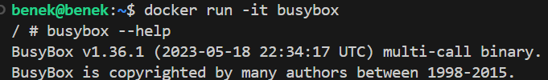

Wychodzę z kontenera za pomocą polecenia: 

    exit

### Uruchomienie 'systemu w kontenerze'

Z racji, iż na używam systemu Ubuntu to system w kontenerze, który będe uruchamiał z obrazu fedora w trybie interaktywnym:

    docker run -it fedora

### Zaprezentowanie PID1 w kontenerze i procesów dockera na hoście

W celu zaprezentowania PID1 w kontenerze używam komendy ps -aux, lecz okazuje się, że w obrazie kontenera brakuje standardowych narzędzi systemowych w tym własnie komendy 'ps'. Zainstalowałem odpowiedni pakiet za pomocą komendy:

    dnf install procps-ng

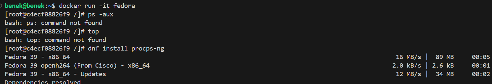

Proces PID1 w kontenerze:

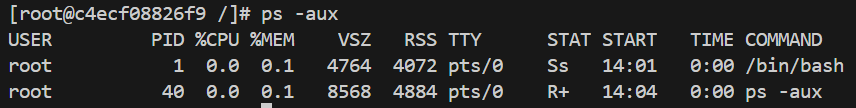

Następnie przełączyłem się do drugiego terminala, aby zaprezentować procesy dockera na hoście: 

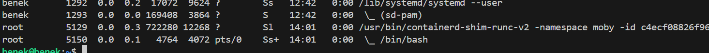

### Aktualizacja pakietów

Do aktualizacji pakietow na systemie Fedora używam polecenia: 

    sudo dnf update

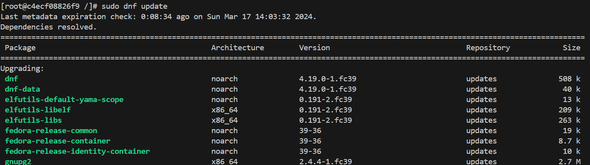

### Wyjście

W celu wyjścia z systemu w kontenerze i zamknięcia sesji terminala w kontenerze używam komendy: 

    exit

Sprawdzam, czy kontener zakończył pracę: 

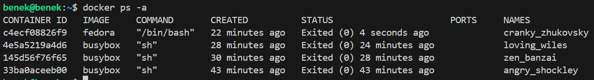

Jak widać status to 'Exited', co oznacza, że kontener zakończył swoje działanie, ale nadal istnieje w moim systemie Docker. 

### Stworzenie własnoręcznie, zbudowanie i uruchomienie prostego pliku Dockerfile bazującego na wybranym systemie i sklonowanie naszego repozytorium

Na samym początku stworzyłem plik o nazwie Dockerfile za pomocą komendy: 

    touch Dockerfile

Umieściłem ten plik w folderze "/Sprawozdanie1", aby uniknąc pózniejszego przenoszenia. 
Zapoznalem się z dobrymi praktykami pisania pliku Dockerfile.
Napisałem plik Dockerfile, który wygląda nastepująco: 

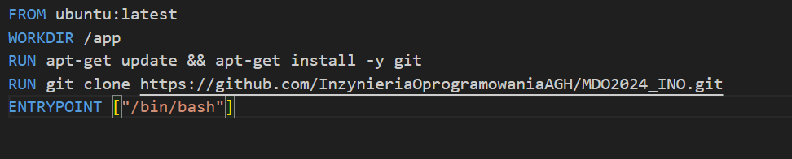

W tym pliku na samym początku ustawiam, aby mój obraz bazował na ostatnim oficjalnym obrazie Ubuntu z repozytorium:

    FROM ubuntu:latest

Kolejnym krokiem jest ustawienie katalogu roboczego w kontenerze Docker. Jest to miejsce, do ktorego zostane przeniesiony po uruchomieniu kontenera oraz miejsce, w ktorym zostaną wykonane wszystkie kolejne instrukcje w pliku Dockerfile. Instrukcja ustawiająca katalog '/app' jako katalog roboczy to: 

    WORKDIR /app

Następnie zdefiniowałem instrukcję, która aktualizuje listę pakietow dostępnych w repozytorium apt-get oraz instaluje pakiet 'git'. Opcja '-y' powoduje, że instalacja odbywa się bez konieczności potwierdzania przez użytkownika. Instrukcja to: 

    RUN apt-get update && apt-get install -y git

Kolejno klonuje repozytorium Git do katalogu roboczego w kontenerze Docker za pomocą instrukcji: 

    RUN git clone https://github.com/InzynieriaOprogramowaniaAGH/MDO2024_INO.git

Ostatnim etapem jest zdefiniowanie głownego programu, który ma zostać uruchomiony jako pierwszy proces w kontenerze Docker po jego uruchomieniu. W moim przypadku jest to powłoka bash. Realizuje to instrukcją:

    ENTRYPOINT ["/bin/bash"]

Po zdefiniowaniu pliku Dockerfile na jego podstawie zbudowałem obraz z nazwą 'my_image':

    docker build -t my_image .

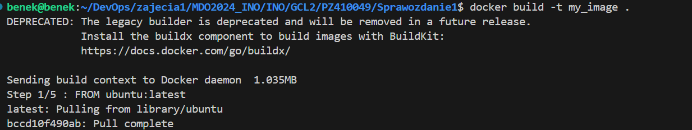

Sprawdziłem czy obraz zbudował się prawidłowo poprzez wyświetlenie listy obrazów dostępnych w lokalnym repozytorium: 

Uruchomiłem kontener w trybie interaktywnym i sprawdziłem czy zostało prawidłowo sciągnietę repozytorium do katalogu roboczego: 

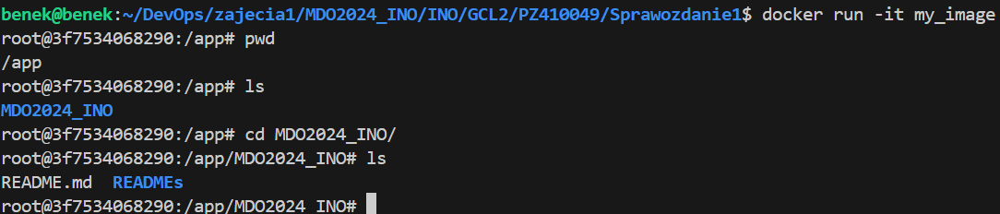

### Pokazanie uruchomionych (!= "działających") kontenerów, wyczyszczenie ich

Aby wyświetlić kontenery, które zostały zatrzymane lub wyłączone należy użyć flagi '-f' w celu przefiltrowania kontenerów, które mają status exited w poleceniu:

    docker ps -a -f status=exited

Następnie, aby usunąc wszystkie zatrzymane kontenery używam polecenia: 

    docker rm $(docker ps -a -f status=exited -q)

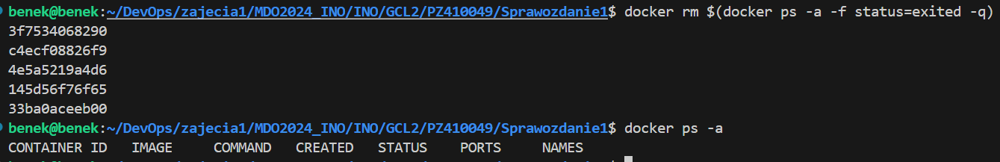

Opcja -q jest używana w celu zwrócenia tylko identyfikatorów kontenerów zamiast pełnej listy.

### Wyczyszczenie obrazów

Aby wyświetlić wszystkie obrazy Dockera na moim systemie używam polecenia: 

    docker images -a

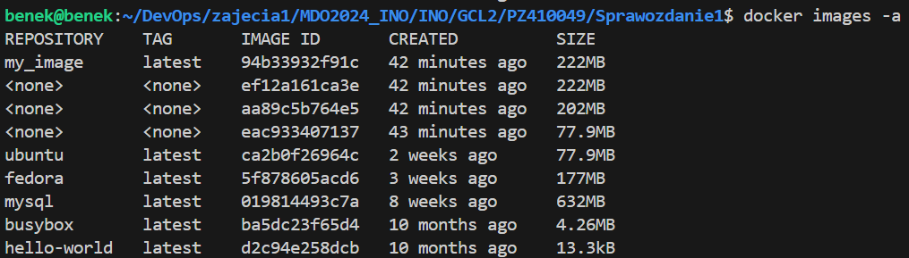

Usuwam je poleceniem:

    docker rmi $(docker images -a -q)

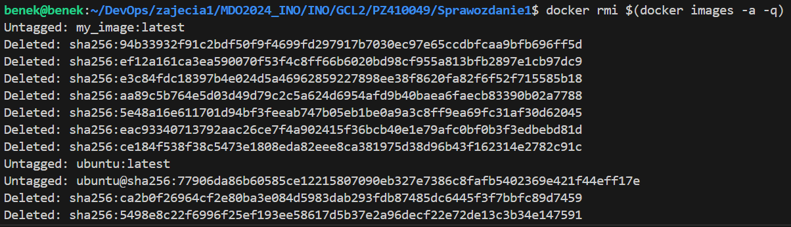

Efekt usunięcia obrazów: 

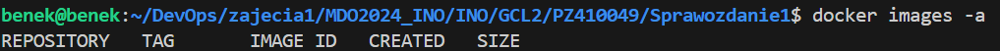

### Dodanie stworzonego pliku Dockerfile do folderu Sprawozdanie1 w repozytorium

### Wystawienie Pull Request do gałezi grupowej

Na sam koniec zaktualizowalem swoją gałąź w lokalnym repozytorium. Wystawiłem Pull Request do gałęzi grupowej jako zgłoszenie wykonanego zadania. 