# Sprawozadanie 2

## Paweł Ząbkiewicz, Inżynieria Obliczeniowa

## Cel projektu

Celem projektu jest automatyzacja procesu budowania i testowania oprogramowania za pomocą plików dockerfile. W tym projekcie należy odpowiednio napisać pliki dockerfile do zdefiniowania dwóch kontenerów. Pierwszy z nich służy do procesu budowania aplikacji, natomiast drugi opiera się na pierwszym i jest przeznaczony do uruchamiania testów jednostkowych. Dzięki temu podejściu procesy budowania i testowania mogą być w prosty sposób replikowane na różnych środowiskach, zapewniając spójność i niezawodność wdrażania aplikacji. 

## Streszczenie projektu

### Wybor oprogramowania na zajęcia

#### Znalezenie repozytorium z kodem oprogramowania, które:
 * dysponuje otwarta licencją,
 * jest umieszczone wraz ze swoimi narzędziami Makefile tak, aby możliwe było uruchamianie w repozytorium np.  make, build, make test,
 * zawiera zdefiniowane i obecne w repozytorium testy, które można uruchomić. Testy musza jednoznacznie formułować swój raport końcowy.

Na samym początku skupiłem się na znalezieniu oprogramowania spełniającego wyżej wymienione wymogi. Posłużyłem się przykładami wykorzystanymi na zajęciach, czyli: Irssi(https://github.com/irssi/irssi) oraz node-js-dummy-test(https://github.com/devenes/node-js-dummy-test). Następnym krokiem było zaznajomienie się z instrukcją oraz wymagami potrzebnymi do zbudowania i uruchomienia programu. 

Dla programu Irssi do procesu budowania użyte są narzędzia Meson i Ninja, natomiast dla programu node-js-dummy-test użyte jest narzędzie npm. 

#### Sklonowanie repozytorium, przeprowadzenie buildu programu.

#### Dla Irsii

Aby sklonować repozytorium posłużyłem się się komendą: 
    git clone https://github.com/irssi/irssi
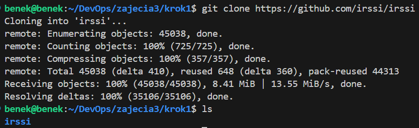

Następnie za pomocą komendy 'cd irssi' przeniosłem się do odpowieniego katalogu  i wykonałem komendę służącą do budowania oprogramowania: 

    meson build

Wtedy okazało się, że nie posiadam narzędzia 'meson' i musiałem do doinstalować. 

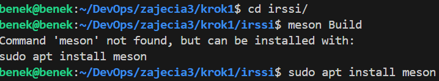

Następnie podczas próby zbudowania oprogramowania okazało się, że brakuję mi jeszcze kolejnych bibliotek i zależności. Za pomocą odpowiednich komend zainstalowałem potrzebne biblioteki, które są wymagane do prawidłowego zbudowania i uruchomienia programu. 

Kolejnym krokiem było wykonanie polecenia: 

    ninja -C /home/benek/DevOps/zajecia3/krok1/irssi/build

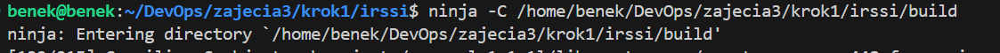

Jest ono używane do uruchomienia narzędzia budującego Ninja w katalogu budowania o nazwie "build".

#### Dla node-js-dummy-test

Zgodnie z instrukcją zamieszczoną w serwisie github na samym starcie sklonowałem repozytorium projektu poleceniem: 

    git clone https://github.com/devenes/node-js-dummy-test

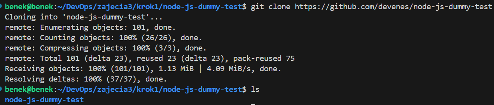

Następnie przeniosłem się do katalogu 'node-js-dummy-test' i sciągnałem wszystkie potrzebne zależności za pomocą komendy: 

    npm intall

Niezbędne jednak było zainstalowanie pakietu npm za pomocą: 

    sudo apt install npm

Po wykonaniu tego polecenia program został pomyślnie zbudowany.

#### Uruchomienie testów jednostkowych dołączonych do repozytorium

#### Dla Irsii

Gdy program został poprawnie zbudowany, przeniosłem się do katalogu 'build' i wykonałem polecenie, które uruchamia testy jednostkowe: 

    ninja test

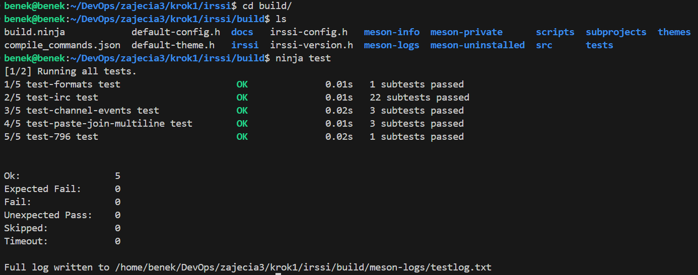

#### Dla node-js-dummy-test

Po zbudowaniu programu, uruchomiłem testy jednostkowe: 

    npm run test

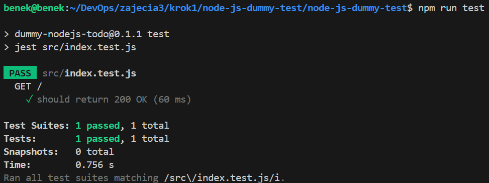

### Przeprowadzenie buildu w kontenerze

#### 1.Wykonanie kroków build i test wewnątrz wybranego kontenera bazowego

Wykonywanie powyższych kroków wewnątrz wybranego kontenera bazowego zapewnia pewność, że budowanie i testowanie aplikacji odbywa się w kontrolowanym i izolowanym środowisku, co pomoga uniknąć problemów związanych z zależnościami systemowymi i róznicami między środowiskami. 

#### Dla Irssi

* Uruchomienie kontenera i podłączenie się do niego TTY celem rozpoczęcia interaktywnej pracy

Z racji tego, że program Irssi jest napisany w języku C to do kompilacji użyje kontenera bazowego na systemie Fedora, gdyż zapewnia odpowiednie środowisko. Uruchamiam kontener i podłączam się do niego interaktywnie poprzez: 

    docker run --rm -it fedora

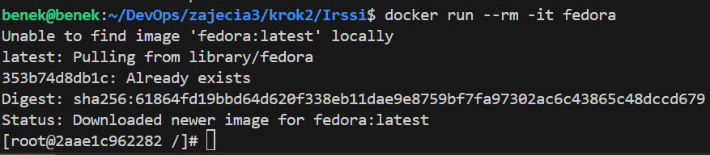

* Zaopatrzenie kontenera w wymagania wstępne

Następnie wykonuje takie kroki jak poprzednio, czyli najpierw instaluje wymagane zależności:

    dnf -y update ; dnf -y install git gcc meson ninja* glib2-devel utf8proc-devel ncurses* perl-Ext*

* Sklonowanie repozytorium 

    git clone https://github.com/irssi/irssi

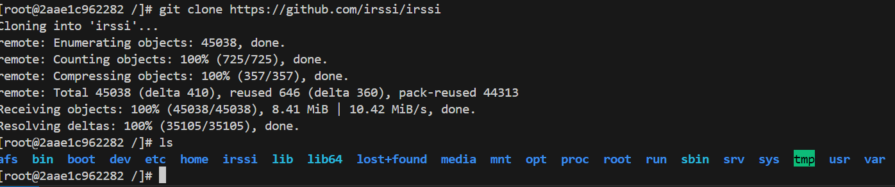

* Uruchomienie buildu

Udaję sie do katalogu 'irssi' wykonuje polecenia:

    meson build

    ninja -C /irssi/build

* Uruchomienie testów

Po zakończonym procesie budowania oprogramowania powstał katalog build, do którego się przenoszę i uruchamiam w nim testy jednostkowe:

    ninja test

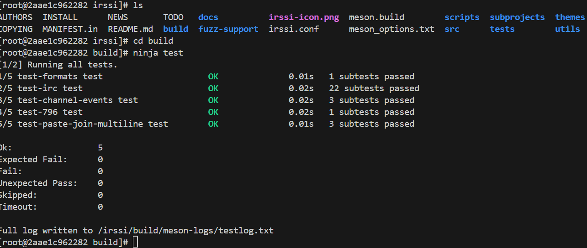

#### Dla node-js-dummy-test

* Uruchomienie kontenera i podłączenie się do niego TTY celem rozpoczęcia interaktywnej pracy

Ze względu na to, że jest to aplikacja oparta na Node.js to używam kontenera bazowego node:

    docker run --rm -it node /bin/bash 

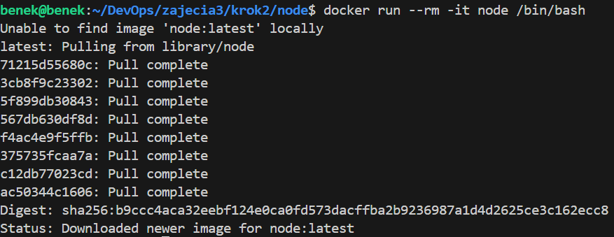

* Zaopatrzenie kontenera w wymagania wstępne

W przypadku obrazu node nie jest to konieczne, gdyż ten obraz zawiera już wszystkie niezbędne zalezności i narzędzia do pracy z Node.js. 

* Sklonowanie repozytorium 

W tym celu wykonuje polecenie: 

    git clone https://github.com/devenes/node-js-dummy-test

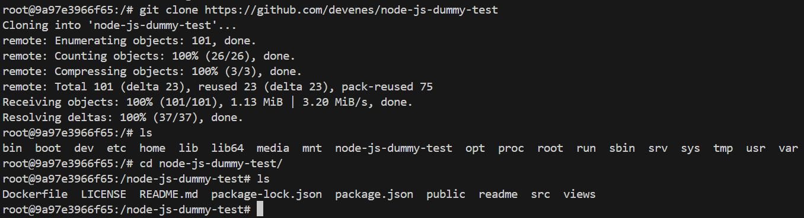

* Uruchomienie buildu

Zgodnie z instrukcją zamieszczoną w repozytorium na githubie przenoszę się do katalogu 'node-js-dummy-test' i instaluje wszystkie zależności za pomocą:

    npm install

* Uruchomienie testów

    npm run test

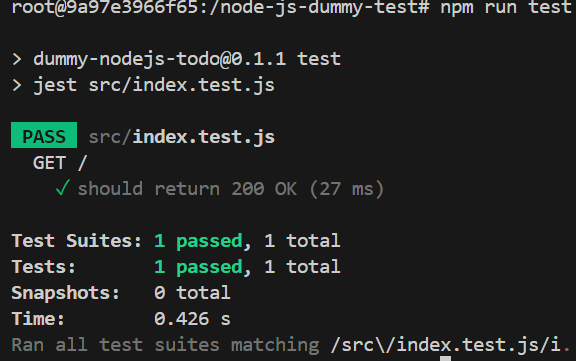

#### 2.Stworzenie dwóch plików Dockerfile automatyzujących kroki powyżej

Dockerfile pozwala zautomatyzować proces budowy obrazów kontenerów. Dzięki zapisaniu kroków budowy w pliku Dockerfile, można łatwo powtarzać ten proces na różnych maszynach i środowiskach, co zapewnia spójność i niezawodność aplikacji.

* Kontener pierwszy ma przeprowadzać wszystkie kroki aż do builda

#### Dla irssi

W celu automatyzacji procesu budowania zapisuje wszystkie wcześniej wykonane kroki do momentu uruchomienia builda w pliku o nazwie 'irssi.builder.Dockerfile'. 

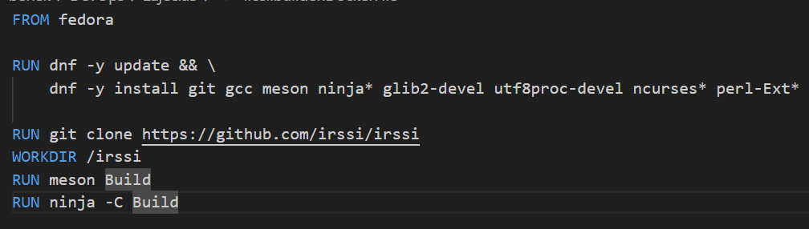

Ten Dockerfile automatyzuje proces przygotowania środowiska oraz budowy programu irssi w środowisku kontenerowym.

Kolejnym krokiem jest zbudowanie obrazu z pliku Dockerfile. Robie to za pomocą: 

    docker build -t irssi-builder -f ./irssi.builder.Dockerfile .

Za pomocą flagi -t przypisuje nazwę obrazu, który zostanie zbudowany, a za pomocą flagi -f określam nazwę pliku Dockerfile używanego do budowy obrazu. 

Gdy uruchomie kontener z tego obrazu to nic nie wykona, gdyż wszystkie operacje zawarte w pliku Dockerfile wykonają się na etapie budowania obrazu. 

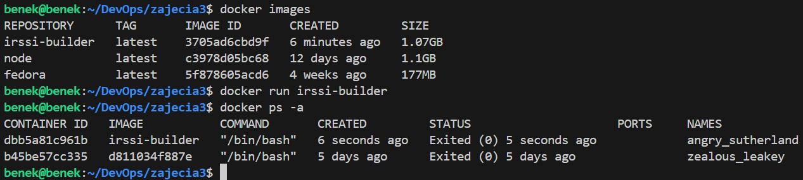

#### Dla node-js-dummy-test

Dockerfile zawierający wcześniej wykonane kroki wygląda następująco: 

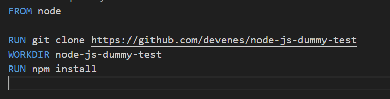

Budowanie obrazu wykonuje za pomocą komendy:

    docker build -t node-builder -f ./node.builder.Dockerfile .

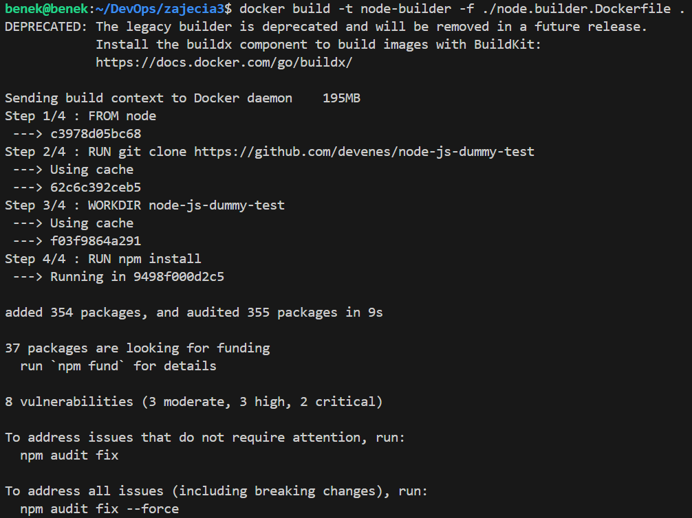

* Kontener drugi ma bazować na pierwszym i wykonywać testy

#### Dla irssi

Ten Dockerfile pozwala na automatyzację procesu uruchamiania testów programu irssi w kontenerze, co zapewnia spójność i niezawodność weryfikacji poprawności kodu źródłowego przed wdrożeniem aplikacji. Bazuje on na wcześniej utworzonym obrazie, który zawiera już zbudowaną aplikacje irssi wraz z narzędziami potrzebnymi do budowy i testowania. 

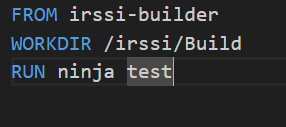

Następnie buduje obraz z tego pliku Dockerfile:

    docker build -t irssi-tester -f ./irssi.test.DockerFile .

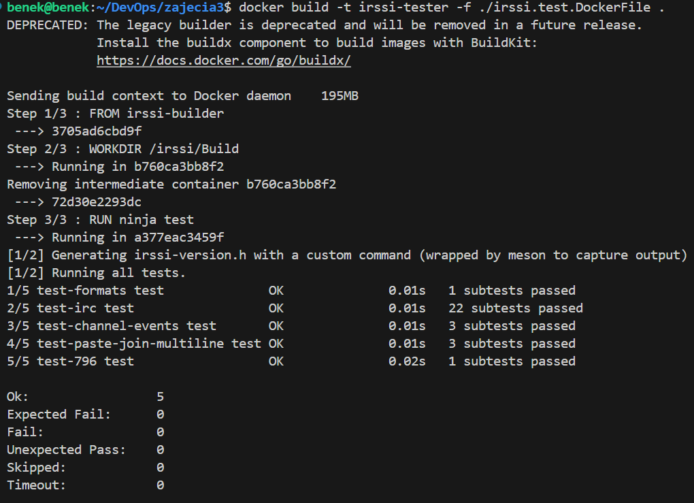

W tym przypadku testy się wykonały na etapie budowania obrazu z pliku Dockerfile. Gdy kontener zostanie uruchomiony, nie będzie żadnych dodatkowych działań związanych z testami, ponieważ ich wyniki zostały już uwzględnione w zbudowanym obrazie. Jeśli testy się nie powiodą to obraz nie powstanie, a gdy testy 'przejdą' to obraz powstanie pomyślnie.

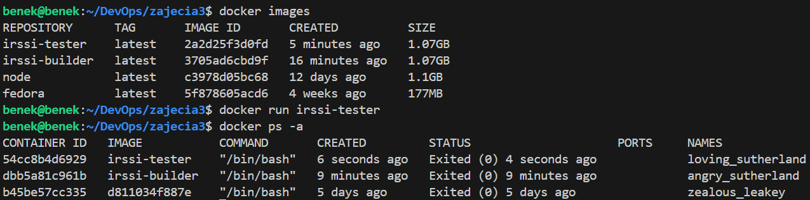

#### Dla node-js-dummy-test

Ten Dockerfile pozwala na automatyzację procesu uruchamiania testów programu node-js-dummy-test w kontenerze, co zapewnia spójność i niezawodność weryfikacji poprawności kodu źródłowego przed wdrożeniem aplikacji. Bazuje on na wcześniej utworzonym obrazie node-builder, który zawiera już zbudowaną aplikacje wraz z narzędziami potrzebnymi do budowy i testowania. 

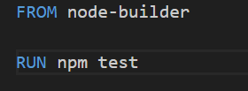

Następnie buduje obraz z tego pliku Dockerfile za pomocą komendy:

    docker build -t node-tester -f ./node.test.Dockerfile .

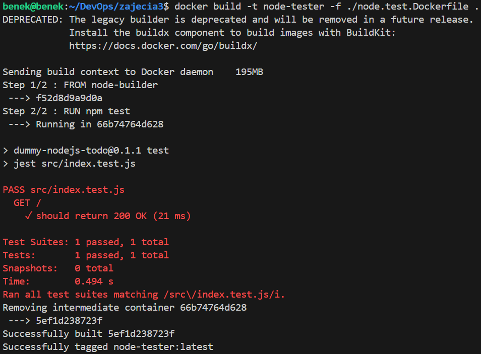

Obraz został pomyślnie zbudowany co świadczy o tym, że testy wykonały się poprawnie podczas procesu jego budowy. W przypadku, gdy testy nie wykonały by się poprawnie obraz nie zostałby zbudowany.

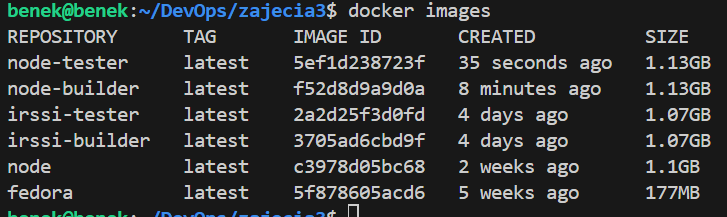

#### 3. Wykazanie, że kontener wdraża się i pracuje poprawnie, pamiętając o rożnicy między obrazem a kontenerem. 

#### Dla irssi

Po zbudowaniu obrazu, sprawdzam czy kontener uruchomiony z tego obrazu wdraża się i pracuje poprawnie. W tym celu uruchamiam kontener z obrazu 'irssi-builder':

    docker run irssi-builder

Uruchomienie konteneru nic nie robi, gdyż obraz ten służy do instalcji wszystkich wymaganych narzędzi i zbudowania aplikacji. Wszystkie te czynności są wykonywane podczas budowania obrazu, a nie podczas uruchamiania kontenera. W pliku Dockerfile nie zdefiniowałem żadnych instrukcji, które mają się wykonać podczas uruchomienia kontenera za pomocą instrukcji 'CMD' lub 'ENTRYPOINT'. 
W celu sprawdzenia poprawności wdrożenia się kontenera i jego pracy wykonuje po jego uruchomieniu komendę:

    echo $?

Służy ona do wyświetlenia kodu wyjścia ostatnio wykonanego polecenia w powłoce systemowej. Jeśli kod wyjścia jest równy zero to oznacza, że kontener został uruchomiony poprawnie. Status wyjścia mogę rownież sprawdzić za pomocą komendy 'docker ps -a' w zakładce 'STATUS'. 

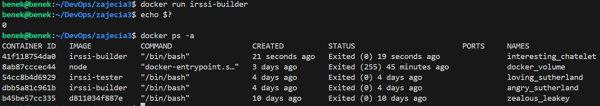

Podobne czynności wykonuje w przypadku kontenera uruchomionego z obrazu odpowiadającego za testy. W tym przypadku testy wykonywane są podczas budowy obrazu z pliku Dockerfile, a nie podczas uruchamiania kontenera. Podczas uruchomiania kontenera nic się nie wykonuje. 
Uruchamiam kontener za pomocą polecenia: 

    docker run irssi-tester

Kolejno sprawdzam kod wyjścia za pomocą polecenia: 

    echo $?

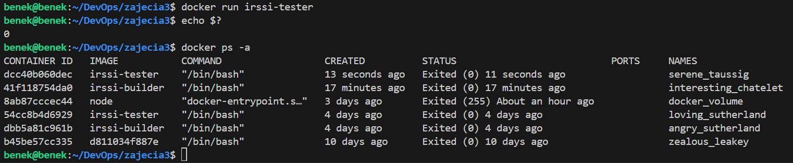

#### Dla node-js-dummy-test

W przypadku aplikacji 'node-js-dummy-test' postępuje w taki sam sposób jak w przypadku aplikacji 'irssi'. 
Uruchamiam kontener z obrazu 'node-builder' i następnie sprawdzam kod wyjścia. 

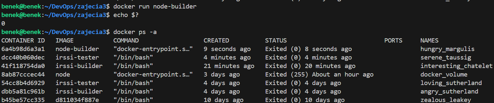

Dla kontenera uruchomionego z obrazu odpowiedzialnego za uruchomienie testów: 

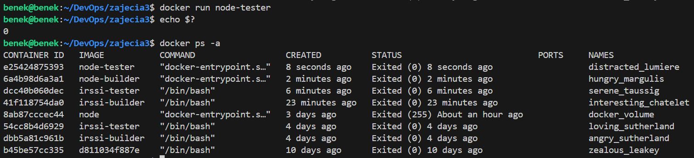

Dla tej aplikacji stworzyłem dodatkowy plik Dockerfile służący do zbudowania obrazu, z którego będe mógł uruchomić aplikację za pomocą uruchomienia kontenera z tego obrazu. 
Plik Dockerfile wygląda w ten sposób: 

Jak widać obraz, który zostanie zbudowany, będzie oparty na obrazie o nazwie 'node-builder'. Nastepnie za pomocą polecenia 'CMD ["npm", "start"]' uruchamiam aplikację Node.js podczas uruchomienia kontenera z tego obrazu.
Buduje obraz:

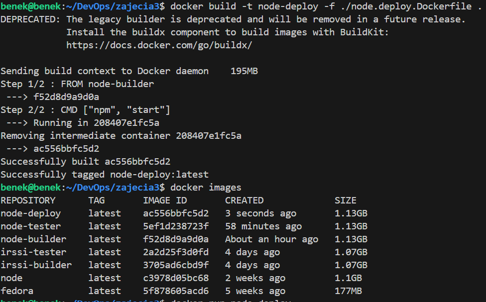

W kolejnym kroku uruchamiam kontener z tego obrazu, który powoduje, że aplikacja zostaje uruchomiona:

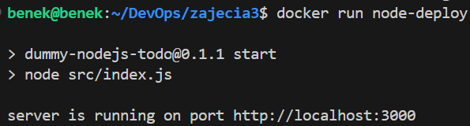

### Docker compose

#### Zamiast ręcznego wdrażania kontenerów, ujęcie ich w kompozycję

Docker Compose jest narzędziem służącym do definiowania i uruchamiania aplikacji składających się z wielu kontenerów Docker. Zamiast ręcznego uruchamiania każdego z konterów, mogę stworzyć plik docker-compose.yml, który zawiera listę serwisów oraz ich konfigurację. Dzięki docker-compose możemy w łatwy sposób zarządzać wieloma konterami. W tym przypadku, gdy mam dwa kontenery nie jest to jeszcze duży problem, lecz w sytuacji gdy tych konterów jest więcej to docker compose jest niesamowicie przydatnym narzędziem. 

Z racji, iż rozważam dwie osobne aplikacje będe tworzył dwa osobne pliki docker-compose.yml w róznych folderach. 
Przed przejściem do korzystania z narzędzia Docker Compose muszę go najpierw zainstalować. Instaluje go za pomocą polecenia: 

    sudo apt install docker-compose

#### Dla irssi

Stworzyłem katalog o nazwie irssi, w którym umieściłem wcześniej stworzone dwa pliki Dockerfile. Za pomocą polecenia touch stworzyłem plik o nazwie 'docker-compose.yml'. Plik docker-compose.yml dla aplikacji irssi: 

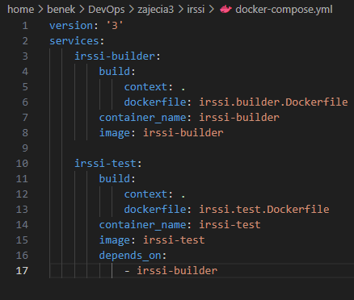

Jak widać w tym pliku zdefiniowalem konfigurację dla dwoch serwisów: 'irssi-builder' oraz 'irssi-test'. 
W sekcji: 
 * 'build' określam sposób budowania obrazu dla danego serwisu, 
    * 'context' wskazuje katalog, w którym Docker będzie szukał plików związanych z budową obrazu,
    * 'dockerfile' wskazuje nazwę pliku Dockerfile
 * 'container_name' nadaje kontenerowi nazwę
 * 'image' nadaje nazwę obrazowi, ktory zostanie użyty dla danego serwisu

 Następnie buduje, tworzę i uruchamiam kontenery opisane w tym pliku za pomocą polecenia:

    docker-compose up

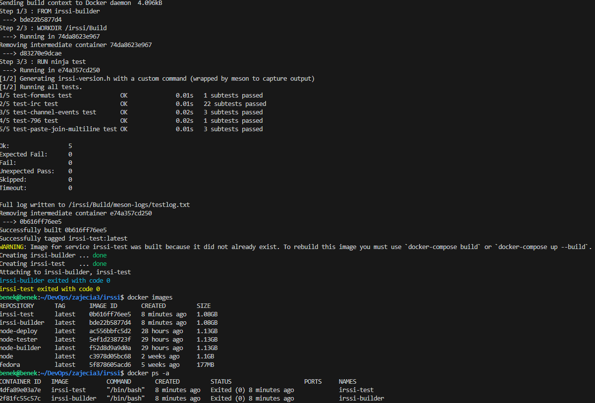

Jak widać obrazy zostały pomyślnie zbudowane, a kontenery uruchomione. 

#### Dla node-js-dummy-test

Dla tej aplikacji również stworzyłem osobny katalog, w którym umieściłem wcześniej stworzone pliki Dockerfile dla tej aplikacji. W pliku docker-compose.yml dla aplikacji node-js-dummy-test zdefiniowałem serwisy służace do:
 * budowania obrazu służacego do przygotowania środowiska oraz budowy programu node-js-dummy-test,
 * testowania aplikacji,
 * uruchamiania aplikacji

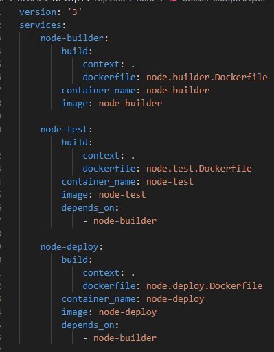

Efekt użyciu polecenia docker-compose up, który automatyzuje proces budowania, tworzenia i uruchamiania kontenerów na podstawie pliku konfiguracyjnego docker-compose.yml:

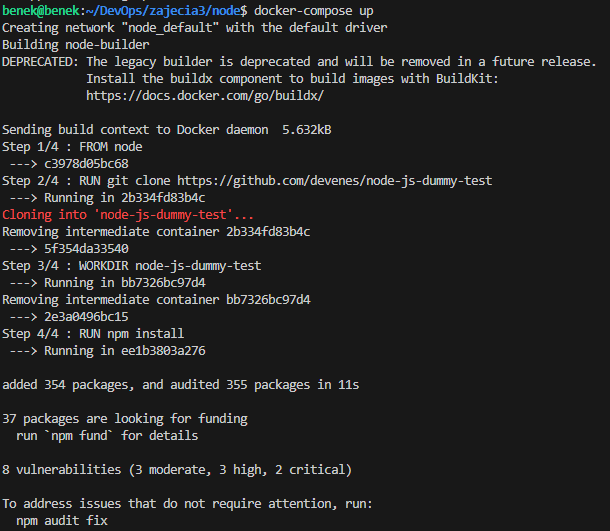

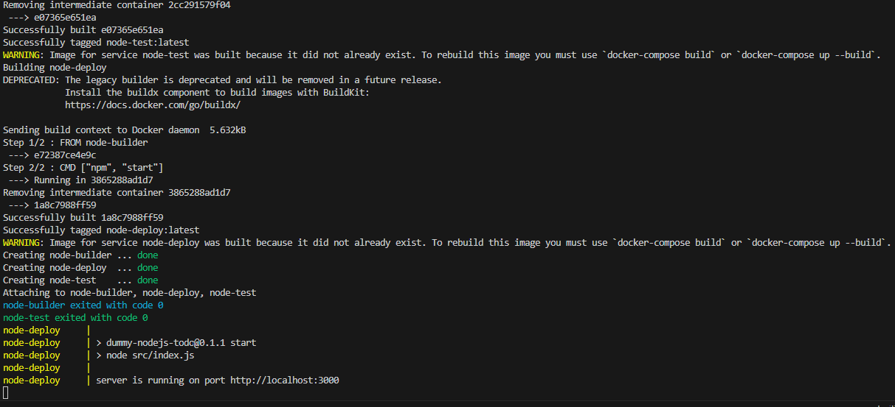

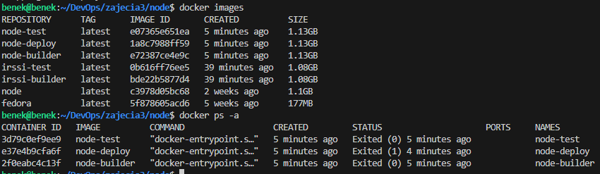

Jak widać proces 'docker-compose up' zakończył się pomyślnie, ponieważ wszystkie usługi zostały zbudowane i uruchomione zgodnie z instrukcjami. 

### Przeprowadzenie dyskusji

 * czy program nadaje się do wdrażania i publikowania jako kontener, czy taki sposób interakcji nadaje się tylko do builda

    Nie każde oprogramowanie nadaję się do wdrażania i publikowania jako kontener. Programy, które działają w sposób interaktywny (np. irssi) nie nadają się do wdrażania na kontenerze. W takim przypadku nasze Dockerfile służą głównie do budowania i testowania aplikacji. Jednak w przypadku wielu aplikacji np. webowych (np. node-js-dummy-test) publikowanie jako kontener jest bardzo korzystne ze względu na przenośność i izolację.   

 * opisz w jaki sposób miałoby zachodzić przygotowanie finalnego artefaktu

    Pierwszym krokiem powinno być zbudowanie aplikacji, która może obejmować kompilację kodu źródłowego, zarządzanie zależnościami oraz działania przygotowujące aplikację do uruchomienia. Po zakończeniu budowy należałoby przeprowadzić proces oczyszczania z niepotrzebnych pików po buildzie. Następnie aplikacja powinna zostać przetestowana, aby upewnić się, że działa zgodnie z oczekiwaniami. Po pomyślnym zakończeniu testów aplikację nalezy spakować w odpowiedni format pakietu np. JAR i przeprowadzić proces publikacji finalnego artefaktu. 

    * jeżeli program miałby być publikowany jako kontener - czy trzeba go oczyszczać z pozostałości po buildzie?

        Tak, w takim przypadku program nalezałoby oczyścić z pozostałości po buildzie. Główną zaletą tego podejścia jest zminimalizowanie końcowego rozmiaru obrazu co jest bardzo porządane jeśli chcemy publikować aplikację jako kontener. 

    * A może dedykowany deploy-and-publish byłby oddzielną ścieżką (inne Dockerfiles)?

        Myślę, że takie rozwiązanie jest wskazane, gdyż korzyścią z tego podejścia jest uzyskanie lepszego kontrolowania nad środowiskiem uruchomieniowym aplikacji oraz zmniejszenie rozmiaru obrazów. Dodatkowo, oddzielając proces budowania od procesu wdrażania możliwie jest usunięcie niepotrzebnych narzędzi i biliotek z obrazów służacych do wdrażania aplikacji. 

    * Czy zbudowany program należałoby dystrybuować jako pakiet, np. JAR, DEB, RPM, EGG?

        Wydaje mi się, że zależy to od wielu czynników i taka decyzja powinna być podejmowana na podstawie potrzeb i specyfikacji konkretnej aplikacji oraz środowiska, w którym będzie uruchamiana. 

    * W jaki sposób zapewnić taki format? Dodatkowy krok (trzeci kontener)? Jakiś przykład?

        Użycie trzeciego kontenera pozwoli nam na zapewnienie odpowiedniego formatu. Kontener ten może wykorzystywać zbudowany program i następnie konwertować go do żądanego formatu. 

### Zachowanie stanu

Aby zachować stan kontenerów Dockerowych, możemy korzystać z mechanizmu woluminów. Woluminy pozwalają na przechowywanie danych między kontenerami, a także na trwałe przechowywanie danych nawet po zatrzymaniu i usunięciu kontenera.
W tej części sprawozdania będe realizował zadania w oparciu o program irssi.

* Zapoznanie się z dokumnetacją dotyczącą woluminów
* Przygotowanie woluminu wejściowego i wyjściowego, o dowolnych nazwach, i podłączenie ich do kontenera bazowego, z którego rozpoczynano poprzednio pracę

Na samym początku tworzę wolumin wejściowy i wyjściowy za pomocą poleceń:

    docker volume create input_volume
    docker volume create output_volume

Po stworzeniu woluminów wyświetlam listę woluminów, aby potwierdzić poprawność operacji:

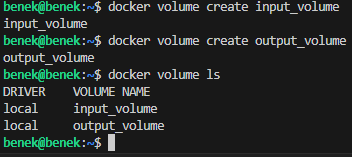

Następnie podłączam stworzone woluminy do kontenera bazowego jakims jest kontener stworzony z obrazu fedora. 
Uruchamiam kontener z obrazu Fedora w trybie interaktywnym montując dwa woluminy poleceniem: 

    docker run -it --name irssi_volume_container -v input_volume:/irssi -v output_volume:/irssi/Build fedora bash

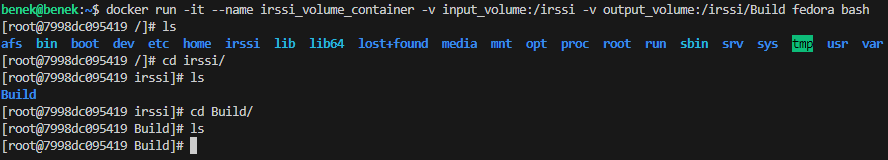

Jak widać zostały stworzone dwa foldery, do których podpięte są woluminy. 

* Po uruchomieniu kontenera. zainstalowanie na nim niezbędnych wymagań wstępnych, ale bez gita. 

Dla programu irssi instaluje niezbędne wymagania do przeporwadzenia buildu poleceniem: 

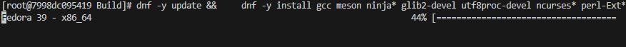

* Sklonowanie repozytorium na wolumin wejściowy 

Klonuje repozytorium na wolumin wejściowy poprzez sklonowanie repozytorium na hoście do folderu, ktory jest związany z woluminem. Dzięki temu repozytorium pojawi się również w odpowiednim folderze w kontenerze. 

Na samym początku, aby uzyskać informację o lokalizacji woluminu na hoście wykonuje następujące polecenie w osobnym terminalu: 

    docker volume inspect input_volume

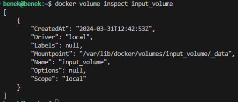

Następnie udaję sie do tego folderu i klonuje do niego repozytorium. Okazuje się jednak, że nie mam uprawnień do dostępu do tego katalogu. W celu rozwiązania tego problemu muszę się przełączyć na konto roota za pomocą polecenia 'sudo su', a następnie mogę zmienić katalog. 

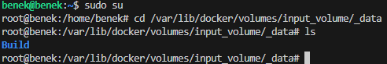

Kolejmym krokiem jest sklonowanie repozytorium do tego katalogu: 

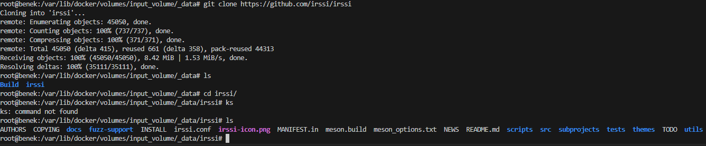

Następnie sprawdzam, czy pliki z sklonowanego repozytorium znajdują się w kontenerze w odpowiednim folderze: 

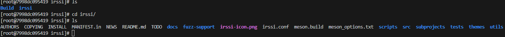

Jak widać operacja przebiegła pomyślnie. 

* Uruchomienie buildu w kontenerze

Jak poprzednio, aby przeprowadzić build należy wykonać następujące polecenia w katalogu irssi: 

    meson build

a następnie: 

    ninja -C /irssi/irssi/build 

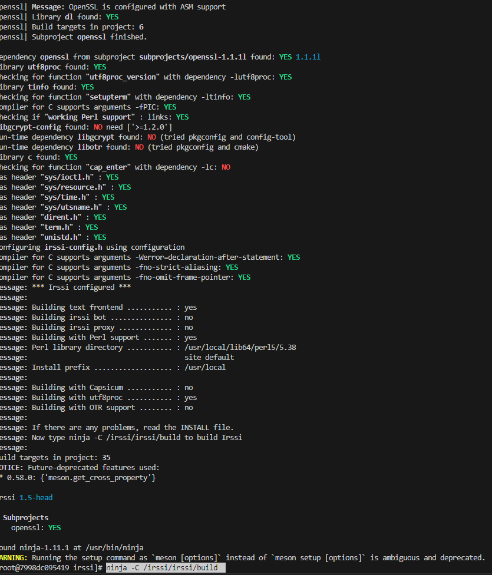

Następnie sprawdzam, czy poprawnie utworzyl się katalog o nazwie 'build':

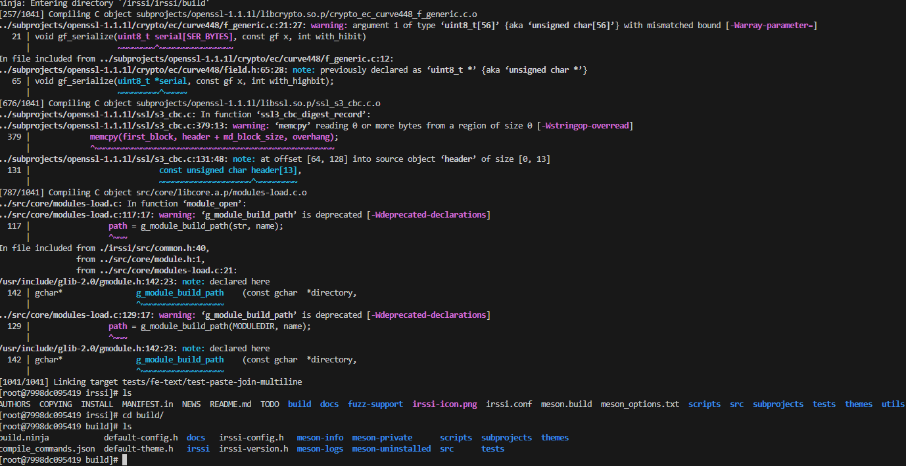

Skopiowanie repozytorium do wnętrza kontnera można wykonać za pomocą polecenia:

    cp -r irssi ../

* Zapisanie zbudowanych plików na woluminie wyjściowym, tak aby były dostępne po wyłączeniu kontenera

Zbudowane pliki znajdująsię w katalogu build, więc kopiuje ten katalog do katalogu do, którego jest podpięty wolumin wyjściowy czy do katalogu Build.

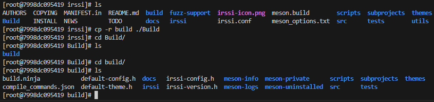

Nastepnie sprawdzam, czy katalog znajduję się w katalogu na hoscie, do którego jest podpięty wolumin.

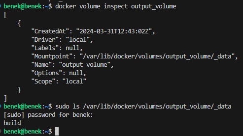

* Ponawiam operację lecz tym razem klonowanie na wolumin wejściowy przeprowadzę wewnątrz kontenera

W tym celu wewnątrz kontenera w katalogu, do którego jest podpięty wolumin tworzę nowy folder i wewnątrz jego kopiuje repozytorium.

Tym razem użyje gita w kontenerze, więc na samym poczatku muszę go zaintalować.

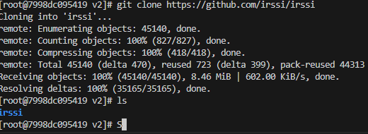

* Przedyskutowanie możliwości wykonania ww. kroków za pomocą docker build i pliku Dockerfile

Wykonanie ww. kroków za pomocą docker build i pliku Dockerfile jest możliwe i należy skorzystać z funkcjonalności 'RUN --mount', która pozwala na montowanie woluminów do kontenera podczas budowowania obrazu. Zawartość pliku Dockerfile:

    FROM fedora

    RUN mkdir /input
    RUN mkdir /output
    RUN --mount type=bind,source=/var/lib/docker/volumes/volume_in,target=/input
    RUN --mount type=bind,source=v/var/lib/docker/volumes/volume_out,target=/output
    RUN dnf -y update && \
        dnf -y install git gcc meson ninja* glib2-devel utf8proc-devel ncurses* perl-Ext*
    WORKDIR /input
    RUN git clone https://github.com/irssi/irssi
    WORKDIR /input/irssi
    RUN meson Build
    RUN ninja -C Build
    RUN cp -r build ../../output

Ten Dockerfile tworzy obraz oparty na obrazie Fedora, montuje dwa wolumeny z hosta do katalogów '/input' i '/output' w kontenerze, instaluje potrzebne narzędzia i biblioteki, przeprowadza build i na koniec przenosi zbudowane pliki do katalogu, do którego podpięty jest wolumin wyjściowy.

### Eksponowanie portu

* Zapoznanie się z dokumentacją https://iperf.fr/

'iperf3' to narzędzie służące do pomiaru przepustowośći sieciowej między dwoma węzłami w sieci. 

* Uruchomienie wewnątrz kontenera serwer iperf

Kontener jaki wybrałem to 'Ubuntu' i zainstalowałem na nim 'iperf3' poleceniem: 

    apt install iperf3

Następnie uruchamiam serwer wewnątrz tego kontenera:

    iperf3 -s

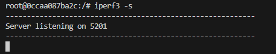

* Połączenie się z nim z drugiego kontenera, zbadanie ruchu

W tym celu otworzyłem nowy terminal i sprawdziłem adres IP kontenera, który jest serwerem: 

    docker inspect -f '{{.Name}} - {{range .NetworkSettings.Networks}}{{.IPAddress}}{{end}}' $(docker ps -aq)

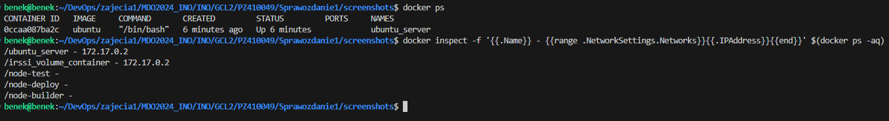

Adres IP serwera to 172.17.0.2

Następne uruchomiłem kolejny kontener z obrazu 'Ubuntu' i połaczyłem się do serwera jako klient za pomocą komendy:

    iperf3 -c 172.17.0.2

Następuje połaczenie i otrzymałem następujące wydruki:

Dla serwera: 

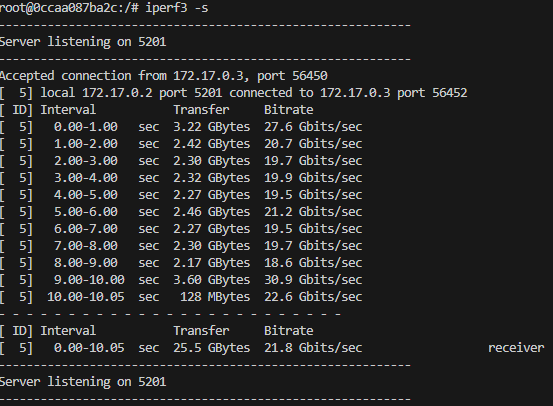

Dla klienta:

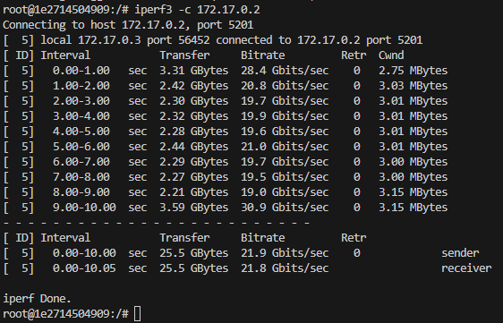

* Zapoznanie się z dokumentacją 'network create': https://docs.docker.com/engine/reference/commandline/network_create/

* Ponowienie tego kroku z wykorzystaniem własnej dedykowanej sieci mostkowej oraz próba użycia rozwiązywania nazw

Dedykowana sieć mostkowa w Dockerze to sieć, którą można utworzyć, aby kontenery miały swoją własną izolowaną przestrzeń sieciową. Kontenery podłączone do tej samem dedykowanej sieci mostkowej mogą komunikować się ze sobą używając nazw kontenerów lub adresów ip. 
Utworzyłem dedykowaną sieć mostkową za pomocą polecenia:
    
    docker network create nazwa_sieci

Kolejnym krokiem jest uruchomienie kontenerów jak poprzednio, lecz tym razem podłączam je do utworzonej wcześniej dedykowanej sieci mostkowej:

    docker run --name ubuntu_server -it --rm --network=my_own_network ubuntu bash
    docker run --name ubuntu_client -it --rm --network=my_own_network ubuntu bash

Sprawdzam, czy kontenery są podpięte do tej samej sieci: 

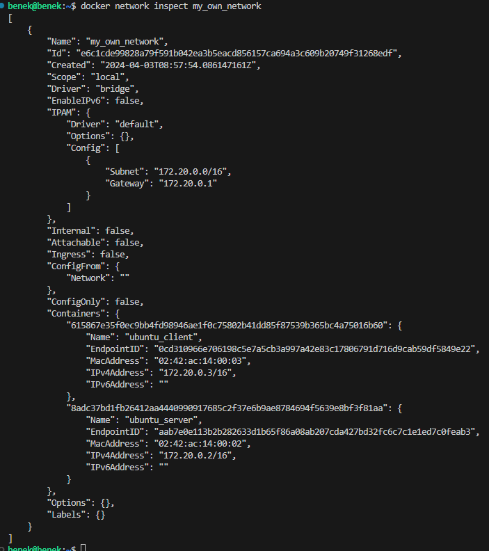

Następnie realizuje to same kroki co poprzednio: 

Uruchamiam serwer na jednym z kontenerów:

    iperf3 -s

A na drugim z konterów relizuje połączenie z serwerem lecz tym razem zamiast adresu IP posługuję się nazwą kontenera:

    iperf3 -c ubuntu_server

Wyniki dla serwera:

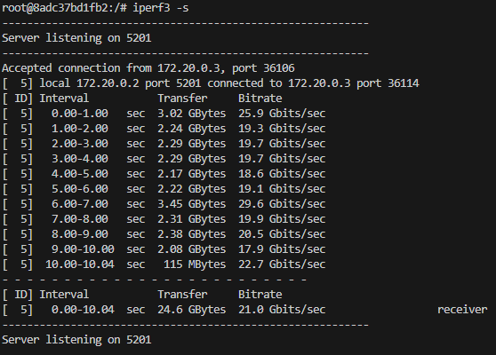

Wyniki dla klienta:

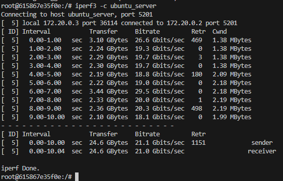

* Połaczenie się z spoza kontenera (z hosta i spoza hosta)

W tym kroku połącze się do sieci z hosta, czyli z mojej maszyny wirtualnej. 
Aby połaczyć sięz serwerem iperf3 uruchomionym w kontenerze z poziomu hosta lub spoza hosta, muszę podczas uruchomienia kontenera z serwerm iperf3 odpowiednio wystawić port, który słucha na połaczenia. Domyślny port dla iperf3 to 5201. Realizuje to poprzez dodanie opcji '-p' do polecenia 'docker run':

    docker run --name ubuntu_server -it --rm --network=my_own_network ubuntu bash

Sprawdziłem adres IP kontenera i połaczyłem się z hosta z serwerem:

    iperf3 -c 172.20.0.2

Wyniki dla hosta:

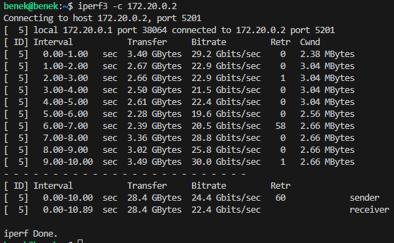

Wyniki dla serwera:

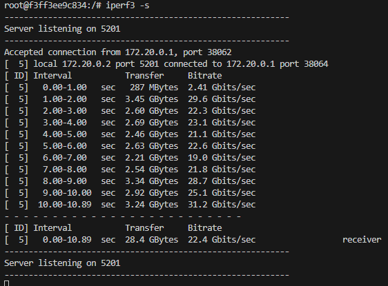

Połączenie spoza hosta spróbowałem zrealizować poprzez pobranie programu 'iperf3' na windowsa. Następnie rozpakowałem pobraną paczkę do oodpowiedniego katalogu i w wierszu poleceń cmd dostałem się do tego katalogu i wykonałem polecenie:

    iperf3.exe -c 127.0.0.1 -p 5201

Niestety mimo wielu prób nie udało mi się połaczyć spoza hosta. 

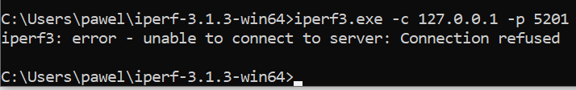

* Przedstawienie przepustowości komunikacji:

* Połączenie dwóch kontenerów przez domyślną sieć Dockera: 21.9 Gbits/sec
* Połączenie dwóch kontenerów przez własną dedykowaną sieć mostkową: 21.1 Gbits/sec
* Połaczenie do kontera z hosta: 24.4 Gbits/sec
* Połączenie do kontenera spoza hosta: nie udało się nawiązać połaczenia

Jak widać największa przepustowość występowała w przypadku komunikacji między kontenerem, a hostem. Może to wynikać z mniejszego narzutu na komunikację w ramach lokalnego hosta. Nie udało się nawiązać połaczenia do kontenera spoza hosta co może sugerować, że występuje jakiś problem z konfiguracją lub dostępnością połaczenia spoza hosta.

### Instancja Jenkins

* Zapoznanie się z dokumntacją https://www.jenkins.io/doc/book/installing/docker/

Jenkins to popularne narzędzie do ciągłej integracji i dostarczania (CI/CD), które umożliwia automatyzację procesów budowania, testowania i wdrażania aplikacji.

* Przeprowadzenie instalacji skonteneryzowanej instacji Jenkinsa z pomocnkiem DIND

Zgodnie z dokumentacją, na samym wstępie należy utworzyć siec mostkową jenkins:

    docker network create jenkins

Następnie należy uruchomić kontener z pomocnkiem DIND:
    docker run \
    --name jenkins-docker \
    --rm \
    --detach \
    --privileged \
    --network jenkins \
    --network-alias docker \
    --env DOCKER_TLS_CERTDIR=/certs \
    --volume jenkins-docker-certs:/certs/client \
    --volume jenkins-data:/var/jenkins_home \
    --publish 2376:2376 \
    docker:dind \
    --storage-driver overlay2

Następnie przechodzę do inicjalizacji instancji. Tworzę plik Dockerfile, który służy do modyfikacji obrazu Jenkinsa, aby zawierał dodatkowe narzędzia:

    FROM jenkins/jenkins:2.440.2-jdk17
    USER root
    RUN apt-get update && apt-get install -y lsb-release
    RUN curl -fsSLo /usr/share/keyrings/docker-archive-keyring.asc \
    https://download.docker.com/linux/debian/gpg
    RUN echo "deb [arch=$(dpkg --print-architecture) \
    signed-by=/usr/share/keyrings/docker-archive-keyring.asc] \
    https://download.docker.com/linux/debian \
    $(lsb_release -cs) stable" > /etc/apt/sources.list.d/docker.list
    RUN apt-get update && apt-get install -y docker-ce-cli
    USER jenkins
    RUN jenkins-plugin-cli --plugins "blueocean docker-workflow"

Kolejno buduje obraz z tego Dockerfila za pomocą polecenia:

    docker build -t myjenkins-blueocean:2.440.2-1 -f jenkins.Dockerfile .

Na koniec uruchamiam kontener Jenkinsa na podstawie zbudowanego obrazu: 

    docker run \
    --name jenkins-blueocean \
    --restart=on-failure \
    --detach \
    --network jenkins \
    --env DOCKER_HOST=tcp://docker:2376 \
    --env DOCKER_CERT_PATH=/certs/client \
    --env DOCKER_TLS_VERIFY=1 \
    --publish 8080:8080 \
    --publish 50000:50000 \
    --volume jenkins-data:/var/jenkins_home \
    --volume jenkins-docker-certs:/certs/client:ro \
    myjenkins-blueocean:2.440.2-1

Uruchomione kontenery: 

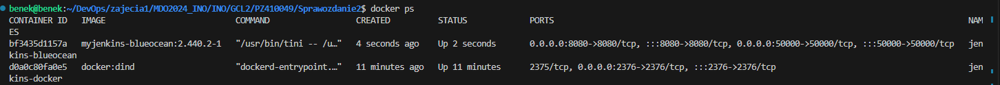

Moja wirutalna maszyna korzysta z konfiguracji NAT, więc muszę przekierowac porty z wirtualnej maszyny do hosta, aby uzyskać dostęp do serwera Jenkinsa uruchomionego wewnątrz maszyny wirtualnej. 

Na początku sprawdzam adres IP:

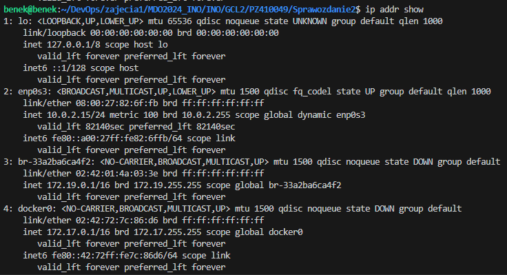

A następnie przekierowuje porty z wirtualnej maszyny do hosta. Robię to w programie Oracle VirtualBox:

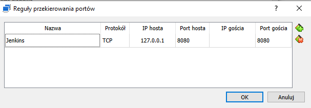

Otwieram panel logowania poprzez wpisanie w przeglądarce 'localhost:8080':

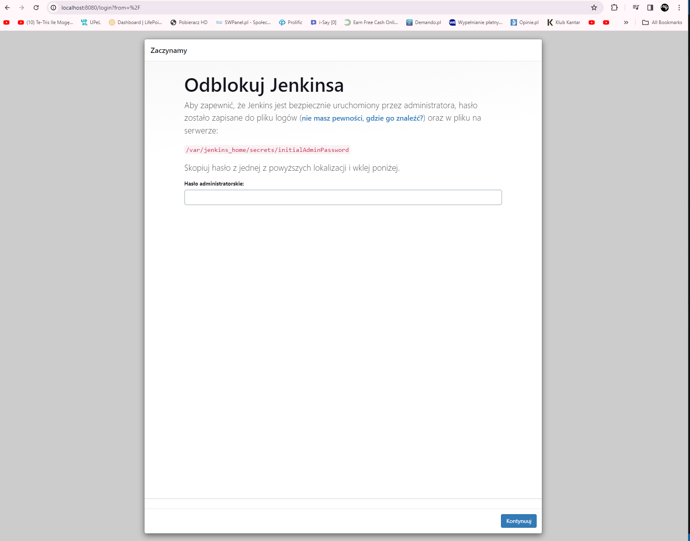

Następnie loguje się do Jenkinsa poprzez wpisanie hasła zapisanego w odpowiednim pliku: 

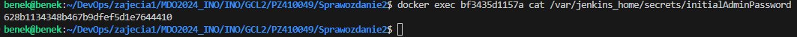