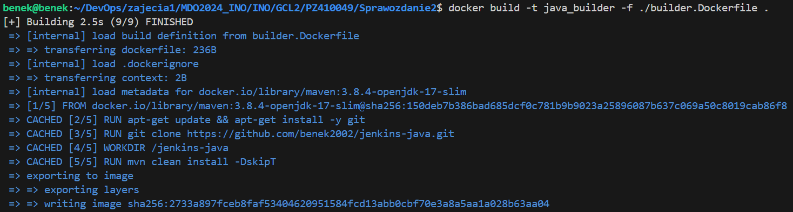
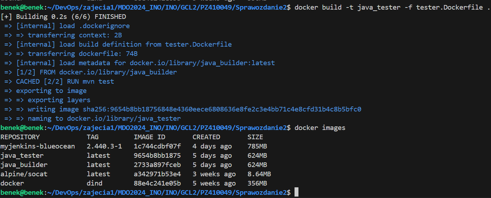
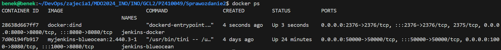
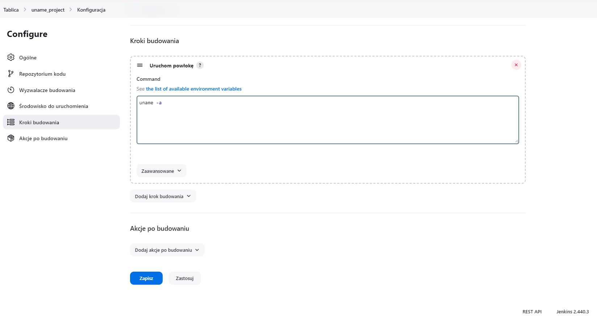
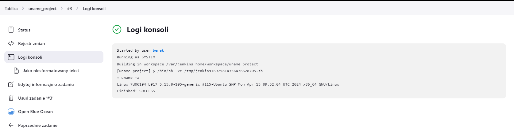
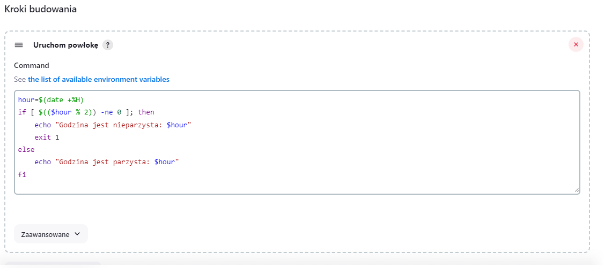
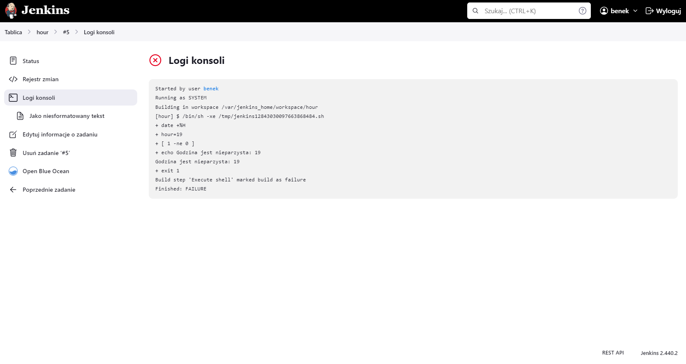
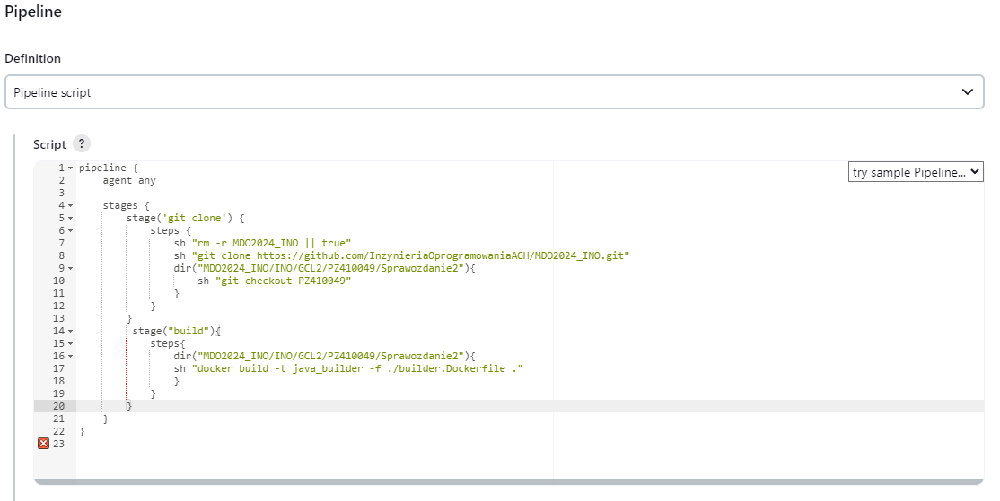
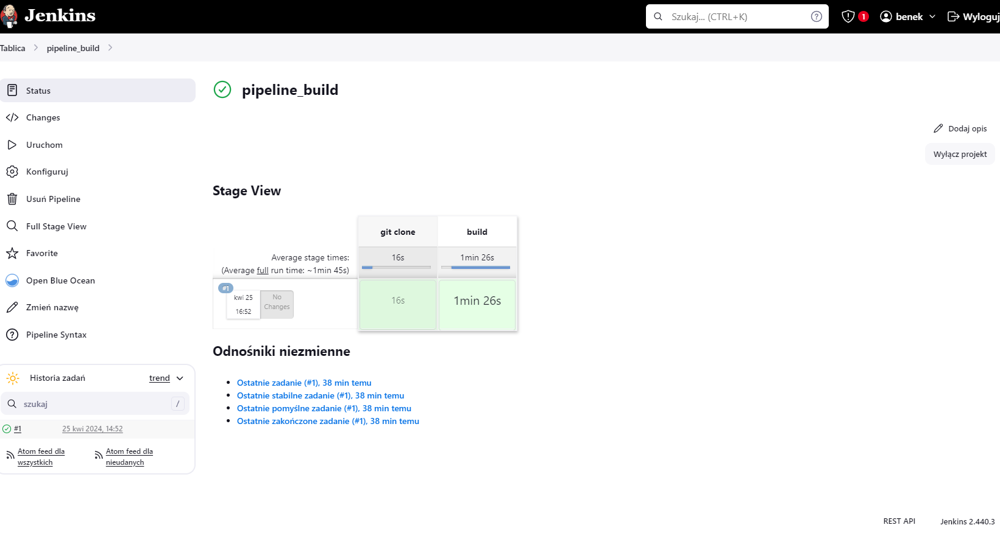
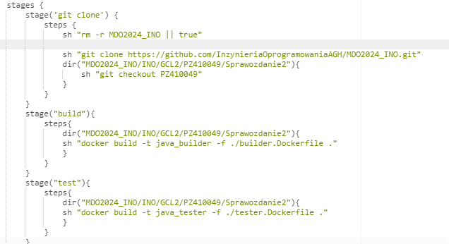

# SPRAWOZDANIE 3

## Paweł Ząbkiewicz, Inżynieria Obliczeniowa

## Cel projektu 

Celem tego projektu jest zautomatyzowanie procesów budowania, testowania i wdrażania aplikacji za pomocą CI/CD. Dzięki temu można zapewnić regularne i niezawodne dostarczanie oprogramowania poprzez zautomatyzowanie powtarzalnych zadań.

## Streszczenie projektu

### Przygotowanie

* Upewnienie się, że na pewno działają kontenery budujące i testujące, stworzone na poprzednich zajęciach.

W celu urozmaicenia napisałem prosty serwer HTTP napisany w języku Java przy użyciu frameworka Spring Boot zawierający testy.  Napisałem dockerfile, które służa do budowania, testowania i deploy'u aplikacji w sposób analogiczny jak uczyniłem to w przypadku aplikacji używającej node.js jako środowisko uruchomieniowe. Program ten to prosty kalkulator wyświetlający na głównym endpoincie napis "Hello User". 

Dockerfile służący do zbudowania aplikacji wygląda następująco: 

    FROM maven:3.8.4-openjdk-17-slim
    RUN apt-get update && apt-get install -y git
    RUN git clone https://github.com/benek2002/jenkins-java.git
    WORKDIR /jenkins-java
    RUN mvn clean install -DskipT

Obraz bazowy użyty do zbudowania obrazu do builda to Maven w wersji 3.8.4 i otwarte JDK w wersji 17 na lekkiej wersji systemu operacyjnego slim. Następnie wykonuje polecenie aktualizujące listę pakietów i instalujące pakiet 'git'. Kolejno klonuje repozytorium z githuba zawierające moją aplikację, ustawiam katalog roboczy na '/jenkins-java/' i w tym katalogu wykonuje polcenie Maven, które powoduje, że Maven oczyści projekt, zbuduje go i zainstaluje wymagane zależności. Opcja '-DskipTests' wyłącza uruchamianie testów podczas procesu budowania.

Dockerfile, z którego zbudowany obraz służy do testowania programu składa się tylko z dwóch instrukcji: 

    FROM java_builder
    RUN mvn test

Obrazem bazowym w tym przypadku jest wcześniej zbudowany obraz służacy do buildu. Następnie wykonywane jest polecenie 'mvn test', które uruchamia testy dla projektu Maven.

Kolejnym krokiem było ręczne zbudowanie obrazów i sprawdzenie czy ich funkcjonalność działa: 

Obraz prawidłowo się tworzy, więc zbudowanie programu przebiegło pomyślnie. 

Następnie buduje obraz odpowiedzialny za testy, który korzysta z wcześniej zbudowanego obrazu do buildu o nazwie 'java_builder':

* Zapoznanie się z instrukcją instalacji Jenkinsa: https://www.jenkins.io/doc/book/installing/docker/
    * Uruchomienie obrazu Dockera który eksponuje środowisko zagnieżdżone
    * Przygotowanie obrazu blueocean na podstawie obrazu Jenkinsa (czym się różnią?)
    * Uruchomienie Blueocean
    * Zadbanie o archiwizację i zabezpieczenie logów

Wyżej wymienione kroki wykonałem w ramach poprzedniego sprawozdania. Zrealizowałem to zgodnie z instrukcją instalacji Jenkinsa, czyli w pierwszej kolejności utworzyłem sieć mostkową w Dockerze o nazwie 'jenkins' za pomocą 'docker network create'. Następnie uruchomiłem kontener 'docker:dind' i dodatkowo mapuje w nim port 8080 w kontenerze na port hosta, ponieważ na porcie 8080 będzie działać moja aplikacja. W celu przygotowania obrazu blueocean na początku tworzę odpowiedni plik Dockerfile i buduje z niego obraz. Ostatnim etapem jest uruchamianie kontenera blueocean z tego obrazu. W nim mapuje port 8080 w kontenerze na port 1000, aby standardowy port, na którym uruchamia się blueocean nie kolidował mi z portem aplikacji. 

Zrzut ekranu przedstawiający uruchomione kontenery ( docker:dind i jenkins-blueocean ):

Główna różnica między obrazami 'blueocean' oraz 'dind'polega na ich przeznaczeniu: 

   * 'blueocean' jest to obraz Jenkinsa z zainstalowanymi wtyczkami Blue Ocean, który służy do budowy i wdrażania systemów CI/CD. 
   * 'dind' jest to obraz umożliwiający uruchomienie kontenerów Docker wewnątrz kontenera Docker. Jest to przydatne do tworzenia          izolowanego środowiska do budowy i testowania aplikacji. 

### Uruchomienie

* Konfiguracja wstępna i pierwsze uruchomienie
  * Utwórz projekt, który wyświetla uname

W tym celu stworzyłem nowy projekt i zawarłem w nim polecenie: 'uname -a':

    
  * Utwórz projekt, który zwraca błąd, gdy... godzina jest nieparzysta

W tym celu również stworzyłem nowy projekt i zawarłem w nim odpowiednie polecenia: 

* Utwórz "prawdziwy" projekt, który:
  * klonuje nasze repozytorium
  * przechodzi na osobistą gałąź
  * buduje obrazy z dockerfiles

W tym celu tworzę pipeline'a w którym definiuje dwa etapy: 'git clone' oraz 'build'. W pierwszym etapie  usuwam katalog MDO2024_INO, jeśli istnieje, a jeśli nie istnieje to zwracam 'true' co oznacza, że polecenie zakończy się sukcesem, nawet jeśli katalog nie istnieje. Robię to ponieważ zamierzam uruchamiać ten pipeline wiele razy, a w przypadku, gdy chciałbym sklonować repozytorium, a pliki z tego repozytorium znajdowały by się w kontenerze dind to zwrócony zostanie błąd. Po usunięciu folderu klonuje nasze repozytorium za pomocą polecenia 'git clone'. Następnie przechodze do okreslonego katalogu w repozytorium za pomocą 'dir' i przechodze na osobistą gałąź za pomocą 'git checkout PZ410049'. W etapie 'build' panownie wchodzę do katalogu 'MDO2024_INO/INO/GCL2/PZ410049/Sprawozdanie2' i buduje obraz Dockera o nazwie 'java_builder' z użyciem pliku 'builder.Dockerfile', który służy do zbudowania aplikacji. 

* Opracowanie dokumentów z diagramami UML, opisującymi proces CI. Opisanie:
   * Wymagania wstępne środowiska
   * Diagram aktywności, pokazujący kolejne etapy:
   * Diagram wdrożeniowy, opisujący relacje między składnikami, zasobami i artefaktami

### Pipeline

* Zdefiniowanie pipeline'a korzystającego z kontenerów celem realizacji kroków `build -> test`

W swoim pipeline zdefiniowałem trzy etapy 'git clone', 'build' i 'test'. W pierwszym etapie usuwam poprzednią kopię repozytorium (jeśli istnieje), klonuje repozytorium z GitHuba do lokalnego środowiska Jenkinsa, a następnie przechodze do odpowiedniego katalogu zawierającego pliki Dockerfile i przełączam się na swoją gałąź. 
W drugim etapie ('build') buduje obraz Dockerowy na podstawie pliku Dockerfile 'builder.Dockerfile', który przeprowadza zbudowanie aplikacji bez przeprowadzania testów i uruchamiania jej. 
Kolejnym etapem jest 'test', w którym wykonuje budowę obrazu o nazwie 'java_tester' na podstawie pliku 'tester.Dockerfile'. Ten krok wykonuje testy jednostkowe w mojej aplikacji. Jeśli testy zakończą się sukcesem to obraz buduje się pomyślnie. 

* Przedstawienie funkcjonalnych róznić między budowaniem z użyciem DIND, a bezpośrednio z użyciem kontenera CI. 

W moim pipeline używam kontenera Docker-in-Docker (DIND) i w tym przypadku Jenkins uruchamia się w kontenerze Dockerowym, co umożliwia dostęp do lokalnego środowiska Jenkinsa z tego własnie kontenera. Najważniejszą zaletą użycia kontenera DIND do realizacji procesu CI/CD mojej aplikacji jest pełby dostęp do wszystkich funkcji i poleceń Dockera. Dzięki temu jestem w stanie budować obrazy z plików Dockerfile, uruchamiać kontenery i zarządzać sieciami wewnątrz środowiska Jenkinsa. DIND umożliwia uruchomienie środowiska Dockerowego wewnątrz innego kontenera Dockerowego, dzięki czemu proces budowy i testosowania odbywa się w izolowanym srodowisku, co minimalizuje ryzyko wpływu innych aplikacji oraz zapewnia czyste środowisko dla każdego procesu. Korzystanie z DIND wiąże się równiez z ograniczeniami związanymi z konfiguracją DIND, która może być skomplikowana i powinna zostać odpowiednio dostosowana  do środowiska. Należy pamiętać o np. zarządzaniu sieciami, przekierowaniu portów na zewnątrz kontenera i udostępnianiu odpowiednich zasobów. Użycie DIND może również wpłynać na wydajność procesu CI/CD, ponieważ dodaję dodatkową warstwę wirtualizacji, co może prowadzić do spadku wydajności w porównaniu z bezpośrednim użyciem kontenerów CI. 

### Szczegóły
Ciąg dalszy sprawozdania
#### Wymagane składniki

*  Kontener Jenkins i DIND skonfigurowany według instrukcji dostawcy oprogramowania

Z racji, iż aplikacją którą używam jest aplikacją napisaną przeze mnie to kontener Jenkins i DIND nie wymagają specjalnej konfiguracji, z wyjątkiem przekierowaniu portu 8080 (na tym porcie standardowo uruchamiania jest aplikacja Spring) z kontenera DIND na zewnątrz, po to abym mógł sprawdzić czy aplikacja uruchamiona wewnątrz kontenera DIND działa poprawnie. 

*  Pliki `Dockerfile` wdrażające instancję Jenkinsa załączone w repozytorium przedmiotowym pod ścieżką i na gałęzi według opisu z poleceń README

*  Zdefiniowany wewnątrz Jenkinsa obiekt projektowy „pipeline”, realizujący następujące kroki:

  * Kontener `Builder`:

Plik Dockerfile służący do zbudowania obrazu służacego do buildu, został opisany wyżej w sprawozdaniu. Używam w nim jako obraz bazowy konkretną wersję obrazu Mavena ('3.8.4-openjdk-17-slim'), co zapewnia stabliność i powtarzalność budowania i wdrażania aplikacji. Dzięki ustaleniu konkretnej wersji obrazu jestem w stanie uniknąć ewentualnych problemów zgodności, które mogą wystąpić w przypadku użycia tagu 'latest'. Dzięki temu podejściu mam pewność, że aplikacja bedzię budowana i działała w takim samym środowisku w jakim została wcześniej przetestowana. 

  * Obraz testujący, w ramach kontenera `Tester`:

Budowanie obrazu służacego do testowania aplikacji również zostało przedstawione wyżej w sprawozdaniu. 

  * Zadbaj o dostępność logów i możliwość wnioskowania jakie testy nie przechodzą

W celu zapisu logów podczas budowania obrazu musiałem zmodyfikować plik Dockerfile o ten krok: 

  FROM java_builder
  RUN mvn test > /test_logs.txt 2>&1
  RUN cp /test_logs.txt .

W tym celu dodałem polecenie, które będzie zapisawać logi wykonywane podczas polecenia 'mvn test' do pliku tekstowego o nazwie 'test_logs.txt', a następnie ten plik jest kopiowany do katalogu, który będzie dostępny po zbudowaniu obrazu. 

Zmodyfikowałem również pipeline o funkcję archiwizacji pliku z logami testowaymi jako artefakt. W tym celu dodaję do etapu 'test' tworzenie kontenera testującego z utworzonego obrazu, pobranie logów z tego kontenera, usunięcie tego kontera i archiwizację pliku za pomocą 'archiveArtifacts':

  
