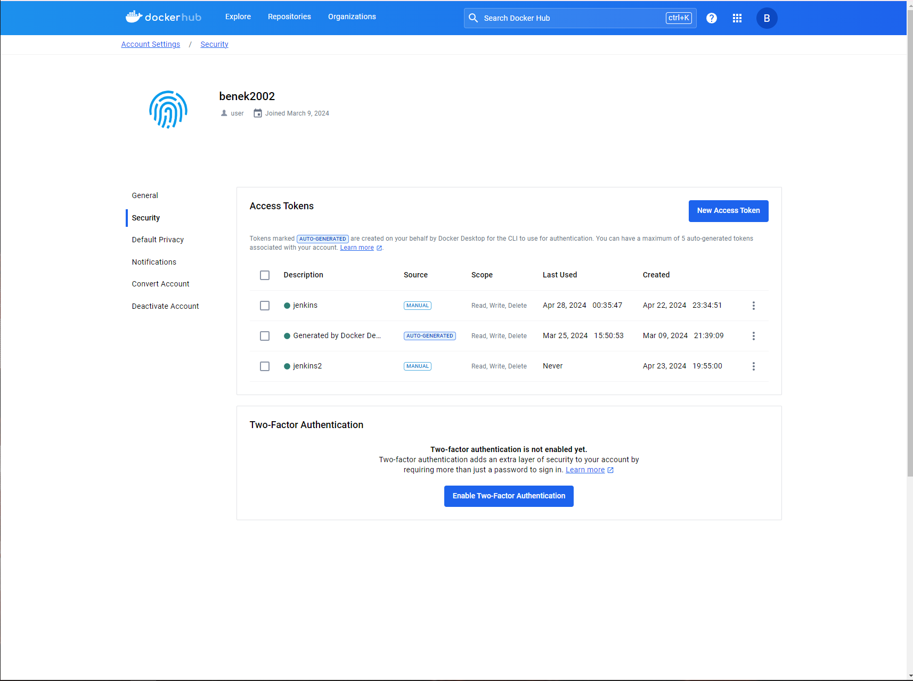

# SPRAWOZDANIE 3

## Paweł Ząbkiewicz, Inżynieria Obliczeniowa

## Cel projektu 

Celem tego projektu jest zautomatyzowanie procesów budowania, testowania i wdrażania aplikacji za pomocą CI/CD. Dzięki temu można zapewnić regularne i niezawodne dostarczanie oprogramowania poprzez zautomatyzowanie powtarzalnych zadań.

## Streszczenie projektu

### Przygotowanie

* Upewnienie się, że na pewno działają kontenery budujące i testujące, stworzone na poprzednich zajęciach.

W celu urozmaicenia napisałem prosty serwer HTTP napisany w języku Java przy użyciu frameworka Spring Boot zawierający testy.  Napisałem dockerfile, które służa do budowania, testowania i deploy'u aplikacji w sposób analogiczny jak uczyniłem to w przypadku aplikacji używającej node.js jako środowisko uruchomieniowe. Program ten to prosty kalkulator wyświetlający na głównym endpoincie napis "Hello User". 

Dockerfile służący do zbudowania aplikacji wygląda następująco: 

    FROM maven:3.8.4-openjdk-17-slim
    RUN apt-get update && apt-get install -y git
    RUN git clone https://github.com/benek2002/jenkins-java.git
    WORKDIR /jenkins-java
    RUN mvn clean install -DskipT

Obraz bazowy użyty do zbudowania obrazu do builda to Maven w wersji 3.8.4 i otwarte JDK w wersji 17 na lekkiej wersji systemu operacyjnego slim. Wybrałem tą wersję obrazu bazowego gdyż jest to jedna z najnowszych stablinych wersji obrazu Maven z wbudowanym JDK 17. Dodatkowo wersja 'slim' jest zoptymalizowana pod kątem rozmiaru i zawiera tylko niezbędne narzędzia i bilioteki do budowania projektów przy użyciu Mavena. Następnie wykonuje polecenie aktualizujące listę pakietów i instalujące pakiet 'git'. Kolejno klonuje repozytorium z githuba zawierające moją aplikację, ustawiam katalog roboczy na '/jenkins-java/' i w tym katalogu wykonuje polcenie Maven, które powoduje, że Maven oczyści projekt, zbuduje go i zainstaluje wymagane zależności. Opcja '-DskipTests' wyłącza uruchamianie testów podczas procesu budowania.

Dockerfile, z którego zbudowany obraz służy do testowania programu składa się tylko z dwóch instrukcji: 

    FROM java_builder
    RUN mvn test

Obrazem bazowym w tym przypadku jest wcześniej zbudowany obraz służacy do buildu. Następnie wykonywane jest polecenie 'mvn test', które uruchamia testy dla projektu Maven.

Kolejnym krokiem było ręczne zbudowanie obrazów i sprawdzenie czy ich funkcjonalność działa: 

Obraz prawidłowo się tworzy, więc zbudowanie programu przebiegło pomyślnie. 

Następnie buduje obraz odpowiedzialny za testy, który korzysta z wcześniej zbudowanego obrazu do buildu o nazwie 'java_builder':

* Zapoznanie się z instrukcją instalacji Jenkinsa: https://www.jenkins.io/doc/book/installing/docker/
    * Uruchomienie obrazu Dockera który eksponuje środowisko zagnieżdżone
    * Przygotowanie obrazu blueocean na podstawie obrazu Jenkinsa (czym się różnią?)
    * Uruchomienie Blueocean
    * Zadbanie o archiwizację i zabezpieczenie logów

Wyżej wymienione kroki wykonałem w ramach poprzedniego sprawozdania. Zrealizowałem to zgodnie z instrukcją instalacji Jenkinsa, czyli w pierwszej kolejności utworzyłem sieć mostkową w Dockerze o nazwie 'jenkins' za pomocą 'docker network create'. Następnie uruchomiłem kontener 'docker:dind' i dodatkowo mapuje w nim port 8080 w kontenerze na port hosta, ponieważ na porcie 8080 będzie działać moja aplikacja. W celu przygotowania obrazu blueocean na początku tworzę odpowiedni plik Dockerfile i buduje z niego obraz. Ostatnim etapem jest uruchamianie kontenera blueocean z tego obrazu. W nim mapuje port 8080 w kontenerze na port 1000, aby standardowy port, na którym uruchamia się blueocean nie kolidował mi z portem aplikacji. 

Zrzut ekranu przedstawiający uruchomione kontenery ( docker:dind i jenkins-blueocean ):

Główna różnica między obrazami 'blueocean' oraz 'dind'polega na ich przeznaczeniu: 

   * 'blueocean' jest to obraz Jenkinsa z zainstalowanymi wtyczkami Blue Ocean, który służy do budowy i wdrażania systemów CI/CD. 
   * 'dind' jest to obraz umożliwiający uruchomienie kontenerów Docker wewnątrz kontenera Docker. Jest to przydatne do tworzenia          izolowanego środowiska do budowy i testowania aplikacji. 

### Uruchomienie

* Konfiguracja wstępna i pierwsze uruchomienie
  * Utwórz projekt, który wyświetla uname

W tym celu stworzyłem nowy projekt i zawarłem w nim polecenie: 'uname -a':

    
  * Utwórz projekt, który zwraca błąd, gdy... godzina jest nieparzysta

W tym celu również stworzyłem nowy projekt i zawarłem w nim odpowiednie polecenia: 

* Utwórz "prawdziwy" projekt, który:
  * klonuje nasze repozytorium
  * przechodzi na osobistą gałąź
  * buduje obrazy z dockerfiles

W tym celu tworzę pipeline'a w którym definiuje dwa etapy: 'git clone' oraz 'build'. W pierwszym etapie  usuwam katalog MDO2024_INO, jeśli istnieje, a jeśli nie istnieje to zwracam 'true' co oznacza, że polecenie zakończy się sukcesem, nawet jeśli katalog nie istnieje. Robię to ponieważ zamierzam uruchamiać ten pipeline wiele razy, a w przypadku, gdy chciałbym sklonować repozytorium, a pliki z tego repozytorium znajdowały by się w kontenerze dind to zwrócony zostanie błąd. Po usunięciu folderu klonuje nasze repozytorium za pomocą polecenia 'git clone'. Następnie przechodze do okreslonego katalogu w repozytorium za pomocą 'dir' i przechodze na osobistą gałąź za pomocą 'git checkout PZ410049'. W etapie 'build' panownie wchodzę do katalogu 'MDO2024_INO/INO/GCL2/PZ410049/Sprawozdanie2' i buduje obraz Dockera o nazwie 'java_builder' z użyciem pliku 'builder.Dockerfile', który służy do zbudowania aplikacji. 

* Opracowanie dokumentów z diagramami UML, opisującymi proces CI. Opisanie:

   * Wymagania wstępne środowiska

1. Jenkins Server z Blue Ocean, który musi być skonfigurowany i uruchomiony na serwerze, który może zarządzać procesem CI. Wymagane jest uruchomienie kontenera 'myjenkins-blueocean' z opowiednio przekierowanym portem i otwartym portem w maszynie wirtualnej, aby interfejs był dostępny na hoście pod odpowiednim adresem ( w moim przypadku localhost:1000 ),

2. Docker in Docker (DIND), w moim procesie CI/CD używam DIND, aby możliwe było zbudowanie obrazów z plików Dockerfile i uruchomienie kontenerów Docker wewnątrz innych kontenerów,

3. Repozytorium Git. Jest one konieczne, ponieważ przechowywany jest tam kod źródłowy aplikacji, którą Jenkins pobiera do wykonania procesu CI. Repozytorium Git jest wykorystywane w moim procesie do pobrania plików Dockerfile potrzebnych do zbudowania obrazów do procesu budowy aplikacji, testów i uruchomienia. 

4. Docker Registry. W moim pipeline planuje przechywać zbudowany obraz służacy do deploy'u w rejestrze. W moim przypadku używam serwisu Docker Hub. 

   * Diagram aktywności, pokazujący kolejne etapy:

   * Diagram wdrożeniowy, opisujący relacje między składnikami, zasobami i artefaktami

### Pipeline

* Zdefiniowanie pipeline'a korzystającego z kontenerów celem realizacji kroków `build -> test`

W swoim pipeline zdefiniowałem trzy etapy 'git clone', 'build' i 'test'. W pierwszym etapie usuwam poprzednią kopię repozytorium (jeśli istnieje), klonuje repozytorium z GitHuba do lokalnego środowiska Jenkinsa, a następnie przechodze do odpowiedniego katalogu zawierającego pliki Dockerfile i przełączam się na swoją gałąź. 
W drugim etapie ('build') buduje obraz Dockerowy na podstawie pliku Dockerfile 'builder.Dockerfile', który przeprowadza zbudowanie aplikacji bez przeprowadzania testów i uruchamiania jej. 
Kolejnym etapem jest 'test', w którym wykonuje budowę obrazu o nazwie 'java_tester' na podstawie pliku 'tester.Dockerfile'. Ten krok wykonuje testy jednostkowe w mojej aplikacji. Jeśli testy zakończą się sukcesem to obraz buduje się pomyślnie. 

* Przedstawienie funkcjonalnych róznić między budowaniem z użyciem DIND, a bezpośrednio z użyciem kontenera CI. 

W moim pipeline używam kontenera Docker-in-Docker (DIND) i w tym przypadku Jenkins uruchamia się w kontenerze Dockerowym, co umożliwia dostęp do lokalnego środowiska Jenkinsa z tego własnie kontenera. Najważniejszą zaletą użycia kontenera DIND do realizacji procesu CI/CD mojej aplikacji jest pełby dostęp do wszystkich funkcji i poleceń Dockera. Dzięki temu jestem w stanie budować obrazy z plików Dockerfile, uruchamiać kontenery i zarządzać sieciami wewnątrz środowiska Jenkinsa. DIND umożliwia uruchomienie środowiska Dockerowego wewnątrz innego kontenera Dockerowego, dzięki czemu proces budowy i testosowania odbywa się w izolowanym srodowisku, co minimalizuje ryzyko wpływu innych aplikacji oraz zapewnia czyste środowisko dla każdego procesu. Korzystanie z DIND wiąże się równiez z ograniczeniami związanymi z konfiguracją DIND, która może być skomplikowana i powinna zostać odpowiednio dostosowana  do środowiska. Należy pamiętać o np. zarządzaniu sieciami, przekierowaniu portów na zewnątrz kontenera i udostępnianiu odpowiednich zasobów. Użycie DIND może również wpłynać na wydajność procesu CI/CD, ponieważ dodaję dodatkową warstwę wirtualizacji, co może prowadzić do spadku wydajności w porównaniu z bezpośrednim użyciem kontenerów CI. 

### Szczegóły
Ciąg dalszy sprawozdania
#### Wymagane składniki

*  Kontener Jenkins i DIND skonfigurowany według instrukcji dostawcy oprogramowania

Z racji, iż aplikacją którą używam jest aplikacją napisaną przeze mnie to kontener Jenkins i DIND nie wymagają specjalnej konfiguracji, z wyjątkiem przekierowaniu portu 8080 (na tym porcie standardowo uruchamiania jest aplikacja Spring) z kontenera DIND na zewnątrz, po to abym mógł sprawdzić czy aplikacja uruchamiona wewnątrz kontenera DIND działa poprawnie. 

*  Pliki `Dockerfile` wdrażające instancję Jenkinsa załączone w repozytorium przedmiotowym pod ścieżką i na gałęzi według opisu z poleceń README

*  Zdefiniowany wewnątrz Jenkinsa obiekt projektowy „pipeline”, realizujący następujące kroki:

  * Kontener `Builder`:

Plik Dockerfile służący do zbudowania obrazu służacego do buildu, został opisany wyżej w sprawozdaniu. Używam w nim jako obraz bazowy konkretną wersję obrazu Mavena ('3.8.4-openjdk-17-slim'), co zapewnia stabliność i powtarzalność budowania i wdrażania aplikacji. Dzięki ustaleniu konkretnej wersji obrazu jestem w stanie uniknąć ewentualnych problemów zgodności, które mogą wystąpić w przypadku użycia tagu 'latest'. Dzięki temu podejściu mam pewność, że aplikacja bedzię budowana i działała w takim samym środowisku w jakim została wcześniej przetestowana. 

  * Obraz testujący, w ramach kontenera `Tester`:

Budowanie obrazu służacego do testowania aplikacji również zostało przedstawione wyżej w sprawozdaniu. 

  * Zadbaj o dostępność logów i możliwość wnioskowania jakie testy nie przechodzą

W celu zapisu logów podczas budowania obrazu musiałem zmodyfikować plik Dockerfile o ten krok: 

  FROM java_builder
  RUN mvn test > /test_logs.txt 2>&1
  RUN cp /test_logs.txt .

W tym celu dodałem polecenie, które będzie zapisawać logi wykonywane podczas polecenia 'mvn test' do pliku tekstowego o nazwie 'test_logs.txt', a następnie ten plik jest kopiowany do katalogu, który będzie dostępny po zbudowaniu obrazu. 

Zmodyfikowałem również pipeline o funkcję archiwizacji pliku z logami testowaymi jako artefakt. W tym celu dodaję do etapu 'test' tworzenie kontenera testującego z utworzonego obrazu, pobranie logów z tego kontenera, usunięcie tego kontera i archiwizację pliku za pomocą 'archiveArtifacts'. Tak wygląda zmodyfikowany stage 'test': 

Zawartość zapisanego jako artefakt pliku zawierający logi wykonanych testów: 

* `Deploy`:

Celu wykonania tego kroku stworzyłem Dockerfile służacego do stworzenia obrazu, z którego będe mógł uruchomić kontener uruchamiający aplikację. Obraz stworzony z tego Dockerfila może służyć do dystrybucji programu:

  FROM java_builder
  COPY --from=java_builder /jenkins-java/target/*.jar /jenkins-java/app.jar
  WORKDIR /jenkins-java
  RUN rm -rf mvnw mvnw.cmd pom.xml src target
  CMD ["java", "-jar", "/jenkins-java/app.jar"]

Obraz do deploy'u jest budowany na podstawie obrazu służacego do buildu, czyli zawiera pliki zbudowane podczas buildu. Najważniejszym dla mnie plikiem jest plik JAR, który zawiera skompilowany kod oraz niezbędne zasoby do uruchomienia aplikacji Java. Jest stosowany do dystrubucji i uruchamiania aplikacji Javy. Plik JAR powstaje podczas zbudowania aplikacji i tylko on mi jest potrzebny do uruchomienia aplikacji. Dlatego własnie w pliku Dockerfile kopiuje ten plik JAR zbudowany przez 'java_builder' z katalogu '/jenkins-java/target/' do katalogu '/jenkins-java/' w obrazie docelowym i zmieniam jego nazwe na 'app.jar'. Kolejnym krokiem jest ustawienie katalogu roboczego na '/jenkins-java', czyli na katalog w którym znajdują sie wszystkie pliki stworzone podczas buildu. Następnie wszystkie pliki z wyjątkiem pliku 'app.jar' są usuwane. Te pliki nie są mi potrzebne do uruchamienia aplikacji. Usunięcie niepotrzebnych plików z obrazu Dockerowego służacego do dystrybucji ma na celu zmiejszenie końcowego rozmiaru obrazu. Obraz ten będzie się szybciej tworzył i będzie wymagał mniej miejsca na dysku dzięki temu, że zawiera tylko niezbędny do uruchomienia plik JAR. 
W ostatnim kroku definiuję domyślną komendę, która zostanie wykonana, gdy kontener Dockerowy utworzony z tego obrazu zostanie uruchomiony. W moim przypadku zostanie uruchomiona aplikacja Javy przez JVM z wykorzystnaniem wcześniej przekopiowanego pliku 'app.jar'. Wykonuje to za pomocą polecenia 'CMD ["java", "-jar", "/jenkins-java/app.jar"]'. 

  * Przeprowadzenie dyskusji dotyczącej tego, jak powinno wyglądać wdrożenie docelowe wybranej aplikacji. 

  * czy program powienien zostać "zapakowany" do jakiegoś przenośnego pliku-formatu? 

W przypadku mojej aplikacji napisanej w Javie zapakowanie programu do przenośnego pliku będzie dobrym rozwiązaniem, gdyż moja aplikacja nie jest złożona i nie wymaga izolacji. Przenośny format pliku używany do dystrubucji mojego programu to plik 'app.jar' i jest on wystarczający. Taki plik może być w łatwością instalowany na różnych systemach operacyjnych i jest łatwy w użyciu. 

  * czy program powinien być dystrybuowany jako obraz Docker? Jeżeli tak – czy powinien zawierać zawartość sklonowanego repozytorium, logi i artefakty z *builda*?

Dystrybucja programu jako obraz Docker może byc bardzo korzystnym rozwiązaniem, szczególnie w przypadku aplikacji, które wymagają izolocji i przenośności. Moja aplikacja ze względu na swoją prostotę i brak np. zewnętrznej bazy danych może być dystrubowana jako plik .jar. Natomiast w sytuacji gdybym miał doczynienia bardziej złożoną aplikacją to z pewnością bym wybrał obraz Docker, gdyż takie rozwiązanie będzie prostsze, zwłaszcza w sytuacji jak dana aplikacja będzie często aktualizowana i wdrażana na różne środowiska. To rozwiązania jest również bardziej skalowalne, ponieważ pozwala na szybsze wdrażanie i efektywne zarządzanie aplikacją w sposób zautomatyzowany. 
Mój obraz Docker nie powinien zawierać sklonowanego repozytorium, ponieważ nie jest to potrzebne do uruchomienia i poprawnego działania mojej aplikacji. Mój obraz powinien zawierać plik JAR, a inne pliki mogą niepotrzebnie zwiększać rozmiar obrazu. 
W przypadku mojej aplikacji logi i artefakty z 'buildu' nie powinny być zawarte w obrazie, gdyż mogą zajmować sporo miejsca. Logi powinny być przekierowane do zewnętrznego systemu logowania, a nie znajdować się bezpośrednio w obrazie. 

* Opisanie procesu, który zostanie opisany jako 'Deploy':

Na tym etapie w folderze 'Sprawozdanie2', przeprowadzam proces budowy obrazu służacego do deploy'u na podstawie wcześniej przedstawionego pliku Dockerfile 'deploy.Dockerfile'. Następnie usuwam kontener o nazwie 'java', jeśli istnieje, a jeśli nie istnieje to zwracam true. Ma to na celu umożlwienie kolejnych uruchomień pipeline'a. Kolejnym krokiem jest uruchomienie kontenera na podstawie zbudowanego obrazu o nazwie 'benek2002/java_deploy'. W przypadku tej nazwy obrazu 'benek2002' jest moją nazwą użytkownika w serwisie DockerHub, gdyż bez tej nazwy występowały problemy z publikowaniem obrazu na ten własnie serwis do mojego repozytorium. Nazwę kontenera określam jako 'java', dodaje flagę '--rm', która jest opcjonalna i powoduje usunięcie kontenera po zakończeniu pracy, flaga '-p 8080:8080' określa przekierowanie portów i pozwala to na dostęp aplikacji uruchomionej w kontnenerze z zewnątrz, flaga '--detach' powoduje, że kontener jest uruchamiany w tle co pozwala na kontynuowanie działania pipeline'a. Dodatkowo zmuszony byłem do użycia flagi '--network=deploy', która określa nazwę sieci, do której zostanie dołaczony kontener. Ta sieć została wcześniej utworzona w etapie 'git clone' za pomocą polecenia 'docker network create'. Wykonałem to ponieważ występował problem z standardowym wykonaniem polecenia 'curl' w celu wykazania, że program uruchomiony w owym kontenerze działa. Aplikacja w kontenerze podczas pipeline'a uruchamiała się ponieważ możliwe było wejściu do niej na hoście jak i również pobrania danych za pomocą polecenia 'curl' w terminalu. Możliwe, że było to spowodowane przez 'Firewall' bądź błędne konfiguracja jenkinsa. 

* Publish
Jak widać aplikacja uruchomiona podczas pipeline'a działa i mogę się z nią połaczyć z zewnątrz ( na hoście ):

Tak samo w przypadku wykonania komendy wget ( curl nie jest zainstlalowane w kontenerze DIND) wewnątrz kontenera DIND na adres IP kontenera. Adres IP kontenera sprawdzam za pomocą 'docker inspect id_kontnera': 

Następnie wykonuje polecenie wget na ten adres i sprawdzam czy plik zawiera zdanie 'Hello User!':

Jak widać polecenie wykonuje się prawidłowo, więc aplikacja uruchamia się z sukcesem. 

Natomiast w przypadku wykonania tej samej komendy ( curl http://172.18.0.2:8080) w jenkinsie występował następujący problem: 

W celu rozwiązania tego problemu stworzyłem osobną sieć dockerową do której podpiąłem kontener uruchamiający aplikację, a następnie uruchomiłem kontener 'curlimages/curl:latest', którego podpiąłem do tej samej sieci co kontener z aplikacją ( po to aby mogły komunikowac się po nazwie ) i za pomocą tego kontenera wykonałem polecenie curl na adres 'http://java:8080', czyli zamiast adresu IP, z którym występowały problemy użyłem nazwy kontenera z działającą aplikacją. 

Po wykonaniu zapytania HTTP na adres 'http://java:8080' sprawdzam czy odpowiedz zawiera "Hello User!" i jeśli tak to wyświetlam komunikat informujący, że odpowiedz zawiera "Hello User!", a następnie kopiuje plik 'app.jar' z kontenera o nazwie 'java' do bieżacego katalogu w jenkinsie. Ten plik następnie archiwizuję jako artefakt budowy. 

Oprócz dystrybowania mojego programu jako plik JAR wykonałem również opcję z dystrubowaniem programu jako obraz Docker na serwis Docker Hub. 
W tym celu musiałem na początku zapewnić Jenkinsowi moje dane uwierzytlniające, takie jak nazwa użytkownika i hasło do serwisu Docker Hub. Bezpośrednie wprowadzenie danych logowania w postaci nazwy użytkownika i hasła jest niebezpieczne, więc wybrałem zastosowanie tokena do uwierzytelniania. Musiałem więc zalogować się do serwisu Docker Hub, następnie udać się do 'My Account->Security' i kliknąc w 'New Access Token'. Został wygenerowany token z określonym zakresem uprawnień i zapisałem go w bezpiecznym miejscu:

Kolejnym krokiem jest stworzenie 'Credentials' w Jenkinsie. W tym celu klikam na moją nazwę użytkownika w Jenkinsie i następnie 'Credentials->System->Global credentials->Add Credentials'. Wybieram opcję 'Username with password', jako 'Username' wpisuję moją nazwę użytkownika z serwisu DockerHub, jako 'Password' wklejam mój wygenerowany token z serwisu Docker Hub, 'ID' to identyfikator tych kredencji. 

Mając wygenerowane kredencję tworzę zmienną środowiskową o nazwie 'DOCKERHUB_CREDENTIALS', w której przechowuje kredencje o id 'benek2002-dockerhub'. Mogę użyć tej zmiennej do uzyskania nazwy użytkownika i tokenu zdefiniowanych w kredencji o ID 'benek2002-dockerhub'. 

Kolejno w kroku 'publish' loguję się do Docker Huba używając nazwy użytkownika i tokenu przechowywanych w wcześniej utworzonej zmiennej środowiskowej 'DOCKERHUB_CREDENTIALS'. Następnie przesyłam obraz 'benek2002/java_deploy' do repozytorium w serwisie Docker Hub za pomocą polecenia 'docker push'. 
Tak wygląda krok 'publish': 

Obraz w moim repozytorium po wykonaniu 'docker push' wewnątrz pipeline'a:

Na zakończenie pipeline'u dopisuje sekcję 'post', która jest używana w Jenkinsie do definiowania działań, które powinny być wykonywane po zakońceniu danego etapu lub tak jak w moim przypadku całego pipeline'u. Wewnątrz umieszczam sekcję 'always', która oznacza, że działania wewnątrz niej będą wykonywane niezależnie od tego, czy dany etap zakończy się sukcesem, czy nie. W moim przypadku jest to wylogowanie się z Docker Huba za pomocą polecenia 'docker logout'. Jest to dobra praktyka z punktu widzenia bezpieczeństwa. 

Tak wygląda  przeprowadzony pipeline zakończony sukcesem zawierający takie artefakty jak logi z etapu testowego i plik JAR:

Jak widać proces CI przechodzi pomyślnie i generuje dwa artefakty: logi z testów i plik JAR. 

Udało mi się zrealizować proces CI zgodnie z diagramem aktywności i diagramem wdrożeniowym. 

Na koniec zwerfikowalem moją postać sprawozdania z pełną listą kontrolną i w taki sposób przedstawiają sie moje zrealizowane punkty:

- [x] Aplikacja została wybrana
- [x] Licencja potwierdza możliwość swobodnego obrotu kodem na potrzeby zadania ( jest to aplikacja napisana przeze mnie, więc nie jest potrzebna licencja)
- [x] Wybrany program buduje się
- [x] Przechodzą dołączone do niego testy
- [x] Zdecydowano, czy jest potrzebny fork własnej kopii repozytorium
- [x] Stworzono diagram UML zawierający planowany pomysł na proces CI/CD
- [x] Wybrano kontener bazowy lub stworzono odpowiedni kontener wstepny (runtime dependencies)
- [x] Build został wykonany wewnątrz obrazu
- [x] Testy zostały wykonane wewnątrz obazu
- [x] Obraz testowy jest oparty o obraz build
- [] Logi z procesu są odkładane jako numerowany artefakt ( archiwizuje jako artefakt logi z testów aplikacji, ale ich nie numeruje)
- [x] Zdefiniowano kontener 'deploy' służący zbudowanej aplikacji do pracy
- [x] Uzasadniono czy kontener buildowy nadaje się do tej roli/opisano proces stworzenia nowego
- [x] Wersjonowany kontener 'deploy' ze zbudowaną aplikacją jest wdrażany na instancję Dockera ( w moim przypadku brakuje wersjonowania kontenera)
- [x] Następuje weryfikacja, że aplikacja pracuje poprawnie ( sprawdzam to za pomocą curlimages/curl)
- [x] Zdefiniowano, jaki element ma być publikowany jako artefakt ( plik .jar )
- [x] Uzasadniono wybór: kontener z programem, plik binarny, flatpak, archiwum tar.gz, pakiet RPM/DEB ( kontener z programem i plik .jar)
- [] Opisano proces wersjonowania artefaktu (można użyć *semantic versioning*) ( w moim przypadku nie zastosowałem wersjonowania artefaktu)
- [x] Dostępność artefaktu: artefakt załączony jako rezultat builda w Jenkinsie
- [x] Przedstawiono sposób na zidentyfikowanie pochodzenia artefaktu
- [x] Pliki Dockerfile i Jenkinsfile dostępne w sprawozdaniu w kopiowalnej postaci oraz obok sprawozdania, jako osobne pliki
- [x] Zweryfikowano potencjalną rozbieżność między zaplanowanym UML a otrzymanym efektem
- [x] Sprawozdanie pozwala zidentyfikować cel podjętych kroków
- [x] Forma sprawozdania umożliwia wykonanie opisanych kroków w jednoznaczny sposób

### Kroki Jenkinsfile
Zweryfikuj, czy definicja pipeline'u obecna w repozytorium pokrywa ścieżkę krytyczną:

- [x] Przepis dostarczany z SCM (co załatwia nam `clone` )
- [x] Etap `Build` dysponuje repozytorium i plikami `Dockerfile`
- [x] Etap `Build` tworzy obraz buildowy, np. `BLDR`
- [x] Etap `Build` (krok w etapie) lub oddzielny etap (o innej nazwie), przygotowuje artefakt - **jeżeli docelowy kontener ma być odmienny**, tj. nie wywodzimy `Deploy` z obrazu `BLDR`
- [x] Etap `Test` przeprowadza testy
- [x] Etap `Deploy` przygotowuje **obraz lub artefakt** pod wdrożenie. W przypadku aplikacji pracującej jako kontener, powinien to być obraz z odpowiednim entrypointem. W przypadku buildu tworzącego artefakt niekoniecznie pracujący jako kontener (np. interaktywna aplikacja desktopowa), należy przesłać i uruchomić artefakt w środowisku docelowym.
- [x] Etap `Deploy` przeprowadza wdrożenie (start kontenera docelowego lub uruchomienie aplikacji na przeznaczonym do tego celu kontenerze sandboxowym)
- [x] Etap `Publish` wysyła obraz docelowy do Rejestru i/lub dodaje artefakt do historii builda
