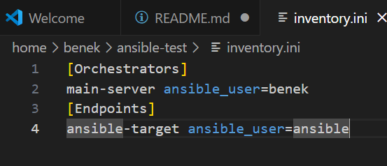

# Sprawozdanie 4

# Automatyzacja i zdalne wykonywanie poleceń za pomocą Ansible
Paweł Ząbkiewicz, IO 

## Cel projektu

Celem projektu jest zapoznanie się z narzędziem Ansible, umożliwiającym zdanlne wykonywanie poleceń na wielu maszynach jednocześnie. Poprzez wykorzystanie Ansible, planuje się instalację, konfigurację oraz zarządzanie serwerami i aplikacjami, co przyczynia się do usprawnienia procesów administracyjnych i zapewnienia spójności środowiska. W projekcie również będę realizował zarządzanie kontenerami za pomocą Ansible, co pozwoli na elastyczne i efektywne zarządzanie aplikacją dostarczoną przez kontener. 

## Instalacja zarządcy Ansible

 * Utwórzenie drugiej maszyny witrualnej o jak najmniejszym zbiorze zainstalowanego oprogramowania

W programie VirtualBox utworzyłem nową maszynę wirtualną, w której zastosowałem ten sam system operacyjny co na głównej maszynie, czyli 'Ubuntu'. Ustawilem w niej minimalne ustawienia i zasoby. Podczas instalacji w interfejsie graficznym zaznaczyłem opcję związaną z instalacją serwera 'OpenSSH'. Program 'tar' był już zainstalowany domyślnie na maszynie. Następnie upewniłem, że program 'tar' i serwer 'OpenSSH(sshd)' są obecne na maszynie, poprzez sprawdzenie wersji. 

Nadałem nazwę mojej naszynie 'asnible-target', a nazwę użytkownika na 'ansible'. Dokonałem to podczas instalacji. Na powyższym screenshocie można zauważyć nazwę użytkownika i hostname. 

* Zainstalowanie oprogramowania Ansible na głównej maszynie wirtualnej

Na samym początku aktualizuje liste dostępnych pakietów z repozytorium poprzez: 

    sudo apt update

Nastepnie instaluje pakiet 'software-properties-common', który zawiera narzędzia, które ułatwiają zarządzanie repozytoriami oprogramowania w systemie Ubuntu:

    sudo apt install software-properties-common

Następnie dodaje repozytorium 'ppa:ansible/ansible', które zawiera oprogramowanie Ansible, do listy repozytoriów w moim systemie:

    sudo add-apt-repository --yes --update ppa:ansible/ansible

Na koniec instaluje Ansible na moim systemie za pomocą menadżera pakietów apt:

    sudo apt install ansible

* Wymiana kluczy SSh między użytkownikiem w głównej maszynie wirtualnej, a użytkownikiem ansible z nowej maszyny, tak by logowanie ssh ansible@ansible-target nie wymagało podania hasła

W tym celu kopiuje z głównej maszyny klucz publiczny za pomocą polecenia:

    ssh-copy-id ansible@<adres_IP_maszyny_ansible-target>

Następnie werfikuje czy logowanie bez podania hasła działa:

Dodatkowo musiałem jeszcze dodać jeden adapter sieciowy 'Host-only' w VirtualBox, gdyż moje maszyny używały domyślnie sieci NAT i przez to miały ten sam adres IP i łacznośc między nimi były niemożliwa. W tym celu do każdej z maszyn dodałem drugi adapter sieciowy 'Host-only', dzięki czemu maszyny uzyskały unikalne adresy IP dla interfejsu 'enp0s8'. Adapter Host-Only umożliwia komunikację z innymi wirtualnymi maszynami lub hostem (główną maszyną), a nadanie adresu IP interfejsowi enp0s8 umożliwia komunikację z siecią host-only.

## Inwentaryzacja

* Dokonanie inwentaryzacji systemów

Wprowadziłem nazwy DNS dla maszyn wirtualnych, stosując /etc/hosts - tak, aby możliwe było wywoływanie komputerów za pomocą nazw, a nie tylko adresów IP. Robię to poprzez otworzenie pliku /etc/hosts i zapisanie w nim adresu IP maszyny i jej nazwy.

Nastepnie dokonuje weryfikacji łaczności poprzez ssh: 

Jak widać teraz mogę sie łączyć z maszyny głównej na maszynę 'ansible-target' poprzez nazwę, a nie tylko poprzez adres IP. 

* Stworzenie pliku inwentaryzacji

Stworzyłem plik 'inventory.ini', który definiuje dwie grupy hostów: 'Orchestrators' i 'Endpoints'. Każdy host ma przypisaną odpowiednią nazwę użytkownika ('ansible_user'), której Ansible użyje do logowania. W rezultacie, gdy Ansible będzie wykonywał operację na hoście 'ansible-target' to użyje konta użytkownika 'ansible'. Dzięki temu zyskuje czytelność, gdyż jasno widać jakie konta użytkowników są przypisane do poszczególnych hostów. Jak widać w pliku 'inventory' używam już nazwy DNS, a nie adresy IP. 'main-server' odpowiada adresowi IP mojej głównej maszyny, a 'ansible-target' odpowiada adresowi IP drugiej maszyny. 

* Wysłanie żądania 'ping' do wszystkich maszyn

W tym kroku testuje połączenie do hostow z pliku 'inventory' za pomocą modułu 'ping'. Realizacja to najpierw dla hosta w grupie 'Endpoints' poprzez: 

Jak widać Ansible pomyślnie wysłał ping do hosta 'ansible-target' z grupy 'Endpoints', a host odpowiedział wynikiem 'pong'. Oznacza to, że konfiguracja pliku 'inventory' oraz połaczenie działa poprawnie. W poleceniu za pomocą flagi '-i' określam plik inventory 'inventory.ini', a za pomocą '-m' używam modułu 'ping'. Moduł 'ping' w Ansible używa SSH do komunikacji z zarzadzanymi hostami, więc jak widać łączność SSH między maszynami jest możliwa i nie potrzebuje haseł.

Następnie wykonałem ta samą operację ale w tym przypadku dla wszystkich hostów z pliku 'inventory.ini': 

## Zdalne wywoływanie procedur

Ta część polegała na wykonaniu pewnych za pomocą playbooka Ansible. Playbook w Ansible to plik w formacie YAML, który definiuje zestaw zadań do wykonania na zdalnych hostach. Playbooki są podstawowym narzędziem do automatyzacji konfiguracji, wdrażania aplikacji, zarządzania systemem i wykonywania innych zadań na serwerach. 
Zadania jakie ma wykonać mój playbook to: 
  * Wysłanie żądania `ping` do wszystkich maszyn

    Tworzę w tym celu plik z rozszerzeniem 'yml' i następnie nadaje nazwę playbook'owi, definiuje hosty na których ma być wykonywany playbook. Posłyguję się nazwą z pliku 'inventory.ini' i do grupy hostów 'Endpoints'. Następnie określam za pomocą 'become: true', że wszystkie zadania wykonywane w tym playbooku bedą wykonywane z podwyższonymi uprawnienieniami. Następnie definiuje nazwę zadania, w tym przypadku 'Ping hosts' i w celu wysłania żądania ping do każdego hosta z grupy 'Endpoints' używam modułu 'ping' z wbudowanych modułów Ansible: 

  * Skopiowanie pliku inwentaryzacji na maszyny/ę `Endpoints`

  W tym kroku używam modułu 'copy' z wbudowanych modułów Ansible, następnie określam źródło, czyli lokalną ścieżkę do pliku inventory na głównej maszynie. Ostatnim krokiem jest wskazanie ścieżki, do której plik ma być skopiowany na zdalnym hoście. Dodatkowo ponowiłem operację kopiowania, aby porównać róznicę w wyjściu. 

  * Zaktualizowanie pakietów w systemie

  Krok ten ma na celu aktualizację wszystkich zainstalowanych pakietów na hostach do najnowszych dostępnych wersji. 
  W tym zadaniu używam modułu 'ansible.builtin.apt', który służy do zarządzania pakietami na systemie Ubuntu, który korzysta z menadżera pakietów 'apt'. Następnie za pomocą '*' określam, że operacja dotyczy wszystkich zainstalowanych pakietów. Na koniec wskazuje, że wszystkie pakiety powinny zostać zaktualizowane do najnowszej dostępnej wersji za pomocą 'state: latest'. 

  * Zrestartowanie usługi `sshd` i `rngd`

  W tym kroku w playbooku Ansible realizuje zrestartowanie dwóch usług systemowych 'sshd' i 'rngd'. W obu przypadkach używam wbudowanego modułu w Ansible 'systemmd_service', który służy do zarządzania usługami systemowymi na systemach opartych na 'systemd'. Wskazuję na odpowiednią nazwę usługi systemowej, a następnie określam docelowy stan usługi na 'restarted', co oznacza, ze usługa zostanie zrestartowana. 

  Następnie sprawdziłem poprawność playbook'a poprzez jego uruchomienie. Z racji, iż używam poleceń z podwyższonymi uprawnienia (sudo), to muszę podczas uruchamiania playbook'a dodać do polecenia '--ask-become-pass', która pozwoli podać hasło do roota. Odpaliłem playbook'a poleceniem: 

    ansible-playbook -i inventory.ini --ask-become-pass first_playbook.yml 

  Podczas uruchamiania zadań playbook'a nastąpił bład związany z tym, że na zdalnej maszynie nie była dostępna usługa 'rng-tools'. W celu naprawienia błędu dodałem do playbook'a zadanie instalujące tą usługę na zdalnej maszynie, aby możliwy był jej pózniejszy restart. W tym miejscu jeszcze zwrócę uwagę na operację kopiowania.  

Teraz playbook realizuje poprawnie wszystkie zadania.

  * Przeprowadzenie operacji względem maszyny z wyłączonym serwerem SSH, odpiętą kartą sieciową

Wyłączenie SSH na maszynie wykonałem za pomocą polecenia: 

  sudo systemctl stop ssh

Rezultat wykonania playbook'a:

Błąd, który wystapił wskazuje, że Ansible nie może połaczyć się z hostem 'ansible-target' przez SSH na porcie 22. Status 'unreachable' oznacza, że Ansible nie może nawiązać połączenia z maszyną docelową z powodu braku dostępności usługi SSH.

Następnie przetestowałem czy playbook wykona się na maszynie, na której odpiąłem kartę sieciową. W tym celu W ustawieniach w VirtualBoxie odznaczyłem opcję 'kabeł podłączony':

W tym przypadku błąd podczas włączania playbook'a wygląda w ten sposób: 

[network-card-playbook](./screenshots/18.png)

Oczywiście w tym przypadku rownież nie udało się nawiązać połaczenia, lecz tym razem połączenie nie mogło zastać nawiązane w określonym czasie (Connection timed out), a nie jak w poprzeednim scenariuszu, w którym maszyna docelowa odrzucała połaczenia (Connection refused).

## Zarządzanie kontenerem

W tej częsci wykonam wdrożenie mojej aplikacji z kontenera na maszynie ansible-target poprzez napisanie odpowiedniego playbook'a. 
W moim playbook'u na samym wstępie umieścić sekcję odpowiedzialną za zainstalowanie i uruchomienie dockera na docelowej maszynie. 

[install docker](./screenshots/19.png)

Następnie zdefiniowałem zadanie, które pobiera obraz Docker z Docker Hub. Jest to ten sam obraz co na poprzednich zajęciach został tam umieszony podczas pipeline'a. Używam tu modułu 'community.docker.docker_image', który jest używany do zarządzania obrazami Docker za pomocą Ansible. Kolejnym zadaniem jest uruchomienie kontenera z pobranego obrazu. Modul Ansible, który jest używany do zarządzania kontenerami to moduł 'docker_container'. W tej częsci definiuje nazwę kontenera, nazwę obrazu z którego ma powstać ten kontener, stan kontenera - w tym przypadku 'started' co oznacza, że kontener ma być uruchomiony, detach - ustawiam na 'yes', gdyż chcę aby kontener działał w tle, a na koniec określam mapowanie portów. 

[pull docker image](./screenshots/20.png)

Po uruchomieniu tego playbook'a na maszynie ansible-target został zaciągniety obraz:

[pull docker image](./screenshots/21.png)

Następnie został uruchomiony kontener z aplikacją: 

[docker ps](./screenshots/22.png)

Logi widoczne po uruchomieniu kontenera: 

[docker logs](./screenshots/23.png)

W celu upewnienia się, ze aplikacja działa poprawnie użyłem polecenia 'curl':

[curl](./screenshots/24.png)

Jak widać aplikacja zostala wdrożona poprawnie. 

Aplikacja działa w trybie 'detach', więc następnym krokiem było zatrzymanie kontenera z aplikacją i jego usunięcie. W tej części playbook'a używam modułu 'docker_container' i stanu 'absent':

[docker rm](./screenshots/25.png)

Tak wygląda cały playbook:

[second playbook](./screenshots/26.png)

Efekt uruchomienia playbook'a:

[second playbook result](./screenshots/27.png)

Ostatnim krokiem z tego laboratorium było ubranie playbook'a w role za pomocą narzędzia 'ansible-galaxy'. Służy ono do tworzenia, udostępniania i zarządzania rolami Ansible. Role w Ansible to modularne, wielokrotnego użytku jednostki kodu automatyzacji, które można udostępniać i ponownie wykorzystywać w różnych projektach Ansible.

w katalogu z playbookiem stworzyłem nowy katalog o nazwie 'roles', a w nim stworzyłem role za pomocą polecenia:

  ansible-galaxy init <nazwa roli>

W ten sposób stwrozyłem w katalogu 'roles' trzy role: 'install_docker', 'deploy' oraz 'remove_container'. 
Struktura katalogów wyświetlona za pomocą polecenia 'tree': 

[tree](./screenshots/28.png)

W pliku 'main.yml' w katalogu 'tasks' w strukturze roli definiuje zadania do wykonania przez daną role. 
Przykładowo dla roli 'install_docker' plik 'main.yml' wygląda w ten sposób:

[main.yml](./screenshots/29.png)

Po zdefiniowaniu każdej z ról, tworzę nowego playbook'a, który będzie z nich korzystał: 

[role playbook](./screenshots/30.png)

Uruchamiam nowo stworzonego playbook'a i jak widać wszystko działa poprawnie i jest realizowane jak poprzednio:

[role playbook](./screenshots/31.png)

# Zajęcia 09

## Pliki odpowiedzi dla wdrożeń nienadzorowanych

Ta część jest poświęcona przygotowaniu źródła instalacyjnego systemu dla maszyny wirtualnej, które jest wykorzystywane do zautomatyzowania instalcji środowiska testowego dla oprogramowania, które nie pracuje w całości w kontenerze. 
Celem zadania jest przeprowadzenie instalacji systemu (Fedora 40), który po uruchomieniu rozpocznie hostowanie mojego programu. 

Na samym początku przeprowadzam instalację nadzorowaną, w której wybieram system Fedora 40, ustalam nazwę hosta, nazwę użytkownika, ustawienia regionalne, wybieram minimalne ustawienia oraz inne parametry potrzebne do instalacji. Następnie po pomyślnej instalacji kopiuje plik odpowiedzi (kickstart file) 'anaconda-ks.cfg' z lokalizacji '/root/anaconda-ks.cfg' na moją głowną maszynę, z której następnie umieszczam ten plik na mojej gałęźi na GitHub. Plik kickstart zawiera wszystkie odpowiedzi na pytania, które normalnie pojawiłyby się podczas interaktywnej instalacji systemu operacyjnego. 

Następnie zmodyfikowałem plik 'anaconda-ks.cfg', gdyż nie zawiera potrzebnych informacji dotyczących repozytoriów ponieważ korzystałem z domyślnych repozytoriów. Zgodnie z instrukcją dodaje odpowiednie wzmianki na temat repozytoriów: 

  url --mirrorlist=http://mirrors.fedoraproject.org/mirrorlist?repo=fedora-40&arch=x86_64
  repo --name=update --mirrorlist=http://mirrors.fedoraproject.org/mirrorlist?repo=updates-released-f40&arch=x86_64

  Aby zapewnić, że dysk zostanie odpowiednio przygotowany i sformatowany bez względu na jego wcześniejszy stan dodaje następujące polecenie w pliku kickstart:

    clearpart --all

  Zmieniam rownież nazwę hosta z domyślnej 'fedora' na 'kickstart' za pomocą: 

    --hostname=kickstart

    Dodatkowo na końcu pliku dodaje jeszcze polecenie 'reboot', które służy do automatyczneo ponownego uruchomienia systemu po zakończeniu procesu instalacji. Jest to przydatne, gdyż chcemy w pełni zautomatyzować instalację systemu operacyjnego, eliminując potrzebę ręcznego restartu po zakończeniu instalacji. 

    W tym momencie plik już jest gotowy do przeprowadzenia instalacji nienadzorowanej. W tym celu w VirtualBox uruchamiam maszynę z systemem Fedora 40 i wybieram opcję e, aby przejść do trybu GRUB, w którym za pomocą polecenia 'inst.ks=' wprowadzam lokalizację do pliku kickstart. Lokalizacja to link do pliku 'anaconda-ks.cfg' z opcją 'raw' w repozytorium GitHub. Polecenie wygląda następująco: 

      inst.ks=https://raw.githubusercontent.com/InzynieriaOprogramowaniaAGH/MDO2024_INO/PZ410049/INO/GCL2/PZ410049/Sprawozdanie4/anaconda-ks.cfg

[fedora](./screenshots/32.png)

System automatycznie ustawił odpowiednie parametry, pobrał zależności oraz pakiety i sam się zrestartował oraz uruchomił: 

[fedora-start](./screenshots/33.png)

## rozszerzenie pliku odpowiedzi o repozytoria i oprogramowanie potrzebne do uruchomienia programu, zbudowanego w ramach projektu

Ten krok polega na dostosowaniu pliku kickstart do automatycznej instalacji systemu operacyjnego z uwzględnieniem wszystkich niezbędnych komponentów, repozytoriów i oprogramowania potrzebnego do uruchomienia kontenera Docker z moją aplikacją odrazu po zakończeniu instalacji. Dzięki tej automatyzacji, system po pierwszym uruchomieniu będzie gotowy do pracy, a aplikacja będzie działać w kontenerze Docker.
W celu zrealizowania tego zadania w pliku 'anaconda-ks.cfg' dodałem sekcję '%packages', której dodaje odpowiednie repozytoria i pakiety, które są niezbędne do uruchomienia systemu oraz Dockera. Pakiety jakie dodałem to: 

* @^minimal-environment: Ta grupa pakietów zapewnia minimalne środowisko operacyjne, które jest konieczne do uruchomienia systemu. Zazwyczaj zawiera tylko niezbędne pakiety i narzędzia, aby system mógł działać, bez dodatkowych funkcji czy narzędzi.

* moby-engine: Instaluje Moby Engine, który jest używany do uruchamiania i zarządzania kontenerami Docker.

[packages](./screenshots/34.png)

Kolejnym krokiem było stworzenie sekcji '%post', w której zdefiniowałem kroki, które mają zostać wykonane po zakończeniu podstawowej instalacji systemu. Te kroki są wykonywane w już zainstalowanym systemie, gdyż należy pamiętac, że '**Docker zadziała dopiero na uruchomionym systemie**'.

W tej sekcji dodaje użytkownika root do grupy Docker: 

  usermod -aG docker root

Włączam i uruchamiam usługi Docker: 

  systemctl enable docker

Kolejne kroki skupiają się na tworzeniu pliku usługi systemowej. W sekcji '[Unit]' zawarte są metadane i zależności usługi.W sekcji '[Service]' określam typ usługi na 'oneshot', co oznacza, że zostanie wykonana jednorazowo. Kolejno pobieram obraz Dockera z moją aplikacją i uruchamiam kontener na podstawie pobranego obrazu, mapując port 8080 kontenera na port 8080 hosta. W sekcji '[Install]' definiuje sposób instalacji i uruchamiania usługi. W tej sekcji następuje powiązanie usługi z 'multi-user.target', co zapewnia, że usługa będzie uruchamiana automatycznie w trybie wieloużytkownikowym. Następnie Przeładowuje konfigurację 'systemd', aby uwzględniała nowo dodaną uslugę. 
Za pomocą 'systemctl enable docker-java-deploy.service' włączam usługę 'docker-java-deploy.service', aby uruchamiała się automatycznie przy starcie systemu. 

Tak wygląda sekcja '%post': 

[post](./screenshots/36.png)

Pod koniec sprawdzam poprawność pliku kickstart poprzez uruchomienie systemu z tego pliku i zweryfikowaniu czy aplikacja została poprawnie wdrożona: 

[werfyfikacja](./screenshots/35.png)

Jak widać obraz został zaciągniety, kontener został uruchamiony z odpowiednim przekierowaniem portów. Dodatkowo sprawdziłem logi kontenera i łacznośc z aplikacją poprzez polecenie 'curl':

[werfyfikacjav2](./screenshots/37.png)