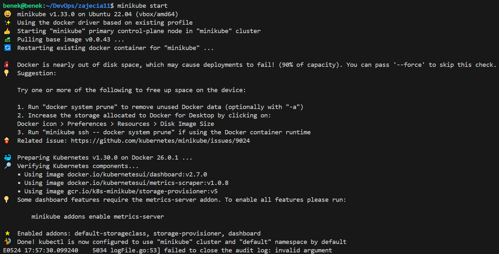
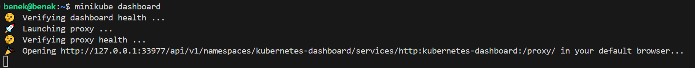
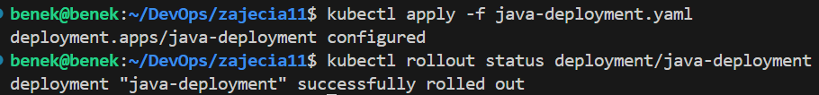
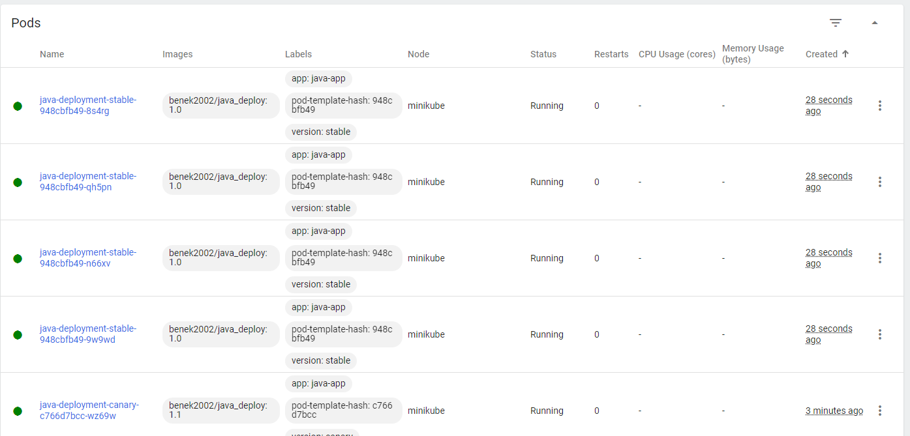

# Sprawozdanie 5

## Wdrażanie na zarządzalne kontenery: Kubernetes (1)

Celem zadań w tej części jest zapoznanie się z podstawami korzystania z klastra Kubernates oraz praktyczne zastosowanie tych umiejętności poprzez wykonanie kilku praktycznych zadań związanych z Kubernates. W tej części głównymi zadaniami była instalacja klastra Kubernates, analiza posiadanego kontenera do deploy'u oraz ręczne uruchomienie tego kontenera na klastrze Kubernates. 

### Instalacja klastra Kubernetes 

* Zaopatrzenie się w implementację stosu k8s oraz przeprowadzenie instalacji

Na samym wstępie zapoznałem się z dokumentacją [minikube](https://minikube.sigs.k8s.io/docs/start/).
Zapewniłem wszystkie potrzebne parametry mojej maszynie wirtualnej i przeszedłem do instalacji minikube, czyli narzędzia, które umożliwia uruchamianie lokalnych klastrów Kubernates na komputerze. Minikube tworzy lokalny klaster Kubernates na maszynie wirtualnej. 
Typ instalatora to paczka dla Debiana, gdyż system operacyjny na mojej maszynie wirtualnej to Ubuntu. W celu zainstalowania tej paczki muszę wykonać następujące komendy: 

    curl -LO https://storage.googleapis.com/minikube/releases/latest/minikube_latest_amd64.deb
    sudo dpkg -i minikube_latest_amd64.deb

* Zaopatrzenie się w polecenie kubectl w wariancie minikube

'kubectl' to narzędzie wiersza poleceń służące do interakcji z klastrem Kubernetes. Umożliwia zarządzanie aplikacjami kontenerowymi wdrażanymi w Kubernetes, sprawdzanie stanu klastrów i węzłów, oraz wykonywanie wielu innych operacji administracyjnych. 

Zamiast korzystac bezpośrednio z narzędzia 'kubectl', korzystam z jego wersji zintegrowanej z Minikube za pomocą polecenia: 

    minikube kubectl -- get po -A

Następnie tworzę alias, które sprawia, że każde wywołanie 'kubectl' w moim terminalu będzie w rzeczywistości wykonywać 'minikube kubectl --'. Oznacza to, że wszystkie polecenia 'kubectl' będą wykonywane przez Minikube, używając wbudowanej wersji 'kubectl' dostarczonej przez Minikube. Stworzyłem ten alias poprzez:

    alias kubectl="minikube kubectl --"

* Uruchomienie Kubeernates

W tym kroku uruchomiłem minikube za pomocą polecenia: 

    minikube start

Polecenie to tworzy kontener Docker, który działa jako maszyna wirtualna hostująca klaster Kubernates:

Wymagania sprzętowe mogą stanowić wyzwanie przy uruchamianiu Minikube, zwłaszcza na systemach z ograniczonymi zasobami. Przed rozpoczęciem pracy z Minikube zapewniłem mojej maszynie wirtualnej minimalne wymagania sprzętowe dla Minikube: 

* CPU: Co najmniej 2 rdzenie,
* RAM: Co najmniej 2 GB,
* Dysk: co najmiej 20GB wolnej pamięci na dysku

* Uruchomienie Dashboardu, otworzenie w przeglądarce, przedstawienie łączności i zapoznanie się z koncepcjami funkcji wprowadzonych przez Kubernetesa

Dashboard uruchomiłem za pomocą komendy: 

    minikube dashboard

Po wykonaniu tego polecenia przeglądarka uruchomiła się automatycznie i przekierowała mnie do interfejsu użytkownika, który pozwala na zarządzanie klastrem Kubernetes. Mogę w nim przeglądać zasoby, takie jak pody, wdrożenia, usługi. Dzięki temu, że korzystam z Visual Studio Code to porty zostały automatycznie przekierowane. 

### Analiza posiadanego kontenera

Aplikacja, którą używam to aplikacja Javy wyprowadzająca interfejs przez sieć, który wyświetla prosty komunikat, więc ta aplikacja idealnie nadaje się do pracy w kontenerze. Obraz, z którego uruchamiam kontener z aplikacją, to obraz wygenerowany wskutek pracy pipeline'u, który wykonałem na jednych z poprzednich laboratoriów. Obraz ten jest dostępny w moim repozytorium na dockerhub benek2002/java_deploy:

### Uruchamianie oprogramowania

* Uruchomienie kontenera na stosie k8s

Aby uruchomić kontener na klastrze Kubernates za pomocą obrazu korzystam z polecenia: 

    minikube kubectl run java-deploy --image=benek2002/java_deploy --port=8080 --labels app=java-deploy

To polecenie uruchamia kontener z obrazu 'benek2002/java_deploy', określa port 8080, na którym aplikacja w kontenerze nasłuchuje oraz nadaje etykietę nowo utworzonego podu. Oznacza to, że kontener jest "ubrany" w pod, co oznacza, że jest zarządzany przez podsystem Kubernetes, który nazywany jest "Pod".

* Przedstawienie, że pod działa 

Wykazanie, że pod działa poprzez dashboard: 

Wykazanie, że pod działa poprzez kubectl: 

* Wyprowadzenie portu celem dotarcia do eksponowanej funkcjonalności

Aby umożliwić dostęp do kontenera z zewnątrz klastra, musiałem przekierować porty z poda na lokalny komputer poleceniem: 

    minikube kubectl port-forward pod/java-deploy 8080:8080

W celu dostępu do aplikacją musiałem jeszcze przekierować port z wirtualnej maszyny w Visual Studio Code: 

Jak widać moja aplikacja jest dostępna pod adresem http://localhost:8081 i działa poprawnie: 

## Wdrażanie na zarządzalne kontenery: Kubernetes (2)

W tej części został zgłębiony temat wrażania aplikacji na zarządzalne kontenery za pomocą Kubernates. Zostało zrealizowana konwersja wdrożenia ręcznego na deklaratywne YAML, przygotowanie nowej wersji obrazu oraz wersji obrazu, która kończy się błędem. Przeprowadziłem zmiany w pliku YAML z wdrożeniem, manipulując liczbą replik i wersją obrazu oraz napisałem skrypt weryfikujący, czy wdrożenie zostało wykonane w ciągu 60 sekund. Na koniec porównałem różne strategie wdrożeń oraz użyłem serwisu do jednego z wdrożeń, aby uzyskać dostęp do aplikacji. 

### Konwersja wdrożenia ręcznego na wdrożenie deklaratywne YAML

W celu przekorwertowania wdrożenia ręcznego na deklaratywne wdrożenie YAML utworzyłem plik YAML o nazwie 'java-deployment.yaml'.Definiuje w nim wdrożenie, które uruchamia 4 repliki kontenera z obrazem Docker 'benek2002/java_deploy', które nasłuchują na porcie 8080. Stworzyłem ten plik przerabiając plik z dokumentacji Kubernetesa, który wdraża aplikację z obrazu 'nginx' [dokumentacja](https://kubernetes.io/docs/concepts/overview/working-with-objects/).

W tym pliku określam: 

* apiVersion: określa wersję API, która jest używana w konfiguracji,
* kind: okresla rodzaj zasobu Kubernetesa, który jest definiowany w pliku. W tym przypadku zdefiniowane jest wdrożenie 'Deployment',
* metadeta: zawiera metadane,
* spec: określa specyfikację (dla wdrożenia określa np. liczbę replik, selektor, a dla poda określa specyfikację kontenerów np. nazwę kontenera, porty, obraz Dockera)

Rozpoczynam wdrożenie za pomocą: 

    kubectl apply -f java-deployment.yaml

Następnie aby sprawdzić stan wdrożenia i zobaczyć, czy repliki zostały poprawnie wdrożone używam polecenia:

    kubectl rollout status deployment java-deployment

Stan wdrożenia mogę również sprawdzić w dashboardzie: 

Warto zauważyć, że kiedy tworzone jest wdrożenie to wraz z nim zostaje automatycznie utworzony ReplicaSet, czyli zasób Kubernates, ktory zapewnia, że określona liczba replik podów jest zawsze uruchomiona i utrzymywana w klastrze. Jest to integralna część sposobu, w jaki Kubernetes zarządza wdrożeniami i zapewnia, że aplikacje są uruchamiane zgodnie z określonymi wymaganiami. Replicaset działa jako kontroler, który monitoruje i utrzymuje liczbę replik zdefiniowaną w wdrożeniu.

### Przygotowanie nowego obrazu

W celu przygotowania nowej wersji obrazu 'Deploy' wprowadziłem zmianę w wyświetlanym tekscie aplikacji z 'Hello User!' na 'Hello Kubernates User!'. Następnie, aby otrzymać nową wersję obrazu musiałem ponownie ten obraz zbudować. Tym razem nie korzystałem z pipeline Jenkins, lecz zbudowałem ręcznie ten obraz. 

Następnie opublikowałem obraz na moim repozytorium dockerhub (Wcześniej opublikowany obraz miał tag latest, więc zmieniłem mu tag na 1.0, a nowy obraz ma tag 1.1):

Sprawdziłem, czy zaszły zmiany w aplikacji poprzez uruchomienie kontenera z nowo opublikowanego obrazu: 

Jak widać zmiany zostały wprowadzone pomyślnie, ponieważ wyświetlany komunikat w nowej wersji różni się od komunikatu z poprzedniej wersji. 

Przeprowadziłem wdrożenie dla nowej wersji za pomocą pliku yaml: 

Jak widać komunikat informuje nas, że wdrożenie 'java-deployment' zostało pomyślnie zakończone. Wszystkie nowe repliki zostały zaktualizowane i są dostępne, a stare repliki zostały usunięte. 

W dashboardzie również można zauważyć, że pody, które są aktywne to pody, w których działają kontenery z nową wersją aplikacji. 

* Przygotowanie wersji obrazu, którego uruchomienie kończy się błędem

W tym celu dokonałem modyfikacji pliku Dockerfile, który służy do budowania obrazu do deploy'u. Modyfikacja polegała na wprowadzeniu błędnej nazwy pliku .jar, który ma być uruchomiony w kontenerze z obrazu Docker, który powstanie z tego pliku Dockerfile. Spowoduje to, że kontener nie będzie w stanie znaleść i uruchomić wskazanego pliku JAR. Tak wygląda plik Dockerfile z błędną nazwą pliku JAR: 

Kolejno wrzuciłem obraz utworzony z tego pliku Dockerfile na dockerhub, dodając do obrazu tag 'error'. 
W pliku YAML zmieniłem wersję kontenera na wersję z błędem. Efekt wdrożenia wygląda w ten sposób: 

Domyślnie Deploymenty mają politykę restartu 'Always', co oznacza, że Kubernetes będzie próbował ponownie uruchamiać kontenery, które zakończyły się błędem. kontenery wielokrotnie próbują się uruchomić, ale bez powodzenia, co prowadzi do stanu 'CrashLoopBackOff'. Kubernetes wprowadza mechanizm opóźnienia (back-off), co oznacza, że czas między kolejnymi próbami uruchomienia kontenera stopniowo się wydłuża.

Sprawdziłem informację o podach za pomocą polecenia 'kubectl get pods' : 

Jak widać Kubernetes utrzymuje starsze pody z poprzedniego wdrożenia, gdy nowe pody mają problemy z uruchomieniem, aby zapewnić ciągłość działania aplikacji. Proces ten jest częścią domyślnego mechanizmu aktualizacji wdrożeń w Kubernetes 'Rolling Update', który stara się minimalizować przestoje i zapewnić, że zawsze będzie dostępna pewna liczba działających podów. 

### Zmiany w deploymencie

W tej sekcji koncentruje się na modyfikacji pliku YAML, który zawiera definicję wdrożenia. Zmiany dotyczą liczby replik oraz wersji obrazów konterów. 

* Zwiększenie liczby replik do 8

Przeprowadziłem modyfikację pliku YAML, która polegała na zwiększeniu liczby replik w sekcji spec z 4 do 8.

Następnie wdrożyłem zmiany (kubectl apply -f) oraz sprawdziłem status wdrożenia (kubectl rollout status)

Zmiana liczby Podów widoczna w dashboardzie:

* Zmmniejszenie liczby replik do 1 

Ten podpunkt wykonałem w taki sam sposób jak poprzedni czyli zmieniłem liczbę replik w pliku YAML, tylko tym razem z 8 na 1. 

Można zauważyć, że podczas zmniejszenia ilości replik podów, które zawierają kontener w tej samej wersji Kubernates usuwa pody w odwrotnej kolejności ich tworzenia, czyli najnowsze pody są usuwane jako pierwsze. W moim przypadku został najstarszy pod, co może być spowodowane tym, że Kubernates go zachował, gdyż jest najbardziej stabilny i przetestowany w bieżącym środowisku. 

* Zmniejszenie liczby replik do 0

Ponownie zmniejszyłem liczbę replik w pliku YAML pozostawiając przy tym taką samą wersję kontenera w podach. Tak prezentuje się dashboard dla tego przypadku:

Jak widać po zastosowaniu tej zmiany Kubernates usunął wszystkie uruchomione pody związane z tym wdrożeniem, ale definicja wdrożenia pozostała w systemie, co może być użyteczne do późniejszego skalowania do pożądanej liczby replik, gdy będą ponownie potrzebne. 

* Zastosowanie nowej wersji obrazu

W celu zastosowania nowej wersji na samym początku stworzę plik wdrożenia jaki miałem przed wprowadzonymi zmianami, czyli ustawiłem ilość replik na 4 i poprzednią wersję kontenera (1.0). Tak to wygląda w dashboardzie: 

Następnie w celu zastosowania nowej wersji zmieniłem wersję obrazu z 1.0 na 1.1 w sekcji spec dla podów: 

Wdrożyłem zmiany za pomocą 'kubectl apply' i sprawdziłem status wdrożenia 'kubectl rollout status':

Jak widać w powyższego zrzutu ekranu Kubernates stopniowo aktualizował kolejne repliki zastępując stare repliki nowymi. Po utworzeniu nowych replik, stare repliki były stopniowo usuwane, aż do momentu, gdy wszystkie repliki działały z nową wersją kontenera. Ten sposob wdrażania to 'rolling update' i umożliwia ciagłą dostępność usługi podczas aktualizacji. 

Pody z nową wersją kontenera widoczne w dashboardzie: 

* Zastosowanie starszej wersji obrazu 

Zastosowanie starszej wersji wykonałem analogiczne jak w poprzednim podpunkcie, tylko tym razem zmieniłem wersję kontenera z 1.1 na 1.0. 

* Przywrócenie poprzedniej wersji wdrożeń

W Kubernates można przywracać poprzednie wersje wdrożeń za pomocą poleceń 'kubectl rollout history' i 'kubectl rollout undo'. Może być to wykorzystywane do cofnięcia wdrożenia do wcześniejszej, stablinej wersji w przypadku problemów z nowym wdrożeniem. 

Aby zobaczyć historię wdrożeń dla konkretnego Deploymentu należy użyć polecenia 'kubectl rollout history':

W celu cofnięcia się do poprzedniej wersji deploymentu należy użyć polecenia:

    kubectl rollout undo deployment/java-deployment

Natomiast, aby cofnąć się do konkretnej wersji należy dodać do tego polecenia flagę '--to-revision':

    kubectl rollout undo deployment/java-deployment --to-revision 6

W moim przypadku cofnąłem się do poprzedniej wersji poprzez zastosowanie polecenia z numerem rewizji. Spowodowało to cofnięcie do wersji kontenerów 1.1: 

### Kontrola wdrożenia 

W tej części napisałem skrypt w Bashu, który weryfikuje, czy wdrożenie w Kubernates zakończyło się sukcesem w ciągu 60 sekund. Tak wygląda treść skryptu: 

W tym skrypcie na samym początku ustawiam zmienne:
* DEPLOYMENT_FILE: Ścieżka do pliku YAML zawierającego definicję wdrożenia.
* DEPLOYMENT_NAME: Nazwa wdrożenia w Kubernetes.
* TIMEOUT: Maksymalny czas oczekiwania na zakończenie wdrożenia w sekundach.
* START_TIME: Czas rozpoczęcia skryptu w sekundach od epoch 

Następnie zdefiniowałem funkcję 'kubectl rollout status', ktora ma na celu sprawdzenie statusu wdrożenia. Zwraca kod wyjścia 0, jeśli wdrożenie zakończyło się sukcesem, lub inny kod, jeśli nie. Używam w skrypcie 'kubectl apply -f' do wdrożenia aplikacji zdefiniowanej w pliku YAML. Jeśli polecenie 'kubectl apply' zakończy się niepowodzeniem (zwróci kod wyjścia różny od 0), skrypt wyświetli komunikat o niepowodzeniu i zakończy działanie z kodem wyjścia 1. 
Kolejnym krokiem było zdefiniowanie nieskończonej pętli, w której w każdym cyklu sprawdzam status wdrożenia za pomocą wcześniej zdefiniowanej funkcji 'check_rollout_status()'. 
Jeśli wdrożenie zakończyło się sukcesem, obliczany jest czas, jaki upłynął od rozpoczęcia wdrożenia (ELAPSED_TIME).
Jeśli czas ten jest mniejszy niż wartość TIMEOUT, skrypt wyświetla komunikat o sukcesie i kończy działanie z kodem wyjścia 0.
W przeciwnym razie skrypt wyświetla komunikat o przekroczeniu czasu i kończy działanie z kodem wyjścia 1.
Jeśli wdrożenie nie zakończyło się sukcesem, skrypt kontynuuje oczekiwanie na zakończenie wdrożenia.
Jeśli czas od rozpoczęcia wdrożenia przekroczy wartość TIMEOUT, skrypt wyświetli komunikat o przekroczeniu czasu i zakończy działanie z kodem wyjścia 1.
Przed kolejnym sprawdzeniem statusu skrypt usypia na 5 sekund.

Następnie sprawdziłem poprawność skryptu. W pierwszym scenariuszu przeprowadziłem za jego pomocą wdrożenie, w którym zmieniłem wersję kontenra z 1.0 na 1.1. Działanie skryptu: 

Jak widać skrypt działa poprawnie, wdrożenie zostało przeprowadzone i zostala wyświetlona informacja o czasie w jakim udało się przeprowadzić proces wdrożenia. 

Kolejno sprawdziłem, czy skrypt działa poprawnie dla scenariusza, w którym proces wdrożenia będzie trwał dłużej niż 60 sekund. W tym celu 
stworzyłem duża ilość replik (11) ze wersją kontenera 1.0, następnie w pliku YAML zdefiniowałem 11 replik z nową wersją 1.1. Dzięki temu zabiegowi znacząco wydłużylem czas wdrażania ponieważ wdrożenie obejmowało 11 replik oraz wymagało zakończenie dużej ilości replik ze starszą wersją kontenera:

Można zauważyć, że skrypt działa prawidłowo i wyświetla informację w przypadku, gdy wdrożenie trwa dłużej niż 60 sekund. 

### Strategie wdrożenia

* Przygotowanie wersji wdrożeń stosując następujące strategie wdrożeń: recreate, Rolling Update, Canary Deployment workload

W tej częśći będę realizował rózne wersje wdrożeń stosując odpowiednie strategie i skupię nie na zaobserwowaniu i opisaniu różnić pomiędzy nimi. Dla każdej ze strategi utworzę nowy plik YAML do tworzenia Deploymentu i w każdym z nich będe tworzył 4 repliki. 
W celu zaobserwania różnic pomiedzy strategiami, dla każdego wdrożenia będe postępował tak samo, mianowicie będe aktualizował wersję kontnera z 1.0 na 1.1. 

* Recreate

Strategia Recreate polega na usunięciu wszystkich istniejących podów przed utworzeniem nowych. Ta strategia jest stosowana, gdy nowa wersja nie może działać jednocześnie ze starą wersją lub gdy zmiany wprowadzone w nowej wersji są niekompatybilne ze starą wersją.

Plik YAML dla strategi Recreate:

Jak można zauważyć w dashboardzie wszystkie repliki ze starszą wersją zostały zatrzymane i dopiero pózniej na ich miejsce zostały utworzone 4 repliki z nowszą wersja: 

Można łatwo wywnioskować, że plusem tej strategi jest brak problemów z kompatybilnością między starą i nową wersją, a wadą tej strategi jest przerwa w dostępności aplikacji podczas wdrażania. 

* Rolling Update

trategia Rolling Update polega na stopniowym zastępowaniu starych podów nowymi. Zapewnia to bezprzerwowe wdrażanie nowych wersji, minimalizując ryzyko przestoju. Ta strategia jest domyślną strategią wdrażania w Kubernetes. Parametry jakie zostały użyte w tej strategi to: 
  * maxUnavailable: Maksymalna liczba podów, które mogą być niedostępne podczas aktualizacji. Przyjąłem wartość 2 oznacza, że dwa pody mogą być niedostępne. 
  * maxSurge: Maksymalna liczba nowych podów, które mogą być uruchomione ponad żądaną liczbę replik. Wartość 50% oznacza, że można uruchomić dwa dodatkowe pody, jeśli liczba replik wynosi 4.

Plik YAML: 

Przejście pomiędzy wersjami kontenerów widoczne w dashboardzie: 

Jak widać jednocześnie tworzone są pody z nowszą wersją kontenerów, podczas gdy uruchomiane są pody z starszą wersją kontenerów. 
Zaletami tej strategii jest wdrażanie bez przerw oraz płynne przejście między wersjami. Wadami tej strategii są potencjalne problemy z kompatybilnością wersji oraz wymagane jest odpowiednie zarządzanie zasobami. 

* Canary Deployment workload

Strategia Canary Deployment polega na wdrażaniu nowej wersji aplikacji dla niewielkiego podzbioru użytkowników, zanim zostanie ona wdrożona dla wszystkich. Pozwala to na testowanie nowej wersji w rzeczywistych warunkach przy minimalnym ryzyku.

Oto plik YAML przedstawiający strategię Canary Deployment:

 tym przykładzie, etykieta version jest używana do oznaczenia wersji aplikacji. Deployment java-deployment-stable reprezentuje stabilną wersję, a Deployment java-deployment-canary reprezentuje wersję Canary. Można użyć tych etykiet do zarządzania ruchem w swojej konfiguracji sieciowej, aby kierować ruch na odpowiednią wersję aplikacji.

Replik stablinej wersji (1.0) jest 4, a nowej wersji (1.1) 1 replika. 

Widok w dashboardzie: 

Zalety tej strategi to: bezprzerwowe wdrażanie oraz płynne przejście między wersjami. Wady to: skomplikowane zarządzanie, wymaga dodatkowych mechanizmów do monitorowania i przekierowywania ruchu.

* Użycie serwisów do wdrożeń z wieloma replikami 

Serwis w Kubernetes jest abstrakcją, która definiuje zestaw podów i zasobów sieciowych, które mogą być osiągane jako pojedynczy punkt dostępu. Daje to możliwość komunikacji z aplikacjami w klastrze bez konieczności wiedzenia, na którym konkretnym węźle klastra znajdują się te aplikacje. Serwis Kubernetes obsługuje równoważenie obciążenia, co oznacza, że przekierowuje ruch do odpowiednich podów na podstawie reguł zdefiniowanych w selektorach.

Postanowiłem, że użyje serwisów do strategii Canary Deployment w celu kierowania ruchem do różnych wersji mojego wdrożenia opartego na etykietach. 

Dla zwięzłości i wygody umieściłem definicję serwisów w tym samym pliku co Deploymentów oddzielając je poprzez '---'. Tak wyglądają zdefiniowane serwisy: 

Zdefiniowałem więc dwa serwisy: 'java-app-service' i 'java-app-canary-service'. Serwis 'java-app-service' kieruje ruch na podstawową wersję aplikacji 1.0 (stabilną), a serwis 'java-app-canary-service' kieruje ruch na wersję Canary aplikacji 1.1. Te serwisy są typu NodePort, które przypisują stały port na każdym węźle klastra, na którym działa usługa. Ten port jest otwary na ruch z zewnątrz klastra. Należy pamiętać, że w przypadku usług typu NodePort w Kubernetes, zakres portów, które mogą być używane, to zakres portów od 30000 do 32767. W moim przypadku serwis dla wersji stabilnej będzie dostępny pod portem 30986, a dla wersji Canary pod portem 30987.
Z racji, iż serwisy mam zdefiniowane w tym samym pliku co Deploymenty, to tworzę je jednym poleceniem: 

Następnie sprawdzam, czy ruch jest poprawnie przekierowywany do odpowiedniej wersji aplikacji przez serwisy. Połaczenie sprawdzam za pomocą polecenia 'curl' podając adres maszyny wirtualnej hostującej Minikube jako adres IP oraz port odpowiedniego serwisu. Adres IP sprawdziłem poprzez:

Dla wersji stablinej 1.0 polecenie wygladą w ten sposób: 

A dla wersji Canary 1.1 tak: 

jak widać komunikaty są odpowiednie dla każdej z wersji, więc można śmiało stwierdzić, że serwisy spełniły swoją role i odpowiednio przekierowują ruch. 
