# Sprawozdanie 2
Szymon Krzykwa
Inżynieria Obliczeniowa gr 2

## Cel laboratorium

Celem tych laboratoriów było 

## Wykonanie

### 1. Wybranie repozytorium z kodem dowolnego oprogramowania

#### Przygotowanie

Oprogramowanie, które wybrałem to To Do Web App i jest ono oparte o Node.js

Link do repozytorium: https://github.com/devenes/node-js-dummy-test

Repozytorium to musi spełniać odpowiednie warunki. Pierwszym z nich była otwarta licencja. Wybrany przeze mnie program posiada licenjcę Apache 2.0. Jest to licencja stworzona przez Apache Software Foundation, pozwalająca na używanie, modyfikowanie i dystrybucję programu w postaci źródłowej lub binarnej, bez obowiązku udostępniania kodu źródłowego

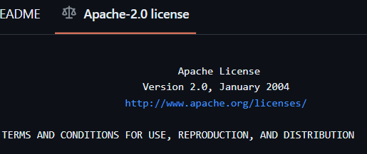

Drugim warunkiem było posiadanie przez to oprogramowanie własnych narzędzi Makefile. Dla tego repo tym środowiskiem jest npm (node package modules). Wszystkie operacje dotyczące budowania, testowania itd. będą zaczynać się zapisem npm "nazwa opercaji".

Trzecim wymaganiem było posiadanie własnych testów. Domyślne tetsy tego programu znajdują się w folderze src pod nazwą index.test.js.

#### Pobranie repozytorium i sprawdzenie jego działania

Zanim przeszedłem do głównej częsci zadania sklonowałem repozytorium do folderu Sprawozdanie2

    git clone https://github.com/devenes/node-js-dummy-test.git

Następnie wewnątrz powstałego katalogu node-js-dummy-test wykonałem build'a:

    npm install 

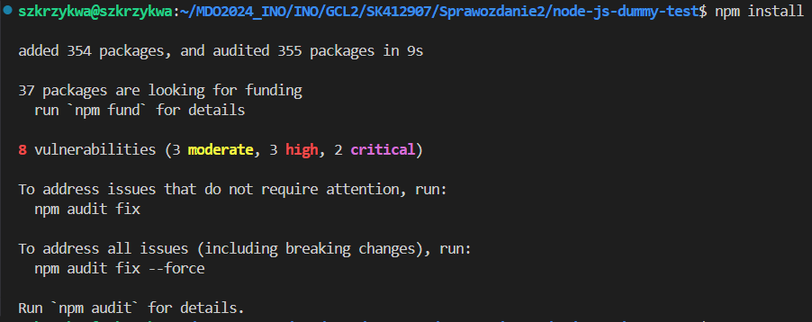

Po zainstalowaniu się wszystkich plików oraz pakietów uruchomiłem testy:
    
    npm test

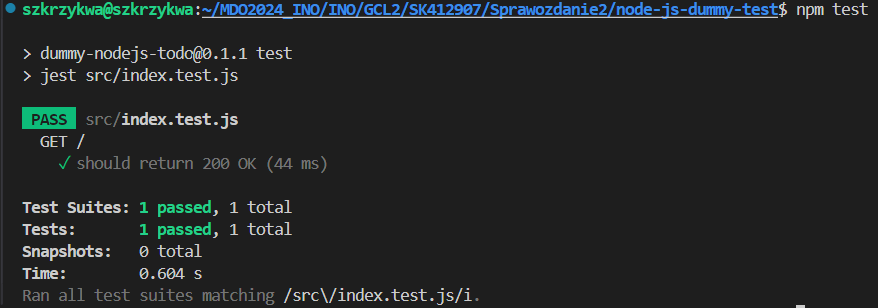

Po pokazaniu się pozytywnych wyników wykonwanych testów uruchomiłem program:

    npm start

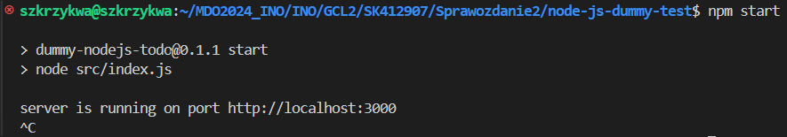

Wynik npm start w przeglądarce

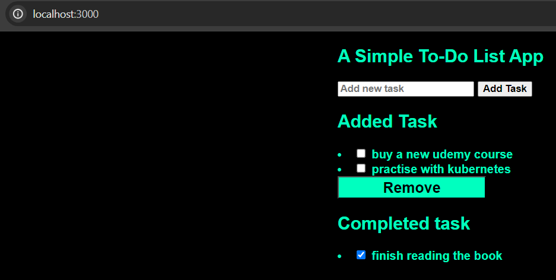

### 2. Przeprowadzenie buildu w kontenerze

Teraz należało wykonać poprzednio wykonane kroki wewnątrz kontenera. Uruchomiłem kontener node z opcją -it w celu interaktywnej pracy wewnątz niego, a jako urządzenie odpowiadające za input-output wybrałem bash.

    docker run -it node bash

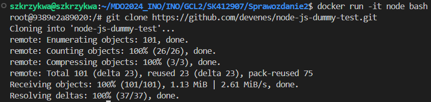

Kontener zaopatrzany jest w trakcie procesu budowania i nie musze dodatkowo instalować git'a, gdyż jest on częścią obrazu.

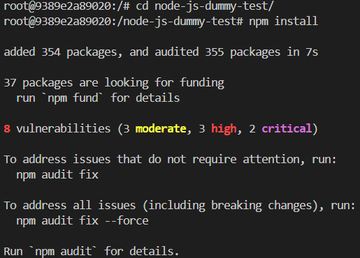

Następnie przechodząc do odpowiedniego folderu uruchomiłem budowę i wykonałem testy.

Kolejnym punktem tego ćwiczenia było wykonanie dwóch plików Dockerfile, które miały służyć do zautomatyzowania powyższych kroków. Pierwszy kontener wykonywał kroki, aż do momentu przeprowadzenia build'a

    FROM node:latest

    RUN git clone https://github.com/devenes/node-js-dummy-test.git
    WORKDIR node-js-dummy-test
    RUN npm install

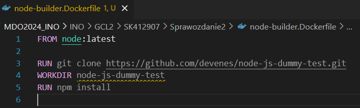

Utworzenie obrazu na podstawie pliku node-build.Dockerfile

    docker build -f ./node-builder.Dockerfile -t node-builder .

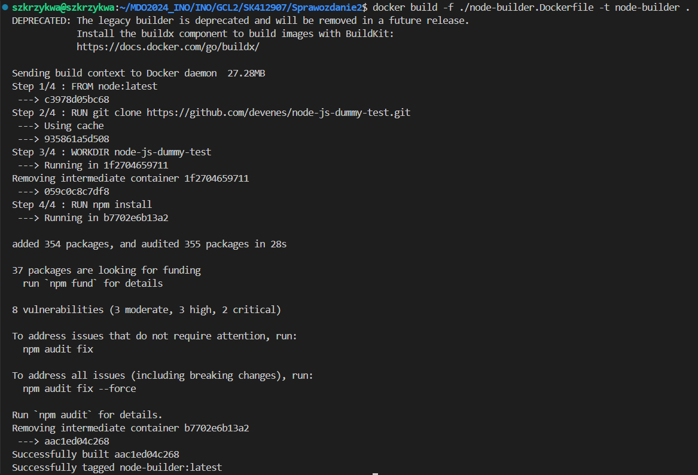

Drugi natomiast wykonuje testy na podstawie poprzedniego kontenera:

    FROM node-builder

    CMD [ "npm", "test" ]

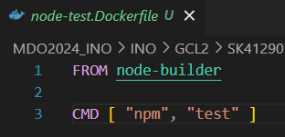

Utworzenie obrazu na podstawie pliku node-test.Dockerfile

    docker build -f ./node-test.Dockerfile -t node-test .

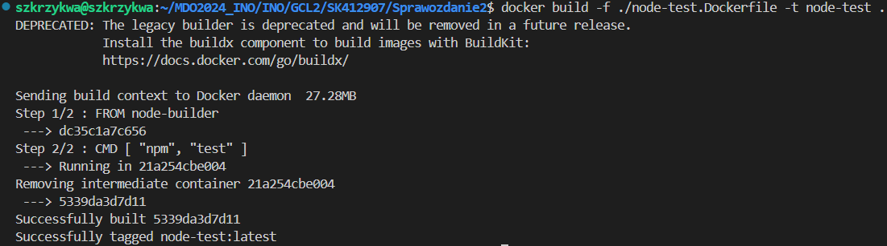

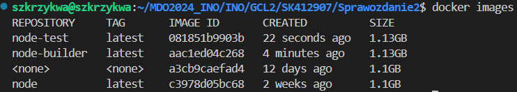

Zbudowane obrazy następnie uruchamiamy i sprawdzamy czy ich działanie jest poprawne. Kontener node-test pokazuje wynik testów, dlatego, że na końcu polecenie npm test jest zapiane przy użyciu CMD. Aby sprawdzić działanie konetenera node-build wpisuje polecenie:

    docker container list --all

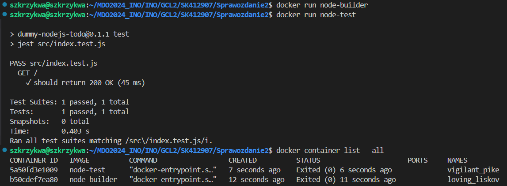

### 3. Zachowywanie stanu przy pomocy voluminów

#### Stworzenie i konfiguracja voluminów

Voluminy służą do zapisywania danych znajdujących się wewnątrz Docker'a. Utworzyłem więc dwa voluminy (wejściowy i wyjściowy):

    docker volume create in
    docker volume create out

Aby sprawdzić czy nasz voluminy na pewno zostały stworzone możemy wpisać komendę pokazującą listę wszystkich stworzonych volumniów:

    docker volume ls

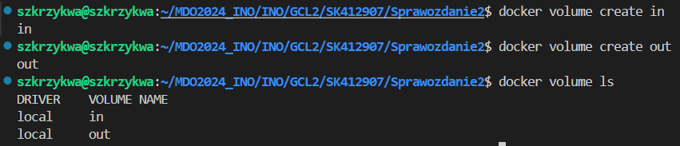

Teraz powstałe voluminy należy podłączyć pod nasz kontener bazowy. W moim przypadku jest to używany we wcześneijszych etapach node. Aby podłączyć voluminy do kontenera używa się flagę --mount. Następnie podajemy source i target, czyli kolejno co podpinamy do naszego kontenera oraz do jakiego miejsca wewnątrz niego (dane, które będziemy zapisywać).

    docker run -it --rm --name my_node --mount source=in,target=/in --mount source=out,target=/out node bash

Po wpisaniu komendy ls możemy zauważyć utworzone katalogi in oraz out wewnątrz naszego kontenera

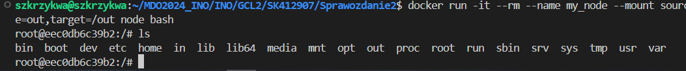

#### Sklonowanie repozytorium do voluminu wejściowego

W celu skopiowania repozytorium do mojego voluminu in uruchomię kontener pomocniczy do którego podepnę volumin. Następnie wejdę do podpiętego do niego folderu in i sklonuje tam repozytorium

Stworzenie kontenera pomocniczego:

    docker run -it --rm --name helpi --mount source=in,target=/in node bash

Sklonowanie repo:

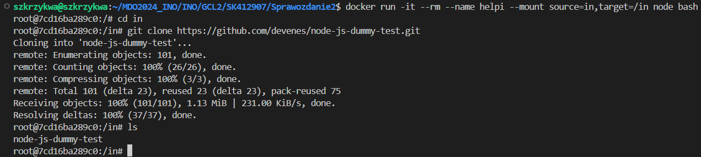

#### Uruchomienie build'a w bazowym kontenerze

Przechodzimy z powrotem do naszego kontenra bazowego do katalogu in. W nim możemy ujrzeć pobrany do volumina w kontenerze pomocinczym folder ze sklonowanym repozytorium. Uruchamiamy build'a:

    npm install 

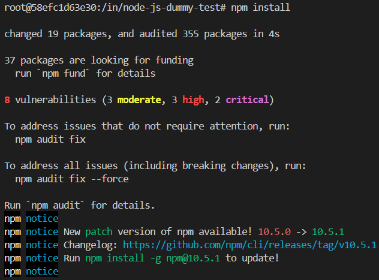

Następnie skopiowałęm repo z moojego voluminu do kontenera:

    cp -r node-js-dummy-test/ ../

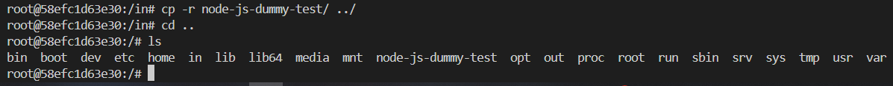

#### Skopiowanie plików z builda do voluminu wyjściowego

Zbudowane pliki znajdują się wewnątrz folderu node_modules. Podobnie jak w przypadku kopiowania do kontenera kopiujemy zawartość tego katalogu do folderu out. 

    cp -r node_modules/ ../../out/

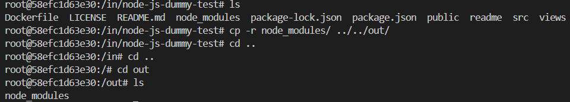

Aby sprawdzić czy pliki skopiowane do voluminów zostały zapisane poza kontenerem sprawdzamy gdzie znajdują się dane do nich zapisane:

    docker volume inspect in

Z ukazanego nam zapisu bierzemy ścieżkę z "Mountpoint" i wpisujemy do terminala:

    sudo ls /var/lib/docker/volumes/in/_data

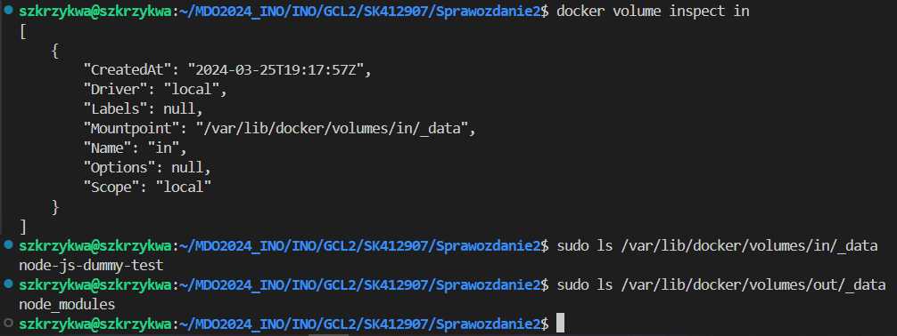

#### Sklonowanie repozytorium na volumin wejściowy wewnątrz kontenera z użyciem git'a

Aby odróżnić nowo sklonowane repo od tego sklonowanego wcześniej wykorzystujemy inną ścieżkę dodając wewnątrz foldera in katalog repo. Po wejściu do kontenera podajemy komendę:

    git clone https://github.com/devenes/node-js-dummy-test.git ./in/repo

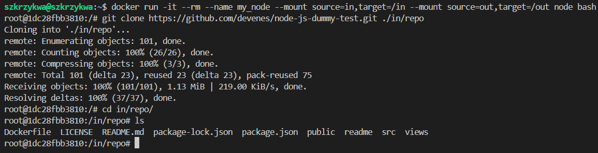

#### Wykonanie powyższych kroków przy pomocy Dockerfile'a.

Wyżej wykonane kroki można wykonać przy pomocy docker build'a i plików Dockerfile. Odtwarzamy wcześniejsze kroki i adaptujemy je do pliku Dockerfile

Zawartość pliku node-builder-volumes.Dockerfile:

    FROM node:latest

    RUN mkdir in
    RUN mkdir out

    RUN --mount=type=bind,source=in,target=/in,rw
    RUN --mount=type=bind,source=out,target=/out,rw
    WORKDIR /in
    RUN git clone https://github.com/devenes/node-js-dummy-test.git
    WORKDIR /in/node-js-dummy-test
    RUN npm install
    RUN cp -r node_modules ../../out/new_node_modules

### 4. Eksponowanie portu

#### Utworzenie serwera iperf

Iperf do narzędzie, które służy do analizy łącza (pomiar wydajności). Instalujemy go poprzez podanie komedny:

    apt-get install iperf3

Serwer uruchamiamy wpisaniem:

    iperf3 -s

Sprawdzamy adres powstałego serwera:

    docker inspect -f'{{range .NetworkSettings.Networks}}{{.IPAddress}}{{end}}' 20216d8af55c

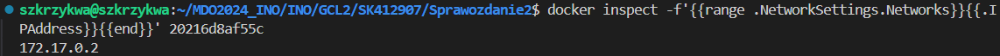

#### Połączenie się z serwerem z drugiego kontenera

W drugim terminalu uruchomiłem kolejny konetener, który będzie pełnił rolę klienta. Aby połączyć się z serwerem wpisujemy komendę (adres ze sprawdzenia powyżej):

    iperf3 -c 172.17.0.2

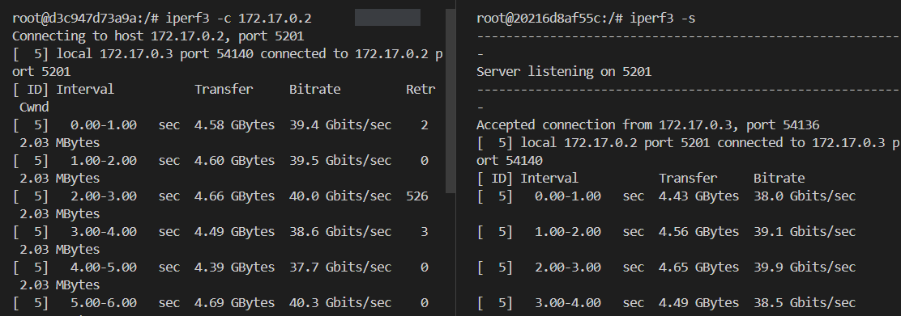

Iperf sprawdza jaka jest wydajność naszego połączenia między kontenerem serwerowym, a klienckim.

#### Własna dedykowana sieć mostkowa

Własną sieć mostkową tworzymy poprzez wpisanie:

    docker network create siec

Podobnie jak wcześniej tworzymy dwa kontenery, które będą robiły za serwer i klienta. Dzięki stworzeniu sieci zamaist adresem możemy posługiwać się nazwą kontenera. Wynika to z tego, że docker korzysta z serwera DNS.

Tworzenie kontenerów podpiętych pod sieć:

    docker run -it --rm --name server --network siec ubuntu bash

    docker run -it --rm --name client --network siec ubuntu bash

Sprawdzamy ID naszej sieci poprzez wpisanie:

    docker network ls

Aby sprawdzić adresy podłączonych kontenerów wpsujemy:

    docker network inspect 0718b89bf50d

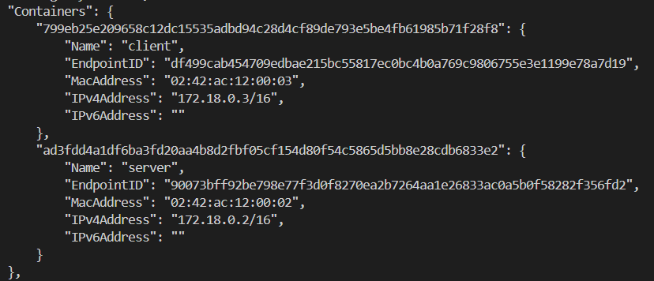

Tworzymy serwer:

    iperf3 -s

Podłączamy kontenery do siebie:

    iperf3 -c server

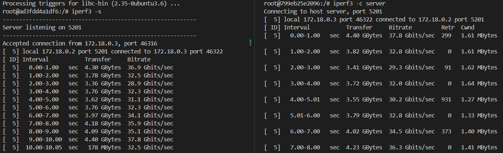

#### Połączenie się do serwera spoza kontenera

Teraz spróbuje się połączyć z utworzonym serwerem z wirtualnej maszyny. Kontener serwerowy uruchamiamy podobnie jak w poprzednuch przypadkach, lecz z dodatkowymi opcjami. Obsługiwany przez nas port to 5201.

    docker run -it --rm --network siec --name server -p 5201:5201 --mount ubuntu bash

Zapis -p 5201:5201 łączy hosta z dockerem. Dodatkowo podpinamy volumin, aby pobierać logi serwera.

Sprawdziłem adres nowo powstałego serwera:

    docker inspect -f'{{range .NetworkSettings.Networks}}{{.IPAddress}}{{end}}' e1cf56964f1f

A następnie podłączyłem się do niego z pozycji hosta:

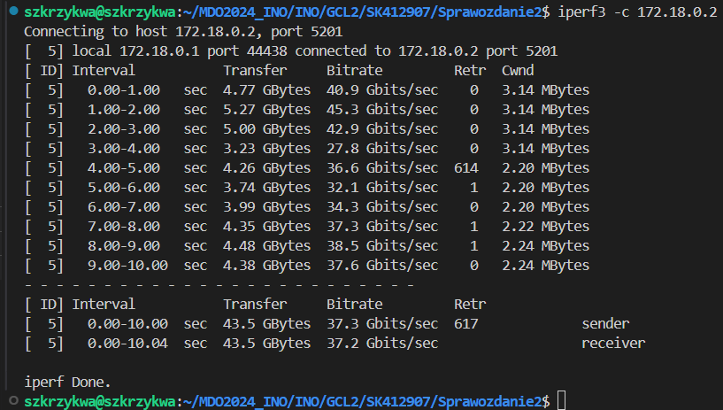

### 5. Instalacja Jenkinsa

Na początek tworzymy sieć mostkową jenkins'a:

    docker network create jenkins

Następnie pobieramy dcoker image poprzez uruchomienie konteneru z opdowiednimi opcjami (poniższy zapis znajduje się na stronie z dokumentacją jenkins'a)

    docker run \
    --name jenkins-docker \
    --rm \
    --detach \
    --privileged \
    --network jenkins \
    --network-alias docker \
    --env DOCKER_TLS_CERTDIR=/certs \
    --volume jenkins-docker-certs:/certs/client \
    --volume jenkins-data:/var/jenkins_home \
    --publish 2376:2376 \
    docker:dind \
    --storage-driver overlay

Następnie tworzymy plik Dockerfile'a, którego zawaratość znajduje się na stronie z dokumentacją:

    FROM jenkins/jenkins:2.440.2-jdk17
    USER root
    RUN apt-get update && apt-get install -y lsb-release
    RUN curl -fsSLo /usr/share/keyrings/docker-archive-keyring.asc \
    https://download.docker.com/linux/debian/gpg
    RUN echo "deb [arch=$(dpkg --print-architecture) \
    signed-by=/usr/share/keyrings/docker-archive-keyring.asc] \
    https://download.docker.com/linux/debian \
    $(lsb_release -cs) stable" > /etc/apt/sources.list.d/docker.list
    RUN apt-get update && apt-get install -y docker-ce-cli
    USER jenkins
    RUN jenkins-plugin-cli --plugins "blueocean docker-workflow"

Uruchamiamy budowanie:

docker build -t myjenkins-blueocean:2.440.2-1 -f jenkins.Dockerfile .

Po zakończeniu budowania uruchamiamy nasz kontener:

    docker run \
    --name jenkins-blueocean \
    --restart=on-failure \
    --detach \
    --network jenkins \
    --env DOCKER_HOST=tcp://docker:2376 \
    --env DOCKER_CERT_PATH=/certs/client \
    --env DOCKER_TLS_VERIFY=1 \
    --publish 8080:8080 \
    --publish 50000:50000 \
    --volume jenkins-data:/var/jenkins_home \
    --volume jenkins-docker-certs:/certs/client:ro \
    myjenkins-blueocean:2.440.2-1 

Sprawdzamy czy nasz kontener został utworzony:

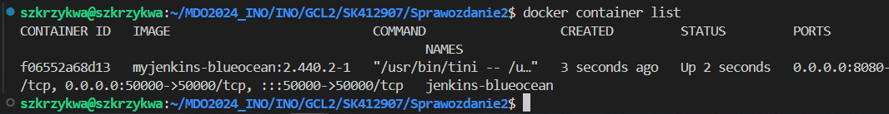

Aby uruchomic ekran hosta w przeglądarce musimy przekierować portów z wirtualnej maszyny do hosta

Znajdujemy adres VM wpisując:

    ip a

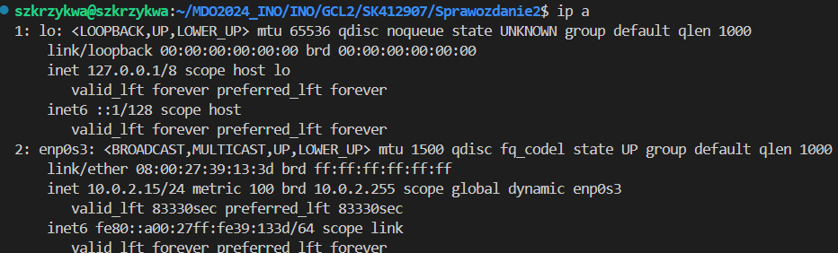

Następnie przechodzimy do ustawień sieci w Virtual Box'ie

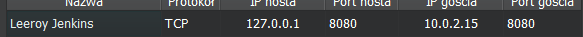

Wynik:

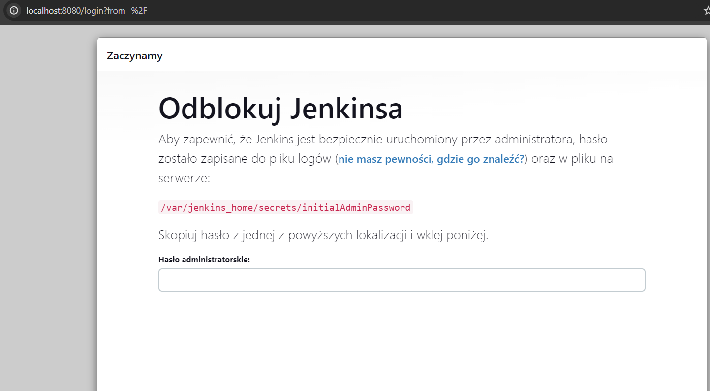