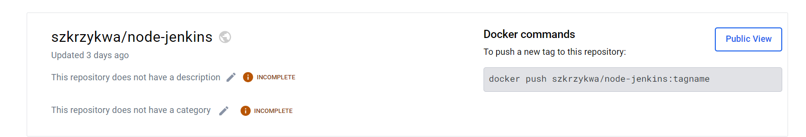

# Sprawozdanie 3
Szymon Krzykwa
Inżynieria Obliczeniowa gr 2

## Cel laboratorium

Celem tych laboratoriów było zapoznanie się z Jenkisnem oraz jego wykorzystaniem.

## Wykonanie

### 1. Przygotowanie

Przed przystąpieniem do główmej części ćwiczenia należało uzyskać dostęp do Jenkinsa. Dokonywaliśmy tego poprzez wpisanie hasła administratora z kontenera Jenkinsa. Przy pomocy:

docker exec -it <id kontenera z Jenkinsem> cat /var/jenkins_home/secrets/initialAdminPassword

na ekranie terminala pokazuje nam się wymagane hasło, ktore następnie należy wprowadzić i przechodzimy do konfiguracji użytkownika. Po wszystkim na ekranie powinno pokaza nam się głowne menu Jenkinsa. 

### 2. Pierwsze uruchomienie

Na początek zostaliśmy poproszeniu o utworzenie dwóch prostych projektów, które miały nas zaznajomić z działaniem wewnątrz Jenkinsa. Jako pierwszy stworzyliśmy projekt uname, który miał na celu wyświetlenie informacji o używanym przez nas systemie. W konfiguracji projektu podaliśmy jedynie jedną linijkę kodu:

    uname -a

Po jego uruchomieniu w logach konsoli otrzymaliśmy wypis:

Drugim z wymaganych projektów było napisanie kodu, który w przypadku występowania godziny nieparzystej zwracał błąd. Kod dla tego problemu prezentował się następująco:

    #!/bin/bash
    current_hour=$(date +%H)

    if [ $((current_hour % 2)) -eq 1 ]; then
        echo "Error: Current hour is odd"
        exit 1
    else
        echo "Current hour is even"
    fi

Wypis z konsoli:

Po wykonananiu powyższych projektów przeszlismy do wykonania "prawdziwego" projektu, który klonuje nasze repozytorium, przechodzi na dedykowaną gałąź i wykonuje builda naszej aplikacji. W konfiguracji projektu w zakładce repozytorium podałem wszystkie odpowiednie informacje:

Następnie w powłoce wykonałem przejście do odpwiedniego katalogu i zbudowałem obraz.

    cd INO/GCL2/SK412907/Sprawozdanie2
    docker build -f node-builder.Dockerfile .

Końcówka wypisu z konsoli potwierdzająca porpawne wykonanie zadania:

### 3. Część główna - Pipeline

#### Diagramy UML, opisujące proces CI.

Poproszono nas o wykonanie diagramów UML. Pierwszym z nich jest diagram czynności, który pokazuje przebieg działania naszego pipeline'u i co powinno zajść na każdym etapie jego wykonywania. Drugim jest diagram wdrożenia przedstawiający strukturę oraz relacje pomiędzy poszczególnymi elementami.

Diagram czynności:

Diagram wdrożenia:

    pipeline {
        agent any
        environment {
            CREDS=credentials('szk-dockerhub')
        }
        stages {
            stage('Clone') {
                steps {
                    script {
                        sh "rm -rf MDO2024_INO || true"
                        sh "git clone https://github.com/InzynieriaOprogramowaniaAGH/MDO2024_INO.git MDO2024_INO"
                        sh "docker network create node || true"
                        dir ("MDO2024_INO/INO/GCL2/SK412907/Sprawozdanie2") {
                            sh "git checkout SK412907"
                        }
                    }
                }
            }
            stage('Build') {
                steps {
                    dir ("MDO2024_INO/INO/GCL2/SK412907/Sprawozdanie2"){
                        sh "docker build -t node-builder -f ./node-builder.Dockerfile ."
                    }
                }
            }
            stage('Test') {
                steps {
                    dir ("MDO2024_INO/INO/GCL2/SK412907/Sprawozdanie2"){
                        sh "docker build -t node-test -f ./node-test.Dockerfile ."
                    } 
                }
            }
            stage('Deploy') {
                steps {
                    dir ("MDO2024_INO/INO/GCL2/SK412907/Sprawozdanie2"){
                        sh "docker build -t szkrzykwa/node-jenkins -f ./node-deploy.Dockerfile ."
                        sh "docker rm -f node-jenkins || true "
                        sh "docker run --name node-jenkins --rm -d -p 3000:3000 --network=node szkrzykwa/node-jenkins"
                    }
                }
            }
            stage('Publish') {
                steps {
                    sh "docker rmi curlimages/curl || true"
                    script {
                        def response = sh script: "docker run --network=node --rm curlimages/curl:latest -L -v http://node-jenkins:3000", returnStdout: true
                        if (response.contains("To Do App")) {
                                
                                sh "echo $CREDS_PSW | docker login -u szkrzykwa --password-stdin" 
                    
                            sh 'docker push szkrzykwa/node-jenkins'
                        } else {
                            error "Response does not contain To Do App!"
                        }
                    }
                }
            }
        }
        post {
            always {
                sh "docker logout"
            }
        }
    }

