# Sprawozdanie 4
Szymon Krzykwa
Inżynieria Obliczeniowa gr 2

## Cel laboratorium

Celem laboratoriów było zapoznanie nas z automatyzacją i zdalnym wykonywaniem poleceń przy pomocy Ansible'a oraz przygotowanie źródła instalacyjnego systemu dla maszyny wirtualnej.

## Wykonanie

### 1. Przygotowanie Ansible'a

Na początek utworzyłem nową maszynę wirtualną o jak najmniejszym zbiorze zainstalowanego oprogramowania (mała ilość pamięci oraz procesorów). Zainstalowałem na niej ten sam system operacyjny co na głównej maszynie. W moim przypadku jest to Ubuntu. W poleceniu zadania podane było, aby zapewnić obecność programu tar i serwera OpenSSH. Nowo powstałej maszynie nadałem hostname ansible-target i utworzyłem w niej użytkownika ansible. 

Widok zainsalowanego systemu po zalogowaniu:

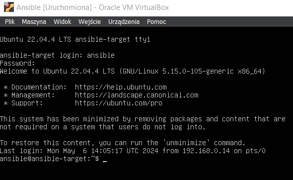

Następnie na głównej maszynie zainstalowałem oprogramowanie Ansible. Posługiwałem się komednami znajdującymi się na stronie wydawcy, a po wykonaniu podanych tam kroków sprawdziłem czy działa ono poprawnie.

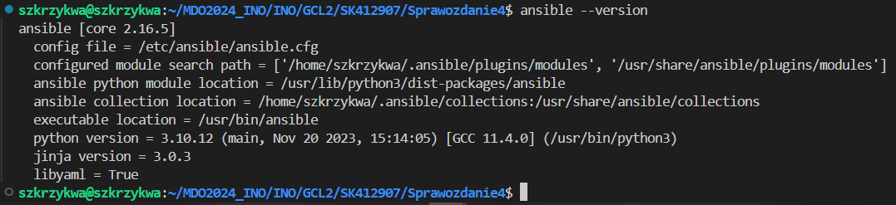

Teraz należało dokonać wymiany kluczy SSH pomiędzy maszynami. Najpierw przełączyłem tryb maszyny ansible na tryb Bridge, aby maszyny mogły się znaleźć. 

Następnie wygenerowałem klucz ssh dla nowej maszyny. W moim przypadku był to klucz typu rsa

    ssh-keygen -t rsa

Wygenerowany klucz w wersji publicznej skopiowałem na główną maszynę przy pomocy komendy:

    ssh-copy-id ansible@192.168.0.19

Po wykonaniu powyższych kroków sprawdziłem czy wymiana kluczy nastała poprawnie. Jeśli tak podczas logowania przez ssh nie powinna pojawić się opcja podawania hasła.

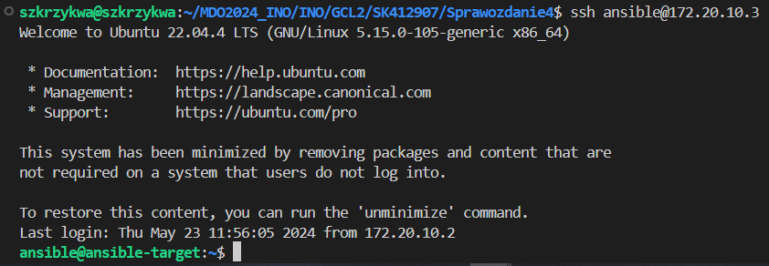

### 2. Inwentaryzcja

Na początek do pliku /etc/hosts wprowadziłem nową nazwę dla adresu maszny ansible - ansible-target. Teraz przy logowaniu do maszyny nie musze posługiwać się ip, a jedynie przypisaną nazwą. 

sudo nano /etc/hosts

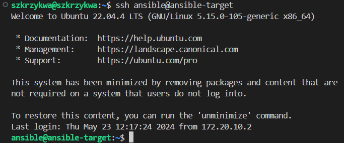

Zweryfikowałem poprawność łączności przy pomocy ping'u i kolejno ip maszyny oraz nazwy ansible-target

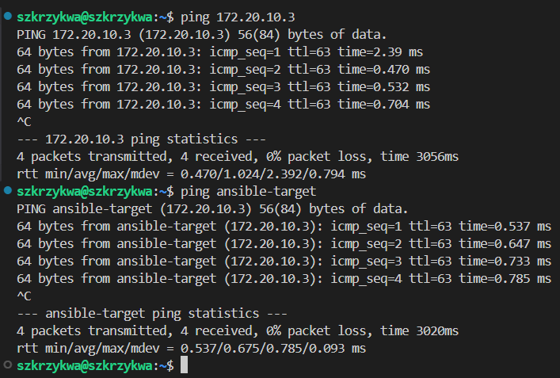

Następnie przy pomocy dokumentacji ansible stowrzyłem plik inwentaryzacji. W moim przypadku jest on w formacie INI i wygląda on następująco: 

    [Orchestrators]
    szkrzykwa

    [Endpoints]
    ansible-target ansible_user=ansible

Następnie do maszyn wysłałem żądanie ping

Poleceniem:

    ansible Endpoints -m ping -i inventory.ini

Wysłałem ping do wszystkich maszyn Endpoints z pliku inventory.ini

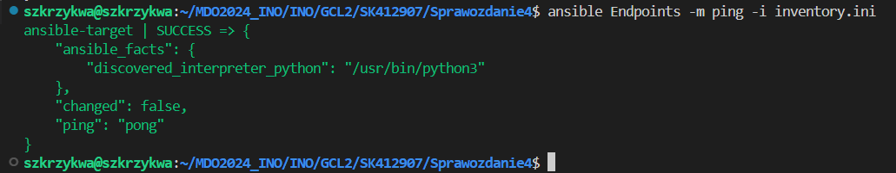

Teraz wysłałem ping do wszystkich maszyn łącznie z orkiestratorami:

    ansible all -m ping -i inventory.ini

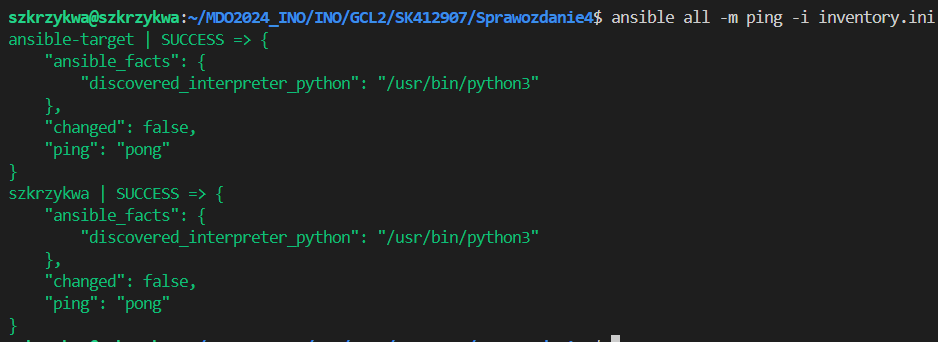

### 3. Zdalne wywołanie procedur

Aby rozpocząć działanie zdalne najpierw utworzyłem plik playbook.yml, który będzie służył do wykonywania procedur. Na początek mieliśmy wysłać żadanie ping do wszystkich maszyn.

Zawartość pliku playbook.yaml:

    - name: moj playbook
        hosts: all
        tasks:
            - name: ping hosts
                ansible.builtin.ping:

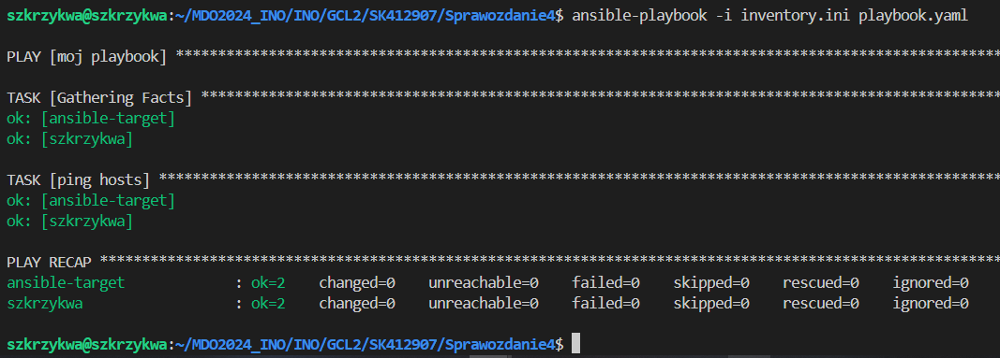

Kolejnym krokiem było skopiowanie plików inwentaryzacji na maszynę Endpoints. Do playbook'a dodałem nowego taska:

- name: moj playbook
  hosts: Endpoints
  tasks:
  - name: copy inventory.ini
    ansible.builtin.copy:
      src: /home/szkrzykwa/MDO2024_INO/INO/GCL2/SK412907/Sprawozdanie4/inventory.ini
      dest: /home/ansible

Po pierwszym uruchomieniu spowodowało to przeprowadzenie zmiany na maszynie ansible-target:

Kiedy uruchomiłem playbooka po raz drugi informacja zmienła swój kolor na zielony sygnalizując poprawne i niezmienione przejście procedury:

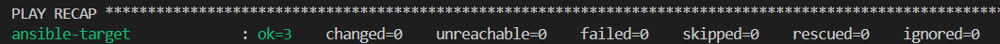

Kolejnym krokiem naszego playbook'a miałobyć zaaktualizowanie pakietów w systemie:

- name: Update package
  hosts: Endpoints
  vars:
    ansible_become_pass: XXX
  tasks:
  - name: update packs
    become: yes
    ansible.builtin.apt:
      name: "*"
      state: latest

W moim przypadku wszystko było już zaaktualizowane:

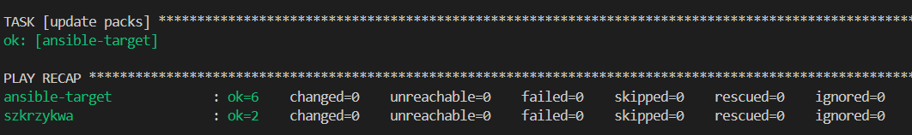

Następnym krokiem było zrestartowanie usług sshd i rngd. Usługę rngd pobrałem na maszynie ansibl, a do playbook'a dopisałem następujące linie kodu:

    - name: Restart sshd and rngd
  hosts: Endpoints
  vars:
    ansible_become_pass: XXX
  tasks:
  - name: Restart sshd
    become: yes
    service:
      name: sshd
      state: restarted
  - name: Restart rngd
    become: yes
    service:
      name: rng-tools
      state: restarted

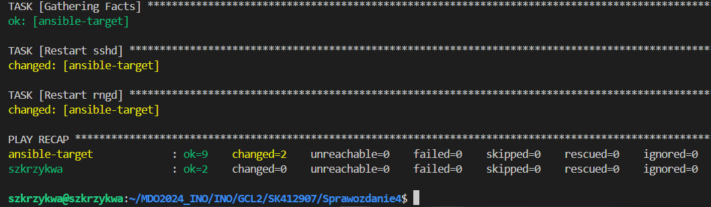

Na koniec mieliśmy przeprowadzić powyższe operacje względem maszyny z wyłączonym serwerem SSH i odpiętą kartą sieciową. 