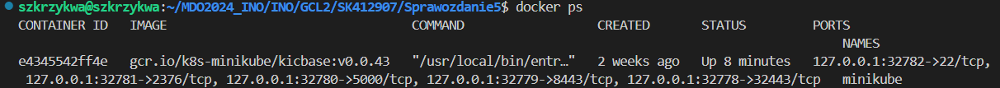
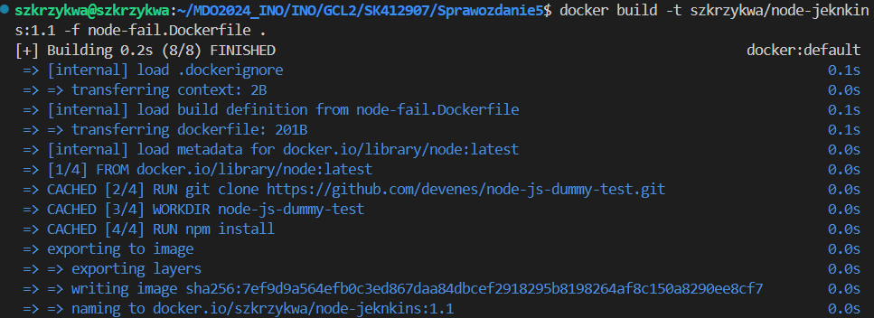

# Sprawozdanie 5
Szymon Krzykwa
Inżynieria Obliczeniowa gr 2

## Cel laboratorium

Celem laboratoriów było zapoznanie z wdrażaniem na zarządzalne kontenery, konkretnie Kubernetes.

## Wykonanie

### 1. Instalacja Kubernetes'a

Korzystając ze strony podanej w opisie ćwiczenia wykonywałem kolejne kroki w celu instalacji Kubernetes'a. Wybierając odpowiednie opcje systemu pokazały mi się komendy, dzięki którym dokonam instalacji. Na początek trzeba pobrać odpowiednią paczkę. Wykonuję to poleceniem:

    curl -LO https://storage.googleapis.com/minikube/releases/latest/minikube_latest_amd64.deb

A następnie dokonuje instalacji:

    sudo dpkg -i minikube_latest_amd64.deb

Następnie poproszono nas o zaopatrzenie się w polecenie kubectl. Pozwala ono na sprawdzenie zasobów użytkownika takich jak pod'y, deployment'y i usługi. Na początek uruhomiłem minikube'a poleceniem:

    minikube start

Uruchomienie przebiegło pomyślnie co oznacza poprawne jego zainstalowanie. Można to również potwierdzić poprzez sprawdzenie aktualnie działających kontenerów poleceniem docker ps:

Następnie poleceniem:

    minikube kubectl -- get po -A

Pobrałem kubectl.
W celu ułatwienia sobie pracy utworzyłem alias kubectl, który sprawia, że każde wywołanie kubectl tak naprawdę będzie odpowiadało zapisowi "minikube kubectl --".

Następnie przeszedłem do uruchomienia dashboard'u. Jest to swego rodzaju centrum dowodzenia, które pozwala nam na zarządzanie klastrem Kubernetes. Wewnątrze niego mamy lepszy podgląd na wszystkie zasoby. Ważnym czynnikiem działania tego przekierowania jest używanie przeze mnie Visual Studio Code, które automatycznie dokonuje przekierowania portów.

Widok na dashboard:

Poprawne zakończenie działania kubernetes'a wykonujemy komendą:

    minikube stop

### 2. Analiza posiadanego kontenera

Do tego zadania wykorzystam aplikację, którą wykorzystywałem w poprzednich laboratoraich z Jenkins'em. Jest to apliakcja, która oparta o node'a , która tworzy prostą listę zadań do wykonania. Obraz tej apliakcji jest dostępny na moim profilu na dockerhub'ie.

### 3. Uruchomienie oprogamowania

Uruchamiam kontener na stosie k8s. Dokonuje tego podając komendę:

    minikube kubectl -- run node-jenkins --image=szkrzykwa/node-jenkins --port=3000 --labels app=node-jenkins

Polecenie uruchamia kontener na podstawie obrazu szkrzykwa/node-jenkins. Przeznacza dla niego port 3000 i od tego momentu jest zarządzany przez Kubernetes i jest podpięty pod pod'a.

Pokazanie ,że pod działa przez Dashboard i kubectl:

Teraz wyprowadzę port celem dotarcia do eksponowanej funkcjonalności. Wykonuje to poprzez przekierowanie portów z poda na komputer podając komendę: 

    minikube kubectl port-forward pod/node-jenkins 3000:3000

Teraz port 3001 zotał przekierowany do mojego kompuetra i wpisując w przeglądarkę localhost:3001 uruchomi się moja apliakcja.

Widok aplikacji:

### 4. Konwersja wdrożenia ręcznego na wdrożenie deklaratywne YAML

Korzystając z dokumentacji Kubernetes'a utworzyłem plik YAML pozwalający na konwersję wdrożenia ręcznego. Wewnątrz niego zawieramy takie informacje jak rodzaj pliku, nazwę deploymentu oraz apliakcji, ilość replik oraz na jakim obrazie będzie się opeirać. W poleceniu zadania było podane, aby powstały 4 repliki.

Zawartość pliku node-deployment.yaml:

    apiVersion: apps/v1
    kind: Deployment
    metadata:
    name: node-deployment
    labels:
        app: node-jenkins
    spec:
    replicas: 4
    selector:
        matchLabels:
        app: node-jenkins
    template:
        metadata:
        labels:
            app: node-jenkins
        spec:
        containers:
        - name: node-jenkins
            image: szkrzykwa/node-jenkins
            ports:
            - containerPort: 3000

Przechodzimy do wdrożenia stosując komendę:

    minikube kubectl -- apply -f ./node-deployment.yaml

Następnie pobieramy nasze deployment'y:

Sprawdzamy status na dwa sposoby:

Przy pomocy komendy:

    minikube kubectl rollout status deployments/node-deployment

I korzystając z dashboardu

### 5. Nowy obraz

Nowy obraz miał przy uruchomieniu kończyć się błędem. Korzystjąc z Dockerfile'a ze wcześniejszych zajęć dokonałem jedynie małej modyfiackji, która wywoła pojawienie się błędu. Buduję nowy obraz i dodaję go jako nowa wersja do swojego dockerhub'a. Dokonuje tego wykonująć kolejno kroki:

    FROM node:latest

    RUN git clone https://github.com/devenes/node-js-dummy-test.git
    WORKDIR node-js-dummy-test
    RUN npm install

    CMD ["sh", "-c", "exit 1"] 

Zbudowanie nowego obrazu

Push nowej wersji obrazu

Teraz utworzyłem nowy yaml, który będzię odnosić się do tej nieporawnej wersji obrazu. Tak naprawdę jedyne co trzeba było zmienić to odnośnik do nowej wersji obrazu.

    containers:
      - name: node-jenkins
        image: szkrzykwa/node-jenkins:1.1

Teraz w momencie deployment'u pokaże się błąd wynikający z dopisanej w Dockerfiel'u linijki CMD.

Widok z dashboard'u:

Widok z terminala:

### 6. Zmiany w deploymencie

W kolejnym punkcie zwróciliśmy uwagę na zmiany zachodzące w deploymentach po akutalizacji pliku YAML. Wykonaliśmy kolejno:

ZWIĘKSZENIE LICZBY REPLIK DO 8

    spec:
      replicas: 8

W wyniku zwiększenia liczby podów do wcześniej stowrzonych powstały 4 nowe.

ZMNIEJSZENIE LICZBY REPLIK DO 1

    spec:
      replicas: 1

7 podów zostało zamkniętych pozostwiając tylko 1

ZMNIEJSZENIE LICZBY REPLIK DO 0

    spec:
      replicas: 0

Ostatni pod został zamknięty, ale deployment jest dalej w stanie działania

### 7. Skrpyt

Zostaliśmy poproszeni o wykonaie skryptu, który sprawdza czy wdrożenie zostało ukończone przed upłynięciem 60s. Wewnątrz niego podaję nazwę deploymentu i następnie komendy wdrożenia i pobrania deploymentów. Zapis if na podstawie czasu otrzymanego z polecenia zwraca nam informacje o powodzeniu lub niepowodzeniu wdrożenia.

Cały skypt:

    #!/bin/bash

    DEPLOYMENT_NAME="node-deployment"
    TIMEOUT=60

    minikube kubectl -- apply -f node-deployment.yaml

    minikube kubectl get deployments 

    if minikube kubectl -- rollout status deployment/$DEPLOYMENT_NAME --timeout=${TIMEOUT}s > /dev/null 2>&1; then
    echo "Suckes - czas < 60s"
    exit 0
    else
    echo "Niepowodzenie - czas > 60s"
    exit 1
    fi

Sukces:

Niepowodzenie:

### 8. Strategie wdrożenia

Na koniec poruszyliśmy temat strategii wdrożenia. Jako iż nie mam zrobionych innych wersji obrazu, a jedynie wersje z błędnym uruchomieniem nie byłem w stanie w pełni wykonać tego zadania. Dlatego omówię jakie zmiany w deploymencie trzeba wprowadzić dla każdej strategii oraz jaki efekt powinniśmy otrzymać.

Recreate:

Dodajemy informacje o aktualnej wersji, a w sekcji image podajemy nowo wykorzystywaną

    labels:
      app: node-jenkins
      version: latest

W specyfikacji dodajemy odnośnik do strategii i jej typu

    spec:
      replicas: 4
      strategy:
        type: Recreate
      selector:
        matchLabels:
        app: node-jenkins

Strategia ta usuwa wszystkie działające wcześniej kontenery i w ich miejsce tworzy nowe.

Rolling update:

maxUnavailable - określa maksymalną ilość podów, które mogą być niedostępne podczas wdrażania.

maxSurge - określa maksymalną liczbę instancji, które mogą być utworzone ponad ich docelową liczbę. Wartość podaje się w porcentach lub jak zwykła liczba.

    strategy:
      type: RollingUpdate
      rollingUpdate:
        maxUnavailable: 2
        maxSurge: 30%

Startegia ta stopniowo aktualizuje pody jednocześnie usuwając te stare.

Canary Deployment workload:

W każdym miejscu, gdzie występuje zapis app: node-jenkins dodajemy opcję track canary.

    app: node-jenkins
    version: latest
    track: canary

W Canary nowa wersja aplikacji jest wdrażana jednocześnie z istniejącą wersją, ale tylko dla części użytkowników. Ma to na celu testowanie nowej wersji w warunkach produkcyjnych, ale z minimalnym wpływem na użytkowników. 