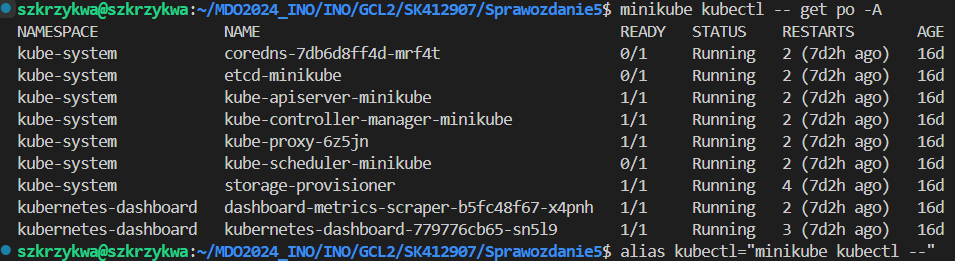
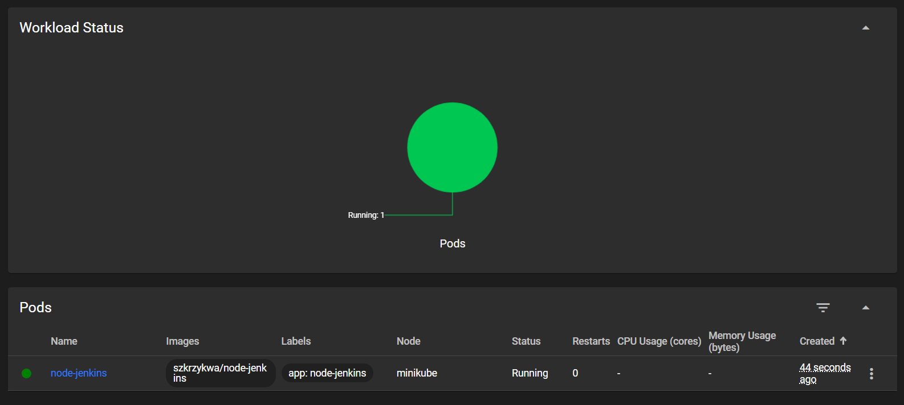

# Sprawozdanie 5
Szymon Krzykwa
Inżynieria Obliczeniowa gr 2

## Cel laboratorium

Celem laboratoriów było zapoznanie z wdrażaniem na zarządzalne kontenery, konkretnie Kubernetes.

## Wykonanie

### 1. Instalacja Kubernetes'a

Korzystając ze strony podanej w opisie ćwiczenia wykonywałem kolejne kroki w celu instalacji Kubernetes'a. Wybierając odpowiednie opcje systemu pokazały mi się komendy, dzięki którym dokonam instalacji. Na początek trzeba pobrać odpowiednią paczkę. Wykonuję to poleceniem:

    curl -LO https://storage.googleapis.com/minikube/releases/latest/minikube_latest_amd64.deb

A następnie dokonuje instalacji:

    sudo dpkg -i minikube_latest_amd64.deb

Następnie poproszono nas o zaopatrzenie się w polecenie kubectl. Pozwala ono na sprawdzenie zasobów użytkownika takich jak pod'y, deployment'y i usługi. Na początek uruhomiłem minikube'a poleceniem:

    minikube start

Uruchomienie przebiegło pomyślnie co oznacza poprawne jego zainstalowanie. Można to również potwierdzić poprzez sprawdzenie aktualnie działających kontenerów poleceniem docker ps:

Następnie poleceniem:

    minikube kubectl -- get po -A

Pobrałem kubectl.
W celu ułatwienia sobie pracy utworzyłem alias kubectl, który sprawia, że każde wywołanie kubectl tak naprawdę będzie odpowiadało zapisowi "minikube kubectl --".

Następnie przeszedłem do uruchomienia dashboard'u. Jest to swego rodzaju centrum dowodzenia, które pozwala nam na zarządzanie klastrem Kubernetes. Wewnątrze niego mamy lepszy podgląd na wszystkie zasoby. Ważnym czynnikiem działania tego przekierowania jest używanie przeze mnie Visual Studio Code, które automatycznie dokonuje przekierowania portów.

Widok na dashboard:

Poprawne zakończenie działania kubernetes'a wykonujemy komendą:

    minikube stop

### 2. Analiza posiadanego kontenera

Do tego zadania wykorzystam aplikację, którą wykorzystywałem w poprzednich laboratoraich z Jenkins'em. Jest to apliakcja, która oparta o node'a , która tworzy prostą listę zadań do wykonania. Obraz tej apliakcji jest dostępny na moim profilu na dockerhub'ie.

### 3. Uruchomienie oprogamowania

Uruchamiam kontener na stosie k8s. Dokonuje tego podając komendę:

    minikube kubectl -- run node-jenkins --image=szkrzykwa/node-jenkins --port=3000 --labels app=node-jenkins

Polecenie uruchamia kontener na podstawie obrazu szkrzykwa/node-jenkins. Przeznacza dla niego port 3000 i od tego momentu jest zarządzany przez Kubernetes i jest podpięty pod pod'a.

Pokazanie ,że pod działa przez Dashboard i kubectl:

Teraz wyprowadzę port celem dotarcia do eksponowanej funkcjonalności. Wykonuje to poprzez przekierowanie portów z poda na komputer podając komendę: 

    minikube kubectl port-forward pod/node-jenkins 3000:3000

Teraz port 3000 zotał przekierowany do mojego kompuetra i wpisując w przeglądarkę localhost:3000 uruchomi się moja apliakcja.

Widok aplikacji:

### 4. Konwersja wdrożenia ręcznego na wdrożenie deklaratywne YAML